---
aliases:
  - CardProperty
tags:
  - java/class
  - module/forge-game
  - pkg/forge/game/card
fqn: forge.game.card.CardProperty
package: forge.game.card
module: forge-game
kind: Class
---

# CardProperty

**Package:** `forge.game.card`   **Module:** `forge-game`   **Kind:** Class



```mermaid
classDiagram
    class CardProperty {
        +cardHasProperty(Card card, String property, Player sourceController, Card source, CardTraitBase spellAbility) boolean
        -hasTimestampMatch(Card card, CardCollectionView coll) boolean
    }
    CardProperty ..> AttackRequirement : uses
    CardProperty ..> AttackingBand : uses
    CardProperty ..> Card : uses
    CardProperty ..> CardCollection : uses
    CardProperty ..> CardCollectionView : uses
    CardProperty ..> CardTraitBase : uses
    CardProperty ..> ColorSet : uses
    CardProperty ..> Combat : uses
    CardProperty ..> FCollection : uses
    CardProperty ..> FCollectionView : uses
    CardProperty ..> Game : uses
    CardProperty ..> GameEntity : uses
    CardProperty ..> Mana : uses
    CardProperty ..> ManaCost : uses
    CardProperty ..> ManaCostShard : uses
    CardProperty ..> PaperCard : uses
    CardProperty ..> Player : uses
    CardProperty ..> SpellAbility : uses
    CardProperty ..> SpellAbilityStackInstance : uses
    CardProperty ..> Zone : uses
    CardProperty ..> ZoneType : uses
```

## Relationships
**Uses:**
- [[forge.card.ColorSet|ColorSet]]
- [[forge.card.mana.ManaCost|ManaCost]]
- [[forge.card.mana.ManaCostShard|ManaCostShard]]
- [[forge.game.CardTraitBase|CardTraitBase]]
- [[forge.game.Game|Game]]
- [[forge.game.GameEntity|GameEntity]]
- [[forge.game.card.Card|Card]]
- [[forge.game.card.CardCollection|CardCollection]]
- [[forge.game.card.CardCollectionView|CardCollectionView]]
- [[forge.game.combat.AttackRequirement|AttackRequirement]]
- [[forge.game.combat.AttackingBand|AttackingBand]]
- [[forge.game.combat.Combat|Combat]]
- [[forge.game.mana.Mana|Mana]]
- [[forge.game.player.Player|Player]]
- [[forge.game.spellability.SpellAbility|SpellAbility]]
- [[forge.game.spellability.SpellAbilityStackInstance|SpellAbilityStackInstance]]
- [[forge.game.zone.Zone|Zone]]
- [[forge.game.zone.ZoneType|ZoneType]]
- [[forge.item.PaperCard|PaperCard]]
- [[forge.util.collect.FCollection|FCollection]]
- [[forge.util.collect.FCollectionView|FCollectionView]]

## Design Description

CardProperty is a stateless utility class providing a single public static predicate, `cardHasProperty`, that evaluates whether a given `Card` satisfies a named textual property within the current game context. It serves as the central interpreter for Forge's card-scripting property language, translating string tokens (e.g. `YouCtrl`, `attacking`, `SharesColorWith`, `counters_GE9_P1P1`) into concrete checks against game state. Acting as a `Card` query helper, it collaborates broadly with the game model—resolving controllers and zones, consulting `Combat`, `AttackingBand`, and `AttackRequirement` for combat queries, inspecting `ManaCost`/`Mana`/`ColorSet` for cost and color tests, and delegating to `SpellAbility`/`CardTraitBase` and `AbilityUtils` for defined-object and validity resolution.

Its design intent is a large, ordered if/else chain dispatching on property prefixes, deliberately handling phased-out cards and last-known-information (LKI) up front per the comprehensive rules, with any unrecognized property delegated to the card's current state. A private `hasTimestampMatch` helper supports identity comparisons that respect game timestamps rather than object reference.

## Source
`forge-game/src/main/java/forge/game/card/CardProperty.java`

```java
package forge.game.card;

import com.google.common.collect.Iterables;
import com.google.common.collect.Lists;
import forge.StaticData;
import forge.card.CardDb;
import forge.card.ColorSet;
import forge.card.MagicColor;
import forge.card.mana.ManaCost;
import forge.card.mana.ManaCostShard;
import forge.game.CardTraitBase;
import forge.game.EvenOdd;
import forge.game.Game;
import forge.game.GameEntity;
import forge.game.ability.AbilityKey;
import forge.game.ability.AbilityUtils;
import forge.game.combat.AttackRequirement;
import forge.game.combat.AttackingBand;
import forge.game.combat.Combat;
import forge.game.combat.CombatUtil;
import forge.game.mana.Mana;
import forge.game.player.Player;
import forge.game.spellability.OptionalCost;
import forge.game.spellability.SpellAbility;
import forge.game.spellability.SpellAbilityStackInstance;
import forge.game.zone.Zone;
import forge.game.zone.ZoneType;
import forge.item.PaperCard;
import forge.util.Expressions;
import forge.util.IterableUtil;
import forge.util.TextUtil;
import forge.util.collect.FCollection;
import forge.util.collect.FCollectionView;
import org.apache.commons.lang3.StringUtils;
import org.apache.commons.lang3.tuple.Pair;

import java.util.*;

public class CardProperty {

    public static boolean cardHasProperty(Card card, String property, Player sourceController, Card source, CardTraitBase spellAbility) {
        final Game game = card.getGame();
        final Combat combat = game.getCombat();
        // lki can't be null but it does return this
        final Card lki = game.getChangeZoneLKIInfo(card);
        final Player controller = lki.getController();

        // CR 702.25b if card is phased out it will not count unless specifically asked for
        if (card.isPhasedOut()) {
            if (property.startsWith("phasedOut")) {
                property = property.substring(9);
            } else {
                return false;
            }
        }

        if (property.equals("noName")) {
            if (!card.hasNoName()) {
                return false;
            }
        } else if (property.startsWith("named")) {
            // by name can also have color names, so needs to happen before colors.
            String name = TextUtil.fastReplace(property.substring(5), ";", ","); // workaround for card name with ","
            name = TextUtil.fastReplace(name, "_", " ");
            if (!card.sharesNameWith(name)) {
                return false;
            }
        } else if (property.equals("NamedCard")) {
            boolean found = false;
            for (String name : source.getNamedCards()) {
                if (card.sharesNameWith(name)) {
                    found = true;
                    break;
                }
            }
            return found;
        } else if (property.equals("NamedByRememberedPlayer")) {
            for (final Object o : source.getRemembered()) {
                if (o instanceof Player p) {
                    if (!card.sharesNameWith(p.getNamedCard())) {
                        return false;
                    }
                }
            }
        } else if (property.startsWith("BorderColor")) {
            if (!property.toUpperCase().contains(card.borderColor().toString())) {
                return false;
            }
        } else if (property.equals("Permanent")) {
            if (!card.isPermanent()) {
                return false;
            }
        } else if (property.equals("Historic")) {
            if (!card.isHistoric()) {
                return false;
            }
        } else if (property.startsWith("CardUID_")) {// Protection with "doesn't remove effect"
            if (card.getId() != Integer.parseInt(property.split("CardUID_")[1])) {
                return false;
            }
        } else if (property.startsWith("ChosenCard")) {
            CardCollectionView chosen = source.getChosenCards();
            int i = chosen.indexOf(card);
            if (i == -1) {
                return false;
            }
            if (property.contains("Strict") && !chosen.get(i).equalsWithGameTimestamp(card)) {
                return false;
            }
        } else if (property.equals("nonChosenCard")) {
            if (source.hasChosenCard(card)) {
                return false;
            }
        } else if (property.startsWith("ChosenMode")) {
            if (!card.getChosenMode().equals(property.substring(10))) {
                return false;
            }
        } else if (property.equals("ChosenSector")) {
            if (!source.getChosenSector().equals(card.getSector())) {
                return false;
            }
        } else if (property.equals("DifferentSector")) {
            if (source.getSector().equals(card.getSector())) {
                return false;
            }
        } else if (property.equals("DoubleFaced")) {
            if (!card.isDoubleFaced()) {
                return false;
            }
        } else if (property.equals("FrontSide")) {
            if (card.isBackSide()) {
                return false;
            }
        } else if (property.equals("BackSide")) {
            if (!card.isBackSide()) {
                return false;
            }
        } else if (property.equals("CanTransform")) {
            if (!card.isTransformable()) {
                return false;
            }
        } else if (property.equals("Transformed")) {
            if (!card.isTransformed()) {
                return false;
            }
        } else if (property.equals("Flip")) {
            if (!card.isFlipCard()) {
                return false;
            }
        } else if (property.equals("Split")) {
            if (!card.isSplitCard()) {
                return false;
            }
        } else if (property.equals("AdventureCard")) {
            if (!card.isAdventureCard()) {
                return false;
            }
        } else if (property.equals("IsRingbearer")) {
            if (!card.isRingBearer()) {
                return false;
            }
        } else if (property.equals("IsTriggerRemembered")) {
            boolean found = false;
            for (Object o : spellAbility.getTriggerRemembered()) {
                if (o instanceof Card) {
                    Card trigRem = (Card) o;
                    if (trigRem.equalsWithGameTimestamp(card)) {
                        found = true;
                        break;
                    }
                }
            }
            if (!found) {
                return false;
            }
        } else if (property.startsWith("YouCtrl")) {
            if (!controller.equals(sourceController)) {
                return false;
            }
        } else if (property.startsWith("YourTeamCtrl")) {
            if (controller.getTeam() != sourceController.getTeam()) {
                return false;
            }
        } else if (property.startsWith("YouDontCtrl")) {
            if (controller.equals(sourceController)) {
                return false;
            }
        } else if (property.startsWith("OppCtrl")) {
            if (!controller.getOpponents().contains(sourceController)) {
                return false;
            }
        } else if (property.startsWith("ChosenCtrl")) {
            if (!controller.equals(source.getChosenPlayer())) {
                return false;
            }
        } else if (property.startsWith("DefenderCtrl")) {
            if (!game.getPhaseHandler().inCombat()) {
                return false;
            }
            if (property.endsWith("ForRemembered")) {
                if (!source.hasRemembered()) {
                    return false;
                }
                if (combat.getDefendingPlayerRelatedTo((Card) source.getFirstRemembered()) != controller) {
                    return false;
                }
            } else {
                if (combat.getDefendingPlayerRelatedTo(source) != controller) {
                    return false;
                }
            }
        } else if (property.startsWith("OppProtect")) {
            if (card.getProtectingPlayer() == null
                    || !sourceController.getOpponents().contains(card.getProtectingPlayer())) {
                return false;
            }
        } else if (property.startsWith("ProtectedBy")) {
            if (card.getProtectingPlayer() == null) {
                return false;
            }
            final List<Player> lp = AbilityUtils.getDefinedPlayers(source, property.substring(12), spellAbility);
            if (!lp.contains(card.getProtectingPlayer())) {
                return false;
            }
        } else if (property.equals("Defending")) {
            if (game.getCombat() == null || !game.getCombat().getAttackersAndDefenders().values().contains(card)) {
                return false;
            }
        } else if (property.startsWith("DefendingPlayer")) {
            Player p = property.endsWith("Ctrl") ? controller : card.getOwner();
            if (!game.getPhaseHandler().inCombat()) {
                return false;
            }
            if (!combat.isPlayerAttacked(p)) {
                return false;
            }
        } else if (property.startsWith("EnchantedPlayer")) {
            Player p = property.endsWith("Ctrl") ? controller : card.getOwner();
            final Object o = source.getEntityAttachedTo();
            if (o instanceof Player) {
                if (!p.equals(o)) {
                    return false;
                }
            } else { // source not enchanting a player
                return false;
            }
        } else if (property.startsWith("EnchantedController")) {
            Player p = property.endsWith("Ctrl") ? controller : card.getOwner();
            final Object o = source.getEntityAttachedTo();
            if (o instanceof Card) {
                if (!p.equals(((Card) o).getController())) {
                    return false;
                }
            } else { // source not enchanting a card
                return false;
            }
        } else if (property.startsWith("RememberedPlayer")) {
            Player p = property.endsWith("Ctrl") ? controller : card.getOwner();
            if (!source.hasRemembered()) {
                final Card newCard = game.getCardState(source);
                if (!newCard.isRemembered(p)) {
                    return false;
                }
            }

            if (!source.isRemembered(p)) {
                return false;
            }
        } else if (property.equals("targetedBy")) {
            if (!(spellAbility instanceof SpellAbility sa)) {
                return false;
            }
            if (!sa.getRootAbility().isTargeting(card)) {
                return false;
            }
        } else if (property.equals("TargetedPlayerCtrl")) {
            if (!AbilityUtils.getDefinedPlayers(source, "TargetedPlayer", spellAbility).contains(controller)) {
                return false;
            }
        } else if (property.startsWith("ActivePlayerCtrl")) {
            if (!game.getPhaseHandler().isPlayerTurn(controller)) {
                return false;
            }
        } else if (property.startsWith("YouOwn")) {
            if (!card.getOwner().equals(sourceController)) {
                return false;
            }
        } else if (property.startsWith("YouDontOwn")) {
            if (card.getOwner().equals(sourceController)) {
                return false;
            }
        } else if (property.startsWith("OppOwn")) {
            if (!card.getOwner().getOpponents().contains(sourceController)) {
                return false;
            }
        } else if (property.equals("TargetedPlayerOwn")) {
            if (!AbilityUtils.getDefinedPlayers(source, "TargetedPlayer", spellAbility).contains(card.getOwner())) {
                return false;
            }
        } else if (property.startsWith("OwnedBy")) {
            final String valid = property.substring(8);
            if (!card.getOwner().isValid(valid, sourceController, source, spellAbility)) {
                final List<Player> lp = AbilityUtils.getDefinedPlayers(source, valid, spellAbility);
                if (!lp.contains(card.getOwner())) {
                    return false;
                }
            }
        } else if (property.startsWith("ControlledBy")) {
            final String valid = property.substring(13);
            if (!controller.isValid(valid, sourceController, source, spellAbility)) {
                final List<Player> lp = AbilityUtils.getDefinedPlayers(source, valid, spellAbility);
                if (!lp.contains(controller)) {
                    return false;
                }
            }
        } else if (property.startsWith("OwnerDoesntControl")) {
            if (card.getOwner().equals(controller)) {
                return false;
            }
        } else if (property.startsWith("ControllerControls")) {
            final String type = property.substring(18);
            if (type.startsWith("More")) {
                String realType = type.split("More")[1];
                CardCollectionView cards = CardLists.getType(controller.getCardsIn(ZoneType.Battlefield), realType);
                CardCollectionView yours = CardLists.getType(sourceController.getCardsIn(ZoneType.Battlefield), realType);
                if (cards.size() <= yours.size()) {
                    return false;
                }
            } else if (type.startsWith("AtLeastAsMany")) {
                String realType = type.split("AtLeastAsMany")[1];
                CardCollectionView cards = CardLists.getType(controller.getCardsIn(ZoneType.Battlefield), realType);
                CardCollectionView yours = CardLists.getType(sourceController.getCardsIn(ZoneType.Battlefield), realType);
                if (cards.size() < yours.size()) {
                    return false;
                }
            } else {
                final CardCollectionView cards = controller.getCardsIn(ZoneType.Battlefield);
                if (type.contains("_")) {
                    final String[] parts = type.split("_", 2);
                    CardCollectionView found = CardLists.getType(cards, parts[0]);
                    final int num = AbilityUtils.calculateAmount(card, parts[1].substring(2), spellAbility);
                    if (!Expressions.compare(found.size(), parts[1].substring(0, 2), num)) {
                        return false;
                    }
                } else if (CardLists.getType(cards, type).isEmpty()) {
                    return false;
                }
            }
        } else if (property.startsWith("StrictlyOther")) {
            if (card.equalsWithGameTimestamp(source)) {
                return false;
            }
        } else if (property.startsWith("Other")) {
            if (card.equals(source)) {
                return false;
            }
        } else if (property.startsWith("StrictlySelf")) {
            if (!card.equalsWithGameTimestamp(source)) {
                return false;
            }
        } else if (property.startsWith("Self")) {
            if (!card.equals(source)) {
                return false;
            }
        } else if (property.startsWith("ExiledByYou")) {
            if (card.getExiledBy() == null) {
                return false;
            }
            if (!card.getExiledBy().equals(sourceController)) {
                return false;
            }
        } else if (property.startsWith("ExiledWithSourceLKI")) {
            List<Card> exiled = card.getZone().getCardsAddedThisTurn(null);
            exiled.sort(CardPredicates.compareByGameTimestamp());
            int idx = exiled.lastIndexOf(card);
            if (idx == -1) {
                return false;
            }
            Card lkiExiled = exiled.get(idx);

            if (lkiExiled.getExiledWith() == null) {
                return false;
            }

            Card host = source;
            //Static Abilities doesn't have spellAbility or OriginalHost
            if (spellAbility != null) {
                host = spellAbility.getOriginalHost();
                if (host == null) {
                    host = spellAbility.getHostCard();
                }
            }
            if (!lkiExiled.getExiledWith().equalsWithGameTimestamp(host)) {
                return false;
            }
        } else if (property.startsWith("ExiledWithSource")) {
            if (card.getExiledWith() == null) {
                return false;
            }

            Card host = source;
            //Static Abilities doesn't have spellAbility or OriginalHost
            if (spellAbility != null) {
                host = spellAbility.getOriginalHost();
                if (host == null) {
                    host = spellAbility.getHostCard();
                }
            }
            if (!source.hasExiledCard(card) || !card.getExiledWith().equalsWithGameTimestamp(host)) {
                return false;
            }
        } else if (property.equals("ExiledWithEffectSource")) {
            if (card.getExiledWith() == null) {
                return false;
            }
            if (!card.getExiledWith().equalsWithGameTimestamp(source.getEffectSource())) {
                return false;
            }
        } else if (property.equals("EncodedWithSource")) {
            if (!card.getEncodedCards().contains(source)) {
                return false;
            }
        } else if (property.equals("EffectSource")) {
            if (!source.isImmutable()) {
                return false;
            }

            if (!card.equals(source.getEffectSource())) {
                return false;
            }
        } else if (property.equals("CanBeSacrificedBy") && spellAbility instanceof SpellAbility) {
            // used for Emerge and Offering, these are SpellCost, not effect
            if (!card.canBeSacrificedBy((SpellAbility) spellAbility, false)) {
                return false;
            }
        } else if (property.equals("Attached")) {
            if (!source.hasCardAttachment(card)) {
                return false;
            }
        } else if (property.startsWith("AttachedTo")) {
            final String restriction = property.split("AttachedTo ")[1];

            if (!card.isAttachedToEntity()) {
                return false;
            }

            if (!card.getEntityAttachedTo().isValid(restriction, sourceController, source, spellAbility)) {
                // only few cases need players
                if (!(restriction.contains("Player") ? AbilityUtils.getDefinedPlayers(source, restriction, spellAbility) : AbilityUtils.getDefinedCards(source, restriction, spellAbility)).contains(card.getEntityAttachedTo())) {
                    return false;
                }
            }
        } else if (property.equals("NameNotEnchantingEnchantedPlayer")) {
            Player enchantedPlayer = source.getPlayerAttachedTo();
            if (enchantedPlayer == null || enchantedPlayer.isEnchantedBy(card.getName())) {
                return false;
            }
        } else if (property.startsWith("EnchantedBy")) {
            if (property.equals("EnchantedBy")) {
                if (!card.isEnchantedBy(source) && !card.equals(source.getEntityAttachedTo())) {
                    return false;
                }
            } else {
                final String restriction = property.split("EnchantedBy ")[1];
                switch (restriction) {
                    case "Imprinted":
                        for (final Card c : source.getImprintedCards()) {
                            if (!card.isEnchantedBy(c) && !card.equals(c.getEntityAttachedTo())) {
                                return false;
                            }
                        }
                        break;
                    case "Targeted":
                        for (final Card c : AbilityUtils.getDefinedCards(source, "Targeted", spellAbility)) {
                            if (!card.isEnchantedBy(c) && !card.equals(c.getEntityAttachedTo())) {
                                return false;
                            }
                        }
                        break;
                    default:  // EnchantedBy Aura.Other
                        for (final Card aura : card.getEnchantedBy()) {
                            if (aura.isValid(restriction, sourceController, source, spellAbility)) {
                                return true;
                            }
                        }
                        return false;
                }
            }
        } else if (property.startsWith("Enchanted")) {
            if (!source.equals(card.getEntityAttachedTo())) {
                return false;
            }
        } else if (property.startsWith("CanEnchant")) {
            final String restriction = property.substring(10);
            if (restriction.equals("EquippedBy")) {
                if (!source.isEquipping() || !source.getEquipping().canBeAttached(card, null)) return false;
            }
            if (restriction.equals("Remembered")) {
                for (final Object rem : source.getRemembered()) {
                    if (!(rem instanceof Card) || !((Card) rem).canBeAttached(card, null))
                        return false;
                }
            } else if (restriction.equals("Source")) {
                if (!source.canBeAttached(card, null)) return false;
            }
        } else if (property.startsWith("CanBeEnchantedBy")) {
            if (property.substring(16).equals("Targeted")) {
                for (final Card c : AbilityUtils.getDefinedCards(source, "Targeted", spellAbility)) {
                    if (!card.canBeAttached(c, null)) {
                        return false;
                    }
                }
            } else {
                if (!card.canBeAttached(source, null)) {
                    return false;
                }
            }
        } else if (property.startsWith("EquippedBy") || property.startsWith("AttachedBy")) {
            String prop = property.substring(10);
            if (!StringUtils.isBlank(prop)) {
                boolean found = false;
                for (final Card c : AbilityUtils.getDefinedCards(source, prop, spellAbility)) {
                    if (card.hasCardAttachment(c)) {
                        found = true;
                        break;
                    }
                }
                if (!found) {
                    return false;
                }
            } else if (!card.hasCardAttachment(source)) {
                return false;
            }
        } else if (property.startsWith("FortifiedBy")) {
            if (!card.hasCardAttachment(source)) {
                return false;
            }
        } else if (property.startsWith("CanBeAttachedBy")) {
            if (!card.canBeAttached(source, null)) {
                return false;
            }
        } else if (property.startsWith("CanBeTargetedBy")) {
            final String def = property.substring(15);
            SpellAbility targetingSA = AbilityUtils.getDefinedSpellAbilities(source, def, spellAbility).get(0);
            while (targetingSA != null) {
                if (targetingSA.usesTargeting() && !targetingSA.canTarget(card)) {
                    return false;
                }
                targetingSA = targetingSA.getSubAbility();
            }
        } else if (property.startsWith("HauntedBy")) {
            if (!card.isHauntedBy(source)) {
                return false;
            }
        } else if (property.startsWith("notTributed")) {
            if (card.isTributed()) {
                return false;
            }
        } else if (property.startsWith("madness")) {
            if (!card.isMadness()) {
                return false;
            }
        } else if (property.startsWith("Paired")) {
            if (!card.isPaired()) {
                return false;
            }
            if (property.endsWith("With") && card.getPairedWith() != source) {
                return false;
            }
        } else if (property.startsWith("Above")) { // "Are Above" Source
            final CardCollectionView cards = card.getOwner().getCardsIn(ZoneType.Graveyard);
            if (cards.indexOf(source) >= cards.indexOf(card)) {
                return false;
            }
        } else if (property.startsWith("DirectlyAbove")) { // "Are Directly Above" Source
            final CardCollectionView cards = card.getOwner().getCardsIn(ZoneType.Graveyard);
            if (cards.indexOf(card) - cards.indexOf(source) != 1) {
                return false;
            }
        } else if (property.startsWith("TopGraveyardCreature")) {
            CardCollection cards = CardLists.filter(card.getOwner().getCardsIn(ZoneType.Graveyard), CardPredicates.CREATURES);
            Collections.reverse(cards);
            if (cards.isEmpty() || !card.equals(cards.get(0))) {
                return false;
            }
        } else if (property.startsWith("TopGraveyard")) {
            final CardCollection cards = new CardCollection(card.getOwner().getCardsIn(ZoneType.Graveyard));
            Collections.reverse(cards);
            if (property.substring(12).matches("[0-9][0-9]?")) {
                int n = Integer.parseInt(property.substring(12));
                int num = Math.min(n, cards.size());
                final CardCollection newlist = new CardCollection();
                for (int i = 0; i < num; i++) {
                    newlist.add(cards.get(i));
                }
                if (cards.isEmpty() || !newlist.contains(card)) {
                    return false;
                }
            } else {
                if (cards.isEmpty() || !card.equals(cards.get(0))) {
                    return false;
                }
            }
        } else if (property.startsWith("BottomGraveyard")) {
            final CardCollectionView cards = card.getOwner().getCardsIn(ZoneType.Graveyard);
            if (cards.isEmpty() || !card.equals(cards.get(0))) {
                return false;
            }
        } else if (property.startsWith("TopLibrary") || property.startsWith("BottomLibrary")) {
            CardCollectionView cards = card.getOwner().getCardsIn(ZoneType.Library);
            if (!property.equals("TopLibrary")) {
                if (property.contains("_")) cards = CardLists.getValidCards(cards, property.split("_")[1],
                        sourceController, source, spellAbility);
                if (property.startsWith("Bottom")) {
                    cards = new CardCollection(cards);
                    Collections.reverse((CardCollection) cards);
                }
            }
            if (cards.isEmpty() || !card.equals(cards.get(0))) return false;
        } else if (property.startsWith("Cloned")) {
            if (card.getCloneOrigin() == null || !card.getCloneOrigin().equals(source)) {
                return false;
            }
        } else if (property.startsWith("SharesCMCWith")) {
            if (property.equals("SharesCMCWith")) {
                if (!card.sharesCMCWith(source)) {
                    return false;
                }
            } else {
                final String restriction = property.split("SharesCMCWith ")[1];
                CardCollection list = AbilityUtils.getDefinedCards(source, restriction, spellAbility);
                return list.anyMatch(CardPredicates.sharesCMCWith(card));
            }
        } else if (property.startsWith("SharesColorWith")) {
            // if card is colorless, it can't share colors
            if (card.isColorless()) {
                return false;
            }
            if (property.equals("SharesColorWith")) {
                if (!card.sharesColorWith(source)) {
                    return false;
                }
            } else {
                // Special case to prevent list from comparing with itself
                if (property.startsWith("SharesColorWithOther")) {
                    final String restriction = property.split("SharesColorWithOther ")[1];
                    CardCollection list = AbilityUtils.getDefinedCards(source, restriction, spellAbility);
                    list.remove(card);
                    return list.anyMatch(CardPredicates.sharesColorWith(card));
                }

                final String restriction = property.split("SharesColorWith ")[1];
                switch (restriction) {
                    case "MostProminentColor":
                        byte mask = CardFactoryUtil.getMostProminentColors(game.getCardsIn(ZoneType.Battlefield));
                        if (!card.getColor().hasAnyColor(mask))
                            return false;
                        break;
                    case "LastCastThisTurn":
                        final List<Card> c = game.getStack().getSpellsCastThisTurn();
                        if (c.isEmpty() || !card.sharesColorWith(c.get(c.size() - 1))) {
                            return false;
                        }
                        break;
                    case "ActivationColor":
                        SpellAbilityStackInstance castSA = game.getStack().getInstanceMatchingSpellAbilityID((SpellAbility) spellAbility);
                        if (castSA == null) {
                            return false;
                        }
                        List<Mana> payingMana = castSA.getSpellAbility().getPayingMana();
                        // even if the cost was raised, we only care about mana from activation part
                        // since this can only be 1 currently with Protective Sphere, let's just assume it's the first shard spent for easy handling
                        if (payingMana.isEmpty() || !card.getColor().hasAnyColor(payingMana.get(0).getColor())) {
                            return false;
                        }
                        break;
                    case "TriggeredProduced":
                        final SpellAbility root = ((SpellAbility) spellAbility).getRootAbility();
                        final Object prod = (Object) root.getTriggeringObject(AbilityKey.Produced);
                        if (!(prod instanceof String)) return false;
                        String produced = (String) prod;
                        ColorSet cs = ColorSet.fromNames(produced.split(" "));
                        if (!card.getColor().hasAnyColor(cs.getColor())) return false;
                        break;
                    default:
                        if (!AbilityUtils.getDefinedCards(source, restriction, spellAbility).anyMatch(CardPredicates.sharesColorWith(card))) {
                            return false;
                        }
                        break;
                }
            }
        } else if (property.startsWith("MostProminentColor")) {
            // MostProminentColor <color>
            // e.g. MostProminentColor black
            String[] props = property.split(" ");
            if (props.length == 1) {
                System.out.println("WARNING! Using MostProminentColor property without a color.");
                return false;
            }
            String color = props[1];

            byte mostProm = CardFactoryUtil.getMostProminentColors(game.getCardsIn(ZoneType.Battlefield));
            return ColorSet.fromMask(mostProm).hasAnyColor(MagicColor.fromName(color));
        } else if (property.startsWith("MostProminentCreatureTypeInLibrary")) {
            final CardCollectionView list = sourceController.getCardsIn(ZoneType.Library);
            for (String s : CardFactoryUtil.getMostProminentCreatureType(list)) {
                if (!card.getType().hasCreatureType(s)) {
                    return false;
                }
            }
        } else if (property.startsWith("sharesCreatureTypeWith")) {
            if (property.equals("sharesCreatureTypeWith")) {
                if (!card.sharesCreatureTypeWith(source)) {
                    return false;
                }
            } else {
                final String restriction = property.split(" ", 2)[1];
                switch (restriction) {
                    case "Commander":
                        final List<Card> cmdrs = sourceController.getCommanders();
                        for (Card cmdr : cmdrs) {
                            cmdr = game.getCardState(cmdr);
                            // if your commander is in a hidden zone or phased out
                            // it's considered to have no creature types
                            if (cmdr.getZone().getZoneType().isHidden() || cmdr.isPhasedOut()) {
                                continue;
                            }
                            if (card.sharesCreatureTypeWith(cmdr)) {
                                return true;
                            }
                        }
                        return false;
                    default:
                        CardCollection def = AbilityUtils.getDefinedCards(source, restriction, spellAbility);
                        if (property.contains("WithAll")) {
                            if (!def.allMatch(CardPredicates.sharesCreatureTypeWith(card))) {
                                return false;
                            }  
                        } else if (!def.anyMatch(CardPredicates.sharesCreatureTypeWith(card))) {
                            return false;
                        }
                        break;
                }
            }
        } else if (property.startsWith("sharesCardTypeWith")) {
            if (property.equals("sharesCardTypeWith")) {
                if (!card.sharesCardTypeWith(source)) {
                    return false;
                }
            } else {
                // Special case to prevent list from comparing with itself
                if (property.startsWith("sharesCardTypeWithOther")) {
                    final String restriction = property.split("sharesCardTypeWithOther ")[1];
                    CardCollection list = AbilityUtils.getDefinedCards(source, restriction, spellAbility);
                    list.remove(card);
                    return IterableUtil.any(list, CardPredicates.sharesCardTypeWith(card));
                }

                final String restriction = property.split("sharesCardTypeWith ")[1];
                switch (restriction) {
                    case "Imprinted":
                        if (!source.hasImprintedCard() || !card.sharesCardTypeWith(Iterables.getFirst(source.getImprintedCards(), null))) {
                            return false;
                        }
                        break;
                    case "EachTopLibrary":
                        final CardCollection cards = new CardCollection();
                        for (Player p : game.getPlayers()) {
                            final Card top = p.getCardsIn(ZoneType.Library).get(0);
                            cards.add(top);
                        }
                        for (Card c : cards) {
                            if (card.sharesCardTypeWith(c)) {
                                return true;
                            }
                        }
                        return false;
                    default:
                        if (!AbilityUtils.getDefinedCards(source, restriction, spellAbility).anyMatch(CardPredicates.sharesCardTypeWith(card))) {
                            return false;
                        }
                }
            }
        } else if (property.startsWith("sharesAllCardTypesWithOther")) {
            final String restriction = property.split("sharesAllCardTypesWithOther ")[1];
            CardCollection list = AbilityUtils.getDefinedCards(source, restriction, spellAbility);
            list.remove(card);
            return list.anyMatch(CardPredicates.sharesAllCardTypesWith(card));
        } else if (property.startsWith("sharesLandTypeWith")) {
            final String restriction = property.split("sharesLandTypeWith ")[1];
            if (!AbilityUtils.getDefinedCards(source, restriction, spellAbility).anyMatch(CardPredicates.sharesLandTypeWith(card))) {
                return false;
            }
        } else if (property.equals("sharesPermanentTypeWith")) {
            if (!card.sharesPermanentTypeWith(source)) {
                return false;
            }
        } else if (property.equals("canProduceSameManaTypeWith")) {
            if (!card.canProduceSameManaTypeWith(source)) {
                return false;
            }
        } else if (property.startsWith("canProduceManaColor")) {
            final String color = property.split("canProduceManaColor ")[1];
            for (SpellAbility ma : card.getManaAbilities()) {
                if (ma.canProduce(MagicColor.toShortString(color))) {
                    return true;
                }
            }
            return false;
        } else if (property.equals("canProduceMana")) {
            return !card.getManaAbilities().isEmpty();
        } else if (property.startsWith("sameName")) {
            if (!card.sharesNameWith(source)) {
                return false;
            }
        } else if (property.startsWith("sharesNameWith")) {
            if (property.equals("sharesNameWith")) {
                if (!card.sharesNameWith(source)) {
                    return false;
                }
            } else {
                final String restriction = property.split("sharesNameWith ")[1];
                if (restriction.equals("YourGraveyard")) {
                    return sourceController.getCardsIn(ZoneType.Graveyard).anyMatch(CardPredicates.sharesNameWith(card));
                } else if (restriction.equals(ZoneType.Graveyard.toString())) {
                    return game.getCardsIn(ZoneType.Graveyard).anyMatch(CardPredicates.sharesNameWith(card));
                } else if (restriction.equals(ZoneType.Battlefield.toString())) {
                    return game.getCardsIn(ZoneType.Battlefield).anyMatch(CardPredicates.sharesNameWith(card));
                } else if (restriction.equals("ThisTurnCast")) {
                    return CardUtil.getThisTurnCast("Card", source, spellAbility, sourceController).stream().anyMatch(CardPredicates.sharesNameWith(card));
                } else if (restriction.equals("MovedToGrave")) {
                    if (!(spellAbility instanceof SpellAbility)) {
                        final SpellAbility root = ((SpellAbility) spellAbility).getRootAbility();
                        if (root != null && (root.getPaidList("MovedToGrave", true) != null)
                                && !root.getPaidList("MovedToGrave", true).isEmpty()) {
                            final CardCollectionView cards = root.getPaidList("MovedToGrave", true);
                            for (final Card c : cards) {
                                String name = c.getName();
                                if (StringUtils.isEmpty(name)) {
                                    name = c.getPaperCard().getName();
                                }
                                if (card.getName().equals(name)) {
                                    return true;
                                }
                            }
                        }
                    }
                    return false;
                } else if (restriction.equals("NonToken")) {
                    return !CardLists.filter(game.getCardsIn(ZoneType.Battlefield),
                            CardPredicates.NON_TOKEN, CardPredicates.sharesNameWith(card)).isEmpty();
                } else if (restriction.equals("TriggeredCard")) {
                    if (!(spellAbility instanceof SpellAbility)) {
                        System.out.println("Looking at TriggeredCard but no SA?");
                    } else {
                        Card triggeredCard = ((Card) ((SpellAbility) spellAbility).getRootAbility().getTriggeringObject(AbilityKey.Card));
                        if (triggeredCard != null && card.sharesNameWith(triggeredCard)) {
                            return true;
                        }
                    }
                    return false;
                } else {
                    CardCollection iterable = AbilityUtils.getDefinedCards(source, restriction, spellAbility);
                    if (!iterable.anyMatch(CardPredicates.sharesNameWith(card))) {
                        return false;
                    }
                }
            }
        } else if (property.startsWith("doesNotShareNameWith")) {
            if (property.equals("doesNotShareNameWith")) {
                if (card.sharesNameWith(source)) {
                    return false;
                }
            } else {
                final String restriction = property.split("doesNotShareNameWith ")[1];
                if (restriction.startsWith("Remembered") || restriction.startsWith("Imprinted")) {
                    CardCollection list = AbilityUtils.getDefinedCards(source, restriction, spellAbility);
                    return !list.anyMatch(CardPredicates.sharesNameWith(card));
                } else if (restriction.equals("YourGraveyard")) {
                    return !sourceController.getCardsIn(ZoneType.Graveyard).anyMatch(CardPredicates.sharesNameWith(card));
                } else if (restriction.equals("OtherYourBattlefield")) {
                    // Obviously it's going to share a name with itself, so consider that in the
                    CardCollection list = CardLists.filter(sourceController.getCardsIn(ZoneType.Battlefield), CardPredicates.sharesNameWith(card));

                    if (list.size() == 1) {
                        Card c = list.getFirst();
                        if (c.equalsWithGameTimestamp(card)) {
                            list.remove(card);
                        }
                    }
                    return list.isEmpty();
                } else {
                    CardCollection list = CardLists.getValidCards(game.getCardsIn(ZoneType.Battlefield), restriction,
                            sourceController, source, spellAbility);
                    return !list.anyMatch(CardPredicates.sharesNameWith(card));
                }
            }
        } else if (property.startsWith("sharesControllerWith")) {
            if (property.equals("sharesControllerWith")) {
                if (!card.sharesControllerWith(source)) {
                    return false;
                }
            } else {
                final String restriction = property.split("sharesControllerWith ")[1];
                CardCollection list = AbilityUtils.getDefinedCards(source, restriction, spellAbility);
                if (!list.anyMatch(CardPredicates.sharesControllerWith(card))) {
                    return false;
                }
            }
        } else if (property.startsWith("sharesOwnerWith")) {
            if (property.equals("sharesOwnerWith")) {
                if (!card.getOwner().equals(source.getOwner())) {
                    return false;
                }
            } else {
                final String restriction = property.split("sharesOwnerWith ")[1];
                CardCollection def = AbilityUtils.getDefinedCards(source, restriction, spellAbility);
                if (!def.allMatch(CardPredicates.isOwner(card.getOwner()))) {
                    return false;
                }
            }
        } else if (property.startsWith("SecondSpellCastThisTurn")) {
            final List<Card> cards = CardUtil.getThisTurnCast("Card", source, spellAbility, sourceController);
            if (cards.size() < 2) {
                return false;
            }
            if (!cards.get(1).equalsWithGameTimestamp(card)) {
                return false;
            }
        } else if (property.equals("ThisTurnCast")) {
            for (final Card c : CardUtil.getThisTurnCast("Card", source, spellAbility, sourceController)) {
                if (card.equals(c)) {
                    return true;
                }
            }
            return false;
        } else if (property.startsWith("EnteredUnder")) {
            Player u = card.getTurnInController();
            if (u == null) {
                return false;
            }
            final String valid = property.substring(13);
            if (!u.isValid(valid, sourceController, source, spellAbility)) {
                final List<Player> lp = AbilityUtils.getDefinedPlayers(source, valid, spellAbility);
                if (!lp.contains(u)) {
                    return false;
                }
            }
        } else if (property.equals("EnteredSinceYourLastTurn")) {
            if (card.getTurnInZone() <= sourceController.getLastTurnNr()) {
                return false;
            }
        } else if (property.startsWith("ThisTurnEnteredFrom")) {
            final String restrictions = property.split("ThisTurnEnteredFrom_")[1];
            final String[] res = restrictions.split("_");
            final ZoneType origin = ZoneType.smartValueOf(res[0]);

            if (!card.enteredThisTurn()) {
                return false;
            }

            if (!card.getZone().isCardAddedThisTurn(card, origin)) {
                return false;
            }
        } else if (property.startsWith("ThisTurnEntered")) {
            // only check if it entered the Zone this turn
            if (!card.enteredThisTurn()) {
                return false;
            }
            if (!property.equals("ThisTurnEntered")) { // to confirm specific zones / player
                final boolean your = property.contains("Your");
                final ZoneType where = ZoneType.smartValueOf(property.substring(your ? 19 : 15));
                final Zone z = sourceController.getZone(where);
                if (!z.getCardsAddedThisTurn(null).contains(card)) {
                    return false;
                }
                if (your) { // for corner cases of controlling other player
                    if (!card.getOwner().equals(sourceController)) {
                        return false;
                    }
                }
            }
        } else if (property.equals("DiscardedThisTurn")) {
            if (!card.enteredThisTurn()) {
                return false;
            }
            if (!card.wasDiscarded()) {
                return false;
            }
        } else if (property.equals("surveilledThisTurn")) {
            if (!card.enteredThisTurn()) {
                return false;
            }
            if (!card.wasSurveilled()) {
                return false;
            }
        } else if (property.equals("milledThisTurn")) {
            if (!card.enteredThisTurn()) {
                return false;
            }
            if (!card.wasMilled()) {
                return false;
            }
        } else if (property.equals("hasABasicLandType")) {
            if (!card.hasABasicLandType()) {
                return false;
            }
        } else if (property.equals("hasANonBasicLandType")) {
            if (!card.hasANonBasicLandType()) {
                return false;
            }
        } else if (property.startsWith("hasKeyword")) {
            // "withFlash" would find Flashback cards, add this to fix Mystical Teachings
            if (!card.hasKeyword(property.substring(10))) {
                return false;
            }
        } else if (property.startsWith("with")) {
            // ... Card keywords
            if (property.startsWith("without") && card.hasStartOfUnHiddenKeyword(property.substring(7))) {
                return false;
            }
            if (!property.startsWith("without") && !card.hasStartOfUnHiddenKeyword(property.substring(4))) {
                return false;
            }
        } else if (property.startsWith("activated")) {
            if (!card.activatedThisTurn()) {
                return false;
            }
        } else if (property.startsWith("tapped")) {
            if (!card.isTapped()) {
                return false;
            }
        } else if (property.startsWith("untapped")) {
            if (!card.isUntapped()) {
                return false;
            }
        } else if (property.startsWith("faceDown")) {
            if (!card.isFaceDown()) {
                return false;
            }
        } else if (property.startsWith("faceUp")) {
            if (card.isFaceDown()) {
                return false;
            }
        } else if (property.startsWith("turnedFaceUpThisTurn")) {
            if (!card.wasTurnedFaceUpThisTurn()) return false;
        } else if (property.startsWith("phasedOut")) {
            if (!card.isPhasedOut()) {
                return false;
            }
        } else if (property.startsWith("phasedIn")) {
            if (card.isPhasedOut()) {
                return false;
            }
        } else if (property.equals("manifested")) {
            if (!card.isManifested()) {
                return false;
            }
        } else if (property.equals("cloaked")) {
            if (!card.isCloaked()) {
                return false;
            }
        } else if (property.startsWith("DrawnThisTurn")) {
            if (!card.getDrawnThisTurn()) {
                return false;
            }
        } else if (property.startsWith("FoughtThisTurn")) {
            if (!card.getFoughtThisTurn()) {
                return false;
            }
        } else if (property.startsWith("firstTurnControlled")) {
            if (!card.isFirstTurnControlled()) {
                return false;
            }
        } else if (property.startsWith("startedTheTurnUntapped")) {
            if (!card.hasStartedTheTurnUntapped()) {
                return false;
            }
        } else if (property.startsWith("cameUnderControlSinceLastUpkeep")) {
            if (!card.cameUnderControlSinceLastUpkeep()) {
                return false;
            }
        } else if (property.equals("attackedOrBlockedSinceYourLastUpkeep")) {
            if (!card.getDamageHistory().hasAttackedSinceLastUpkeepOf(sourceController)
                    && !card.getDamageHistory().hasBlockedSinceLastUpkeepOf(sourceController)) {
                return false;
            }
        } else if (property.equals("blockedOrBeenBlockedSinceYourLastUpkeep")) {
            if (!card.getDamageHistory().hasBeenBlockedSinceLastUpkeepOf(sourceController)
                    && !card.getDamageHistory().hasBlockedSinceLastUpkeepOf(sourceController)) {
                return false;
            }
        } else if (property.startsWith("DamagedBy")) {
            String prop = property.substring("DamagedBy".length());
            CardCollection def = null;
            if (prop.startsWith(" ")) {
                def = AbilityUtils.getDefinedCards(source, prop.substring(1), spellAbility);
            }
            boolean found = false;
            for (Pair<Integer, Boolean> p : card.getDamageReceivedThisTurn()) {
                Card dmgSource = game.getDamageLKI(p).getLeft();
                if (def != null) {
                    for (Card c : def) {
                        if (dmgSource.equalsWithGameTimestamp(c)) {
                            found = true;
                        }
                    }
                }
                else if (prop.isEmpty() && dmgSource.equalsWithGameTimestamp(source)) {
                    found = true;
                } else if (dmgSource.isValid(prop.split(";"), sourceController, source, spellAbility)) {
                    found = true;
                }
                if (found) {
                    break;
                }
            }
            if (!found) {
                return false;
            }
        } else if (property.equals("isDamaged")) { // with any damage
            if (card.getDamage() <= 0) {
                return false;
            }
        } else if (property.startsWith("Damaged")) { // gets cards that Damaged source
            boolean found = false;
            for (Pair<Integer, Boolean> p : source.getDamageReceivedThisTurn()) {
                if (game.getDamageLKI(p).getLeft().equalsWithGameTimestamp(card)) {
                    found = true;
                    break;
                }
            }
            if (!found) {
                return false;
            }
        } else if (property.startsWith("dealtCombatDamageThisCombat")) {
            if (card.getDamageHistory().getThisCombatDamaged().isEmpty()) {
                return false;
            }
        } else if (property.startsWith("dealtDamageToYouThisTurn")) {
            if (card.getDamageHistory().getDamageDoneThisTurn(null, true, null, "You", card, sourceController, spellAbility) == 0) {
                return false;
            }
        } else if (property.startsWith("dealtDamageToOppThisTurn")) {
            if (!card.hasDealtDamageToOpponentThisTurn()) {
                return false;
            }
        } else if (property.startsWith("dealtCombatDamageThisTurn")) {
            if (card.getDamageHistory().getDamageDoneThisTurn(true, true, null, property.split(" ")[1], card, sourceController, spellAbility) == 0) {
                return false;
            }
        } else if (property.startsWith("controllerWasDealtCombatDamageByThisTurn")) {
            if (source.getDamageHistory().getDamageDoneThisTurn(true, true, null, "You", card, controller, spellAbility) == 0) {
                return false;
            }
        } else if (property.startsWith("controllerWasDealtDamageByThisTurn")) {
            if (source.getDamageHistory().getDamageDoneThisTurn(null, true, null, "You", card, controller, spellAbility) == 0) {
                return false;
            }
        } else if (property.startsWith("wasDealtDamageThisTurn")) {
            if (card.getAssignedDamage() == 0) {
                return false;
            }
        } else if (property.equals("wasDealtNonCombatDamageThisTurn")) {
            if (card.getAssignedDamage(false, null) == 0) {
                return false;
            }
        } else if (property.startsWith("wasDealtExcessDamageThisTurn")) {
            if (!card.hasBeenDealtExcessDamageThisTurn()) {
                return false;
            }
        } else if (property.startsWith("wasDealtDamageByThisGame")) {
            int idx = source.getDamageHistory().getThisGameDamaged().indexOf(card);
            if (idx == -1) {
                return false;
            }
            Card c = (Card) source.getDamageHistory().getThisGameDamaged().get(idx);
            if (!c.equalsWithGameTimestamp(game.getCardState(card))) {
                return false;
            }
        } else if (property.startsWith("dealtDamageThisTurn")) {
            if (card.getTotalDamageDoneBy() == 0) {
                return false;
            }
        } else if (property.startsWith("dealtDamagetoAny")) {
            return card.getDamageHistory().getHasdealtDamagetoAny();
        } else if (property.startsWith("attackedThisTurn")) {
            if (card.getDamageHistory().getCreatureAttacksThisTurn() == 0) {
                return false;
            }
        } else if (property.startsWith("attackedBattleThisTurn")) {
            if (!card.getDamageHistory().hasAttackedBattleThisTurn()) {
                return false;
            }
        } else if (property.startsWith("attackedYouThisTurn")) {
            if (!card.getDamageHistory().hasAttackedThisTurn(sourceController)) {
                return false;
            }
        } else if (property.startsWith("attackedLastTurn")) {
            return card.getDamageHistory().getCreatureAttackedLastTurnOf(controller);
        } else if (property.startsWith("blockedThisTurn")) {
            if (card.getBlockedThisTurn().isEmpty()) {
                return false;
            }
        } else if (property.startsWith("notExertedThisTurn")) {
            if (card.getExertedThisTurn() > 0) {
                return false;
            }
        } else if (property.startsWith("gotBlockedThisTurn")) {
            if (card.getBlockedByThisTurn().isEmpty()) {
                return false;
            }
        } else if (property.startsWith("greatestPower")) {
            CardCollectionView cards = CardLists.filter(game.getCardsIn(ZoneType.Battlefield), CardPredicates.CREATURES);
            if (property.contains("ControlledBy")) {
                FCollectionView<Player> p = AbilityUtils.getDefinedPlayers(source, property.split("ControlledBy")[1], spellAbility);
                cards = CardLists.filterControlledBy(cards, p);
                // Kraven the Hunter LTB trigger
                if (!card.isLKI() && !cards.contains(card)) {
                    return false;
                }
            }
            for (final Card crd : cards) {
                if (crd.getNetPower() > card.getNetPower()) {
                    return false;
                }
            }
        } else if (property.startsWith("yardGreatestPower")) {
            final CardCollectionView cards = CardLists.filter(sourceController.getCardsIn(ZoneType.Graveyard), CardPredicates.CREATURES);
            for (final Card crd : cards) {
                if (crd.getNetPower() > card.getNetPower()) {
                    return false;
                }
            }
        } else if (property.startsWith("leastPower")) {
            CardCollectionView cards = CardLists.filter(game.getCardsIn(ZoneType.Battlefield), CardPredicates.CREATURES);
            if (property.contains("ControlledBy")) {
                FCollectionView<Player> p = AbilityUtils.getDefinedPlayers(source, property.split("ControlledBy")[1], spellAbility);
                cards = CardLists.filterControlledBy(cards, p);
                if (!cards.contains(card)) {
                    return false;
                }
            }
            for (final Card crd : cards) {
                if (crd.getNetPower() < card.getNetPower()) {
                    return false;
                }
            }
        } else if (property.startsWith("leastToughness")) {
            CardCollectionView cards = CardLists.filter(game.getCardsIn(ZoneType.Battlefield), CardPredicates.CREATURES);
            if (property.contains("ControlledBy")) { // 4/25/2023 only used for adventure mode Death Ring
                FCollectionView<Player> p = AbilityUtils.getDefinedPlayers(source, property.split("ControlledBy")[1], spellAbility);
                cards = CardLists.filterControlledBy(cards, p);
                if (!cards.contains(card)) {
                    return false;
                }
            }
            for (final Card crd : cards) {
                if (crd.getNetToughness() < card.getNetToughness()) {
                    return false;
                }
            }
        } else if (property.startsWith("greatestCMC_")) {
            CardCollectionView cards = game.getCardsIn(ZoneType.Battlefield);
            String prop = property.substring("greatestCMC_".length());
            if (prop.contains("ControlledBy")) {
                prop = prop.split("ControlledBy")[0];
                FCollectionView<Player> p = AbilityUtils.getDefinedPlayers(source, property.split("ControlledBy")[1], null);
                cards = CardLists.filterControlledBy(cards, p);
            }

            if ("NonLandPermanent".equals(prop)) {
                cards = CardLists.filter(cards, CardPredicates.NONLAND_PERMANENTS);
            } else {
                cards = CardLists.getType(cards, prop);
            }
            cards = CardLists.getCardsWithHighestCMC(cards);
            if (!cards.contains(card)) {
                return false;
            }
        } else if (property.startsWith("greatestRememberedCMC")) {
            CardCollection cards = new CardCollection();
            for (final Object o : source.getRemembered()) {
                if (o instanceof Card) {
                    cards.add(game.getCardState((Card) o));
                }
            }
            if (!cards.contains(card)) {
                return false;
            }
            cards = CardLists.getCardsWithHighestCMC(cards);
            if (!cards.contains(card)) {
                return false;
            }
        } else if (property.startsWith("lowestRememberedCMC")) {
            CardCollection cards = new CardCollection();
            for (final Object o : source.getRemembered()) {
                if (o instanceof Card) {
                    cards.add(game.getCardState((Card) o));
                }
            }
            if (!cards.contains(card)) {
                return false;
            }
            cards = CardLists.getCardsWithLowestCMC(cards);
            if (!cards.contains(card)) {
                return false;
            }
        } else if (property.startsWith("lowestCMC")) {
            final CardCollectionView cards = game.getCardsIn(ZoneType.Battlefield);
            for (final Card crd : cards) {
                if (!crd.isLand() && !crd.isImmutable()) {
                    // no check for SplitCard anymore
                    if (crd.getCMC() < card.getCMC()) {
                        return false;
                    }
                }
            }
        } else if (property.startsWith("enchanted")) {
            if (!card.isEnchanted()) {
                return false;
            }
        } else if (property.startsWith("enchanting")) {
            if (!card.isEnchanting()) {
                return false;
            }
        } else if (property.startsWith("equipped")) {
            if (!card.isEquipped()) {
                return false;
            }
        } else if (property.startsWith("equipping")) {
            if (!card.isEquipping()) {
                return false;
            }
        } else if (property.startsWith("modified")) {
            if (!card.isModified()) {
                return false;
            }
        } else if (property.startsWith("token")) {
            if (!card.isToken() && !card.isTokenCard()) {
                return false;
            }
            // copied spell don't count
            if (property.contains("Created") && card.getCastSA() != null) {
                return false;
            }
        } else if (property.startsWith("copiedSpell")) {
            if (!card.isCopiedSpell()) {
                return false;
            }
        } else if (property.startsWith("hasXCost")) {
            ManaCost cost = card.getManaCost();
            if (cost == null || cost.countX() <= 0) {
                return false;
            }
        } else if (property.startsWith("suspended")) {
            if (!card.hasSuspend()) {
                return false;
            }
        } else if (property.startsWith("delved")) {
            if (!source.getDelved().contains(card)) {
                return false;
            }
        } else if (property.startsWith("convoked")) {
            if (!source.getConvoked().contains(card)) {
                return false;
            }
        } else if (property.startsWith("exploited")) {
            if (!source.getExploited().contains(card)) {
                return false;
            }
        } else if (property.startsWith("equalPT")) {
            if (card.getNetPower() != card.getNetToughness()) {
                return false;
            }
        } else if (property.equals("powerGTtoughness")) {
            if (card.getNetPower() <= card.getNetToughness()) {
                return false;
            }
        } else if (property.equals("powerGTbasePower")) {
            if (card.getNetPower() <= card.getCurrentPower()) {
                return false;
            }
        } else if (property.equals("powerNOTbasePower")) {
            if (card.getNetPower() == card.getCurrentPower()) {
                return false;
            }
        } else if (property.equals("powerLTtoughness")) {
            if (card.getNetPower() >= card.getNetToughness()) {
                return false;
            }
        } else if (property.equals("cmcEven")) {
            if (card.getCMC() % 2 != 0) {
                return false;
            }
        } else if (property.equals("cmcOdd")) {
            if (card.getCMC() % 2 != 1) {
                return false;
            }
        } else if (property.equals("powerEven")) {
            if (card.getNetPower() % 2 != 0) {
                return false;
            }
        } else if (property.equals("powerOdd")) {
            if (card.getNetPower() % 2 != 1) {
                return false;
            }
        } else if (property.equals("cmcChosenEvenOdd")) {
            if (!source.hasChosenEvenOdd()) {
                return false;
            }
            if ((card.getCMC() % 2 == 0) != (source.getChosenEvenOdd() == EvenOdd.Even)) {
                return false;
            }
        } else if (property.equals("cmcNotChosenEvenOdd")) {
            if (!source.hasChosenEvenOdd()) {
                return false;
            }
            if ((card.getCMC() % 2 == 0) == (source.getChosenEvenOdd() == EvenOdd.Even)) {
                return false;
            }
        } else if (property.startsWith("power") || property.startsWith("toughness") || property.startsWith("cmc")
                || property.startsWith("totalPT") || property.startsWith("numColors")
                || property.startsWith("basePower") || property.startsWith("baseToughness") || property.startsWith("numTypes")) {
            int x;
            int y = 0;
            String rhs = "";

            if (property.startsWith("power")) {
                rhs = property.substring(7);
                y = card.getNetPower();
            } else if (property.startsWith("basePower")) {
                rhs = property.substring(11);
                y = card.getCurrentPower();
            } else if (property.startsWith("toughness")) {
                rhs = property.substring(11);
                y = card.getNetToughness();
            } else if (property.startsWith("baseToughness")) {
                rhs = property.substring(15);
                y = card.getCurrentToughness();
            } else if (property.startsWith("cmc")) {
                rhs = property.substring(5);
                y = card.getCMC();
            } else if (property.startsWith("totalPT")) {
                rhs = property.substring(10);
                y = card.getNetPower() + card.getNetToughness();
            } else if (property.startsWith("numColors")) {
                rhs = property.substring(11);
                y = card.getColor().countColors();
            } else if (property.startsWith("numTypes")) {
                rhs = property.substring(10);
                y = Iterables.size(card.getType().getCoreTypes());
            }
            if (rhs.equals("Chosen")) {
                if (!source.hasChosenNumber()) {
                    return false;
                }
                x = source.getChosenNumber();
            } else {
                x = AbilityUtils.calculateAmount(source, rhs, spellAbility);
            }

            if (!Expressions.compare(y, property, x)) {
                return false;
            }
        } else if (property.startsWith("ManaCost")) {
            String cost = card.getManaCost().getShortString();
            if (property.contains("Partial") ? !cost.contains(MagicColor.toShortString(property.substring(15))) : !cost.equals(property.substring(8))) {
                return false;
            }
        } else if (property.equals("HasCounters")) {
            if (!card.hasCounters()) {
                return false;
            }
        }
        else if (property.startsWith("counters")) {
            // syntax example: counters_GE9_P1P1 or counters_LT12_TIME
            final String[] splitProperty = property.split("_");
            final String strNum = splitProperty[1].substring(2);
            final String comparator = splitProperty[1].substring(0, 2);
            final String counterType = splitProperty[2];
            final int number = AbilityUtils.calculateAmount(source, strNum, spellAbility);

            final int actualnumber = card.getCounters(CounterType.getType(counterType));

            if (!Expressions.compare(actualnumber, comparator, number)) {
                return false;
            }
        }
        // These predicated refer to ongoing combat. If no combat happens, they'll return false (meaning not attacking/blocking ATM)
        else if (property.startsWith("attacking")) {
            if (null == combat) return false;
            // check this always first to make sure lki is only used when the card provides it
            if (!(property.contains("LKI") ? lki : card).isAttacking()) return false;
            if (property.equals("attacking")) return true;
            if (property.endsWith("Alone")) {
                return CardLists.count(card.getGame().getLastStateBattlefield(), Card::isAttacking) == 1;
            }
            if (property.equals("attackingYou")) return combat.isAttacking(card, sourceController);
            if (property.equals("attackingSame")) {
                final GameEntity attacked = combat.getDefenderByAttacker(source);
                if (!combat.isAttacking(card, attacked)) {
                    return false;
                }
            }
            if (property.equals("attackingBattle")) {
                final GameEntity attacked = combat.getDefenderByAttacker(source);
                if (!(attacked instanceof Card)) {
                    return false;
                }
                if (!((Card) attacked).isBattle()) {
                    return false;
                }
            }
            if (property.startsWith("attackingYouOrYourPW")) {
                GameEntity defender = combat.getDefenderByAttacker(card);
                if (defender instanceof Card) {
                    // attack on a planeswalker that was removed from combat
                    if (!((Card) defender).isPlaneswalker()) {
                        return false;
                    }
                    defender = ((Card) defender).getController();
                }
                if (!sourceController.equals(defender)) {
                    return false;
                }
            }
            if (property.startsWith("attacking ")) { // generic "attacking [DefinedGameEntity]"
                FCollection<GameEntity> defined = AbilityUtils.getDefinedEntities(source, property.split(" ", 2)[1], spellAbility);
                final GameEntity defender = combat.getDefenderByAttacker(card);
                if (!defined.contains(defender)) {
                    return false;
                }
            }
        } else if (property.startsWith("enlistedThisCombat")) {
            if (card.getEnlistedThisCombat() == false) return false;
        } else if (property.startsWith("attackedThisCombat")) {
            if (null == combat || card.getDamageHistory().getCreatureAttackedThisCombat() == 0) {
                return false;
            }
            if (property.length() > 18) {
                int x = AbilityUtils.calculateAmount(source, property.substring(21), spellAbility);
                if (!Expressions.compare(card.getDamageHistory().getCreatureAttackedThisCombat(), property, x)) {
                    return false;
                }
            }
        } else if (property.equals("blockedThisCombat")) {
            if (null == combat || !card.getDamageHistory().getCreatureBlockedThisCombat()) {
                return false;
            }
        } else if (property.equals("attackedBySourceThisCombat")) {
            if (null == combat) return false;
            final GameEntity defender = combat.getDefenderByAttacker(source);
            if (defender instanceof Card && !card.equals(defender)) {
                return false;
            }
        } else if (property.startsWith("blocking")) {
            if (combat == null || !combat.isBlocking(card)) return false;
            String what = property.substring("blocking".length());
            if (what.endsWith("Alone")) {
                return CardLists.count(card.getGame().getLastStateBattlefield(), c -> c.getCombatLKI() != null && !c.getCombatLKI().isAttacker) == 1;
            }
            if (what.startsWith("Source")) return combat.isBlocking(card, source);
            if (what.startsWith("CreatureYouCtrl")) {
                for (final Card c : sourceController.getCreaturesInPlay())
                    if (combat.isBlocking(card, c))
                        return true;
                return false;
            } else if (!StringUtils.isEmpty(what)) {
                for (Card c : AbilityUtils.getDefinedCards(source, what, spellAbility)) {
                    if (combat.isBlocking(card, c)) {
                        return true;
                    }
                }
                return false;
            }
        } else if (property.startsWith("sharesBlockingAssignmentWith")) {
            if (null == combat) {
                return false;
            }
            if (null == combat.getAttackersBlockedBy(source) || null == combat.getAttackersBlockedBy(card)) {
                return false;
            }

            if (Collections.disjoint(combat.getAttackersBlockedBy(source), combat.getAttackersBlockedBy(card))) {
                return false;
            }
        }
        // Nex predicates refer to past combat and don't need a reference to actual combat
        else if (property.equals("blocked")) {
            return null != combat && combat.isBlocked(card);
        } else if (property.startsWith("blockedBySourceThisTurn")) {
            return card.getBlockedByThisTurn().contains(source);
        } else if (property.startsWith("blockedBySourceLKI")) {
            return null != combat && combat.isBlocking(game.getChangeZoneLKIInfo(source), card);
        } else if (property.startsWith("blockedBySource")) {
            return null != combat && combat.isBlocking(source, card);
        } else if (property.startsWith("blockedThisTurn")) {
            return !card.getBlockedThisTurn().isEmpty();
        } else if (property.startsWith("blockedByThisTurn")) {
            return !card.getBlockedByThisTurn().isEmpty();
        } else if (property.startsWith("blockedValidThisTurn ")) {
            List<Card> blocked = card.getBlockedThisTurn();
            if (blocked.isEmpty()) {
                return false;
            }
            String valid = property.split(" ")[1];
            if (blocked.stream().anyMatch(CardPredicates.restriction(valid, card.getController(), source, spellAbility))) {
                return true;
            }
            for (Card c : AbilityUtils.getDefinedCards(source, valid, spellAbility)) {
                if (blocked.contains(c)) {
                    return true;
                }
            }
            return false;
        } else if (property.startsWith("blockedByValidThisTurn ")) {
            List<Card> blocked = card.getBlockedByThisTurn();
            if (blocked.isEmpty()) {
                return false;
            }
            String valid = property.split(" ")[1];
            if (blocked.stream().anyMatch(CardPredicates.restriction(valid, card.getController(), source, spellAbility))) {
                return true;
            }
            for (Card c : AbilityUtils.getDefinedCards(source, valid, spellAbility)) {
                if (blocked.contains(c)) {
                    return true;
                }
            }
            return false;
        } else if (property.startsWith("isBlockedByRemembered")) {
            if (null == combat) return false;
            for (final Object o : source.getRemembered()) {
                if (o instanceof Card && combat.isBlocking((Card) o, card)) {
                    return true;
                }
            }
            return false;
        } else if (property.startsWith("blockedRemembered")) {
            Card rememberedcard;
            for (final Object o : source.getRemembered()) {
                if (o instanceof Card) {
                    rememberedcard = (Card) o;
                    if (card.getBlockedThisTurn().contains(rememberedcard)) {
                        return true;
                    }
                }
            }
            return false;
        } else if (property.startsWith("blockedByRemembered")) {
            Card rememberedcard;
            for (final Object o : source.getRemembered()) {
                if (o instanceof Card) {
                    rememberedcard = (Card) o;
                    if (card.getBlockedByThisTurn().contains(rememberedcard)) {
                        return true;
                    }
                }
            }
            return false;
        } else if (property.startsWith("unblocked")) {
            if (combat == null || !combat.isUnblocked(card)) {
                return false;
            }
        } else if (property.equals("attackersBandedWith")) {
            if (card.equals(source)) {
                // You don't band with yourself
                return false;
            }
            AttackingBand band = combat == null ? null : combat.getBandOfAttacker(source);
            if (band == null || !band.getAttackers().contains(card)) {
                return false;
            }
        } else if (property.equals("hadToAttackThisCombat")) {
            AttackRequirement e = combat == null ? null : combat.getAttackConstraints().getRequirements().get(card);
            if (e == null || !e.hasRequirement() || !e.getAttacker().equalsWithGameTimestamp(card)) {
                return false;
            }
        } else if (property.equals("couldAttackButNotAttacking")) {
            if (!game.getPhaseHandler().isPlayerTurn(controller)) return false;
            return CombatUtil.couldAttackButNotAttacking(combat, card);
        } else if (property.equals("linkedCastSA")) {
            if (card.getCastSA() == null) {
                return false;
            }
            if (AbilityUtils.isUnlinkedFromCastSA(spellAbility, card)) {
                return false;
            }
        } else if (property.startsWith("kicked")) {
            // CR 607.2i check cost is linked
            if (AbilityUtils.isUnlinkedFromCastSA(spellAbility, card)) {
                return false;
            }
            if (property.equals("kicked")) {
                if (card.getKickerMagnitude() == 0) {
                    return false;
                }
            } else {
                String s = property.split("kicked ")[1];
                if ("1".equals(s) && !card.isOptionalCostPaid(OptionalCost.Kicker1)) return false;
                if ("2".equals(s) && !card.isOptionalCostPaid(OptionalCost.Kicker2)) return false;
            }
        } else if (property.equals("bargained")) {
            if (card.getCastSA() == null) {
                return false;
            }
            if (AbilityUtils.isUnlinkedFromCastSA(spellAbility, card)) {
                return false;
            }
            return card.getCastSA().isBargained();
        } else if (property.equals("surged")) {
            if (card.getCastSA() == null) {
                return false;
            }
            if (AbilityUtils.isUnlinkedFromCastSA(spellAbility, card)) {
                return false;
            }
            return card.getCastSA().isSurged();
        } else if (property.equals("blitzed")) {
            if (card.getCastSA() == null) {
                return false;
            }
            if (AbilityUtils.isUnlinkedFromCastSA(spellAbility, card)) {
                return false;
            }
            return card.getCastSA().isBlitz();
        } else if (property.equals("dashed")) {
            if (card.getCastSA() == null) {
                return false;
            }
            if (AbilityUtils.isUnlinkedFromCastSA(spellAbility, card)) {
                return false;
            }
            return card.getCastSA().isDash();
        } else if (property.equals("escaped")) {
            if (card.getCastSA() == null) {
                return false;
            }
            return card.getCastSA().isEscape();
        } else if (property.equals("evoked")) {
            if (card.getCastSA() == null) {
                return false;
            }
            if (AbilityUtils.isUnlinkedFromCastSA(spellAbility, card)) {
                return false;
            }
            return card.getCastSA().isEvoke();
        } else if (property.equals("PromisedGift")) {
            // Do we need this isUnlinked thing like these others?
            if (card.getCastSA() == null) {
                return false;
            }
            return card.getCastSA().isGiftPromised();
        } else if (property.equals("impended")) {
            if (card.getCastSA() == null) {
                return false;
            }
            if (AbilityUtils.isUnlinkedFromCastSA(spellAbility, card)) {
                return false;
            }
            return card.getCastSA().isImpending();
        } else if (property.equals("prowled")) {
            if (card.getCastSA() == null) {
                return false;
            }
            if (AbilityUtils.isUnlinkedFromCastSA(spellAbility, card)) {
                return false;
            }
            return card.getCastSA().isProwl();
        } else if (property.equals("spectacle")) {
            if (card.getCastSA() == null) {
                return false;
            }
            if (AbilityUtils.isUnlinkedFromCastSA(spellAbility, card)) {
                return false;
            }
            return card.getCastSA().isSpectacle();
        } else if (property.equals("sneaked")) {
            if (card.getCastSA() == null) {
                return false;
            }
            if (AbilityUtils.isUnlinkedFromCastSA(spellAbility, card)) {
                return false;
            }
            return card.getCastSA().isSneak();
        } else if (property.equals("foretold")) {
            if (!card.isForetold()) {
                return false;
            }
        } else if (property.equals("warped")) {
            if (!card.isWarped()) {
                return false;
            }
        } else if (property.equals("webSlinged")) {
            if (!card.isWebSlinged()) {
                return false;
            }
        } else if (property.equals("CrewedThisTurn")) {
            if (!hasTimestampMatch(card, source.getCrewedByThisTurn())) return false;
        } else if (property.equals("CrewedBySourceThisTurn")) {
            if (!hasTimestampMatch(source, card.getCrewedByThisTurn())) return false;
        } else if (property.equals("HasDevoured")) {
            if (card.getDevouredCards().isEmpty()) {
                return false;
            }
        } else if (property.equals("harnessed")) {
            if (!card.isHarnessed()) {
                return false;
            }
        } else if (property.equals("IsMonstrous")) {
            if (!card.isMonstrous()) {
                return false;
            }
        } else if (property.equals("IsUnearthed")) {
            if (!card.isUnearthed()) {
                return false;
            }
        } else if (property.equals("IsRenowned")) {
            if (!card.isRenowned()) {
                return false;
            }
        } else if (property.equals("IsSolved")) {
            if (!card.isSolved()) {
                return false;
            }
        } else if (property.equals("IsSaddled")) {
            if (!card.isSaddled()) {
                return false;
            }
        } else if (property.equals("SaddledThisTurn")) {
            if (!hasTimestampMatch(card, source.getSaddledByThisTurn())) return false;
        } else if (property.equals("VisitedThisTurn")) {
            if (!card.wasVisitedThisTurn()) {
                return false;
            }
        } else if (property.equals("IsSuspected")) {
            if (!card.isSuspected()) {
                return false;
            }
        } else if (property.equals("IsRemembered")) {
            if (!source.isRemembered(card)) {
                return false;
            }
        } else if (property.equals("IsImprinted")) {
            if (!source.hasImprintedCard(card)) {
                return false;
            }
        } else if (property.equals("IsGoaded")) {
            if (!card.isGoaded()) {
                return false;
            }
        } else if (property.equals("FullyUnlocked")) {
            if (card.getUnlockedRooms().size() < 2) {
                return false;
            }
        } else if (property.startsWith("canReceiveCounters")) {
            if (!card.canReceiveCounters(CounterType.getType(property.split(" ")[1]))) {
                return false;
            }
        } else if (property.equals("canBeTurnedFaceUp")) {
            if (!card.canBeTurnedFaceUp()) {
                return false;
            }
        } else if (property.equals("NoAbilities")) {
            if (!card.hasNoAbilities()) {
                return false;
            }
        } else if (property.equals("castKeyword")) {
            SpellAbility castSA = card.getCastSA();
            if (castSA == null) {
                return false;
            }
            // intrinsic keyword might be a new one when the zone changes
            if (castSA.isIntrinsic()) {
                // so just check if the static is intrinsic too
                if (!spellAbility.isIntrinsic()) {
                    return false;
                }
            } else {
                // otherwise check for keyword object
                return Objects.equals(castSA.getKeyword(), spellAbility.getKeyword());
            }
        } else if (property.equals("CastSaSource")) {
            SpellAbility castSA = card.getCastSA();
            if (castSA == null) {
                return false;
            }
            if (!castSA.equals(source.getCastSA())) {
                return false;
            }
        } else if (property.startsWith("CastSa")) {
            SpellAbility castSA = card.getCastSA();
            if (castSA == null) {
                return false;
            }
            String v = property.substring(7);
            if (!castSA.isValid(v, sourceController, source, spellAbility)) {
                return false;
            }
        } else if (property.startsWith("wasCastFrom")) {
            boolean byYou = property.contains("ByYou");
            String strZone = property.substring(11);
            Player zoneOwner = null;
            if (property.contains("Your")) {
                strZone = strZone.substring(4);
                zoneOwner = sourceController;
            }
            if (property.contains("Their")) {
                strZone = strZone.substring(5);
                zoneOwner = controller;
            }
            if (byYou) {
                strZone = strZone.substring(0, strZone.indexOf("ByYou", 0));
            }
            final ZoneType realZone = ZoneType.smartValueOf(strZone);
            if (card.getCastFrom() == null || card.getCastSA() == null || (zoneOwner != null && !card.getCastFrom().getPlayer().equals(zoneOwner))
                    || (byYou && !sourceController.equals(card.getCastSA().getActivatingPlayer()))
                    || realZone != card.getCastFrom().getZoneType()) {
                return false;
            }
        } else if (property.startsWith("wasCast")) {
            if (!card.wasCast()) {
                return false;
            }
            if (property.contains("ByYou") && card.getCastSA() != null && !sourceController.equals(card.getCastSA().getActivatingPlayer())) {
                return false;
            }
        } else if (property.startsWith("set")) {
            final String setCode = property.substring(3, 6);
            if (card.getName().isEmpty()) {
                return false;
            }
            final PaperCard setCard = StaticData.instance().getCommonCards().getCardFromEditions(card.getName(),
                    CardDb.CardArtPreference.ORIGINAL_ART_ALL_EDITIONS);
            if (setCard != null && !setCard.getEdition().equals(setCode)) {
                return false;
            }
        } else if (property.startsWith("inZone")) {
            final String strZone = property.substring(6);
            final ZoneType realZone = ZoneType.smartValueOf(strZone);
            // lki last zone does fall back to this zone
            final Zone lkiZone = lki.getLastKnownZone();

            if (lkiZone == null || !lkiZone.is(realZone)) {
                return false;
            }
        } else if (property.startsWith("inRealZone")) {
            final String strZone = property.substring(10);
            final ZoneType realZone = ZoneType.smartValueOf(strZone);

            if (!card.isInZone(realZone)) {
                return false;
            }
        } else if (property.equals("IsCommander")) {
            if (!card.isCommander()) {
                return false;
            }
        } else if (property.startsWith("NotedFor")) {
            final String key = property.substring("NotedFor".length());
            for (String note : sourceController.getNotesForName(key)) {
                if (note.equals("Name:" + card.getName())) {
                    return true;
                }
                if (note.equals("Id:" + card.getId())) {
                    return true;
                }
            }
            return false;
        } else if (property.equals("NotedColor")) {
            // Should Regicide be hardcoded here or part of the property?
            String colors = sourceController.getDraftNotes().get("Regicide");
            if (colors == null) {
                return false;
            }
            return (colors.contains("white") && card.getColor().hasWhite()) ||
                    (colors.contains("blue") && card.getColor().hasBlue()) ||
                    (colors.contains("black") && card.getColor().hasBlack()) ||
                    (colors.contains("red") && card.getColor().hasRed()) ||
                    (colors.contains("green") && card.getColor().hasGreen());
        } else if (property.equals("NotedNameNobleBanneret")) {
            String names = sourceController.getDraftNotes().get("Noble Banneret");
            if (names == null || names.isEmpty()) {
                return false;
            }
            List<String> nameList = Lists.newArrayList(names.split(";"));

            return nameList.contains(card.getName());
        } else if (property.equals("NotedNameAetherSearcher")) {
            String names = sourceController.getDraftNotes().get("Aether Searcher");
            if (names == null || names.isEmpty()) {
                return false;
            }
            List<String> nameList = Lists.newArrayList(names.split(";"));

            return nameList.contains(card.getName());
        } else if (property.equals("NotedNameSmugglerCaptain")) {
            String names = sourceController.getDraftNotes().get("Smuggler Captain");
            if (names == null || names.isEmpty()) {
                return false;
            }
            List<String> nameList = Lists.newArrayList(names.split(";"));

            return nameList.contains(card.getName());
        } else if (property.equals("NotedGuessPhantasm")) {
            String names = sourceController.getDraftNotes().get("Spire Phantasm");
            return names != null && !names.isEmpty();
        } else if (property.equals("NotedTypes")) {
            // Should Paliano Vanguard be hardcoded here or part of the property?
            String types = sourceController.getDraftNotes().get("Paliano Vanguard");
            if (types == null || types.isEmpty()) {
                return false;
            }
            List<String> typeList = Lists.newArrayList(types.split(","));

            return card.getType().getCreatureTypes().stream().anyMatch(typeList::contains);
        } else if (property.startsWith("Triggered")) {
            if (spellAbility instanceof SpellAbility) {
                final String key = property.substring(9);
                SpellAbility sa = (SpellAbility) spellAbility;
                Object o = sa.getRootAbility().getTriggeringObject(AbilityKey.fromString(key));
                boolean found = false;
                if (o != null) {
                    if (o instanceof CardCollection) {
                        found = ((CardCollection) o).contains(card);
                    } else {
                        found = card.equals(o);
                    }
                }
                if (!found) {
                    return false;
                }
            } else {
                return false;
            }
        } else if (property.startsWith("NotDefined")) {
            final String key = property.substring("NotDefined".length());
            if (AbilityUtils.getDefinedCards(source, key, spellAbility).contains(card)) {
                return false;
            }
        } else if (property.equals("CanPayManaCost")) {
            if (!(spellAbility instanceof SpellAbility)) {
                return false;
            }
            final class CheckCanPayManaCost {
                private List<Mana> manaPaid;
                private List<ManaCostShard> manaCost;
                // check shards recursively
                boolean checkShard(int index) {
                    if (index >= manaCost.size()) {
                        return true;
                    }
                    ManaCostShard shard = manaCost.get(index);
                    // ignore X cost
                    if (shard == ManaCostShard.X) {
                        return checkShard(index + 1);
                    }
                    for (int i = 0; i < manaPaid.size(); i++) {
                        Mana mana = manaPaid.get(i);
                        if (shard.isColor(mana.getColor()) || (shard.isSnow() && mana.isSnow())) {
                            manaPaid.remove(i);
                            if (checkShard(index + 1)) {
                                return true;
                            }
                            manaPaid.add(i, mana);
                        }
                        if (shard.isGeneric() && !shard.isSnow()) {
                            // Handle 2 generic mana
                            if (shard.getCmc() == 2) {
                                manaCost.add(ManaCostShard.GENERIC);
                            }
                            manaPaid.remove(i);
                            if (checkShard(index + 1)) {
                                return true;
                            }
                            manaPaid.add(i, mana);
                            if (shard.getCmc() == 2) {
                                manaCost.remove(manaCost.size() - 1);
                            }
                        }
                    }
                    return false;
                }
                boolean check() {
                    manaPaid = Lists.newArrayList(((SpellAbility)spellAbility).getPayingMana());
                    manaCost = Lists.newArrayList(card.getManaCost());
                    Collections.sort(manaCost);
                    //It seems the above codes didn't add generic mana cost ?
                    //Add generic cost below to fix it.
                    int genericCost = card.getManaCost().getGenericCost();
                    while (genericCost-- > 0) {
                        manaCost.add(ManaCostShard.GENERIC);
                    }
                    return checkShard(0);
                }
            }
            return new CheckCanPayManaCost().check();
        } else if (!card.getCurrentState().hasProperty(property, sourceController, source, spellAbility)) {
            return false;
        }
        return true;
    }

    private static boolean hasTimestampMatch(final Card card, final CardCollectionView coll) {
        if (coll == null) {
            return false;
        }
        boolean match = false;
        for (Card c : coll) {
            if (c.equalsWithGameTimestamp(card)) {
                match = true;
                break;
            }
        }
        return match;
    }
}
```

## Python
`forge/game/card/CardProperty.py`

```python
import functools
import re

from forge.StaticData import StaticData
from forge.card.CardDb import CardDb
from forge.card.ColorSet import ColorSet
from forge.card.MagicColor import MagicColor
from forge.card.mana.ManaCost import ManaCost
from forge.card.mana.ManaCostShard import ManaCostShard
from forge.game.CardTraitBase import CardTraitBase
from forge.game.EvenOdd import EvenOdd
from forge.game.Game import Game
from forge.game.GameEntity import GameEntity
from forge.game.ability.AbilityKey import AbilityKey
from forge.game.ability.AbilityUtils import AbilityUtils
from forge.game.combat.AttackRequirement import AttackRequirement
from forge.game.combat.AttackingBand import AttackingBand
from forge.game.combat.Combat import Combat
from forge.game.combat.CombatUtil import CombatUtil
from forge.game.mana.Mana import Mana
from forge.game.player.Player import Player
from forge.game.spellability.OptionalCost import OptionalCost
from forge.game.spellability.SpellAbility import SpellAbility
from forge.game.spellability.SpellAbilityStackInstance import SpellAbilityStackInstance
from forge.game.zone.Zone import Zone
from forge.game.zone.ZoneType import ZoneType
from forge.item.PaperCard import PaperCard
from forge.util.Expressions import Expressions
from forge.util.IterableUtil import IterableUtil
from forge.util.TextUtil import TextUtil
from forge.util.collect.FCollection import FCollection
from forge.util.collect.FCollectionView import FCollectionView
from forge.game.card.Card import Card
from forge.game.card.CardCollection import CardCollection
from forge.game.card.CardCollectionView import CardCollectionView
from forge.game.card.CardLists import CardLists
from forge.game.card.CardPredicates import CardPredicates
from forge.game.card.CardFactoryUtil import CardFactoryUtil
from forge.game.card.CardUtil import CardUtil
from forge.game.card.CounterType import CounterType


class CardProperty:

    @staticmethod
    def cardHasProperty(card, property, sourceController, source, spellAbility):
        game = card.getGame()
        combat = game.getCombat()
        # lki can't be null but it does return this
        lki = game.getChangeZoneLKIInfo(card)
        controller = lki.getController()

        # CR 702.25b if card is phased out it will not count unless specifically asked for
        if card.isPhasedOut():
            if property.startswith("phasedOut"):
                property = property[9:]
            else:
                return False

        if property == "noName":
            if not card.hasNoName():
                return False
        elif property.startswith("named"):
            # by name can also have color names, so needs to happen before colors.
            name = TextUtil.fastReplace(property[5:], ";", ",")  # workaround for card name with ","
            name = TextUtil.fastReplace(name, "_", " ")
            if not card.sharesNameWith(name):
                return False
        elif property == "NamedCard":
            found = False
            for name in source.getNamedCards():
                if card.sharesNameWith(name):
                    found = True
                    break
            return found
        elif property == "NamedByRememberedPlayer":
            for o in source.getRemembered():
                if isinstance(o, Player):
                    p = o
                    if not card.sharesNameWith(p.getNamedCard()):
                        return False
        elif property.startswith("BorderColor"):
            if card.borderColor().toString() not in property.upper():
                return False
        elif property == "Permanent":
            if not card.isPermanent():
                return False
        elif property == "Historic":
            if not card.isHistoric():
                return False
        elif property.startswith("CardUID_"):  # Protection with "doesn't remove effect"
            if card.getId() != int(property.split("CardUID_")[1]):
                return False
        elif property.startswith("ChosenCard"):
            chosen = source.getChosenCards()
            i = chosen.indexOf(card)
            if i == -1:
                return False
            if "Strict" in property and not chosen.get(i).equalsWithGameTimestamp(card):
                return False
        elif property == "nonChosenCard":
            if source.hasChosenCard(card):
                return False
        elif property.startswith("ChosenMode"):
            if card.getChosenMode() != property[10:]:
                return False
        elif property == "ChosenSector":
            if not source.getChosenSector().equals(card.getSector()):
                return False
        elif property == "DifferentSector":
            if source.getSector().equals(card.getSector()):
                return False
        elif property == "DoubleFaced":
            if not card.isDoubleFaced():
                return False
        elif property == "FrontSide":
            if card.isBackSide():
                return False
        elif property == "BackSide":
            if not card.isBackSide():
                return False
        elif property == "CanTransform":
            if not card.isTransformable():
                return False
        elif property == "Transformed":
            if not card.isTransformed():
                return False
        elif property == "Flip":
            if not card.isFlipCard():
                return False
        elif property == "Split":
            if not card.isSplitCard():
                return False
        elif property == "AdventureCard":
            if not card.isAdventureCard():
                return False
        elif property == "IsRingbearer":
            if not card.isRingBearer():
                return False
        elif property == "IsTriggerRemembered":
            found = False
            for o in spellAbility.getTriggerRemembered():
                if isinstance(o, Card):
                    trigRem = o
                    if trigRem.equalsWithGameTimestamp(card):
                        found = True
                        break
            if not found:
                return False
        elif property.startswith("YouCtrl"):
            if not controller.equals(sourceController):
                return False
        elif property.startswith("YourTeamCtrl"):
            if controller.getTeam() != sourceController.getTeam():
                return False
        elif property.startswith("YouDontCtrl"):
            if controller.equals(sourceController):
                return False
        elif property.startswith("OppCtrl"):
            if not controller.getOpponents().contains(sourceController):
                return False
        elif property.startswith("ChosenCtrl"):
            if not controller.equals(source.getChosenPlayer()):
                return False
        elif property.startswith("DefenderCtrl"):
            if not game.getPhaseHandler().inCombat():
                return False
            if property.endswith("ForRemembered"):
                if not source.hasRemembered():
                    return False
                if combat.getDefendingPlayerRelatedTo(source.getFirstRemembered()) != controller:
                    return False
            else:
                if combat.getDefendingPlayerRelatedTo(source) != controller:
                    return False
        elif property.startswith("OppProtect"):
            if card.getProtectingPlayer() is None \
                    or not sourceController.getOpponents().contains(card.getProtectingPlayer()):
                return False
        elif property.startswith("ProtectedBy"):
            if card.getProtectingPlayer() is None:
                return False
            lp = AbilityUtils.getDefinedPlayers(source, property[12:], spellAbility)
            if not lp.contains(card.getProtectingPlayer()):
                return False
        elif property == "Defending":
            if game.getCombat() is None or not game.getCombat().getAttackersAndDefenders().values().contains(card):
                return False
        elif property.startswith("DefendingPlayer"):
            p = controller if property.endswith("Ctrl") else card.getOwner()
            if not game.getPhaseHandler().inCombat():
                return False
            if not combat.isPlayerAttacked(p):
                return False
        elif property.startswith("EnchantedPlayer"):
            p = controller if property.endswith("Ctrl") else card.getOwner()
            o = source.getEntityAttachedTo()
            if isinstance(o, Player):
                if not p.equals(o):
                    return False
            else:  # source not enchanting a player
                return False
        elif property.startswith("EnchantedController"):
            p = controller if property.endswith("Ctrl") else card.getOwner()
            o = source.getEntityAttachedTo()
            if isinstance(o, Card):
                if not p.equals(o.getController()):
                    return False
            else:  # source not enchanting a card
                return False
        elif property.startswith("RememberedPlayer"):
            p = controller if property.endswith("Ctrl") else card.getOwner()
            if not source.hasRemembered():
                newCard = game.getCardState(source)
                if not newCard.isRemembered(p):
                    return False
            if not source.isRemembered(p):
                return False
        elif property == "targetedBy":
            if not isinstance(spellAbility, SpellAbility):
                return False
            sa = spellAbility
            if not sa.getRootAbility().isTargeting(card):
                return False
        elif property == "TargetedPlayerCtrl":
            if not AbilityUtils.getDefinedPlayers(source, "TargetedPlayer", spellAbility).contains(controller):
                return False
        elif property.startswith("ActivePlayerCtrl"):
            if not game.getPhaseHandler().isPlayerTurn(controller):
                return False
        elif property.startswith("YouOwn"):
            if not card.getOwner().equals(sourceController):
                return False
        elif property.startswith("YouDontOwn"):
            if card.getOwner().equals(sourceController):
                return False
        elif property.startswith("OppOwn"):
            if not card.getOwner().getOpponents().contains(sourceController):
                return False
        elif property == "TargetedPlayerOwn":
            if not AbilityUtils.getDefinedPlayers(source, "TargetedPlayer", spellAbility).contains(card.getOwner()):
                return False
        elif property.startswith("OwnedBy"):
            valid = property[8:]
            if not card.getOwner().isValid(valid, sourceController, source, spellAbility):
                lp = AbilityUtils.getDefinedPlayers(source, valid, spellAbility)
                if not lp.contains(card.getOwner()):
                    return False
        elif property.startswith("ControlledBy"):
            valid = property[13:]
            if not controller.isValid(valid, sourceController, source, spellAbility):
                lp = AbilityUtils.getDefinedPlayers(source, valid, spellAbility)
                if not lp.contains(controller):
                    return False
        elif property.startswith("OwnerDoesntControl"):
            if card.getOwner().equals(controller):
                return False
        elif property.startswith("ControllerControls"):
            type = property[18:]
            if type.startswith("More"):
                realType = type.split("More")[1]
                cards = CardLists.getType(controller.getCardsIn(ZoneType.Battlefield), realType)
                yours = CardLists.getType(sourceController.getCardsIn(ZoneType.Battlefield), realType)
                if cards.size() <= yours.size():
                    return False
            elif type.startswith("AtLeastAsMany"):
                realType = type.split("AtLeastAsMany")[1]
                cards = CardLists.getType(controller.getCardsIn(ZoneType.Battlefield), realType)
                yours = CardLists.getType(sourceController.getCardsIn(ZoneType.Battlefield), realType)
                if cards.size() < yours.size():
                    return False
            else:
                cards = controller.getCardsIn(ZoneType.Battlefield)
                if "_" in type:
                    parts = type.split("_", 1)
                    found = CardLists.getType(cards, parts[0])
                    num = AbilityUtils.calculateAmount(card, parts[1][2:], spellAbility)
                    if not Expressions.compare(found.size(), parts[1][0:2], num):
                        return False
                elif CardLists.getType(cards, type).isEmpty():
                    return False
        elif property.startswith("StrictlyOther"):
            if card.equalsWithGameTimestamp(source):
                return False
        elif property.startswith("Other"):
            if card.equals(source):
                return False
        elif property.startswith("StrictlySelf"):
            if not card.equalsWithGameTimestamp(source):
                return False
        elif property.startswith("Self"):
            if not card.equals(source):
                return False
        elif property.startswith("ExiledByYou"):
            if card.getExiledBy() is None:
                return False
            if not card.getExiledBy().equals(sourceController):
                return False
        elif property.startswith("ExiledWithSourceLKI"):
            exiled = card.getZone().getCardsAddedThisTurn(None)
            exiled.sort(key=functools.cmp_to_key(CardPredicates.compareByGameTimestamp()))
            idx = (len(exiled) - 1 - exiled[::-1].index(card)) if card in exiled else -1
            if idx == -1:
                return False
            lkiExiled = exiled[idx]

            if lkiExiled.getExiledWith() is None:
                return False

            host = source
            # Static Abilities doesn't have spellAbility or OriginalHost
            if spellAbility is not None:
                host = spellAbility.getOriginalHost()
                if host is None:
                    host = spellAbility.getHostCard()
            if not lkiExiled.getExiledWith().equalsWithGameTimestamp(host):
                return False
        elif property.startswith("ExiledWithSource"):
            if card.getExiledWith() is None:
                return False

            host = source
            # Static Abilities doesn't have spellAbility or OriginalHost
            if spellAbility is not None:
                host = spellAbility.getOriginalHost()
                if host is None:
                    host = spellAbility.getHostCard()
            if not source.hasExiledCard(card) or not card.getExiledWith().equalsWithGameTimestamp(host):
                return False
        elif property == "ExiledWithEffectSource":
            if card.getExiledWith() is None:
                return False
            if not card.getExiledWith().equalsWithGameTimestamp(source.getEffectSource()):
                return False
        elif property == "EncodedWithSource":
            if not card.getEncodedCards().contains(source):
                return False
        elif property == "EffectSource":
            if not source.isImmutable():
                return False

            if not card.equals(source.getEffectSource()):
                return False
        elif property == "CanBeSacrificedBy" and isinstance(spellAbility, SpellAbility):
            # used for Emerge and Offering, these are SpellCost, not effect
            if not card.canBeSacrificedBy(spellAbility, False):
                return False
        elif property == "Attached":
            if not source.hasCardAttachment(card):
                return False
        elif property.startswith("AttachedTo"):
            restriction = property.split("AttachedTo ")[1]

            if not card.isAttachedToEntity():
                return False

            if not card.getEntityAttachedTo().isValid(restriction, sourceController, source, spellAbility):
                # only few cases need players
                coll = AbilityUtils.getDefinedPlayers(source, restriction, spellAbility) if "Player" in restriction \
                    else AbilityUtils.getDefinedCards(source, restriction, spellAbility)
                if not coll.contains(card.getEntityAttachedTo()):
                    return False
        elif property == "NameNotEnchantingEnchantedPlayer":
            enchantedPlayer = source.getPlayerAttachedTo()
            if enchantedPlayer is None or enchantedPlayer.isEnchantedBy(card.getName()):
                return False
        elif property.startswith("EnchantedBy"):
            if property == "EnchantedBy":
                if not card.isEnchantedBy(source) and not card.equals(source.getEntityAttachedTo()):
                    return False
            else:
                restriction = property.split("EnchantedBy ")[1]
                if restriction == "Imprinted":
                    for c in source.getImprintedCards():
                        if not card.isEnchantedBy(c) and not card.equals(c.getEntityAttachedTo()):
                            return False
                elif restriction == "Targeted":
                    for c in AbilityUtils.getDefinedCards(source, "Targeted", spellAbility):
                        if not card.isEnchantedBy(c) and not card.equals(c.getEntityAttachedTo()):
                            return False
                else:  # EnchantedBy Aura.Other
                    for aura in card.getEnchantedBy():
                        if aura.isValid(restriction, sourceController, source, spellAbility):
                            return True
                    return False
        elif property.startswith("Enchanted"):
            if not source.equals(card.getEntityAttachedTo()):
                return False
        elif property.startswith("CanEnchant"):
            restriction = property[10:]
            if restriction == "EquippedBy":
                if not source.isEquipping() or not source.getEquipping().canBeAttached(card, None):
                    return False
            if restriction == "Remembered":
                for rem in source.getRemembered():
                    if not isinstance(rem, Card) or not rem.canBeAttached(card, None):
                        return False
            elif restriction == "Source":
                if not source.canBeAttached(card, None):
                    return False
        elif property.startswith("CanBeEnchantedBy"):
            if property[16:] == "Targeted":
                for c in AbilityUtils.getDefinedCards(source, "Targeted", spellAbility):
                    if not card.canBeAttached(c, None):
                        return False
            else:
                if not card.canBeAttached(source, None):
                    return False
        elif property.startswith("EquippedBy") or property.startswith("AttachedBy"):
            prop = property[10:]
            if prop and prop.strip():
                found = False
                for c in AbilityUtils.getDefinedCards(source, prop, spellAbility):
                    if card.hasCardAttachment(c):
                        found = True
                        break
                if not found:
                    return False
            elif not card.hasCardAttachment(source):
                return False
        elif property.startswith("FortifiedBy"):
            if not card.hasCardAttachment(source):
                return False
        elif property.startswith("CanBeAttachedBy"):
            if not card.canBeAttached(source, None):
                return False
        elif property.startswith("CanBeTargetedBy"):
            def_ = property[15:]
            targetingSA = AbilityUtils.getDefinedSpellAbilities(source, def_, spellAbility).get(0)
            while targetingSA is not None:
                if targetingSA.usesTargeting() and not targetingSA.canTarget(card):
                    return False
                targetingSA = targetingSA.getSubAbility()
        elif property.startswith("HauntedBy"):
            if not card.isHauntedBy(source):
                return False
        elif property.startswith("notTributed"):
            if card.isTributed():
                return False
        elif property.startswith("madness"):
            if not card.isMadness():
                return False
        elif property.startswith("Paired"):
            if not card.isPaired():
                return False
            if property.endswith("With") and card.getPairedWith() != source:
                return False
        elif property.startswith("Above"):  # "Are Above" Source
            cards = card.getOwner().getCardsIn(ZoneType.Graveyard)
            if cards.indexOf(source) >= cards.indexOf(card):
                return False
        elif property.startswith("DirectlyAbove"):  # "Are Directly Above" Source
            cards = card.getOwner().getCardsIn(ZoneType.Graveyard)
            if cards.indexOf(card) - cards.indexOf(source) != 1:
                return False
        elif property.startswith("TopGraveyardCreature"):
            cards = CardLists.filter(card.getOwner().getCardsIn(ZoneType.Graveyard), CardPredicates.CREATURES)
            cards.reverse()
            if cards.isEmpty() or not card.equals(cards.get(0)):
                return False
        elif property.startswith("TopGraveyard"):
            cards = CardCollection(card.getOwner().getCardsIn(ZoneType.Graveyard))
            cards.reverse()
            if re.fullmatch(r"[0-9][0-9]?", property[12:]):
                n = int(property[12:])
                num = min(n, cards.size())
                newlist = CardCollection()
                for i in range(num):
                    newlist.add(cards.get(i))
                if cards.isEmpty() or not newlist.contains(card):
                    return False
            else:
                if cards.isEmpty() or not card.equals(cards.get(0)):
                    return False
        elif property.startswith("BottomGraveyard"):
            cards = card.getOwner().getCardsIn(ZoneType.Graveyard)
            if cards.isEmpty() or not card.equals(cards.get(0)):
                return False
        elif property.startswith("TopLibrary") or property.startswith("BottomLibrary"):
            cards = card.getOwner().getCardsIn(ZoneType.Library)
            if property != "TopLibrary":
                if "_" in property:
                    cards = CardLists.getValidCards(cards, property.split("_")[1],
                                                    sourceController, source, spellAbility)
                if property.startswith("Bottom"):
                    cards = CardCollection(cards)
                    cards.reverse()
            if cards.isEmpty() or not card.equals(cards.get(0)):
                return False
        elif property.startswith("Cloned"):
            if card.getCloneOrigin() is None or not card.getCloneOrigin().equals(source):
                return False
        elif property.startswith("SharesCMCWith"):
            if property == "SharesCMCWith":
                if not card.sharesCMCWith(source):
                    return False
            else:
                restriction = property.split("SharesCMCWith ")[1]
                list = AbilityUtils.getDefinedCards(source, restriction, spellAbility)
                return list.anyMatch(CardPredicates.sharesCMCWith(card))
        elif property.startswith("SharesColorWith"):
            # if card is colorless, it can't share colors
            if card.isColorless():
                return False
            if property == "SharesColorWith":
                if not card.sharesColorWith(source):
                    return False
            else:
                # Special case to prevent list from comparing with itself
                if property.startswith("SharesColorWithOther"):
                    restriction = property.split("SharesColorWithOther ")[1]
                    list = AbilityUtils.getDefinedCards(source, restriction, spellAbility)
                    list.remove(card)
                    return list.anyMatch(CardPredicates.sharesColorWith(card))

                restriction = property.split("SharesColorWith ")[1]
                if restriction == "MostProminentColor":
                    mask = CardFactoryUtil.getMostProminentColors(game.getCardsIn(ZoneType.Battlefield))
                    if not card.getColor().hasAnyColor(mask):
                        return False
                elif restriction == "LastCastThisTurn":
                    c = game.getStack().getSpellsCastThisTurn()
                    if len(c) == 0 or not card.sharesColorWith(c[len(c) - 1]):
                        return False
                elif restriction == "ActivationColor":
                    castSA = game.getStack().getInstanceMatchingSpellAbilityID(spellAbility)
                    if castSA is None:
                        return False
                    payingMana = castSA.getSpellAbility().getPayingMana()
                    # even if the cost was raised, we only care about mana from activation part
                    # since this can only be 1 currently with Protective Sphere, let's just assume it's the first shard spent for easy handling
                    if len(payingMana) == 0 or not card.getColor().hasAnyColor(payingMana[0].getColor()):
                        return False
                elif restriction == "TriggeredProduced":
                    root = spellAbility.getRootAbility()
                    prod = root.getTriggeringObject(AbilityKey.Produced)
                    if not isinstance(prod, str):
                        return False
                    produced = prod
                    cs = ColorSet.fromNames(produced.split(" "))
                    if not card.getColor().hasAnyColor(cs.getColor()):
                        return False
                else:
                    if not AbilityUtils.getDefinedCards(source, restriction, spellAbility).anyMatch(CardPredicates.sharesColorWith(card)):
                        return False
        elif property.startswith("MostProminentColor"):
            # MostProminentColor <color>
            # e.g. MostProminentColor black
            props = property.split(" ")
            if len(props) == 1:
                print("WARNING! Using MostProminentColor property without a color.")
                return False
            color = props[1]

            mostProm = CardFactoryUtil.getMostProminentColors(game.getCardsIn(ZoneType.Battlefield))
            return ColorSet.fromMask(mostProm).hasAnyColor(MagicColor.fromName(color))
        elif property.startswith("MostProminentCreatureTypeInLibrary"):
            list = sourceController.getCardsIn(ZoneType.Library)
            for s in CardFactoryUtil.getMostProminentCreatureType(list):
                if not card.getType().hasCreatureType(s):
                    return False
        elif property.startswith("sharesCreatureTypeWith"):
            if property == "sharesCreatureTypeWith":
                if not card.sharesCreatureTypeWith(source):
                    return False
            else:
                restriction = property.split(" ", 1)[1]
                if restriction == "Commander":
                    cmdrs = sourceController.getCommanders()
                    for cmdr in cmdrs:
                        cmdr = game.getCardState(cmdr)
                        # if your commander is in a hidden zone or phased out
                        # it's considered to have no creature types
                        if cmdr.getZone().getZoneType().isHidden() or cmdr.isPhasedOut():
                            continue
                        if card.sharesCreatureTypeWith(cmdr):
                            return True
                    return False
                else:
                    def_ = AbilityUtils.getDefinedCards(source, restriction, spellAbility)
                    if "WithAll" in property:
                        if not def_.allMatch(CardPredicates.sharesCreatureTypeWith(card)):
                            return False
                    elif not def_.anyMatch(CardPredicates.sharesCreatureTypeWith(card)):
                        return False
        elif property.startswith("sharesCardTypeWith"):
            if property == "sharesCardTypeWith":
                if not card.sharesCardTypeWith(source):
                    return False
            else:
                # Special case to prevent list from comparing with itself
                if property.startswith("sharesCardTypeWithOther"):
                    restriction = property.split("sharesCardTypeWithOther ")[1]
                    list = AbilityUtils.getDefinedCards(source, restriction, spellAbility)
                    list.remove(card)
                    return IterableUtil.any(list, CardPredicates.sharesCardTypeWith(card))

                restriction = property.split("sharesCardTypeWith ")[1]
                if restriction == "Imprinted":
                    imprinted = source.getImprintedCards()
                    first = imprinted.get(0) if not imprinted.isEmpty() else None
                    if not source.hasImprintedCard() or not card.sharesCardTypeWith(first):
                        return False
                elif restriction == "EachTopLibrary":
                    cards = CardCollection()
                    for p in game.getPlayers():
                        top = p.getCardsIn(ZoneType.Library).get(0)
                        cards.add(top)
                    for c in cards:
                        if card.sharesCardTypeWith(c):
                            return True
                    return False
                else:
                    if not AbilityUtils.getDefinedCards(source, restriction, spellAbility).anyMatch(CardPredicates.sharesCardTypeWith(card)):
                        return False
        elif property.startswith("sharesAllCardTypesWithOther"):
            restriction = property.split("sharesAllCardTypesWithOther ")[1]
            list = AbilityUtils.getDefinedCards(source, restriction, spellAbility)
            list.remove(card)
            return list.anyMatch(CardPredicates.sharesAllCardTypesWith(card))
        elif property.startswith("sharesLandTypeWith"):
            restriction = property.split("sharesLandTypeWith ")[1]
            if not AbilityUtils.getDefinedCards(source, restriction, spellAbility).anyMatch(CardPredicates.sharesLandTypeWith(card)):
                return False
        elif property == "sharesPermanentTypeWith":
            if not card.sharesPermanentTypeWith(source):
                return False
        elif property == "canProduceSameManaTypeWith":
            if not card.canProduceSameManaTypeWith(source):
                return False
        elif property.startswith("canProduceManaColor"):
            color = property.split("canProduceManaColor ")[1]
            for ma in card.getManaAbilities():
                if ma.canProduce(MagicColor.toShortString(color)):
                    return True
            return False
        elif property == "canProduceMana":
            return not card.getManaAbilities().isEmpty()
        elif property.startswith("sameName"):
            if not card.sharesNameWith(source):
                return False
        elif property.startswith("sharesNameWith"):
            if property == "sharesNameWith":
                if not card.sharesNameWith(source):
                    return False
            else:
                restriction = property.split("sharesNameWith ")[1]
                if restriction == "YourGraveyard":
                    return sourceController.getCardsIn(ZoneType.Graveyard).anyMatch(CardPredicates.sharesNameWith(card))
                elif restriction == ZoneType.Graveyard.toString():
                    return game.getCardsIn(ZoneType.Graveyard).anyMatch(CardPredicates.sharesNameWith(card))
                elif restriction == ZoneType.Battlefield.toString():
                    return game.getCardsIn(ZoneType.Battlefield).anyMatch(CardPredicates.sharesNameWith(card))
                elif restriction == "ThisTurnCast":
                    return any(CardPredicates.sharesNameWith(card)(x) for x in CardUtil.getThisTurnCast("Card", source, spellAbility, sourceController))
                elif restriction == "MovedToGrave":
                    if not isinstance(spellAbility, SpellAbility):
                        root = spellAbility.getRootAbility()
                        if root is not None and (root.getPaidList("MovedToGrave", True) is not None) \
                                and not root.getPaidList("MovedToGrave", True).isEmpty():
                            cards = root.getPaidList("MovedToGrave", True)
                            for c in cards:
                                name = c.getName()
                                if not name:
                                    name = c.getPaperCard().getName()
                                if card.getName() == name:
                                    return True
                    return False
                elif restriction == "NonToken":
                    return not CardLists.filter(game.getCardsIn(ZoneType.Battlefield),
                                                CardPredicates.NON_TOKEN, CardPredicates.sharesNameWith(card)).isEmpty()
                elif restriction == "TriggeredCard":
                    if not isinstance(spellAbility, SpellAbility):
                        print("Looking at TriggeredCard but no SA?")
                    else:
                        triggeredCard = spellAbility.getRootAbility().getTriggeringObject(AbilityKey.Card)
                        if triggeredCard is not None and card.sharesNameWith(triggeredCard):
                            return True
                    return False
                else:
                    iterable = AbilityUtils.getDefinedCards(source, restriction, spellAbility)
                    if not iterable.anyMatch(CardPredicates.sharesNameWith(card)):
                        return False
        elif property.startswith("doesNotShareNameWith"):
            if property == "doesNotShareNameWith":
                if card.sharesNameWith(source):
                    return False
            else:
                restriction = property.split("doesNotShareNameWith ")[1]
                if restriction.startswith("Remembered") or restriction.startswith("Imprinted"):
                    list = AbilityUtils.getDefinedCards(source, restriction, spellAbility)
                    return not list.anyMatch(CardPredicates.sharesNameWith(card))
                elif restriction == "YourGraveyard":
                    return not sourceController.getCardsIn(ZoneType.Graveyard).anyMatch(CardPredicates.sharesNameWith(card))
                elif restriction == "OtherYourBattlefield":
                    # Obviously it's going to share a name with itself, so consider that in the
                    list = CardLists.filter(sourceController.getCardsIn(ZoneType.Battlefield), CardPredicates.sharesNameWith(card))

                    if list.size() == 1:
                        c = list.getFirst()
                        if c.equalsWithGameTimestamp(card):
                            list.remove(card)
                    return list.isEmpty()
                else:
                    list = CardLists.getValidCards(game.getCardsIn(ZoneType.Battlefield), restriction,
                                                   sourceController, source, spellAbility)
                    return not list.anyMatch(CardPredicates.sharesNameWith(card))
        elif property.startswith("sharesControllerWith"):
            if property == "sharesControllerWith":
                if not card.sharesControllerWith(source):
                    return False
            else:
                restriction = property.split("sharesControllerWith ")[1]
                list = AbilityUtils.getDefinedCards(source, restriction, spellAbility)
                if not list.anyMatch(CardPredicates.sharesControllerWith(card)):
                    return False
        elif property.startswith("sharesOwnerWith"):
            if property == "sharesOwnerWith":
                if not card.getOwner().equals(source.getOwner()):
                    return False
            else:
                restriction = property.split("sharesOwnerWith ")[1]
                def_ = AbilityUtils.getDefinedCards(source, restriction, spellAbility)
                if not def_.allMatch(CardPredicates.isOwner(card.getOwner())):
                    return False
        elif property.startswith("SecondSpellCastThisTurn"):
            cards = CardUtil.getThisTurnCast("Card", source, spellAbility, sourceController)
            if len(cards) < 2:
                return False
            if not cards[1].equalsWithGameTimestamp(card):
                return False
        elif property == "ThisTurnCast":
            for c in CardUtil.getThisTurnCast("Card", source, spellAbility, sourceController):
                if card.equals(c):
                    return True
            return False
        elif property.startswith("EnteredUnder"):
            u = card.getTurnInController()
            if u is None:
                return False
            valid = property[13:]
            if not u.isValid(valid, sourceController, source, spellAbility):
                lp = AbilityUtils.getDefinedPlayers(source, valid, spellAbility)
                if not lp.contains(u):
                    return False
        elif property == "EnteredSinceYourLastTurn":
            if card.getTurnInZone() <= sourceController.getLastTurnNr():
                return False
        elif property.startswith("ThisTurnEnteredFrom"):
            restrictions = property.split("ThisTurnEnteredFrom_")[1]
            res = restrictions.split("_")
            origin = ZoneType.smartValueOf(res[0])

            if not card.enteredThisTurn():
                return False

            if not card.getZone().isCardAddedThisTurn(card, origin):
                return False
        elif property.startswith("ThisTurnEntered"):
            # only check if it entered the Zone this turn
            if not card.enteredThisTurn():
                return False
            if property != "ThisTurnEntered":  # to confirm specific zones / player
                your = "Your" in property
                where = ZoneType.smartValueOf(property[19:] if your else property[15:])
                z = sourceController.getZone(where)
                if card not in z.getCardsAddedThisTurn(None):
                    return False
                if your:  # for corner cases of controlling other player
                    if not card.getOwner().equals(sourceController):
                        return False
        elif property == "DiscardedThisTurn":
            if not card.enteredThisTurn():
                return False
            if not card.wasDiscarded():
                return False
        elif property == "surveilledThisTurn":
            if not card.enteredThisTurn():
                return False
            if not card.wasSurveilled():
                return False
        elif property == "milledThisTurn":
            if not card.enteredThisTurn():
                return False
            if not card.wasMilled():
                return False
        elif property == "hasABasicLandType":
            if not card.hasABasicLandType():
                return False
        elif property == "hasANonBasicLandType":
            if not card.hasANonBasicLandType():
                return False
        elif property.startswith("hasKeyword"):
            # "withFlash" would find Flashback cards, add this to fix Mystical Teachings
            if not card.hasKeyword(property[10:]):
                return False
        elif property.startswith("with"):
            # ... Card keywords
            if property.startswith("without") and card.hasStartOfUnHiddenKeyword(property[7:]):
                return False
            if not property.startswith("without") and not card.hasStartOfUnHiddenKeyword(property[4:]):
                return False
        elif property.startswith("activated"):
            if not card.activatedThisTurn():
                return False
        elif property.startswith("tapped"):
            if not card.isTapped():
                return False
        elif property.startswith("untapped"):
            if not card.isUntapped():
                return False
        elif property.startswith("faceDown"):
            if not card.isFaceDown():
                return False
        elif property.startswith("faceUp"):
            if card.isFaceDown():
                return False
        elif property.startswith("turnedFaceUpThisTurn"):
            if not card.wasTurnedFaceUpThisTurn():
                return False
        elif property.startswith("phasedOut"):
            if not card.isPhasedOut():
                return False
        elif property.startswith("phasedIn"):
            if card.isPhasedOut():
                return False
        elif property == "manifested":
            if not card.isManifested():
                return False
        elif property == "cloaked":
            if not card.isCloaked():
                return False
        elif property.startswith("DrawnThisTurn"):
            if not card.getDrawnThisTurn():
                return False
        elif property.startswith("FoughtThisTurn"):
            if not card.getFoughtThisTurn():
                return False
        elif property.startswith("firstTurnControlled"):
            if not card.isFirstTurnControlled():
                return False
        elif property.startswith("startedTheTurnUntapped"):
            if not card.hasStartedTheTurnUntapped():
                return False
        elif property.startswith("cameUnderControlSinceLastUpkeep"):
            if not card.cameUnderControlSinceLastUpkeep():
                return False
        elif property == "attackedOrBlockedSinceYourLastUpkeep":
            if not card.getDamageHistory().hasAttackedSinceLastUpkeepOf(sourceController) \
                    and not card.getDamageHistory().hasBlockedSinceLastUpkeepOf(sourceController):
                return False
        elif property == "blockedOrBeenBlockedSinceYourLastUpkeep":
            if not card.getDamageHistory().hasBeenBlockedSinceLastUpkeepOf(sourceController) \
                    and not card.getDamageHistory().hasBlockedSinceLastUpkeepOf(sourceController):
                return False
        elif property.startswith("DamagedBy"):
            prop = property[len("DamagedBy"):]
            def_ = None
            if prop.startswith(" "):
                def_ = AbilityUtils.getDefinedCards(source, prop[1:], spellAbility)
            found = False
            for p in card.getDamageReceivedThisTurn():
                dmgSource = game.getDamageLKI(p).getLeft()
                if def_ is not None:
                    for c in def_:
                        if dmgSource.equalsWithGameTimestamp(c):
                            found = True
                elif len(prop) == 0 and dmgSource.equalsWithGameTimestamp(source):
                    found = True
                elif dmgSource.isValid(prop.split(";"), sourceController, source, spellAbility):
                    found = True
                if found:
                    break
            if not found:
                return False
        elif property == "isDamaged":  # with any damage
            if card.getDamage() <= 0:
                return False
        elif property.startswith("Damaged"):  # gets cards that Damaged source
            found = False
            for p in source.getDamageReceivedThisTurn():
                if game.getDamageLKI(p).getLeft().equalsWithGameTimestamp(card):
                    found = True
                    break
            if not found:
                return False
        elif property.startswith("dealtCombatDamageThisCombat"):
            if card.getDamageHistory().getThisCombatDamaged().isEmpty():
                return False
        elif property.startswith("dealtDamageToYouThisTurn"):
            if card.getDamageHistory().getDamageDoneThisTurn(None, True, None, "You", card, sourceController, spellAbility) == 0:
                return False
        elif property.startswith("dealtDamageToOppThisTurn"):
            if not card.hasDealtDamageToOpponentThisTurn():
                return False
        elif property.startswith("dealtCombatDamageThisTurn"):
            if card.getDamageHistory().getDamageDoneThisTurn(True, True, None, property.split(" ")[1], card, sourceController, spellAbility) == 0:
                return False
        elif property.startswith("controllerWasDealtCombatDamageByThisTurn"):
            if source.getDamageHistory().getDamageDoneThisTurn(True, True, None, "You", card, controller, spellAbility) == 0:
                return False
        elif property.startswith("controllerWasDealtDamageByThisTurn"):
            if source.getDamageHistory().getDamageDoneThisTurn(None, True, None, "You", card, controller, spellAbility) == 0:
                return False
        elif property.startswith("wasDealtDamageThisTurn"):
            if card.getAssignedDamage() == 0:
                return False
        elif property == "wasDealtNonCombatDamageThisTurn":
            if card.getAssignedDamage(False, None) == 0:
                return False
        elif property.startswith("wasDealtExcessDamageThisTurn"):
            if not card.hasBeenDealtExcessDamageThisTurn():
                return False
        elif property.startswith("wasDealtDamageByThisGame"):
            idx = source.getDamageHistory().getThisGameDamaged().indexOf(card)
            if idx == -1:
                return False
            c = source.getDamageHistory().getThisGameDamaged().get(idx)
            if not c.equalsWithGameTimestamp(game.getCardState(card)):
                return False
        elif property.startswith("dealtDamageThisTurn"):
            if card.getTotalDamageDoneBy() == 0:
                return False
        elif property.startswith("dealtDamagetoAny"):
            return card.getDamageHistory().getHasdealtDamagetoAny()
        elif property.startswith("attackedThisTurn"):
            if card.getDamageHistory().getCreatureAttacksThisTurn() == 0:
                return False
        elif property.startswith("attackedBattleThisTurn"):
            if not card.getDamageHistory().hasAttackedBattleThisTurn():
                return False
        elif property.startswith("attackedYouThisTurn"):
            if not card.getDamageHistory().hasAttackedThisTurn(sourceController):
                return False
        elif property.startswith("attackedLastTurn"):
            return card.getDamageHistory().getCreatureAttackedLastTurnOf(controller)
        elif property.startswith("blockedThisTurn"):
            if card.getBlockedThisTurn().isEmpty():
                return False
        elif property.startswith("notExertedThisTurn"):
            if card.getExertedThisTurn() > 0:
                return False
        elif property.startswith("gotBlockedThisTurn"):
            if card.getBlockedByThisTurn().isEmpty():
                return False
        elif property.startswith("greatestPower"):
            cards = CardLists.filter(game.getCardsIn(ZoneType.Battlefield), CardPredicates.CREATURES)
            if "ControlledBy" in property:
                p = AbilityUtils.getDefinedPlayers(source, property.split("ControlledBy")[1], spellAbility)
                cards = CardLists.filterControlledBy(cards, p)
                # Kraven the Hunter LTB trigger
                if not card.isLKI() and not cards.contains(card):
                    return False
            for crd in cards:
                if crd.getNetPower() > card.getNetPower():
                    return False
        elif property.startswith("yardGreatestPower"):
            cards = CardLists.filter(sourceController.getCardsIn(ZoneType.Graveyard), CardPredicates.CREATURES)
            for crd in cards:
                if crd.getNetPower() > card.getNetPower():
                    return False
        elif property.startswith("leastPower"):
            cards = CardLists.filter(game.getCardsIn(ZoneType.Battlefield), CardPredicates.CREATURES)
            if "ControlledBy" in property:
                p = AbilityUtils.getDefinedPlayers(source, property.split("ControlledBy")[1], spellAbility)
                cards = CardLists.filterControlledBy(cards, p)
                if not cards.contains(card):
                    return False
            for crd in cards:
                if crd.getNetPower() < card.getNetPower():
                    return False
        elif property.startswith("leastToughness"):
            cards = CardLists.filter(game.getCardsIn(ZoneType.Battlefield), CardPredicates.CREATURES)
            if "ControlledBy" in property:  # 4/25/2023 only used for adventure mode Death Ring
                p = AbilityUtils.getDefinedPlayers(source, property.split("ControlledBy")[1], spellAbility)
                cards = CardLists.filterControlledBy(cards, p)
                if not cards.contains(card):
                    return False
            for crd in cards:
                if crd.getNetToughness() < card.getNetToughness():
                    return False
        elif property.startswith("greatestCMC_"):
            cards = game.getCardsIn(ZoneType.Battlefield)
            prop = property[len("greatestCMC_"):]
            if "ControlledBy" in prop:
                prop = prop.split("ControlledBy")[0]
                p = AbilityUtils.getDefinedPlayers(source, property.split("ControlledBy")[1], None)
                cards = CardLists.filterControlledBy(cards, p)

            if "NonLandPermanent" == prop:
                cards = CardLists.filter(cards, CardPredicates.NONLAND_PERMANENTS)
            else:
                cards = CardLists.getType(cards, prop)
            cards = CardLists.getCardsWithHighestCMC(cards)
            if not cards.contains(card):
                return False
        elif property.startswith("greatestRememberedCMC"):
            cards = CardCollection()
            for o in source.getRemembered():
                if isinstance(o, Card):
                    cards.add(game.getCardState(o))
            if not cards.contains(card):
                return False
            cards = CardLists.getCardsWithHighestCMC(cards)
            if not cards.contains(card):
                return False
        elif property.startswith("lowestRememberedCMC"):
            cards = CardCollection()
            for o in source.getRemembered():
                if isinstance(o, Card):
                    cards.add(game.getCardState(o))
            if not cards.contains(card):
                return False
            cards = CardLists.getCardsWithLowestCMC(cards)
            if not cards.contains(card):
                return False
        elif property.startswith("lowestCMC"):
            cards = game.getCardsIn(ZoneType.Battlefield)
            for crd in cards:
                if not crd.isLand() and not crd.isImmutable():
                    # no check for SplitCard anymore
                    if crd.getCMC() < card.getCMC():
                        return False
        elif property.startswith("enchanted"):
            if not card.isEnchanted():
                return False
        elif property.startswith("enchanting"):
            if not card.isEnchanting():
                return False
        elif property.startswith("equipped"):
            if not card.isEquipped():
                return False
        elif property.startswith("equipping"):
            if not card.isEquipping():
                return False
        elif property.startswith("modified"):
            if not card.isModified():
                return False
        elif property.startswith("token"):
            if not card.isToken() and not card.isTokenCard():
                return False
            # copied spell don't count
            if "Created" in property and card.getCastSA() is not None:
                return False
        elif property.startswith("copiedSpell"):
            if not card.isCopiedSpell():
                return False
        elif property.startswith("hasXCost"):
            cost = card.getManaCost()
            if cost is None or cost.countX() <= 0:
                return False
        elif property.startswith("suspended"):
            if not card.hasSuspend():
                return False
        elif property.startswith("delved"):
            if not source.getDelved().contains(card):
                return False
        elif property.startswith("convoked"):
            if not source.getConvoked().contains(card):
                return False
        elif property.startswith("exploited"):
            if not source.getExploited().contains(card):
                return False
        elif property.startswith("equalPT"):
            if card.getNetPower() != card.getNetToughness():
                return False
        elif property == "powerGTtoughness":
            if card.getNetPower() <= card.getNetToughness():
                return False
        elif property == "powerGTbasePower":
            if card.getNetPower() <= card.getCurrentPower():
                return False
        elif property == "powerNOTbasePower":
            if card.getNetPower() == card.getCurrentPower():
                return False
        elif property == "powerLTtoughness":
            if card.getNetPower() >= card.getNetToughness():
                return False
        elif property == "cmcEven":
            if card.getCMC() % 2 != 0:
                return False
        elif property == "cmcOdd":
            if card.getCMC() % 2 != 1:
                return False
        elif property == "powerEven":
            if card.getNetPower() % 2 != 0:
                return False
        elif property == "powerOdd":
            if card.getNetPower() % 2 != 1:
                return False
        elif property == "cmcChosenEvenOdd":
            if not source.hasChosenEvenOdd():
                return False
            if (card.getCMC() % 2 == 0) != (source.getChosenEvenOdd() == EvenOdd.Even):
                return False
        elif property == "cmcNotChosenEvenOdd":
            if not source.hasChosenEvenOdd():
                return False
            if (card.getCMC() % 2 == 0) == (source.getChosenEvenOdd() == EvenOdd.Even):
                return False
        elif (property.startswith("power") or property.startswith("toughness") or property.startswith("cmc")
              or property.startswith("totalPT") or property.startswith("numColors")
              or property.startswith("basePower") or property.startswith("baseToughness") or property.startswith("numTypes")):
            x = 0
            y = 0
            rhs = ""

            if property.startswith("power"):
                rhs = property[7:]
                y = card.getNetPower()
            elif property.startswith("basePower"):
                rhs = property[11:]
                y = card.getCurrentPower()
            elif property.startswith("toughness"):
                rhs = property[11:]
                y = card.getNetToughness()
            elif property.startswith("baseToughness"):
                rhs = property[15:]
                y = card.getCurrentToughness()
            elif property.startswith("cmc"):
                rhs = property[5:]
                y = card.getCMC()
            elif property.startswith("totalPT"):
                rhs = property[10:]
                y = card.getNetPower() + card.getNetToughness()
            elif property.startswith("numColors"):
                rhs = property[11:]
                y = card.getColor().countColors()
            elif property.startswith("numTypes"):
                rhs = property[10:]
                y = len(list(card.getType().getCoreTypes()))
            if rhs == "Chosen":
                if not source.hasChosenNumber():
                    return False
                x = source.getChosenNumber()
            else:
                x = AbilityUtils.calculateAmount(source, rhs, spellAbility)

            if not Expressions.compare(y, property, x):
                return False
        elif property.startswith("ManaCost"):
            cost = card.getManaCost().getShortString()
            if (MagicColor.toShortString(property[15:]) not in cost) if "Partial" in property else (cost != property[8:]):
                return False
        elif property == "HasCounters":
            if not card.hasCounters():
                return False
        elif property.startswith("counters"):
            # syntax example: counters_GE9_P1P1 or counters_LT12_TIME
            splitProperty = property.split("_")
            strNum = splitProperty[1][2:]
            comparator = splitProperty[1][0:2]
            counterType = splitProperty[2]
            number = AbilityUtils.calculateAmount(source, strNum, spellAbility)

            actualnumber = card.getCounters(CounterType.getType(counterType))

            if not Expressions.compare(actualnumber, comparator, number):
                return False
        # These predicated refer to ongoing combat. If no combat happens, they'll return false (meaning not attacking/blocking ATM)
        elif property.startswith("attacking"):
            if combat is None:
                return False
            # check this always first to make sure lki is only used when the card provides it
            if not (lki if "LKI" in property else card).isAttacking():
                return False
            if property == "attacking":
                return True
            if property.endswith("Alone"):
                return CardLists.count(card.getGame().getLastStateBattlefield(), lambda c: c.isAttacking()) == 1
            if property == "attackingYou":
                return combat.isAttacking(card, sourceController)
            if property == "attackingSame":
                attacked = combat.getDefenderByAttacker(source)
                if not combat.isAttacking(card, attacked):
                    return False
            if property == "attackingBattle":
                attacked = combat.getDefenderByAttacker(source)
                if not isinstance(attacked, Card):
                    return False
                if not attacked.isBattle():
                    return False
            if property.startswith("attackingYouOrYourPW"):
                defender = combat.getDefenderByAttacker(card)
                if isinstance(defender, Card):
                    # attack on a planeswalker that was removed from combat
                    if not defender.isPlaneswalker():
                        return False
                    defender = defender.getController()
                if not sourceController.equals(defender):
                    return False
            if property.startswith("attacking "):  # generic "attacking [DefinedGameEntity]"
                defined = AbilityUtils.getDefinedEntities(source, property.split(" ", 1)[1], spellAbility)
                defender = combat.getDefenderByAttacker(card)
                if not defined.contains(defender):
                    return False
        elif property.startswith("enlistedThisCombat"):
            if card.getEnlistedThisCombat() == False:
                return False
        elif property.startswith("attackedThisCombat"):
            if combat is None or card.getDamageHistory().getCreatureAttackedThisCombat() == 0:
                return False
            if len(property) > 18:
                x = AbilityUtils.calculateAmount(source, property[21:], spellAbility)
                if not Expressions.compare(card.getDamageHistory().getCreatureAttackedThisCombat(), property, x):
                    return False
        elif property == "blockedThisCombat":
            if combat is None or not card.getDamageHistory().getCreatureBlockedThisCombat():
                return False
        elif property == "attackedBySourceThisCombat":
            if combat is None:
                return False
            defender = combat.getDefenderByAttacker(source)
            if isinstance(defender, Card) and not card.equals(defender):
                return False
        elif property.startswith("blocking"):
            if combat is None or not combat.isBlocking(card):
                return False
            what = property[len("blocking"):]
            if what.endswith("Alone"):
                return CardLists.count(card.getGame().getLastStateBattlefield(), lambda c: c.getCombatLKI() is not None and not c.getCombatLKI().isAttacker) == 1
            if what.startswith("Source"):
                return combat.isBlocking(card, source)
            if what.startswith("CreatureYouCtrl"):
                for c in sourceController.getCreaturesInPlay():
                    if combat.isBlocking(card, c):
                        return True
                return False
            elif what:
                for c in AbilityUtils.getDefinedCards(source, what, spellAbility):
                    if combat.isBlocking(card, c):
                        return True
                return False
        elif property.startswith("sharesBlockingAssignmentWith"):
            if combat is None:
                return False
            if combat.getAttackersBlockedBy(source) is None or combat.getAttackersBlockedBy(card) is None:
                return False

            if set(combat.getAttackersBlockedBy(source)).isdisjoint(set(combat.getAttackersBlockedBy(card))):
                return False
        # Nex predicates refer to past combat and don't need a reference to actual combat
        elif property == "blocked":
            return combat is not None and combat.isBlocked(card)
        elif property.startswith("blockedBySourceThisTurn"):
            return card.getBlockedByThisTurn().contains(source)
        elif property.startswith("blockedBySourceLKI"):
            return combat is not None and combat.isBlocking(game.getChangeZoneLKIInfo(source), card)
        elif property.startswith("blockedBySource"):
            return combat is not None and combat.isBlocking(source, card)
        elif property.startswith("blockedThisTurn"):
            return not card.getBlockedThisTurn().isEmpty()
        elif property.startswith("blockedByThisTurn"):
            return not card.getBlockedByThisTurn().isEmpty()
        elif property.startswith("blockedValidThisTurn "):
            blocked = card.getBlockedThisTurn()
            if blocked.isEmpty():
                return False
            valid = property.split(" ")[1]
            if any(CardPredicates.restriction(valid, card.getController(), source, spellAbility)(c) for c in blocked):
                return True
            for c in AbilityUtils.getDefinedCards(source, valid, spellAbility):
                if blocked.contains(c):
                    return True
            return False
        elif property.startswith("blockedByValidThisTurn "):
            blocked = card.getBlockedByThisTurn()
            if blocked.isEmpty():
                return False
            valid = property.split(" ")[1]
            if any(CardPredicates.restriction(valid, card.getController(), source, spellAbility)(c) for c in blocked):
                return True
            for c in AbilityUtils.getDefinedCards(source, valid, spellAbility):
                if blocked.contains(c):
                    return True
            return False
        elif property.startswith("isBlockedByRemembered"):
            if combat is None:
                return False
            for o in source.getRemembered():
                if isinstance(o, Card) and combat.isBlocking(o, card):
                    return True
            return False
        elif property.startswith("blockedRemembered"):
            for o in source.getRemembered():
                if isinstance(o, Card):
                    rememberedcard = o
                    if card.getBlockedThisTurn().contains(rememberedcard):
                        return True
            return False
        elif property.startswith("blockedByRemembered"):
            for o in source.getRemembered():
                if isinstance(o, Card):
                    rememberedcard = o
                    if card.getBlockedByThisTurn().contains(rememberedcard):
                        return True
            return False
        elif property.startswith("unblocked"):
            if combat is None or not combat.isUnblocked(card):
                return False
        elif property == "attackersBandedWith":
            if card.equals(source):
                # You don't band with yourself
                return False
            band = None if combat is None else combat.getBandOfAttacker(source)
            if band is None or not band.getAttackers().contains(card):
                return False
        elif property == "hadToAttackThisCombat":
            e = None if combat is None else combat.getAttackConstraints().getRequirements().get(card)
            if e is None or not e.hasRequirement() or not e.getAttacker().equalsWithGameTimestamp(card):
                return False
        elif property == "couldAttackButNotAttacking":
            if not game.getPhaseHandler().isPlayerTurn(controller):
                return False
            return CombatUtil.couldAttackButNotAttacking(combat, card)
        elif property == "linkedCastSA":
            if card.getCastSA() is None:
                return False
            if AbilityUtils.isUnlinkedFromCastSA(spellAbility, card):
                return False
        elif property.startswith("kicked"):
            # CR 607.2i check cost is linked
            if AbilityUtils.isUnlinkedFromCastSA(spellAbility, card):
                return False
            if property == "kicked":
                if card.getKickerMagnitude() == 0:
                    return False
            else:
                s = property.split("kicked ")[1]
                if "1" == s and not card.isOptionalCostPaid(OptionalCost.Kicker1):
                    return False
                if "2" == s and not card.isOptionalCostPaid(OptionalCost.Kicker2):
                    return False
        elif property == "bargained":
            if card.getCastSA() is None:
                return False
            if AbilityUtils.isUnlinkedFromCastSA(spellAbility, card):
                return False
            return card.getCastSA().isBargained()
        elif property == "surged":
            if card.getCastSA() is None:
                return False
            if AbilityUtils.isUnlinkedFromCastSA(spellAbility, card):
                return False
            return card.getCastSA().isSurged()
        elif property == "blitzed":
            if card.getCastSA() is None:
                return False
            if AbilityUtils.isUnlinkedFromCastSA(spellAbility, card):
                return False
            return card.getCastSA().isBlitz()
        elif property == "dashed":
            if card.getCastSA() is None:
                return False
            if AbilityUtils.isUnlinkedFromCastSA(spellAbility, card):
                return False
            return card.getCastSA().isDash()
        elif property == "escaped":
            if card.getCastSA() is None:
                return False
            return card.getCastSA().isEscape()
        elif property == "evoked":
            if card.getCastSA() is None:
                return False
            if AbilityUtils.isUnlinkedFromCastSA(spellAbility, card):
                return False
            return card.getCastSA().isEvoke()
        elif property == "PromisedGift":
            # Do we need this isUnlinked thing like these others?
            if card.getCastSA() is None:
                return False
            return card.getCastSA().isGiftPromised()
        elif property == "impended":
            if card.getCastSA() is None:
                return False
            if AbilityUtils.isUnlinkedFromCastSA(spellAbility, card):
                return False
            return card.getCastSA().isImpending()
        elif property == "prowled":
            if card.getCastSA() is None:
                return False
            if AbilityUtils.isUnlinkedFromCastSA(spellAbility, card):
                return False
            return card.getCastSA().isProwl()
        elif property == "spectacle":
            if card.getCastSA() is None:
                return False
            if AbilityUtils.isUnlinkedFromCastSA(spellAbility, card):
                return False
            return card.getCastSA().isSpectacle()
        elif property == "sneaked":
            if card.getCastSA() is None:
                return False
            if AbilityUtils.isUnlinkedFromCastSA(spellAbility, card):
                return False
            return card.getCastSA().isSneak()
        elif property == "foretold":
            if not card.isForetold():
                return False
        elif property == "warped":
            if not card.isWarped():
                return False
        elif property == "webSlinged":
            if not card.isWebSlinged():
                return False
        elif property == "CrewedThisTurn":
            if not CardProperty.hasTimestampMatch(card, source.getCrewedByThisTurn()):
                return False
        elif property == "CrewedBySourceThisTurn":
            if not CardProperty.hasTimestampMatch(source, card.getCrewedByThisTurn()):
                return False
        elif property == "HasDevoured":
            if card.getDevouredCards().isEmpty():
                return False
        elif property == "harnessed":
            if not card.isHarnessed():
                return False
        elif property == "IsMonstrous":
            if not card.isMonstrous():
                return False
        elif property == "IsUnearthed":
            if not card.isUnearthed():
                return False
        elif property == "IsRenowned":
            if not card.isRenowned():
                return False
        elif property == "IsSolved":
            if not card.isSolved():
                return False
        elif property == "IsSaddled":
            if not card.isSaddled():
                return False
        elif property == "SaddledThisTurn":
            if not CardProperty.hasTimestampMatch(card, source.getSaddledByThisTurn()):
                return False
        elif property == "VisitedThisTurn":
            if not card.wasVisitedThisTurn():
                return False
        elif property == "IsSuspected":
            if not card.isSuspected():
                return False
        elif property == "IsRemembered":
            if not source.isRemembered(card):
                return False
        elif property == "IsImprinted":
            if not source.hasImprintedCard(card):
                return False
        elif property == "IsGoaded":
            if not card.isGoaded():
                return False
        elif property == "FullyUnlocked":
            if card.getUnlockedRooms().size() < 2:
                return False
        elif property.startswith("canReceiveCounters"):
            if not card.canReceiveCounters(CounterType.getType(property.split(" ")[1])):
                return False
        elif property == "canBeTurnedFaceUp":
            if not card.canBeTurnedFaceUp():
                return False
        elif property == "NoAbilities":
            if not card.hasNoAbilities():
                return False
        elif property == "castKeyword":
            castSA = card.getCastSA()
            if castSA is None:
                return False
            # intrinsic keyword might be a new one when the zone changes
            if castSA.isIntrinsic():
                # so just check if the static is intrinsic too
                if not spellAbility.isIntrinsic():
                    return False
            else:
                # otherwise check for keyword object
                return castSA.getKeyword() == spellAbility.getKeyword()
        elif property == "CastSaSource":
            castSA = card.getCastSA()
            if castSA is None:
                return False
            if not castSA.equals(source.getCastSA()):
                return False
        elif property.startswith("CastSa"):
            castSA = card.getCastSA()
            if castSA is None:
                return False
            v = property[7:]
            if not castSA.isValid(v, sourceController, source, spellAbility):
                return False
        elif property.startswith("wasCastFrom"):
            byYou = "ByYou" in property
            strZone = property[11:]
            zoneOwner = None
            if "Your" in property:
                strZone = strZone[4:]
                zoneOwner = sourceController
            if "Their" in property:
                strZone = strZone[5:]
                zoneOwner = controller
            if byYou:
                strZone = strZone[0:strZone.index("ByYou")]
            realZone = ZoneType.smartValueOf(strZone)
            if (card.getCastFrom() is None or card.getCastSA() is None or (zoneOwner is not None and not card.getCastFrom().getPlayer().equals(zoneOwner))
                    or (byYou and not sourceController.equals(card.getCastSA().getActivatingPlayer()))
                    or realZone != card.getCastFrom().getZoneType()):
                return False
        elif property.startswith("wasCast"):
            if not card.wasCast():
                return False
            if "ByYou" in property and card.getCastSA() is not None and not sourceController.equals(card.getCastSA().getActivatingPlayer()):
                return False
        elif property.startswith("set"):
            setCode = property[3:6]
            if not card.getName():
                return False
            setCard = StaticData.instance().getCommonCards().getCardFromEditions(card.getName(),
                                                                                CardDb.CardArtPreference.ORIGINAL_ART_ALL_EDITIONS)
            if setCard is not None and not setCard.getEdition().equals(setCode):
                return False
        elif property.startswith("inZone"):
            strZone = property[6:]
            realZone = ZoneType.smartValueOf(strZone)
            # lki last zone does fall back to this zone
            lkiZone = lki.getLastKnownZone()

            if lkiZone is None or not lkiZone.is_(realZone):
                return False
        elif property.startswith("inRealZone"):
            strZone = property[10:]
            realZone = ZoneType.smartValueOf(strZone)

            if not card.isInZone(realZone):
                return False
        elif property == "IsCommander":
            if not card.isCommander():
                return False
        elif property.startswith("NotedFor"):
            key = property[len("NotedFor"):]
            for note in sourceController.getNotesForName(key):
                if note == "Name:" + card.getName():
                    return True
                if note == "Id:" + str(card.getId()):
                    return True
            return False
        elif property == "NotedColor":
            # Should Regicide be hardcoded here or part of the property?
            colors = sourceController.getDraftNotes().get("Regicide")
            if colors is None:
                return False
            return (("white" in colors and card.getColor().hasWhite()) or
                    ("blue" in colors and card.getColor().hasBlue()) or
                    ("black" in colors and card.getColor().hasBlack()) or
                    ("red" in colors and card.getColor().hasRed()) or
                    ("green" in colors and card.getColor().hasGreen()))
        elif property == "NotedNameNobleBanneret":
            names = sourceController.getDraftNotes().get("Noble Banneret")
            if names is None or names == "":
                return False
            nameList = list(names.split(";"))

            return card.getName() in nameList
        elif property == "NotedNameAetherSearcher":
            names = sourceController.getDraftNotes().get("Aether Searcher")
            if names is None or names == "":
                return False
            nameList = list(names.split(";"))

            return card.getName() in nameList
        elif property == "NotedNameSmugglerCaptain":
            names = sourceController.getDraftNotes().get("Smuggler Captain")
            if names is None or names == "":
                return False
            nameList = list(names.split(";"))

            return card.getName() in nameList
        elif property == "NotedGuessPhantasm":
            names = sourceController.getDraftNotes().get("Spire Phantasm")
            return names is not None and names != ""
        elif property == "NotedTypes":
            # Should Paliano Vanguard be hardcoded here or part of the property?
            types = sourceController.getDraftNotes().get("Paliano Vanguard")
            if types is None or types == "":
                return False
            typeList = list(types.split(","))

            return any(t in typeList for t in card.getType().getCreatureTypes())
        elif property.startswith("Triggered"):
            if isinstance(spellAbility, SpellAbility):
                key = property[9:]
                sa = spellAbility
                o = sa.getRootAbility().getTriggeringObject(AbilityKey.fromString(key))
                found = False
                if o is not None:
                    if isinstance(o, CardCollection):
                        found = o.contains(card)
                    else:
                        found = card.equals(o)
                if not found:
                    return False
            else:
                return False
        elif property.startswith("NotDefined"):
            key = property[len("NotDefined"):]
            if AbilityUtils.getDefinedCards(source, key, spellAbility).contains(card):
                return False
        elif property == "CanPayManaCost":
            if not isinstance(spellAbility, SpellAbility):
                return False

            manaPaid_box = []
            manaCost_box = []

            # check shards recursively
            def checkShard(index):
                if index >= len(manaCost_box):
                    return True
                shard = manaCost_box[index]
                # ignore X cost
                if shard == ManaCostShard.X:
                    return checkShard(index + 1)
                for i in range(len(manaPaid_box)):
                    mana = manaPaid_box[i]
                    if shard.isColor(mana.getColor()) or (shard.isSnow() and mana.isSnow()):
                        del manaPaid_box[i]
                        if checkShard(index + 1):
                            return True
                        manaPaid_box.insert(i, mana)
                    if shard.isGeneric() and not shard.isSnow():
                        # Handle 2 generic mana
                        if shard.getCmc() == 2:
                            manaCost_box.append(ManaCostShard.GENERIC)
                        del manaPaid_box[i]
                        if checkShard(index + 1):
                            return True
                        manaPaid_box.insert(i, mana)
                        if shard.getCmc() == 2:
                            manaCost_box.pop()
                return False

            def check():
                manaPaid_box[:] = list(spellAbility.getPayingMana())
                manaCost_box[:] = list(card.getManaCost())
                manaCost_box.sort(key=functools.cmp_to_key(lambda a, b: a.compareTo(b)))
                # It seems the above codes didn't add generic mana cost ?
                # Add generic cost below to fix it.
                genericCost = card.getManaCost().getGenericCost()
                while genericCost > 0:
                    manaCost_box.append(ManaCostShard.GENERIC)
                    genericCost -= 1
                return checkShard(0)

            return check()
        elif not card.getCurrentState().hasProperty(property, sourceController, source, spellAbility):
            return False
        return True

    @staticmethod
    def hasTimestampMatch(card, coll):
        if coll is None:
            return False
        match = False
        for c in coll:
            if c.equalsWithGameTimestamp(card):
                match = True
                break
        return match
```
