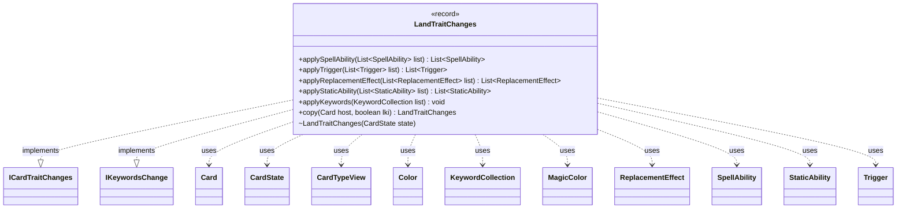

---
aliases:
  - LandTraitChanges
tags:
  - java/record
  - module/forge-game
  - pkg/forge/game/card
fqn: forge.game.card.CardState.LandTraitChanges
package: forge.game.card
module: forge-game
kind: Record
---

# LandTraitChanges

**Package:** `forge.game.card`   **Module:** `forge-game`   **Kind:** Record



## Relationships
**Implements:**
- [[forge.game.card.ICardTraitChanges|ICardTraitChanges]]
- [[forge.game.keyword.IKeywordsChange|IKeywordsChange]]
**Uses:**
- [[forge.card.CardTypeView|CardTypeView]]
- [[forge.card.MagicColor|MagicColor]]
- [[forge.card.MagicColor.Color|Color]]
- [[forge.game.card.Card|Card]]
- [[forge.game.card.CardState|CardState]]
- [[forge.game.keyword.KeywordCollection|KeywordCollection]]
- [[forge.game.replacement.ReplacementEffect|ReplacementEffect]]
- [[forge.game.spellability.SpellAbility|SpellAbility]]
- [[forge.game.staticability.StaticAbility|StaticAbility]]
- [[forge.game.trigger.Trigger|Trigger]]

## Design Description

`LandTraitChanges` is a nested record within `CardState` that models the trait modifications a card acquires when it becomes (or behaves as) a land. As an implementation of `ICardTraitChanges` and `IKeywordsChange`, it participates in Forge's layered trait-application pipeline, contributing the intrinsic mana abilities that basic land subtypes confer. Its central `applySpellAbility` method inspects the card's effective `CardTypeView`, and for each basic land subtype present synthesizes a tap-for-mana `SpellAbility` of the matching color, caching results in an `EnumMap` keyed by `MagicColor.Color` so generated abilities are reused.

The remaining `apply*` methods are deliberately minimal, only honoring `hasRemoveIntrinsic()` by clearing the supplied collections, since lands contribute no triggers, replacement effects, static abilities, or keywords. Being an immutable record, its `copy` simply returns `this`, reflecting that all state derives from the referenced `CardState` rather than from mutable per-instance data.

## Source
`forge-game/src/main/java/forge/game/card/CardState.java` — declaration excerpt

```java
    record LandTraitChanges(CardState state, Map<MagicColor.Color, SpellAbility> map) implements ICardTraitChanges, IKeywordsChange
    {
        LandTraitChanges(CardState state) {
            this(state, Maps.newEnumMap(MagicColor.Color.class));
        }

        public List<SpellAbility> applySpellAbility(List<SpellAbility> list) {
            if (state.getCard().hasRemoveIntrinsic()) {
                list.clear();
            }
            CardTypeView type = state.getTypeWithChanges();
            if (!type.isLand()) {
                return list;
            }
            for (MagicColor.Color c : MagicColor.Color.values()) {
               if (c.getBasicLandType() == null) {
                   continue;
               }
               if (type.hasSubtype(c.getBasicLandType())) {
                   list.add(map.computeIfAbsent(c, a -> {
                       String abString  = "AB$ Mana | Cost$ T | Produced$ " + a.getShortName() +
                               " | Secondary$ True | SpellDescription$ Add " + a.getSymbol() + ".";
                       SpellAbility sa = AbilityFactory.getAbility(abString, state);
                       sa.setIntrinsic(true); // always intrinsic
                       return sa;
                   }));
               }
            }
            return list;
        }
        public List<Trigger> applyTrigger(List<Trigger> list) {
            if (state.getCard().hasRemoveIntrinsic()) {
                list.clear();
            }
            return list;
        }
        public List<ReplacementEffect> applyReplacementEffect(List<ReplacementEffect> list) {
            if (state.getCard().hasRemoveIntrinsic()) {
                list.clear();
            }
            return list;
        }
        public List<StaticAbility> applyStaticAbility(List<StaticAbility> list) {
            if (state.getCard().hasRemoveIntrinsic()) {
                list.clear();
            }
            return list;
        }
        public void applyKeywords(KeywordCollection list) {
            if (state.getCard().hasRemoveIntrinsic()) {
                list.clear();
            }
        }
        public LandTraitChanges copy(Card host, boolean lki) { return this; }
    }
```

## Python
`forge/game/card/CardState/LandTraitChanges.py`

```python
from forge.game.card.ICardTraitChanges import ICardTraitChanges
from forge.game.keyword.IKeywordsChange import IKeywordsChange
from forge.card.CardTypeView import CardTypeView
from forge.card.MagicColor import MagicColor
from forge.card.MagicColor.Color import Color
from forge.game.card.Card import Card
from forge.game.card.CardState import CardState
from forge.game.keyword.KeywordCollection import KeywordCollection
from forge.game.replacement.ReplacementEffect import ReplacementEffect
from forge.game.spellability.SpellAbility import SpellAbility
from forge.game.staticability.StaticAbility import StaticAbility
from forge.game.trigger.Trigger import Trigger
from forge.game.ability.AbilityFactory import AbilityFactory


class LandTraitChanges(ICardTraitChanges, IKeywordsChange):
    def __init__(self, state: CardState, map: dict = None):
        self.state = state
        if map is None:
            map = {}
        self.map = map

    def applySpellAbility(self, list: list[SpellAbility]) -> list[SpellAbility]:
        if self.state.getCard().hasRemoveIntrinsic():
            list.clear()
        type = self.state.getTypeWithChanges()
        if not type.isLand():
            return list
        for c in Color.values():
            if c.getBasicLandType() is None:
                continue
            if type.hasSubtype(c.getBasicLandType()):
                if c not in self.map:
                    abString = ("AB$ Mana | Cost$ T | Produced$ " + c.getShortName() +
                                " | Secondary$ True | SpellDescription$ Add " + c.getSymbol() + ".")
                    sa = AbilityFactory.getAbility(abString, self.state)
                    sa.setIntrinsic(True)  # always intrinsic
                    self.map[c] = sa
                list.append(self.map[c])
        return list

    def applyTrigger(self, list: list[Trigger]) -> list[Trigger]:
        if self.state.getCard().hasRemoveIntrinsic():
            list.clear()
        return list

    def applyReplacementEffect(self, list: list[ReplacementEffect]) -> list[ReplacementEffect]:
        if self.state.getCard().hasRemoveIntrinsic():
            list.clear()
        return list

    def applyStaticAbility(self, list: list[StaticAbility]) -> list[StaticAbility]:
        if self.state.getCard().hasRemoveIntrinsic():
            list.clear()
        return list

    def applyKeywords(self, list: KeywordCollection) -> None:
        if self.state.getCard().hasRemoveIntrinsic():
            list.clear()

    def copy(self, host: Card, lki: bool) -> "LandTraitChanges":
        return self
```
