---
aliases:
  - CardState
tags:
  - java/class
  - module/forge-game
  - pkg/forge/game/card
fqn: forge.game.card.CardState
package: forge.game.card
module: forge-game
kind: Class
---

# CardState

**Package:** `forge.game.card`   **Module:** `forge-game`   **Kind:** Class



```mermaid
classDiagram
    class CardState {
        -String name
        -CardType type
        -CardTypeView changedType
        -ManaCost manaCost
        -ManaCost perpetualAdjustedManaCost
        -ColorSet color
        -String oracleText
        -String functionalVariantName
        -String flavorName
        -int basePower
        -int baseToughness
        -String basePowerString
        -String baseToughnessString
        -String baseLoyalty
        -String baseDefense
        -KeywordCollection intrinsicKeywords
        -Set~Integer~ attractionLights
        -FCollection~SpellAbility~ abilities
        -FCollection~Trigger~ triggers
        -FCollection~ReplacementEffect~ replacementEffects
        -FCollection~StaticAbility~ staticAbilities
        -String imageKey
        -Map~String,String~ sVars
        -Map~String,SpellAbility~ abilityForTrigger
        -KeywordCollection cachedKeywords
        -CardRarity rarity
        -String setCode
        -CardStateView view
        -Card card
        -SpellAbility landAbility
        -SpellAbility auraAbility
        -SpellAbility permanentAbility
        -ReplacementEffect loyaltyRep
        -ReplacementEffect defenseRep
        -ReplacementEffect sagaRep
        -ReplacementEffect adventureRep
        -ReplacementEffect omenRep
        -SpellAbility manifestUp
        -SpellAbility cloakUp
        -LandTraitChanges landTraitChanges
        +getView() CardStateView
        +getCard() Card
        +getName() String
        +setName(String name0) void
        +getStateName() CardStateName
        +toString() String
        +getTypeWithChanges() CardTypeView
        +updateTypes() void
        +updateTypesForView() void
        +getType() CardTypeView
        +addType(String type0) void
        +addType(Iterable~String~ type0) void
        +setType(CardType type0) void
        +removeType(CardType.Supertype st) void
        +removeCardTypes(boolean sanisfy) void
        +setCreatureTypes(Collection~String~ ctypes) void
        +getManaCost() ManaCost
        +setManaCost(ManaCost manaCost0) void
        +calculatePerpetualAdjustedManaCost() void
        +getPerpetualAdjustedManaCost() ManaCost
        +getColor() ColorSet
        +addColor(ColorSet color) void
        +setColor(ColorSet color) void
        +getOracleText() String
        +setOracleText(String oracleText) void
        +getFunctionalVariantName() String
        +setFunctionalVariantName(String functionalVariantName) void
        +getFlavorName() String
        +setFlavorName(String flavorName) void
        +getBasePower() int
        +setBasePower(int basePower0) void
        +getBaseToughness() int
        +setBaseToughness(int baseToughness0) void
        +getBasePowerString() String
        +getBaseToughnessString() String
        +setBasePowerString(String s) void
        +setBaseToughnessString(String s) void
        +hasPrintedPT() boolean
        +getBaseLoyalty() String
        +setBaseLoyalty(String string) void
        +getBaseDefense() String
        +setBaseDefense(String string) void
        +getAttractionLights() Set~Integer~
        +setAttractionLights(Set~Integer~ attractionLights) void
        +getCachedKeywords() KeywordCollection
        +getCachedKeyword(Keyword keyword) Collection~KeywordInterface~
        +setCachedKeywords(KeywordCollection col) void
        +hasKeyword(Keyword key) boolean
        +getIntrinsicKeywords() Collection~KeywordInterface~
        +hasIntrinsicKeyword(String k) boolean
        +hasIntrinsicKeyword(Keyword k) boolean
        +setIntrinsicKeywords(Iterable~KeywordInterface~ intrinsicKeyword0, boolean lki) void
        +updateKeywordsCache() void
        +addIntrinsicKeyword(String s, boolean initTraits) KeywordInterface
        +addIntrinsicKeywords(Iterable~String~ keywords) boolean
        +addIntrinsicKeywords(Iterable~String~ keywords, boolean initTraits) boolean
        +addIntrinsicKeywords(Collection~KeywordInterface~ intrinsicKeywords2) void
        +removeIntrinsicKeyword(String s) boolean
        +removeIntrinsicKeyword(KeywordInterface s) boolean
        +removeIntrinsicKeyword(Keyword k) boolean
        +getSpellAbilities() FCollectionView~SpellAbility~
        +getManaAbilities() FCollectionView~SpellAbility~
        +getNonManaAbilities() FCollectionView~SpellAbility~
        #updateSpellAbilities(FCollection~SpellAbility~ newCol) void
        +getLandTraitChanges() LandTraitChanges
        +getIntrinsicSpellAbilities() Iterable~SpellAbility~
        +getFirstAbility() SpellAbility
        +getFirstSpellAbility() SpellAbility
        +getFirstSpellAbilityWithFallback() SpellAbility
        +getAuraSpell() SpellAbility
        +hasSpellAbility(SpellAbility sa) boolean
        +hasSpellAbility(int id) boolean
        +addSpellAbility(SpellAbility a) boolean
        +getTriggers() FCollectionView~Trigger~
        +hasTrigger(Trigger t) boolean
        +hasTrigger(int id) boolean
        +addTrigger(Trigger t) boolean
        +getStaticAbilities() FCollectionView~StaticAbility~
        +addStaticAbility(StaticAbility stab) boolean
        +removeStaticAbility(StaticAbility stab) boolean
        +getReplacementEffects() FCollectionView~ReplacementEffect~
        +getReplacementEffects(boolean rulesHost) FCollectionView~ReplacementEffect~
        +addReplacementEffect(ReplacementEffect replacementEffect) boolean
        +hasReplacementEffect(ReplacementEffect re) boolean
        +hasReplacementEffect(int id) boolean
        +getReplacementEffect(int id) ReplacementEffect
        +getSVars() Map~String,String~
        +getSVar(String var) String
        +hasSVar(String var) boolean
        +setSVar(String var, String str) void
        +setSVars(Map~String,String~ newSVars) void
        +removeSVar(String var) void
        +getFoil() int
        +copyFrom(CardState source, boolean lki) void
        +copyFrom(CardState source, boolean lki, CardTraitBase ctb) void
        +addAbilitiesFrom(CardState source, boolean lki) void
        +copy(Card host, CardStateName name, boolean lki) CardState
        +copy(Card host, CardTraitBase ctb) CardState
        +copy(Card host, CardStateName name, CardTraitBase ctb) CardState
        +copy(Card host, CardStateName name, boolean lki, CardTraitBase ctb) CardState
        +getRarity() CardRarity
        +setRarity(CardRarity rarity0) void
        +getSetCode() String
        +setSetCode(String setCode0) void
        +getImageKey() String
        +setImageKey(String imageFilename0) void
        +hasProperty(String property, Player sourceController, Card source, CardTraitBase spellAbility) boolean
        +getTraits() ImmutableList~CardTraitBase~
        +resetOriginalHost(Card oldHost) void
        +updateChangedText() void
        +changeTextIntrinsic(Map~String,String~ colorMap, Map~String,String~ typeMap) void
        +hasChapter() boolean
        +getFinalChapterNr() int
        +getManifestUp() SpellAbility
        +getCloakUp() SpellAbility
        +getAbilityForTrigger(String svar) SpellAbility
        +getTranslationKey() String
        +getUntranslatedType() String
        +getTranslatedName() String
        +CardState(Card card, CardStateName name)
        +CardState(CardStateView view0, Card card0)
    }
    CardState ..|> GameObject : implements
    CardState ..|> IHasSVars : implements
    CardState ..|> ITranslatable : implements
    CardState ..> Card : uses
    CardState ..> CardRarity : uses
    CardState ..> CardStateName : uses
    CardState ..> CardStateView : uses
    CardState ..> CardTraitBase : uses
    CardState ..> CardType : uses
    CardState ..> CardTypeView : uses
    CardState ..> Color : uses
    CardState ..> ColorSet : uses
    CardState ..> Cost : uses
    CardState ..> FCollection : uses
    CardState ..> FCollectionView : uses
    CardState ..> ICardTraitChanges : uses
    CardState ..> IKeywordsChange : uses
    CardState ..> Keyword : uses
    CardState ..> KeywordCollection : uses
    CardState ..> KeywordInterface : uses
    CardState ..> KeywordWithType : uses
    CardState ..> LandAbility : uses
    CardState ..> LandTraitChanges : uses
    CardState ..> MagicColor : uses
    CardState ..> ManaCost : uses
    CardState ..> Player : uses
    CardState ..> ReplacementEffect : uses
    CardState ..> SpellAbility : uses
    CardState ..> SpellPermanent : uses
    CardState ..> StaticAbility : uses
    CardState ..> Supertype : uses
    CardState ..> Trigger : uses
```

## Relationships
**Implements:**
- [[forge.game.GameObject|GameObject]]
- [[forge.game.IHasSVars|IHasSVars]]
- [[forge.util.ITranslatable|ITranslatable]]
**Uses:**
- [[forge.card.CardRarity|CardRarity]]
- [[forge.card.CardStateName|CardStateName]]
- [[forge.card.CardType|CardType]]
- [[forge.card.CardType.Supertype|Supertype]]
- [[forge.card.CardTypeView|CardTypeView]]
- [[forge.card.ColorSet|ColorSet]]
- [[forge.card.MagicColor|MagicColor]]
- [[forge.card.MagicColor.Color|Color]]
- [[forge.card.mana.ManaCost|ManaCost]]
- [[forge.game.CardTraitBase|CardTraitBase]]
- [[forge.game.card.Card|Card]]
- [[forge.game.card.CardState.LandTraitChanges|LandTraitChanges]]
- [[forge.game.card.CardView.CardStateView|CardStateView]]
- [[forge.game.card.ICardTraitChanges|ICardTraitChanges]]
- [[forge.game.cost.Cost|Cost]]
- [[forge.game.keyword.IKeywordsChange|IKeywordsChange]]
- [[forge.game.keyword.Keyword|Keyword]]
- [[forge.game.keyword.KeywordCollection|KeywordCollection]]
- [[forge.game.keyword.KeywordInterface|KeywordInterface]]
- [[forge.game.keyword.KeywordWithType|KeywordWithType]]
- [[forge.game.player.Player|Player]]
- [[forge.game.replacement.ReplacementEffect|ReplacementEffect]]
- [[forge.game.spellability.LandAbility|LandAbility]]
- [[forge.game.spellability.SpellAbility|SpellAbility]]
- [[forge.game.spellability.SpellPermanent|SpellPermanent]]
- [[forge.game.staticability.StaticAbility|StaticAbility]]
- [[forge.game.trigger.Trigger|Trigger]]
- [[forge.util.collect.FCollection|FCollection]]
- [[forge.util.collect.FCollectionView|FCollectionView]]

## Design Description

CardState models a single face or mode of a Magic card—its name, type, mana cost, color, base power/toughness, loyalty, keywords, and the spell abilities, triggers, replacement effects, and static abilities printed on that face. A `Card` owns one or more named CardStates (Original, split halves, transformed backsides, specialize modes), and each delegates display concerns to its paired `CardStateView`, calling back to the view on every mutation so the UI stays synchronized.

Implementing `GameObject`, `IHasSVars`, and `ITranslatable`, the class concentrates the intrinsic, printed characteristics of a card while leaving runtime modifications to the owning `Card`. Notable design intent: type-dependent abilities (land mana, aura attach, permanent spell, planeswalker/saga/battle ETB counters) are lazily synthesized on demand rather than stored; accessor methods fold in split-card and continuous-effect changes via the host `Card`; and `copyFrom`/`copy` produce deep, intrinsic-only duplicates for last-known-information snapshots and card-copy effects, guarding against self-copy loops per the comprehensive rules.

## Source
`forge-game/src/main/java/forge/game/card/CardState.java`

```java
/*
 * Forge: Play Magic: the Gathering.
 * Copyright (C) 2011  Forge Team
 *
 * This program is free software: you can redistribute it and/or modify
 * it under the terms of the GNU General Public License as published by
 * the Free Software Foundation, either version 3 of the License, or
 * (at your option) any later version.
 *
 * This program is distributed in the hope that it will be useful,
 * but WITHOUT ANY WARRANTY; without even the implied warranty of
 * MERCHANTABILITY or FITNESS FOR A PARTICULAR PURPOSE.  See the
 * GNU General Public License for more details.
 *
 * You should have received a copy of the GNU General Public License
 * along with this program.  If not, see <http://www.gnu.org/licenses/>.
 */
package forge.game.card;

import com.google.common.collect.ImmutableList;
import com.google.common.collect.Iterables;
import com.google.common.collect.Maps;
import forge.card.*;
import forge.card.mana.ManaCost;
import forge.card.mana.ManaCostShard;
import forge.game.CardTraitBase;
import forge.game.ForgeScript;
import forge.game.GameObject;
import forge.game.IHasSVars;
import forge.game.ability.AbilityFactory;
import forge.game.ability.ApiType;
import forge.game.card.CardView.CardStateView;
import forge.game.cost.Cost;
import forge.game.keyword.IKeywordsChange;
import forge.game.keyword.Keyword;
import forge.game.keyword.KeywordCollection;
import forge.game.keyword.KeywordInterface;
import forge.game.keyword.KeywordWithType;
import forge.game.player.Player;
import forge.game.replacement.ReplacementEffect;
import forge.game.spellability.LandAbility;
import forge.game.spellability.SpellAbility;
import forge.game.spellability.SpellPermanent;
import forge.game.staticability.StaticAbility;
import forge.game.staticability.StaticAbilityMode;
import forge.game.trigger.Trigger;
import forge.util.CardTranslation;
import forge.util.ITranslatable;
import forge.util.IterableUtil;
import forge.util.collect.FCollection;
import forge.util.collect.FCollectionView;
import io.sentry.Breadcrumb;
import io.sentry.Sentry;

import org.apache.commons.lang3.StringUtils;

import java.util.Collection;
import java.util.List;
import java.util.Map;
import java.util.Objects;
import java.util.Set;
import java.util.function.Predicate;

public class CardState implements GameObject, IHasSVars, ITranslatable {
    private String name = "";
    private CardType type = new CardType(false);
    private CardTypeView changedType = null;
    private ManaCost manaCost = ManaCost.NO_COST;
    // Track mana cost after adjustments from perpetual cost-changing effects for display
    private ManaCost perpetualAdjustedManaCost = null;
    private ColorSet color = ColorSet.C;
    private String oracleText = "";
    private String functionalVariantName = null;
    private String flavorName = null;
    private int basePower = 0;
    private int baseToughness = 0;
    private String basePowerString = null;
    private String baseToughnessString = null;
    private String baseLoyalty = "";
    private String baseDefense = "";
    private KeywordCollection intrinsicKeywords = new KeywordCollection();
    private Set<Integer> attractionLights = null;

    private final FCollection<SpellAbility> abilities = new FCollection<>();
    private FCollection<Trigger> triggers = new FCollection<>();
    private FCollection<ReplacementEffect> replacementEffects = new FCollection<>();
    private FCollection<StaticAbility> staticAbilities = new FCollection<>();
    private String imageKey = "";
    private Map<String, String> sVars = Maps.newTreeMap();
    private Map<String, SpellAbility> abilityForTrigger = Maps.newHashMap();

    private KeywordCollection cachedKeywords = new KeywordCollection();

    private CardRarity rarity = CardRarity.Unknown;
    private String setCode = CardEdition.UNKNOWN_CODE;

    private final CardStateView view;
    private final Card card;

    private SpellAbility landAbility;
    private SpellAbility auraAbility;
    private SpellAbility permanentAbility;

    private ReplacementEffect loyaltyRep;
    private ReplacementEffect defenseRep;
    private ReplacementEffect sagaRep;
    private ReplacementEffect adventureRep;
    private ReplacementEffect omenRep;

    private SpellAbility manifestUp;
    private SpellAbility cloakUp;

    private LandTraitChanges landTraitChanges = new LandTraitChanges(this);

    public CardState(Card card, CardStateName name) {
        this(card.getView().createAlternateState(name), card);
    }

    public CardState(CardStateView view0, Card card0) {
        view = view0;
        card = card0;
        view.updateRarity(this);
        view.updateSetCode(this);
    }

    public CardStateView getView() {
        return view;
    }

    public Card getCard() {
        return card;
    }

    public final String getName() {
        return name;
    }
    public final void setName(final String name0) {
        name = name0;
        view.updateName(this);
    }

    public CardStateName getStateName() {
        return this.getView().getState();
    }

    @Override
    public String toString() {
        return name + " (" + view.getState() + ")";
    }

    public CardTypeView getTypeWithChanges() {
        return Objects.requireNonNullElse(this.changedType, getType());
    }

    public void updateTypes() {
        this.changedType = getType().getTypeWithChanges(card.getChangedCardTypes());
    }
    public void updateTypesForView() {
        view.updateType(this);
    }

    public final CardTypeView getType() {
        return type;
    }
    public final void addType(String type0) {
        if (type.add(type0)) {
            updateTypes();
            updateTypesForView();
        }
    }
    public final void addType(Iterable<String> type0) {
        if (type.addAll(type0)) {
            updateTypes();
            updateTypesForView();
        }
    }
    public final void setType(final CardType type0) {
        if (type0 == type) {
            // Logic below would incorrectly clear the type if it's the same object.
            return;
        }
        if (type0.isEmpty() && type.isEmpty()) { return; }
        type.clear();
        type.addAll(type0);
        updateTypes();
        updateTypesForView();
    }

    public final void removeType(final CardType.Supertype st) {
        if (type.remove(st)) {
            updateTypes();
            updateTypesForView();
        }
    }

    public final void removeCardTypes(boolean sanisfy) {
        type.removeCardTypes();
        if (sanisfy) {
            type.sanisfySubtypes();
        }

        updateTypes();
        updateTypesForView();
    }

    public final void setCreatureTypes(Collection<String> ctypes) {
        if (type.setCreatureTypes(ctypes)) {
            updateTypes();
            updateTypesForView();
        }
    }

    public final ManaCost getManaCost() {
        return manaCost;
    }
    public final void setManaCost(final ManaCost manaCost0) {
        manaCost = manaCost0;
        view.updateManaCost(this);
    }

    /**
     * Calculate and save the value of the mana cost adjusted by any perpetual raise/lower cost
     * effects for display.
     */
    public void calculatePerpetualAdjustedManaCost() {
        // If the total amount reduced is more than the generic mana cost,
        // keep track of the extra in case it could be applied to an X cost
        if (getCard() == null || getCard().getGame() == null
                || (manaCost.getGenericCost() == 0 && manaCost.getShardCount(ManaCostShard.X) == 0)) {
            return;
        }

        int genericCostAdjustment = 0;
        for (final StaticAbility stAb : getStaticAbilities()) {
            // Only collect perpetual cost changes to this card (not cost changes that this card applies to other cards)
            if ("Card.Self".equals(stAb.getParam("ValidCard"))) {
                int reduceOrRaise = 0;
                if (stAb.checkMode(StaticAbilityMode.ReduceCost)) {
                    reduceOrRaise = 1;
                } else if (stAb.checkMode(StaticAbilityMode.RaiseCost)) {
                    reduceOrRaise = -1;
                }
                if (reduceOrRaise != 0) {
                    try {
                        genericCostAdjustment += Integer.parseInt(stAb.getParamOrDefault("Amount", "1")) * reduceOrRaise;
                    } catch (NumberFormatException e) {
                        // We only care about adjustments with a specific numeric value
                    }
                }
            }
        }

        if (genericCostAdjustment == 0) {
            return;
        }

        // This doesn't work on hybrid generic costs
        int newGeneric = manaCost.getGenericCost() - genericCostAdjustment;
        // Apply negative cost adjustments to cards with an X cost only.
        // While this could be done for regular cards as well (to potentially offset other cost-increasing effects)
        // it would rarely matter and would require changing the "no_cost" flag in ManaCost from -1
        // otherwise a -1 generic adjustment will get interpreted as "no_cost"
        if (manaCost.getShardCount(ManaCostShard.X) == 0) {
            newGeneric = Math.max(0, newGeneric);
        }

        // Replace the original generic mana cost with the adjusted value
        perpetualAdjustedManaCost = new ManaCost(
                (newGeneric != 0 ? newGeneric + " " : "") +
                        manaCost.getShortString().replace("" + manaCost.getGenericCost(), "")
        );
        view.updateManaCost(this);
    }

    public ManaCost getPerpetualAdjustedManaCost() {
        return perpetualAdjustedManaCost == null ? getManaCost() : perpetualAdjustedManaCost;
    }

    public final ColorSet getColor() {
        return color;
    }
    public final void addColor(final ColorSet color) {
        this.color = ColorSet.combine(this.color, color);
        view.updateColors(card);
    }
    public final void setColor(final ColorSet color) {
        this.color = color;
        view.updateColors(card);
    }

    public String getOracleText() {
        return oracleText;
    }
    public void setOracleText(final String oracleText) {
        this.oracleText = oracleText;
        view.setOracleText(oracleText);
    }

    public String getFunctionalVariantName() {
        return functionalVariantName;
    }
    public void setFunctionalVariantName(String functionalVariantName) {
        if(functionalVariantName != null && functionalVariantName.isEmpty())
            functionalVariantName = null;
        this.functionalVariantName = functionalVariantName;
        view.setFunctionalVariantName(functionalVariantName);
    }

    public String getFlavorName() {
        return flavorName;
    }
    public void setFlavorName(String flavorName) {
        this.flavorName = flavorName;
        view.updateName(this);
    }

    public final int getBasePower() {
        return basePower;
    }
    public final void setBasePower(final int basePower0) {
        if (basePower == basePower0) { return; }
        basePower = basePower0;
        view.updatePower(this);
    }

    public final int getBaseToughness() {
        return baseToughness;
    }
    public final void setBaseToughness(final int baseToughness0) {
        if (baseToughness == baseToughness0) { return; }
        baseToughness = baseToughness0;
        view.updateToughness(this);
    }

    // values that are printed on card
    public final String getBasePowerString() {
        return basePowerString;
    }
    public final String getBaseToughnessString() {
        return baseToughnessString;
    }

    // values that are printed on card
    public final void setBasePowerString(final String s) {
        basePowerString = s;
    }
    public final void setBaseToughnessString(final String s) {
        baseToughnessString = s;
    }

    public final boolean hasPrintedPT() {
        return !StringUtils.isEmpty(basePowerString) || !StringUtils.isEmpty(baseToughnessString);
    }

    public String getBaseLoyalty() {
        return baseLoyalty;
    }
    public final void setBaseLoyalty(final String string) {
        baseLoyalty = string;
        view.updateLoyalty(this);
    }

    public String getBaseDefense() { return baseDefense; }
    public final void setBaseDefense(final String string) {
        baseDefense = string;
        view.updateDefense(this);
    }

    public Set<Integer> getAttractionLights() {
        return this.attractionLights;
    }
    public final void setAttractionLights(Set<Integer> attractionLights) {
        this.attractionLights = attractionLights;
        view.updateAttractionLights(this);
    }

    public final KeywordCollection getCachedKeywords() {
        return cachedKeywords;
    }

    public final Collection<KeywordInterface> getCachedKeyword(final Keyword keyword) {
        return cachedKeywords.getValues(keyword);
    }

    public final void setCachedKeywords(final KeywordCollection col) {
        cachedKeywords = col;
    }

    public final boolean hasKeyword(Keyword key) {
        return cachedKeywords.contains(key);
    }

    public final Collection<KeywordInterface> getIntrinsicKeywords() {
        return intrinsicKeywords.getValues();
    }
    public final boolean hasIntrinsicKeyword(String k) {
        return intrinsicKeywords.contains(k);
    }
    public final boolean hasIntrinsicKeyword(Keyword k) {
        return intrinsicKeywords.contains(k);
    }
    public final void setIntrinsicKeywords(final Iterable<KeywordInterface> intrinsicKeyword0, final boolean lki) {
        intrinsicKeywords.clear();
        for (KeywordInterface k : intrinsicKeyword0) {
            intrinsicKeywords.insert(k.copy(card, lki));
        }
        updateKeywordsCache();
    }

    public final void updateKeywordsCache() {
        card.updateKeywordsCache(this);
    }

    public final KeywordInterface addIntrinsicKeyword(final String s, boolean initTraits) {
        if (s.trim().length() == 0) {
            return null;
        }
        KeywordInterface inst = null;
        try {
            inst = intrinsicKeywords.add(s);
        } catch (Exception e) {
            String msg = "CardState:addIntrinsicKeyword: failed to parse Keyword";

            Breadcrumb bread = new Breadcrumb(msg);
            bread.setData("Card", card.getName());
            bread.setData("Keyword", s);
            Sentry.addBreadcrumb(bread);

            //rethrow
            throw new RuntimeException("Error in Keyword " + s + " for card " + card.getName(), e);
        }
        if (inst != null && initTraits) {
            inst.createTraits(card, true);
        }
        return inst;
    }
    public final boolean addIntrinsicKeywords(final Iterable<String> keywords) {
        return addIntrinsicKeywords(keywords, true);
    }
    public final boolean addIntrinsicKeywords(final Iterable<String> keywords, boolean initTraits) {
        boolean changed = false;
        for (String k : keywords) {
            if (addIntrinsicKeyword(k, initTraits) != null) {
                changed = true;
            }
        }
        return changed;
    }

    public void addIntrinsicKeywords(Collection<KeywordInterface> intrinsicKeywords2) {
        for (KeywordInterface inst : intrinsicKeywords2) {
            intrinsicKeywords.insert(inst);
        }
    }

    public final boolean removeIntrinsicKeyword(final String s) {
        return intrinsicKeywords.remove(s);
    }
    public final boolean removeIntrinsicKeyword(final KeywordInterface s) {
        return intrinsicKeywords.remove(s);
    }
    public final boolean removeIntrinsicKeyword(final Keyword k) {
        return intrinsicKeywords.removeAll(k);
    }

    public final FCollectionView<SpellAbility> getSpellAbilities() {
        FCollection<SpellAbility> newCol = new FCollection<>();
        updateSpellAbilities(newCol);
        newCol.addAll(abilities);
        card.updateSpellAbilities(newCol, this);
        return newCol;
    }
    public final FCollectionView<SpellAbility> getManaAbilities() {
        FCollection<SpellAbility> newCol = new FCollection<>();
        updateSpellAbilities(newCol);
        newCol.addAll(abilities);
        card.updateSpellAbilities(newCol, this);
        newCol.removeIf(Predicate.not(SpellAbility::isManaAbility));
        return newCol;
    }
    public final FCollectionView<SpellAbility> getNonManaAbilities() {
        FCollection<SpellAbility> newCol = new FCollection<>();
        updateSpellAbilities(newCol);
        newCol.addAll(abilities);
        card.updateSpellAbilities(newCol, this);
        newCol.removeIf(SpellAbility::isManaAbility);
        return newCol;
    }

    protected final void updateSpellAbilities(FCollection<SpellAbility> newCol) {
        // add Split to Original
        if (getStateName().equals(CardStateName.Original)) {
            if (getCard().hasState(CardStateName.LeftSplit)) {
                CardState leftState = getCard().getState(CardStateName.LeftSplit);
                newCol.addAll(leftState.abilities);
                leftState.updateSpellAbilities(newCol);
            }
            if (getCard().hasState(CardStateName.RightSplit)) {
                CardState rightState = getCard().getState(CardStateName.RightSplit);
                newCol.addAll(rightState.abilities);
                rightState.updateSpellAbilities(newCol);
            }
        }

        // SpellPermanent only for Original State
        switch(getStateName()) {
        case Backside:
            if (!getCard().isModal()) {
                return;
            }
            break;
        case Original:
        case LeftSplit:
        case RightSplit:
        case SpecializeB:
        case SpecializeG:
        case SpecializeR:
        case SpecializeU:
        case SpecializeW:
            break;
        default:
            return;
        }
        // if card has left or right split, disable intrinsic Spell for original
        if (getStateName().equals(CardStateName.Original) && (getCard().hasState(CardStateName.LeftSplit) || getCard().hasState(CardStateName.RightSplit))) {
            return;
        }

        CardTypeView type = getTypeWithChanges();
        if (type.isLand()) {
            if (landAbility == null) {
                landAbility = new LandAbility(card, this);
            }
            newCol.add(landAbility);
        } else if (type.isAura()) {
            newCol.add(getAuraSpell());
        } else if (type.isPermanent()) {
            if (abilities.anyMatch(s -> (
                    s.isBasicSpell() && s.getSubAbility() == null && (ApiType.PermanentCreature.equals(s.getApi()) || ApiType.PermanentNoncreature.equals(s.getApi())))
                )) {
                return;
            }

            if (permanentAbility == null) {
                permanentAbility = new SpellPermanent(card, this);
            }
            newCol.add(permanentAbility);
        }
    }

    public LandTraitChanges getLandTraitChanges() { return this.landTraitChanges; }

    record LandTraitChanges(CardState state, Map<MagicColor.Color, SpellAbility> map) implements ICardTraitChanges, IKeywordsChange
    {
        LandTraitChanges(CardState state) {
            this(state, Maps.newEnumMap(MagicColor.Color.class));
        }

        public List<SpellAbility> applySpellAbility(List<SpellAbility> list) {
            if (state.getCard().hasRemoveIntrinsic()) {
                list.clear();
            }
            CardTypeView type = state.getTypeWithChanges();
            if (!type.isLand()) {
                return list;
            }
            for (MagicColor.Color c : MagicColor.Color.values()) {
               if (c.getBasicLandType() == null) {
                   continue;
               }
               if (type.hasSubtype(c.getBasicLandType())) {
                   list.add(map.computeIfAbsent(c, a -> {
                       String abString  = "AB$ Mana | Cost$ T | Produced$ " + a.getShortName() +
                               " | Secondary$ True | SpellDescription$ Add " + a.getSymbol() + ".";
                       SpellAbility sa = AbilityFactory.getAbility(abString, state);
                       sa.setIntrinsic(true); // always intrinsic
                       return sa;
                   }));
               }
            }
            return list;
        }
        public List<Trigger> applyTrigger(List<Trigger> list) {
            if (state.getCard().hasRemoveIntrinsic()) {
                list.clear();
            }
            return list;
        }
        public List<ReplacementEffect> applyReplacementEffect(List<ReplacementEffect> list) {
            if (state.getCard().hasRemoveIntrinsic()) {
                list.clear();
            }
            return list;
        }
        public List<StaticAbility> applyStaticAbility(List<StaticAbility> list) {
            if (state.getCard().hasRemoveIntrinsic()) {
                list.clear();
            }
            return list;
        }
        public void applyKeywords(KeywordCollection list) {
            if (state.getCard().hasRemoveIntrinsic()) {
                list.clear();
            }
        }
        public LandTraitChanges copy(Card host, boolean lki) { return this; }
    }

    public final Iterable<SpellAbility> getIntrinsicSpellAbilities() {
        return IterableUtil.filter(getSpellAbilities(), CardTraitBase::isIntrinsic);
    }

    public final SpellAbility getFirstAbility() {
        return Iterables.getFirst(getIntrinsicSpellAbilities(), null);
    }
    public final SpellAbility getFirstSpellAbility() {
        if (this.card.getCastSA() != null) {
            return this.card.getCastSA();
        }
        return Iterables.getFirst(getNonManaAbilities(), null);
    }

    public final SpellAbility getFirstSpellAbilityWithFallback() {
        SpellAbility sa = getFirstSpellAbility();
        CardTypeView type = getTypeWithChanges();
        if (sa != null || type.isLand()) {
            return sa;
        }
        // this happens if it's transformed backside (e.g. Disturbed)
        if (type.isAura()) {
            return getAuraSpell();
        }
        if (permanentAbility == null) {
            permanentAbility = new SpellPermanent(card, this);
        }
        return permanentAbility;
    }

    public final SpellAbility getAuraSpell() {
        CardTypeView type = getTypeWithChanges();
        if (!type.isAura()) {
            return null;
        }
        if (auraAbility == null) {
            String desc = "";
            String extra = "";
            for (KeywordInterface ki : this.getCachedKeyword(Keyword.ENCHANT)) {
                if (ki instanceof KeywordWithType kwt) {
                    desc = kwt.getTypeDescription();
                }
                break;
            }
            if (hasSVar("AttachAITgts")) {
                extra += " | AITgts$ " + getSVar("AttachAITgts");
            }
            if (hasSVar("AttachAILogic")) {
                extra += " | AILogic$ " + getSVar("AttachAILogic");
            }
            if (hasSVar("AttachAIValid")) { // TODO combine with AttachAITgts
                extra += " | AIValid$ " + getSVar("AttachAIValid");
            }
            String st = "SP$ Attach | ValidTgts$ Card.CanBeEnchantedBy,Player.CanBeEnchantedBy | TgtZone$ Battlefield,Graveyard | ValidTgtsDesc$ " + desc + extra;
            auraAbility = AbilityFactory.getAbility(st, this);
            auraAbility.setIntrinsic(true);
        }
        return this.auraAbility;
    }

    public final boolean hasSpellAbility(final SpellAbility sa) {
        return getSpellAbilities().contains(sa);
    }
    public final boolean hasSpellAbility(final int id) {
        for (SpellAbility sa : getSpellAbilities()) {
            if (id == sa.getId()) {
                return true;
            }
        }
        return false;
    }

    public final boolean addSpellAbility(final SpellAbility a) {
        return abilities.add(a);
    }

    public final FCollectionView<Trigger> getTriggers() {
        FCollection<Trigger> result = new FCollection<>(triggers);
        if (getStateName().equals(CardStateName.Original)) {
            if (getCard().hasState(CardStateName.LeftSplit))
                result.addAll(getCard().getState(CardStateName.LeftSplit).triggers);
            if (getCard().hasState(CardStateName.RightSplit))
                result.addAll(getCard().getState(CardStateName.RightSplit).triggers);
        }
        card.updateTriggers(result, this);
        return result;
    }

    public final boolean hasTrigger(final Trigger t) {
        return getTriggers().contains(t);
    }

    public final boolean hasTrigger(final int id) {
        for (final Trigger t : getTriggers()) {
            if (id == t.getId()) {
                return true;
            }
        }
        return false;
    }

    public final boolean addTrigger(final Trigger t) {
        return triggers.add(t);
    }

    public final FCollectionView<StaticAbility> getStaticAbilities() {
        FCollection<StaticAbility> result = new FCollection<>(staticAbilities);
        if (getStateName().equals(CardStateName.Original)) {
            if (getCard().hasState(CardStateName.LeftSplit))
                result.addAll(getCard().getState(CardStateName.LeftSplit).staticAbilities);
            if (getCard().hasState(CardStateName.RightSplit))
                result.addAll(getCard().getState(CardStateName.RightSplit).staticAbilities);
        }
        card.updateStaticAbilities(result, this);
        return result;
    }
    public final boolean addStaticAbility(StaticAbility stab) {
        return staticAbilities.add(stab);
    }
    public final boolean removeStaticAbility(StaticAbility stab) {
        return staticAbilities.remove(stab);
    }

    public FCollectionView<ReplacementEffect> getReplacementEffects() {
        return getReplacementEffects(true);
    }
    public FCollectionView<ReplacementEffect> getReplacementEffects(boolean rulesHost) {
        FCollection<ReplacementEffect> result = new FCollection<>(replacementEffects);
        // add Split to Original
        if (getStateName().equals(CardStateName.Original)) {
            if (getCard().hasState(CardStateName.LeftSplit))
                result.addAll(getCard().getState(CardStateName.LeftSplit).replacementEffects);
            if (getCard().hasState(CardStateName.RightSplit))
                result.addAll(getCard().getState(CardStateName.RightSplit).replacementEffects);
        }
        CardTypeView type = getTypeWithChanges();
        if (type.isPlaneswalker()) {
            if (loyaltyRep == null) {
                loyaltyRep = CardFactoryUtil.makeEtbCounter("etbCounter:LOYALTY:" + this.baseLoyalty, this, true);
            }
            result.add(loyaltyRep);
        }
        if (type.isBattle()) {
            if (defenseRep == null) {
                defenseRep = CardFactoryUtil.makeEtbCounter("etbCounter:DEFENSE:" + this.baseDefense, this, true);
            }
            result.add(defenseRep);
        }
        if (type.isSaga() && !hasKeyword(Keyword.READ_AHEAD)) {
            if (sagaRep == null) {
                sagaRep = CardFactoryUtil.makeEtbCounter("etbCounter:LORE:1", this, true);
            }
            result.add(sagaRep);
        }

        card.updateReplacementEffects(result, this, rulesHost);

        if (!rulesHost) {
            return result;
        }

        // below are global rules
        if (type.hasSubtype("Adventure")) {
            if (this.adventureRep == null) {
                adventureRep = CardFactoryUtil.setupAdventureAbility(this);
            }
            result.add(adventureRep);
        }
        if (type.hasSubtype("Omen")) {
            if (this.omenRep == null) {
                omenRep = CardFactoryUtil.setupOmenAbility(this);
            }
            result.add(omenRep);
        }

        return result;
    }
    public boolean addReplacementEffect(final ReplacementEffect replacementEffect) {
        return replacementEffects.add(replacementEffect);
    }

    public final boolean hasReplacementEffect(final ReplacementEffect re) {
        return getReplacementEffects().contains(re);
    }
    public final boolean hasReplacementEffect(final int id) {
        return getReplacementEffect(id) != null;
    }

    public final ReplacementEffect getReplacementEffect(final int id) {
        for (final ReplacementEffect r : getReplacementEffects()) {
            if (id == r.getId()) {
                return r;
            }
        }
        return null;
    }

    @Override
    public final Map<String, String> getSVars() {
        return sVars;
    }

    @Override
    public final String getSVar(final String var) {
        if (sVars.containsKey(var)) {
            return sVars.get(var);
        }
        return "";
    }

    @Override
    public final boolean hasSVar(final String var) {
        if (var == null) {
            return false;
        }
        return sVars.containsKey(var);
    }

    @Override
    public final void setSVar(final String var, final String str) {
        sVars.put(var, str);
        view.updateFoilIndex(card.getState(CardStateName.Original));
    }

    @Override
    public final void setSVars(final Map<String, String> newSVars) {
        sVars = Maps.newTreeMap();
        sVars.putAll(newSVars);
        view.updateFoilIndex(card.getState(CardStateName.Original));
    }

    @Override
    public final void removeSVar(final String var) {
        sVars.remove(var);
    }

    public final int getFoil() {
        final String foil = getSVar("Foil");
        if (!foil.isEmpty()) {
            return Integer.parseInt(foil);
        }
        return 0;
    }

    public final void copyFrom(final CardState source, final boolean lki) {
        copyFrom(source, lki, null);
    }
    public final void copyFrom(final CardState source, final boolean lki, final CardTraitBase ctb) {
        // Makes a "deeper" copy of a CardState object
        setName(source.getName());
        setType(source.type);
        setManaCost(source.getManaCost());
        setColor(source.getColor());
        setOracleText(source.getOracleText());
        setFunctionalVariantName(source.getFunctionalVariantName());
        setBasePower(source.getBasePower());
        setBaseToughness(source.getBaseToughness());
        setBaseLoyalty(source.getBaseLoyalty());
        setBaseDefense(source.getBaseDefense());
        setAttractionLights(source.getAttractionLights());
        setFlavorName(source.getFlavorName());
        setSVars(source.getSVars());

        abilityForTrigger.clear();
        for (Map.Entry<String, SpellAbility> e : source.abilityForTrigger.entrySet()) {
            abilityForTrigger.put(e.getKey(), e.getValue().copy(card, lki));
        }

        abilities.clear();
        for (SpellAbility sa : source.abilities) {
            if (sa.isIntrinsic()) {
                abilities.add(sa.copy(card, lki));
            }
        }

        setIntrinsicKeywords(source.intrinsicKeywords.getValues(), lki);
        setImageKey(source.getImageKey());
        setRarity(source.rarity);
        setSetCode(source.setCode);

        Trigger dontCopyTr = null;
        if (ctb != null && ctb.hasParam("DoesntHaveThisAbility")) {
            SpellAbility root = ((SpellAbility) ctb).getRootAbility();
            if (root.isTrigger()) {
                dontCopyTr = root.getTrigger();
            }
        }

        triggers.clear();
        for (Trigger tr : source.triggers) {
            if (tr.equals(dontCopyTr)) {
                continue;
            }
            if (tr.isIntrinsic()) {
                triggers.add(tr.copy(card, lki, false, tr.hasParam("Execute") ? abilityForTrigger.get(tr.getParam("Execute")) : null));
            }
        }
        ReplacementEffect runRE = null;
        if (ctb instanceof SpellAbility sp && sp.isReplacementAbility()
            && source.getCard().equals(ctb.getHostCard())) {
            runRE = sp.getReplacementEffect();
        }

        replacementEffects.clear();
        for (ReplacementEffect re : source.replacementEffects) {
            if (re.isIntrinsic()) {
                ReplacementEffect reCopy = re.copy(card, lki);
                if (re.equals(runRE) && runRE.hasRun()) {
                    // CR 208.2b prevent loop from card copying itself
                    reCopy.setHasRun(true);
                }
                replacementEffects.add(reCopy);
            }
        }

        staticAbilities.clear();
        for (StaticAbility sa : source.staticAbilities) {
            if (sa.isIntrinsic()) {
                staticAbilities.add(sa.copy(card, lki));
            }
        }
        if (lki) {
            this.changedType = source.changedType;
            if (source.landAbility != null) {
                landAbility = source.landAbility.copy(card, true);
            }
            if (source.auraAbility != null) {
                auraAbility = source.auraAbility.copy(card, true);
            }
            if (source.permanentAbility != null) {
                permanentAbility = source.permanentAbility.copy(card, true);
            }
            if (source.loyaltyRep != null) {
                loyaltyRep = source.loyaltyRep.copy(card, true);
            }
            if (source.defenseRep != null) {
                defenseRep = source.defenseRep.copy(card, true);
            }
            if (source.sagaRep != null) {
                sagaRep = source.sagaRep.copy(card, true);
            }
            if (source.adventureRep != null) {
                adventureRep = source.adventureRep.copy(card, true);
            }
            if (source.omenRep != null) {
                omenRep = source.omenRep.copy(card, true);
            }
        }
    }

    public final void addAbilitiesFrom(final CardState source, final boolean lki) {
        for (SpellAbility sa : source.abilities) {
            if (sa.isIntrinsic() && sa.getApi() != ApiType.PermanentCreature && sa.getApi() != ApiType.PermanentNoncreature) {
                abilities.add(sa.copy(card, lki));
            }
        }

        for (KeywordInterface k : source.intrinsicKeywords) {
            intrinsicKeywords.insert(k.copy(card, lki));
        }

        for (Trigger tr : source.triggers) {
            if (tr.isIntrinsic()) {
                triggers.add(tr.copy(card, lki));
            }
        }

        for (ReplacementEffect re : source.replacementEffects) {
            if (re.isIntrinsic()) {
                replacementEffects.add(re.copy(card, lki));
            }
        }

        for (StaticAbility sa : source.staticAbilities) {
            if (sa.isIntrinsic()) {
                staticAbilities.add(sa.copy(card, lki));
            }
        }
    }

    public CardState copy(final Card host, CardStateName name, final boolean lki) {
        return copy(host, name, lki, null);
    }
    public CardState copy(final Card host, final CardTraitBase ctb) {
        return copy(host, this.getStateName(), false, ctb);
    }
    public CardState copy(final Card host, CardStateName name, final CardTraitBase ctb) {
        return copy(host, name, false, ctb);
    }
    public CardState copy(final Card host, CardStateName name, final boolean lki, final CardTraitBase ctb) {
        CardState result = new CardState(host, name);
        result.copyFrom(this, lki, ctb);
        return result;
    }

    public CardRarity getRarity() {
        return rarity;
    }
    public void setRarity(CardRarity rarity0) {
        rarity = rarity0;
        view.updateRarity(this);
    }

    public String getSetCode() {
        return setCode;
    }
    public void setSetCode(String setCode0) {
        setCode = setCode0;
        view.updateSetCode(this);
    }

    public final String getImageKey() {
        return imageKey;
    }
    public final void setImageKey(final String imageFilename0) {
        imageKey = imageFilename0;
        view.updateImageKey(this);
    }

    /* (non-Javadoc)
     * @see forge.game.GameObject#hasProperty(java.lang.String, forge.game.player.Player, forge.game.card.Card, forge.game.spellability.SpellAbility)
     */
    @Override
    public boolean hasProperty(String property, Player sourceController, Card source, CardTraitBase spellAbility) {
        return ForgeScript.cardStateHasProperty(this, property, sourceController, source, spellAbility);
    }

    public ImmutableList<CardTraitBase> getTraits() {
        return ImmutableList.<CardTraitBase>builder()
                .addAll(abilities)
                .addAll(triggers)
                .addAll(replacementEffects)
                .addAll(staticAbilities)
                .build();
    }

    public void resetOriginalHost(Card oldHost) {
        for (final CardTraitBase ctb : getTraits()) {
            if (ctb.isIntrinsic() && oldHost.equals(ctb.getOriginalHost())) {
                // only update traits with undesired host or SVar lookup would fail
                ctb.setCardState(this);
            }
        }
    }

    public void updateChangedText() {
        for (final CardTraitBase ctb : getTraits()) {
            if (ctb.isIntrinsic()) {
                ctb.changeText();
            }
        }
    }

    public void changeTextIntrinsic(Map<String,String> colorMap, Map<String,String> typeMap) {
        for (final CardTraitBase ctb : getTraits()) {
            if (ctb.isIntrinsic()) {
                ctb.changeTextIntrinsic(colorMap, typeMap);
            }
        }
    }

    public final boolean hasChapter() {
        return getTriggers().anyMatch(Trigger::isChapter);
    }

    public final int getFinalChapterNr() {
        int n = 0;
        for (final Trigger t : getTriggers()) {
            if (t.isChapter()) {
                n = Math.max(n, t.getChapter());
            }
        }
        return n;
    }

    public SpellAbility getManifestUp() {
        if (this.manifestUp == null) {
            manifestUp = CardFactoryUtil.abilityTurnFaceUp(this, new Cost(this.getManaCost(), true), "ManifestUp", "Unmanifest", "manacost");
        }
        return manifestUp;
    }
    public SpellAbility getCloakUp() {
        if (this.cloakUp == null) {
            cloakUp = CardFactoryUtil.abilityTurnFaceUp(this, new Cost(this.getManaCost(), true), "CloakUp", "Uncloak", "manacost");
        }
        return cloakUp;
    }

    public SpellAbility getAbilityForTrigger(String svar) {
        return abilityForTrigger.computeIfAbsent(svar, s -> AbilityFactory.getAbility(getCard(), s, this));
    }

    @Override
    public String getTranslationKey() {
        String displayName = flavorName == null ? name : flavorName;
        if(StringUtils.isNotEmpty(functionalVariantName))
            return displayName + " $" + functionalVariantName;
        return displayName;
    }

    @Override
    public String getUntranslatedType() {
        return getType().toString();
    }

    @Override
    public String getTranslatedName() {
        return CardTranslation.getTranslatedName(this);
    }
}
```

## Python
`forge/game/card/CardState.py`

```python
from forge.card.CardEdition import CardEdition
from forge.card.CardRarity import CardRarity
from forge.card.CardStateName import CardStateName
from forge.card.CardType import CardType
from forge.card.CardType.Supertype import Supertype
from forge.card.CardTypeView import CardTypeView
from forge.card.ColorSet import ColorSet
from forge.card.MagicColor import MagicColor
from forge.card.MagicColor.Color import Color
from forge.card.mana.ManaCost import ManaCost
from forge.card.mana.ManaCostShard import ManaCostShard
from forge.game.CardTraitBase import CardTraitBase
from forge.game.ForgeScript import ForgeScript
from forge.game.GameObject import GameObject
from forge.game.IHasSVars import IHasSVars
from forge.game.ability.AbilityFactory import AbilityFactory
from forge.game.ability.ApiType import ApiType
from forge.game.card.Card import Card
from forge.game.card.CardFactoryUtil import CardFactoryUtil
from forge.game.card.CardView.CardStateView import CardStateView
from forge.game.card.ICardTraitChanges import ICardTraitChanges
from forge.game.cost.Cost import Cost
from forge.game.keyword.IKeywordsChange import IKeywordsChange
from forge.game.keyword.Keyword import Keyword
from forge.game.keyword.KeywordCollection import KeywordCollection
from forge.game.keyword.KeywordInterface import KeywordInterface
from forge.game.keyword.KeywordWithType import KeywordWithType
from forge.game.player.Player import Player
from forge.game.replacement.ReplacementEffect import ReplacementEffect
from forge.game.spellability.LandAbility import LandAbility
from forge.game.spellability.SpellAbility import SpellAbility
from forge.game.spellability.SpellPermanent import SpellPermanent
from forge.game.staticability.StaticAbility import StaticAbility
from forge.game.staticability.StaticAbilityMode import StaticAbilityMode
from forge.game.trigger.Trigger import Trigger
from forge.util.CardTranslation import CardTranslation
from forge.util.ITranslatable import ITranslatable
from forge.util.IterableUtil import IterableUtil
from forge.util.collect.FCollection import FCollection
from forge.util.collect.FCollectionView import FCollectionView

from io.sentry.Breadcrumb import Breadcrumb
from io.sentry.Sentry import Sentry


def _getFirst(iterable, default):
    for x in iterable:
        return x
    return default


class CardState(GameObject, IHasSVars, ITranslatable):
    def __init__(self, arg0, arg1):
        self.name = ""
        self.type = CardType(False)
        self.changedType = None
        self.manaCost = ManaCost.NO_COST
        # Track mana cost after adjustments from perpetual cost-changing effects for display
        self.perpetualAdjustedManaCost = None
        self.color = ColorSet.C
        self.oracleText = ""
        self.functionalVariantName = None
        self.flavorName = None
        self.basePower = 0
        self.baseToughness = 0
        self.basePowerString = None
        self.baseToughnessString = None
        self.baseLoyalty = ""
        self.baseDefense = ""
        self.intrinsicKeywords = KeywordCollection()
        self.attractionLights = None

        self.abilities = FCollection()
        self.triggers = FCollection()
        self.replacementEffects = FCollection()
        self.staticAbilities = FCollection()
        self.imageKey = ""
        self.sVars = {}
        self.abilityForTrigger = {}

        self.cachedKeywords = KeywordCollection()

        self.rarity = CardRarity.Unknown
        self.setCode = CardEdition.UNKNOWN_CODE

        self.landAbility = None
        self.auraAbility = None
        self.permanentAbility = None

        self.loyaltyRep = None
        self.defenseRep = None
        self.sagaRep = None
        self.adventureRep = None
        self.omenRep = None

        self.manifestUp = None
        self.cloakUp = None

        self.landTraitChanges = CardState.LandTraitChanges(self)

        if isinstance(arg0, Card):
            # CardState(Card card, CardStateName name)
            view0 = arg0.getView().createAlternateState(arg1)
            card0 = arg0
        else:
            # CardState(CardStateView view0, Card card0)
            view0 = arg0
            card0 = arg1

        self.view = view0
        self.card = card0
        self.view.updateRarity(self)
        self.view.updateSetCode(self)

    def getView(self):
        return self.view

    def getCard(self):
        return self.card

    def getName(self):
        return self.name

    def setName(self, name0):
        self.name = name0
        self.view.updateName(self)

    def getStateName(self):
        return self.getView().getState()

    def __str__(self):
        return self.name + " (" + str(self.view.getState()) + ")"

    def getTypeWithChanges(self):
        return self.changedType if self.changedType is not None else self.getType()

    def updateTypes(self):
        self.changedType = self.getType().getTypeWithChanges(self.card.getChangedCardTypes())

    def updateTypesForView(self):
        self.view.updateType(self)

    def getType(self):
        return self.type

    def addType(self, type0):
        if isinstance(type0, str):
            if self.type.add(type0):
                self.updateTypes()
                self.updateTypesForView()
        else:
            if self.type.addAll(type0):
                self.updateTypes()
                self.updateTypesForView()

    def setType(self, type0):
        if type0 is self.type:
            # Logic below would incorrectly clear the type if it's the same object.
            return
        if type0.isEmpty() and self.type.isEmpty():
            return
        self.type.clear()
        self.type.addAll(type0)
        self.updateTypes()
        self.updateTypesForView()

    def removeType(self, st):
        if self.type.remove(st):
            self.updateTypes()
            self.updateTypesForView()

    def removeCardTypes(self, sanisfy):
        self.type.removeCardTypes()
        if sanisfy:
            self.type.sanisfySubtypes()

        self.updateTypes()
        self.updateTypesForView()

    def setCreatureTypes(self, ctypes):
        if self.type.setCreatureTypes(ctypes):
            self.updateTypes()
            self.updateTypesForView()

    def getManaCost(self):
        return self.manaCost

    def setManaCost(self, manaCost0):
        self.manaCost = manaCost0
        self.view.updateManaCost(self)

    def calculatePerpetualAdjustedManaCost(self):
        """
        Calculate and save the value of the mana cost adjusted by any perpetual raise/lower cost
        effects for display.
        """
        # If the total amount reduced is more than the generic mana cost,
        # keep track of the extra in case it could be applied to an X cost
        if (self.getCard() is None or self.getCard().getGame() is None
                or (self.manaCost.getGenericCost() == 0 and self.manaCost.getShardCount(ManaCostShard.X) == 0)):
            return

        genericCostAdjustment = 0
        for stAb in self.getStaticAbilities():
            # Only collect perpetual cost changes to this card (not cost changes that this card applies to other cards)
            if "Card.Self" == stAb.getParam("ValidCard"):
                reduceOrRaise = 0
                if stAb.checkMode(StaticAbilityMode.ReduceCost):
                    reduceOrRaise = 1
                elif stAb.checkMode(StaticAbilityMode.RaiseCost):
                    reduceOrRaise = -1
                if reduceOrRaise != 0:
                    try:
                        genericCostAdjustment += int(stAb.getParamOrDefault("Amount", "1")) * reduceOrRaise
                    except ValueError:
                        # We only care about adjustments with a specific numeric value
                        pass

        if genericCostAdjustment == 0:
            return

        # This doesn't work on hybrid generic costs
        newGeneric = self.manaCost.getGenericCost() - genericCostAdjustment
        # Apply negative cost adjustments to cards with an X cost only.
        # While this could be done for regular cards as well (to potentially offset other cost-increasing effects)
        # it would rarely matter and would require changing the "no_cost" flag in ManaCost from -1
        # otherwise a -1 generic adjustment will get interpreted as "no_cost"
        if self.manaCost.getShardCount(ManaCostShard.X) == 0:
            newGeneric = max(0, newGeneric)

        # Replace the original generic mana cost with the adjusted value
        self.perpetualAdjustedManaCost = ManaCost(
            (str(newGeneric) + " " if newGeneric != 0 else "") +
            self.manaCost.getShortString().replace(str(self.manaCost.getGenericCost()), "")
        )
        self.view.updateManaCost(self)

    def getPerpetualAdjustedManaCost(self):
        return self.getManaCost() if self.perpetualAdjustedManaCost is None else self.perpetualAdjustedManaCost

    def getColor(self):
        return self.color

    def addColor(self, color):
        self.color = ColorSet.combine(self.color, color)
        self.view.updateColors(self.card)

    def setColor(self, color):
        self.color = color
        self.view.updateColors(self.card)

    def getOracleText(self):
        return self.oracleText

    def setOracleText(self, oracleText):
        self.oracleText = oracleText
        self.view.setOracleText(oracleText)

    def getFunctionalVariantName(self):
        return self.functionalVariantName

    def setFunctionalVariantName(self, functionalVariantName):
        if functionalVariantName is not None and functionalVariantName == "":
            functionalVariantName = None
        self.functionalVariantName = functionalVariantName
        self.view.setFunctionalVariantName(functionalVariantName)

    def getFlavorName(self):
        return self.flavorName

    def setFlavorName(self, flavorName):
        self.flavorName = flavorName
        self.view.updateName(self)

    def getBasePower(self):
        return self.basePower

    def setBasePower(self, basePower0):
        if self.basePower == basePower0:
            return
        self.basePower = basePower0
        self.view.updatePower(self)

    def getBaseToughness(self):
        return self.baseToughness

    def setBaseToughness(self, baseToughness0):
        if self.baseToughness == baseToughness0:
            return
        self.baseToughness = baseToughness0
        self.view.updateToughness(self)

    # values that are printed on card
    def getBasePowerString(self):
        return self.basePowerString

    def getBaseToughnessString(self):
        return self.baseToughnessString

    # values that are printed on card
    def setBasePowerString(self, s):
        self.basePowerString = s

    def setBaseToughnessString(self, s):
        self.baseToughnessString = s

    def hasPrintedPT(self):
        return bool(self.basePowerString) or bool(self.baseToughnessString)

    def getBaseLoyalty(self):
        return self.baseLoyalty

    def setBaseLoyalty(self, string):
        self.baseLoyalty = string
        self.view.updateLoyalty(self)

    def getBaseDefense(self):
        return self.baseDefense

    def setBaseDefense(self, string):
        self.baseDefense = string
        self.view.updateDefense(self)

    def getAttractionLights(self):
        return self.attractionLights

    def setAttractionLights(self, attractionLights):
        self.attractionLights = attractionLights
        self.view.updateAttractionLights(self)

    def getCachedKeywords(self):
        return self.cachedKeywords

    def getCachedKeyword(self, keyword):
        return self.cachedKeywords.getValues(keyword)

    def setCachedKeywords(self, col):
        self.cachedKeywords = col

    def hasKeyword(self, key):
        return self.cachedKeywords.contains(key)

    def getIntrinsicKeywords(self):
        return self.intrinsicKeywords.getValues()

    def hasIntrinsicKeyword(self, k):
        return self.intrinsicKeywords.contains(k)

    def setIntrinsicKeywords(self, intrinsicKeyword0, lki):
        self.intrinsicKeywords.clear()
        for k in intrinsicKeyword0:
            self.intrinsicKeywords.insert(k.copy(self.card, lki))
        self.updateKeywordsCache()

    def updateKeywordsCache(self):
        self.card.updateKeywordsCache(self)

    def addIntrinsicKeyword(self, s, initTraits):
        if len(s.strip()) == 0:
            return None
        inst = None
        try:
            inst = self.intrinsicKeywords.add(s)
        except Exception as e:
            msg = "CardState:addIntrinsicKeyword: failed to parse Keyword"

            bread = Breadcrumb(msg)
            bread.setData("Card", self.card.getName())
            bread.setData("Keyword", s)
            Sentry.addBreadcrumb(bread)

            # rethrow
            raise RuntimeError("Error in Keyword " + s + " for card " + self.card.getName()) from e
        if inst is not None and initTraits:
            inst.createTraits(self.card, True)
        return inst

    def addIntrinsicKeywords(self, keywords, initTraits=None):
        if initTraits is not None:
            # addIntrinsicKeywords(Iterable<String> keywords, boolean initTraits)
            changed = False
            for k in keywords:
                if self.addIntrinsicKeyword(k, initTraits) is not None:
                    changed = True
            return changed
        # single-arg overload: distinguish Iterable<String> from Collection<KeywordInterface>
        items = list(keywords)
        if items and not isinstance(items[0], str):
            # addIntrinsicKeywords(Collection<KeywordInterface> intrinsicKeywords2)
            for inst in items:
                self.intrinsicKeywords.insert(inst)
            return None
        # addIntrinsicKeywords(Iterable<String> keywords)
        return self.addIntrinsicKeywords(items, True)

    def removeIntrinsicKeyword(self, s):
        if isinstance(s, str):
            return self.intrinsicKeywords.remove(s)
        if isinstance(s, Keyword):
            return self.intrinsicKeywords.removeAll(s)
        return self.intrinsicKeywords.remove(s)

    def getSpellAbilities(self):
        newCol = FCollection()
        self.updateSpellAbilities(newCol)
        newCol.addAll(self.abilities)
        self.card.updateSpellAbilities(newCol, self)
        return newCol

    def getManaAbilities(self):
        newCol = FCollection()
        self.updateSpellAbilities(newCol)
        newCol.addAll(self.abilities)
        self.card.updateSpellAbilities(newCol, self)
        newCol.removeIf(lambda s: not s.isManaAbility())
        return newCol

    def getNonManaAbilities(self):
        newCol = FCollection()
        self.updateSpellAbilities(newCol)
        newCol.addAll(self.abilities)
        self.card.updateSpellAbilities(newCol, self)
        newCol.removeIf(lambda s: s.isManaAbility())
        return newCol

    def updateSpellAbilities(self, newCol):
        # add Split to Original
        if self.getStateName() == CardStateName.Original:
            if self.getCard().hasState(CardStateName.LeftSplit):
                leftState = self.getCard().getState(CardStateName.LeftSplit)
                newCol.addAll(leftState.abilities)
                leftState.updateSpellAbilities(newCol)
            if self.getCard().hasState(CardStateName.RightSplit):
                rightState = self.getCard().getState(CardStateName.RightSplit)
                newCol.addAll(rightState.abilities)
                rightState.updateSpellAbilities(newCol)

        # SpellPermanent only for Original State
        stateName = self.getStateName()
        if stateName == CardStateName.Backside:
            if not self.getCard().isModal():
                return
        elif stateName in (CardStateName.Original, CardStateName.LeftSplit, CardStateName.RightSplit,
                           CardStateName.SpecializeB, CardStateName.SpecializeG, CardStateName.SpecializeR,
                           CardStateName.SpecializeU, CardStateName.SpecializeW):
            pass
        else:
            return

        # if card has left or right split, disable intrinsic Spell for original
        if self.getStateName() == CardStateName.Original and (self.getCard().hasState(CardStateName.LeftSplit) or self.getCard().hasState(CardStateName.RightSplit)):
            return

        type = self.getTypeWithChanges()
        if type.isLand():
            if self.landAbility is None:
                self.landAbility = LandAbility(self.card, self)
            newCol.add(self.landAbility)
        elif type.isAura():
            newCol.add(self.getAuraSpell())
        elif type.isPermanent():
            if self.abilities.anyMatch(lambda s: (
                    s.isBasicSpell() and s.getSubAbility() is None and (ApiType.PermanentCreature == s.getApi() or ApiType.PermanentNoncreature == s.getApi()))):
                return

            if self.permanentAbility is None:
                self.permanentAbility = SpellPermanent(self.card, self)
            newCol.add(self.permanentAbility)

    def getLandTraitChanges(self):
        return self.landTraitChanges

    class LandTraitChanges(ICardTraitChanges, IKeywordsChange):
        def __init__(self, state, map=None):
            if map is None:
                map = {}
            self.state = state
            self.map = map

        def applySpellAbility(self, list):
            if self.state.getCard().hasRemoveIntrinsic():
                list.clear()
            type = self.state.getTypeWithChanges()
            if not type.isLand():
                return list
            for c in MagicColor.Color.values():
                if c.getBasicLandType() is None:
                    continue
                if type.hasSubtype(c.getBasicLandType()):
                    if c not in self.map:
                        abString = "AB$ Mana | Cost$ T | Produced$ " + c.getShortName() + \
                            " | Secondary$ True | SpellDescription$ Add " + c.getSymbol() + "."
                        sa = AbilityFactory.getAbility(abString, self.state)
                        sa.setIntrinsic(True)  # always intrinsic
                        self.map[c] = sa
                    list.add(self.map[c])
            return list

        def applyTrigger(self, list):
            if self.state.getCard().hasRemoveIntrinsic():
                list.clear()
            return list

        def applyReplacementEffect(self, list):
            if self.state.getCard().hasRemoveIntrinsic():
                list.clear()
            return list

        def applyStaticAbility(self, list):
            if self.state.getCard().hasRemoveIntrinsic():
                list.clear()
            return list

        def applyKeywords(self, list):
            if self.state.getCard().hasRemoveIntrinsic():
                list.clear()

        def copy(self, host, lki):
            return self

    def getIntrinsicSpellAbilities(self):
        return IterableUtil.filter(self.getSpellAbilities(), lambda ctb: ctb.isIntrinsic())

    def getFirstAbility(self):
        return _getFirst(self.getIntrinsicSpellAbilities(), None)

    def getFirstSpellAbility(self):
        if self.card.getCastSA() is not None:
            return self.card.getCastSA()
        return _getFirst(self.getNonManaAbilities(), None)

    def getFirstSpellAbilityWithFallback(self):
        sa = self.getFirstSpellAbility()
        type = self.getTypeWithChanges()
        if sa is not None or type.isLand():
            return sa
        # this happens if it's transformed backside (e.g. Disturbed)
        if type.isAura():
            return self.getAuraSpell()
        if self.permanentAbility is None:
            self.permanentAbility = SpellPermanent(self.card, self)
        return self.permanentAbility

    def getAuraSpell(self):
        type = self.getTypeWithChanges()
        if not type.isAura():
            return None
        if self.auraAbility is None:
            desc = ""
            extra = ""
            for ki in self.getCachedKeyword(Keyword.ENCHANT):
                if isinstance(ki, KeywordWithType):
                    desc = ki.getTypeDescription()
                break
            if self.hasSVar("AttachAITgts"):
                extra += " | AITgts$ " + self.getSVar("AttachAITgts")
            if self.hasSVar("AttachAILogic"):
                extra += " | AILogic$ " + self.getSVar("AttachAILogic")
            if self.hasSVar("AttachAIValid"):  # TODO combine with AttachAITgts
                extra += " | AIValid$ " + self.getSVar("AttachAIValid")
            st = "SP$ Attach | ValidTgts$ Card.CanBeEnchantedBy,Player.CanBeEnchantedBy | TgtZone$ Battlefield,Graveyard | ValidTgtsDesc$ " + desc + extra
            self.auraAbility = AbilityFactory.getAbility(st, self)
            self.auraAbility.setIntrinsic(True)
        return self.auraAbility

    def hasSpellAbility(self, sa):
        if isinstance(sa, int):
            for s in self.getSpellAbilities():
                if sa == s.getId():
                    return True
            return False
        return self.getSpellAbilities().contains(sa)

    def addSpellAbility(self, a):
        return self.abilities.add(a)

    def getTriggers(self):
        result = FCollection(self.triggers)
        if self.getStateName() == CardStateName.Original:
            if self.getCard().hasState(CardStateName.LeftSplit):
                result.addAll(self.getCard().getState(CardStateName.LeftSplit).triggers)
            if self.getCard().hasState(CardStateName.RightSplit):
                result.addAll(self.getCard().getState(CardStateName.RightSplit).triggers)
        self.card.updateTriggers(result, self)
        return result

    def hasTrigger(self, t):
        if isinstance(t, int):
            for tr in self.getTriggers():
                if t == tr.getId():
                    return True
            return False
        return self.getTriggers().contains(t)

    def addTrigger(self, t):
        return self.triggers.add(t)

    def getStaticAbilities(self):
        result = FCollection(self.staticAbilities)
        if self.getStateName() == CardStateName.Original:
            if self.getCard().hasState(CardStateName.LeftSplit):
                result.addAll(self.getCard().getState(CardStateName.LeftSplit).staticAbilities)
            if self.getCard().hasState(CardStateName.RightSplit):
                result.addAll(self.getCard().getState(CardStateName.RightSplit).staticAbilities)
        self.card.updateStaticAbilities(result, self)
        return result

    def addStaticAbility(self, stab):
        return self.staticAbilities.add(stab)

    def removeStaticAbility(self, stab):
        return self.staticAbilities.remove(stab)

    def getReplacementEffects(self, rulesHost=True):
        result = FCollection(self.replacementEffects)
        # add Split to Original
        if self.getStateName() == CardStateName.Original:
            if self.getCard().hasState(CardStateName.LeftSplit):
                result.addAll(self.getCard().getState(CardStateName.LeftSplit).replacementEffects)
            if self.getCard().hasState(CardStateName.RightSplit):
                result.addAll(self.getCard().getState(CardStateName.RightSplit).replacementEffects)
        type = self.getTypeWithChanges()
        if type.isPlaneswalker():
            if self.loyaltyRep is None:
                self.loyaltyRep = CardFactoryUtil.makeEtbCounter("etbCounter:LOYALTY:" + self.baseLoyalty, self, True)
            result.add(self.loyaltyRep)
        if type.isBattle():
            if self.defenseRep is None:
                self.defenseRep = CardFactoryUtil.makeEtbCounter("etbCounter:DEFENSE:" + self.baseDefense, self, True)
            result.add(self.defenseRep)
        if type.isSaga() and not self.hasKeyword(Keyword.READ_AHEAD):
            if self.sagaRep is None:
                self.sagaRep = CardFactoryUtil.makeEtbCounter("etbCounter:LORE:1", self, True)
            result.add(self.sagaRep)

        self.card.updateReplacementEffects(result, self, rulesHost)

        if not rulesHost:
            return result

        # below are global rules
        if type.hasSubtype("Adventure"):
            if self.adventureRep is None:
                self.adventureRep = CardFactoryUtil.setupAdventureAbility(self)
            result.add(self.adventureRep)
        if type.hasSubtype("Omen"):
            if self.omenRep is None:
                self.omenRep = CardFactoryUtil.setupOmenAbility(self)
            result.add(self.omenRep)

        return result

    def addReplacementEffect(self, replacementEffect):
        return self.replacementEffects.add(replacementEffect)

    def hasReplacementEffect(self, re):
        if isinstance(re, int):
            return self.getReplacementEffect(re) is not None
        return self.getReplacementEffects().contains(re)

    def getReplacementEffect(self, id):
        for r in self.getReplacementEffects():
            if id == r.getId():
                return r
        return None

    def getSVars(self):
        return self.sVars

    def getSVar(self, var):
        if var in self.sVars:
            return self.sVars[var]
        return ""

    def hasSVar(self, var):
        if var is None:
            return False
        return var in self.sVars

    def setSVar(self, var, str):
        self.sVars[var] = str
        self.view.updateFoilIndex(self.card.getState(CardStateName.Original))

    def setSVars(self, newSVars):
        self.sVars = {}
        self.sVars.update(newSVars)
        self.view.updateFoilIndex(self.card.getState(CardStateName.Original))

    def removeSVar(self, var):
        self.sVars.pop(var, None)

    def getFoil(self):
        foil = self.getSVar("Foil")
        if foil != "":
            return int(foil)
        return 0

    def copyFrom(self, source, lki, ctb=None):
        # Makes a "deeper" copy of a CardState object
        self.setName(source.getName())
        self.setType(source.type)
        self.setManaCost(source.getManaCost())
        self.setColor(source.getColor())
        self.setOracleText(source.getOracleText())
        self.setFunctionalVariantName(source.getFunctionalVariantName())
        self.setBasePower(source.getBasePower())
        self.setBaseToughness(source.getBaseToughness())
        self.setBaseLoyalty(source.getBaseLoyalty())
        self.setBaseDefense(source.getBaseDefense())
        self.setAttractionLights(source.getAttractionLights())
        self.setFlavorName(source.getFlavorName())
        self.setSVars(source.getSVars())

        self.abilityForTrigger.clear()
        for k, v in source.abilityForTrigger.items():
            self.abilityForTrigger[k] = v.copy(self.card, lki)

        self.abilities.clear()
        for sa in source.abilities:
            if sa.isIntrinsic():
                self.abilities.add(sa.copy(self.card, lki))

        self.setIntrinsicKeywords(source.intrinsicKeywords.getValues(), lki)
        self.setImageKey(source.getImageKey())
        self.setRarity(source.rarity)
        self.setSetCode(source.setCode)

        dontCopyTr = None
        if ctb is not None and ctb.hasParam("DoesntHaveThisAbility"):
            root = ctb.getRootAbility()
            if root.isTrigger():
                dontCopyTr = root.getTrigger()

        self.triggers.clear()
        for tr in source.triggers:
            if tr.equals(dontCopyTr):
                continue
            if tr.isIntrinsic():
                execAbility = self.abilityForTrigger.get(tr.getParam("Execute")) if tr.hasParam("Execute") else None
                self.triggers.add(tr.copy(self.card, lki, False, execAbility))
        runRE = None
        if isinstance(ctb, SpellAbility) and ctb.isReplacementAbility() \
                and source.getCard().equals(ctb.getHostCard()):
            runRE = ctb.getReplacementEffect()

        self.replacementEffects.clear()
        for re in source.replacementEffects:
            if re.isIntrinsic():
                reCopy = re.copy(self.card, lki)
                if re.equals(runRE) and runRE.hasRun():
                    # CR 208.2b prevent loop from card copying itself
                    reCopy.setHasRun(True)
                self.replacementEffects.add(reCopy)

        self.staticAbilities.clear()
        for sa in source.staticAbilities:
            if sa.isIntrinsic():
                self.staticAbilities.add(sa.copy(self.card, lki))
        if lki:
            self.changedType = source.changedType
            if source.landAbility is not None:
                self.landAbility = source.landAbility.copy(self.card, True)
            if source.auraAbility is not None:
                self.auraAbility = source.auraAbility.copy(self.card, True)
            if source.permanentAbility is not None:
                self.permanentAbility = source.permanentAbility.copy(self.card, True)
            if source.loyaltyRep is not None:
                self.loyaltyRep = source.loyaltyRep.copy(self.card, True)
            if source.defenseRep is not None:
                self.defenseRep = source.defenseRep.copy(self.card, True)
            if source.sagaRep is not None:
                self.sagaRep = source.sagaRep.copy(self.card, True)
            if source.adventureRep is not None:
                self.adventureRep = source.adventureRep.copy(self.card, True)
            if source.omenRep is not None:
                self.omenRep = source.omenRep.copy(self.card, True)

    def addAbilitiesFrom(self, source, lki):
        for sa in source.abilities:
            if sa.isIntrinsic() and sa.getApi() != ApiType.PermanentCreature and sa.getApi() != ApiType.PermanentNoncreature:
                self.abilities.add(sa.copy(self.card, lki))

        for k in source.intrinsicKeywords:
            self.intrinsicKeywords.insert(k.copy(self.card, lki))

        for tr in source.triggers:
            if tr.isIntrinsic():
                self.triggers.add(tr.copy(self.card, lki))

        for re in source.replacementEffects:
            if re.isIntrinsic():
                self.replacementEffects.add(re.copy(self.card, lki))

        for sa in source.staticAbilities:
            if sa.isIntrinsic():
                self.staticAbilities.add(sa.copy(self.card, lki))

    def copy(self, host, *args):
        if len(args) == 1:
            # copy(Card host, CardTraitBase ctb)
            ctb = args[0]
            return self.copy(host, self.getStateName(), False, ctb)
        if len(args) == 2:
            name = args[0]
            if isinstance(args[1], bool):
                # copy(Card host, CardStateName name, boolean lki)
                return self.copy(host, name, args[1], None)
            # copy(Card host, CardStateName name, CardTraitBase ctb)
            return self.copy(host, name, False, args[1])
        # copy(Card host, CardStateName name, boolean lki, CardTraitBase ctb)
        name, lki, ctb = args
        result = CardState(host, name)
        result.copyFrom(self, lki, ctb)
        return result

    def getRarity(self):
        return self.rarity

    def setRarity(self, rarity0):
        self.rarity = rarity0
        self.view.updateRarity(self)

    def getSetCode(self):
        return self.setCode

    def setSetCode(self, setCode0):
        self.setCode = setCode0
        self.view.updateSetCode(self)

    def getImageKey(self):
        return self.imageKey

    def setImageKey(self, imageFilename0):
        self.imageKey = imageFilename0
        self.view.updateImageKey(self)

    def hasProperty(self, property, sourceController, source, spellAbility):
        return ForgeScript.cardStateHasProperty(self, property, sourceController, source, spellAbility)

    def getTraits(self):
        result = []
        result.extend(self.abilities)
        result.extend(self.triggers)
        result.extend(self.replacementEffects)
        result.extend(self.staticAbilities)
        return result

    def resetOriginalHost(self, oldHost):
        for ctb in self.getTraits():
            if ctb.isIntrinsic() and oldHost.equals(ctb.getOriginalHost()):
                # only update traits with undesired host or SVar lookup would fail
                ctb.setCardState(self)

    def updateChangedText(self):
        for ctb in self.getTraits():
            if ctb.isIntrinsic():
                ctb.changeText()

    def changeTextIntrinsic(self, colorMap, typeMap):
        for ctb in self.getTraits():
            if ctb.isIntrinsic():
                ctb.changeTextIntrinsic(colorMap, typeMap)

    def hasChapter(self):
        return self.getTriggers().anyMatch(lambda t: t.isChapter())

    def getFinalChapterNr(self):
        n = 0
        for t in self.getTriggers():
            if t.isChapter():
                n = max(n, t.getChapter())
        return n

    def getManifestUp(self):
        if self.manifestUp is None:
            self.manifestUp = CardFactoryUtil.abilityTurnFaceUp(self, Cost(self.getManaCost(), True), "ManifestUp", "Unmanifest", "manacost")
        return self.manifestUp

    def getCloakUp(self):
        if self.cloakUp is None:
            self.cloakUp = CardFactoryUtil.abilityTurnFaceUp(self, Cost(self.getManaCost(), True), "CloakUp", "Uncloak", "manacost")
        return self.cloakUp

    def getAbilityForTrigger(self, svar):
        if svar not in self.abilityForTrigger:
            self.abilityForTrigger[svar] = AbilityFactory.getAbility(self.getCard(), svar, self)
        return self.abilityForTrigger[svar]

    def getTranslationKey(self):
        displayName = self.name if self.flavorName is None else self.flavorName
        if self.functionalVariantName:
            return displayName + " $" + self.functionalVariantName
        return displayName

    def getUntranslatedType(self):
        return str(self.getType())

    def getTranslatedName(self):
        return CardTranslation.getTranslatedName(self)
```
