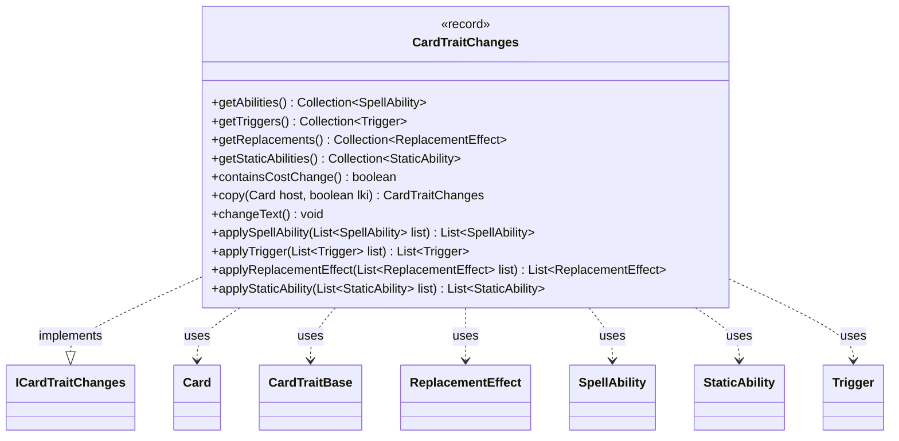

---
aliases:
  - CardTraitChanges
tags:
  - java/record
  - module/forge-game
  - pkg/forge/game/card
fqn: forge.game.card.CardTraitChanges
package: forge.game.card
module: forge-game
kind: Record
---

# CardTraitChanges

**Package:** `forge.game.card` &nbsp; **Module:** `forge-game` &nbsp; **Kind:** Record



## Relationships
**Implements:**
- [[forge.game.card.ICardTraitChanges|ICardTraitChanges]]
**Uses:**
- [[forge.game.CardTraitBase|CardTraitBase]]
- [[forge.game.card.Card|Card]]
- [[forge.game.replacement.ReplacementEffect|ReplacementEffect]]
- [[forge.game.spellability.SpellAbility|SpellAbility]]
- [[forge.game.staticability.StaticAbility|StaticAbility]]
- [[forge.game.trigger.Trigger|Trigger]]

## Design Description

`CardTraitChanges` is an immutable record that bundles a set of trait modifications—spell abilities, triggers, replacement effects, and static abilities—to be layered onto a card, along with an optional `remove` predicate identifying existing traits to strip. As an implementation of `ICardTraitChanges`, it serves as the unit of trait mutation in Forge's card-effect system, encapsulating both additive and subtractive changes. Each typed accessor null-coalesces to an empty list, so absent categories are handled safely without null checks at call sites. The four `apply*` methods mutate a caller-supplied list by first removing matching traits, then appending its own, giving a uniform application protocol across all four trait kinds. `copy` deep-copies every contained trait against a new host (supporting last-known-information snapshots), `changeText` cascades text substitution into each trait, and `containsCostChange` inspects its static abilities for mana-cost modification.

## Source
`forge-game/src/main/java/forge/game/card/CardTraitChanges.java`

```java
package forge.game.card;

import forge.game.CardTraitBase;
import forge.game.replacement.ReplacementEffect;
import forge.game.spellability.SpellAbility;
import forge.game.staticability.StaticAbility;
import forge.game.staticability.StaticAbilityMode;
import forge.game.trigger.Trigger;

import java.util.Collection;
import java.util.List;
import java.util.Objects;
import java.util.function.Predicate;
import java.util.stream.Collectors;

public record CardTraitChanges(
        Collection<SpellAbility> abilities,
        Collection<Trigger> triggers,
        Collection<ReplacementEffect> replacements,
        Collection<StaticAbility> staticAbilities,
        Predicate<CardTraitBase> remove
        ) implements ICardTraitChanges {

    /**
     * @return the abilities
     */
    public Collection<SpellAbility> getAbilities() {
        return Objects.requireNonNullElse(abilities, List.of());
    }

    /**
     * @return the triggers
     */
    public Collection<Trigger> getTriggers() {
        return Objects.requireNonNullElse(triggers, List.of());
    }
    /**
     * @return the replacements
     */
    public Collection<ReplacementEffect> getReplacements() {
        return Objects.requireNonNullElse(replacements, List.of());
    }

    /**
     * @return the staticAbilities
     */
    public Collection<StaticAbility> getStaticAbilities() {
        return Objects.requireNonNullElse(staticAbilities, List.of());
    }

    /**
     * Return if any of the static abilities changes the card's mana cost
     */
    public boolean containsCostChange() {
        for (StaticAbility stAb : getStaticAbilities()) {
            if (stAb.checkMode(StaticAbilityMode.ReduceCost) || stAb.checkMode(StaticAbilityMode.RaiseCost)) {
                return true;
            }
        }
        return false;
    }

    public CardTraitChanges copy(Card host, boolean lki) {
        return new CardTraitChanges(
                this.getAbilities().stream().map(sa -> sa.copy(host, lki)).collect(Collectors.toList()),
                this.getTriggers().stream().map(tr -> tr.copy(host, lki)).collect(Collectors.toList()),
                this.getReplacements().stream().map(re -> re.copy(host, lki)).collect(Collectors.toList()),
                this.getStaticAbilities().stream().map(st -> st.copy(host, lki)).collect(Collectors.toList()),
                remove
            );
    }

    public void changeText() {
        for (SpellAbility sa : this.getAbilities()) {
            sa.changeText();
        }

        for (Trigger tr : this.getTriggers()) {
            tr.changeText();
        }

        for (ReplacementEffect re : this.getReplacements()) {
            re.changeText();
        }

        for (StaticAbility sa : this.getStaticAbilities()) {
            sa.changeText();
        }
    }

    public List<SpellAbility> applySpellAbility(List<SpellAbility> list) {
        if (remove != null) {
            list.removeIf(remove);
        }
        list.addAll(getAbilities());
        return list;
    }
    public List<Trigger> applyTrigger(List<Trigger> list) {
        if (remove != null) {
            list.removeIf(remove);
        }
        list.addAll(getTriggers());
        return list;
    }
    public List<ReplacementEffect> applyReplacementEffect(List<ReplacementEffect> list) {
        if (remove != null) {
            list.removeIf(remove);
        }
        list.addAll(getReplacements());
        return list;
    }
    public List<StaticAbility> applyStaticAbility(List<StaticAbility> list) {
        if (remove != null) {
            list.removeIf(remove);
        }
        list.addAll(getStaticAbilities());
        return list;
    }
}
```
