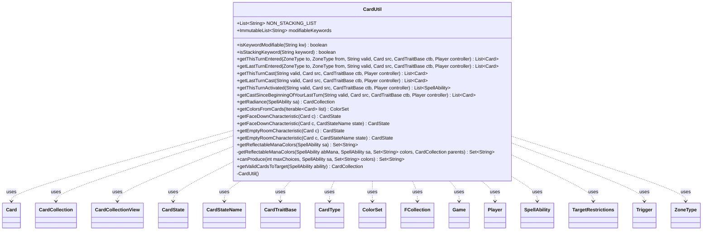

---
aliases:
  - CardUtil
tags:
  - java/class
  - module/forge-game
  - pkg/forge/game/card
fqn: forge.game.card.CardUtil
package: forge.game.card
module: forge-game
kind: Class
---

# CardUtil

**Package:** `forge.game.card` &nbsp; **Module:** `forge-game` &nbsp; **Kind:** Class



## Relationships
**Uses:**
- [[forge.card.CardStateName|CardStateName]]
- [[forge.card.CardType|CardType]]
- [[forge.card.ColorSet|ColorSet]]
- [[forge.game.CardTraitBase|CardTraitBase]]
- [[forge.game.Game|Game]]
- [[forge.game.card.Card|Card]]
- [[forge.game.card.CardCollection|CardCollection]]
- [[forge.game.card.CardCollectionView|CardCollectionView]]
- [[forge.game.card.CardState|CardState]]
- [[forge.game.player.Player|Player]]
- [[forge.game.spellability.SpellAbility|SpellAbility]]
- [[forge.game.spellability.TargetRestrictions|TargetRestrictions]]
- [[forge.game.trigger.Trigger|Trigger]]
- [[forge.game.zone.ZoneType|ZoneType]]
- [[forge.util.collect.FCollection|FCollection]]

## Design Description

CardUtil is a final, non-instantiable utility class providing stateless static helpers for card-related queries and computations across the forge-game engine. It centralizes logic that operates over cards without belonging to any single domain object: keyword classification (which keywords are text-modifiable or stacking), turn-history lookups (cards that entered a zone, spells cast, abilities activated this or last turn), color aggregation, and target/radiance selection. It also synthesizes derived card states such as the 2/2 face-down creature and empty Room characteristics.

As a pure helper, it has no supertype and holds only immutable shared constants (`modifiableKeywords`, `NON_STACKING_LIST`). It collaborates broadly — querying `Game`, `Player`, and `ZoneType` for game state, filtering through `CardLists`/valid expressions, and inspecting `SpellAbility` and `CardTraitBase` for ability context. The notable design intent is the recursive private `getReflectableManaColors`, which threads a `parents` collection to prevent infinite recursion among mutually reflecting mana sources, exposed through a minimal-parameter public entry point.

## Source
`forge-game/src/main/java/forge/game/card/CardUtil.java`

```java
/*
 * Forge: Play Magic: the Gathering.
 * Copyright (C) 2011  Forge Team
 *
 * This program is free software: you can redistribute it and/or modify
 * it under the terms of the GNU General Public License as published by
 * the Free Software Foundation, either version 3 of the License, or
 * (at your option) any later version.
 *
 * This program is distributed in the hope that it will be useful,
 * but WITHOUT ANY WARRANTY; without even the implied warranty of
 * MERCHANTABILITY or FITNESS FOR A PARTICULAR PURPOSE.  See the
 * GNU General Public License for more details.
 *
 * You should have received a copy of the GNU General Public License
 * along with this program.  If not, see <http://www.gnu.org/licenses/>.
 */
package forge.game.card;

import com.google.common.collect.ImmutableList;
import com.google.common.collect.Lists;
import com.google.common.collect.Sets;
import forge.ImageKeys;
import forge.card.CardStateName;
import forge.card.CardType;
import forge.card.ColorSet;
import forge.card.MagicColor;
import forge.game.CardTraitBase;
import forge.game.Game;
import forge.game.ability.AbilityKey;
import forge.game.ability.AbilityUtils;
import forge.game.ability.ApiType;
import forge.game.player.Player;
import forge.game.spellability.SpellAbility;
import forge.game.spellability.SpellAbilityPredicates;
import forge.game.spellability.TargetRestrictions;
import forge.game.trigger.Trigger;
import forge.game.zone.ZoneType;
import forge.util.TextUtil;
import forge.util.collect.FCollection;

import java.util.List;
import java.util.Set;
import java.util.stream.Collectors;

public final class CardUtil {
    // disable instantiation
    private CardUtil() { }

    public static final List<String> NON_STACKING_LIST = Lists.newArrayList();

    /** List of all keywords that could be modified by text changes.
     *  Mostly this is caused by them having a variable, like a cost.
     */
    public static final ImmutableList<String> modifiableKeywords = ImmutableList.<String>builder().add(
            "Enchant", "Protection", "Cumulative upkeep", "Equip", "Buyback",
            "Cycling", "Echo", "Kicker", "Flashback", "Madness", "Morph",
            "Affinity", "Entwine", "Splice", "Ninjutsu",
            "Transmute", "Replicate", "Recover", "Squad", "Suspend", "Aura swap",
            "Fortify", "Transfigure", "Champion", "Evoke", "Prowl", "Freerunning",
            "Reinforce", "Unearth", "Level up", "Miracle", "Overload", "Cleave",
            "Scavenge", "Encore", "Bestow", "Outlast", "Dash", "Surge", "Emerge", "Hexproof:",
            "Bands with other", "Landwalk", "Offering",
            "etbCounter", "Reflect", "Ward").build();

    public static boolean isKeywordModifiable(final String kw) {
        for (final String modKw : modifiableKeywords) {
            if (kw.startsWith(modKw)) {
                return true;
            }
        }
        return false;
    }

    public static boolean isStackingKeyword(final String keyword) {
        String kw = keyword;
        if (kw.startsWith("HIDDEN")) {
            kw = kw.substring(7);
        }

        return !kw.startsWith("Protection") && !NON_STACKING_LIST.contains(kw);
    }

    /**
     * getThisTurnEntered.
     *
     * @param to    zone going to
     * @param from  zone coming from
     * @param valid a isValid expression
     * @param src   a Card object
     * @return a CardCollection that matches the given criteria
     */
    public static List<Card> getThisTurnEntered(final ZoneType to, final ZoneType from, final String valid, final Card src, final CardTraitBase ctb, final Player controller) {
        List<Card> res = Lists.newArrayList();
        final Game game = src.getGame();
        if (to != ZoneType.Stack) {
            for (Player p : game.getRegisteredPlayers()) {
                res.addAll(p.getZone(to).getCardsAddedThisTurn(from));
            }
        } else {
            res.addAll(game.getStackZone().getCardsAddedThisTurn(from));
        }
        return CardLists.getValidCardsAsList(res, valid, controller, src, ctb);
    }

    /**
     * getLastTurnEntered.
     *
     * @param to    zone going to
     * @param from  zone coming from
     * @param valid a isValid expression
     * @param src   a Card object
     * @return a CardCollection that matches the given criteria
     */
    public static List<Card> getLastTurnEntered(final ZoneType to, final ZoneType from, final String valid, final Card src, final CardTraitBase ctb, final Player controller) {
        List<Card> res = Lists.newArrayList();
        final Game game = src.getGame();
        if (to != ZoneType.Stack) {
            for (Player p : game.getPlayers()) {
                res.addAll(p.getZone(to).getCardsAddedLastTurn(from));
            }
        } else {
            res.addAll(game.getStackZone().getCardsAddedLastTurn(from));
        }
        return CardLists.getValidCardsAsList(res, valid, controller, src, ctb);
    }

    public static List<Card> getThisTurnCast(final String valid, final Card src, final CardTraitBase ctb, final Player controller) {
        return CardLists.getValidCardsAsList(src.getGame().getStack().getSpellsCastThisTurn(), valid, controller, src, ctb);
    }

    public static List<Card> getLastTurnCast(final String valid, final Card src, final CardTraitBase ctb, final Player controller) {
        return CardLists.getValidCardsAsList(src.getGame().getStack().getSpellsCastLastTurn(), valid, controller, src, ctb);
    }

    public static List<SpellAbility> getThisTurnActivated(final String valid, final Card src, final CardTraitBase ctb, final Player controller) {
        return src.getGame().getStack().getAbilityActivatedThisTurn().stream()
                .filter(SpellAbilityPredicates.isValid(valid.split(","), controller, src, ctb))
                .collect(Collectors.toList());
    }

    public static List<Card> getCastSinceBeginningOfYourLastTurn(final String valid, final Card src, final CardTraitBase ctb, final Player controller) {
        return CardLists.getValidCardsAsList(controller.getSpellsCastSinceBegOfYourLastTurn(), valid, controller, src, ctb);
    }

    public static CardCollection getRadiance(final SpellAbility sa) {
        SpellAbility targetSA = sa.getSATargetingCard();
        if (targetSA == null || !targetSA.usesTargeting() || !targetSA.hasParam("Radiance")) {
            return new CardCollection();
        }

        final Card source = targetSA.getHostCard();
        final Game game = source.getGame();
        final CardCollection res = new CardCollection();
        final String[] valid = targetSA.getParam("ValidTgts").split(",");
        final CardCollectionView tgts = targetSA.getTargets().getTargetCards();

        byte combinedColor = 0;
        for (Card tgt : tgts) {
            ColorSet cs = tgt.getColor();
            for (byte color : MagicColor.WUBRG) {
                if(!cs.hasAnyColor(color))
                    continue;
                combinedColor |= color;
            }
        }
        for (byte color : MagicColor.WUBRG) {
            if ((combinedColor & color) == 0) {
                continue;
            }
            for (final Card c : game.getColoredCardsInPlay(MagicColor.toLongString(color))) {
                if (!res.contains(c) && !tgts.contains(c) && c.isValid(valid, source.getController(), source, targetSA)) {
                    res.add(c);
                }
            }
        }

        return res;
    }

    public static ColorSet getColorsFromCards(Iterable<Card> list) {
        byte b = 0;
        for (Card c : list) {
            b |= c.getColor().getColor();
        }
        return ColorSet.fromMask(b);
    }

    public static CardState getFaceDownCharacteristic(Card c) {
        return getFaceDownCharacteristic(c, CardStateName.FaceDown);
    }
    public static CardState getFaceDownCharacteristic(Card c, CardStateName state) {
        final CardType type = new CardType(false);
        type.add("Creature");

        final CardState ret = new CardState(c, state);
        ret.setBasePower(2);
        ret.setBaseToughness(2);

        ret.setName("");
        ret.setType(type);

        //show hidden if exiled facedown
        if (state == CardStateName.FaceDown) {
            ret.setImageKey(ImageKeys.getTokenKey(ImageKeys.HIDDEN_CARD));
        } else {
            ret.setImageKey(c.getImageKey());
        }
        return ret;
    }

    public static CardState getEmptyRoomCharacteristic(Card c) {
        return getEmptyRoomCharacteristic(c, CardStateName.EmptyRoom);
    }
    public static CardState getEmptyRoomCharacteristic(Card c, CardStateName state) {
        final CardType type = new CardType(false);
        type.add("Enchantment");
        type.add("Room");
        final CardState ret = new CardState(c, state);

        ret.setName("");
        ret.setType(type);

        // find new image key for empty room
        ret.setImageKey(c.getImageKey());

        return ret;
    }

    // a nice entry point with minimum parameters
    public static Set<String> getReflectableManaColors(final SpellAbility sa) {
        return getReflectableManaColors(sa, sa, Sets.newHashSet(), new CardCollection());
    }
    private static Set<String> getReflectableManaColors(final SpellAbility abMana, final SpellAbility sa,
            Set<String> colors, final CardCollection parents) {
        // Here's the problem with reflectable Mana. If more than one is out,
        // they need to Reflect each other,
        // so we basically need to have a recursive list that send the parents
        // so we don't infinite recurse.
        final Card card = abMana.getHostCard();

        if (abMana.getApi() != ApiType.ManaReflected) {
            return colors;
        }

        final String colorOrType = sa.getParam("ColorOrType");
        // currently Color or Type, Type is colors + colorless
        final String reflectProperty = sa.getParam("ReflectProperty");
        // Produce (Reflecting Pool) or Is (Meteor Crater)

        int maxChoices = 5; // Color is the default colorOrType
        if (colorOrType.equals("Type")) {
            maxChoices++;
        }

        CardCollection cards;

        if (sa.hasParam("Valid")) {
            final String validCard = sa.getParam("Valid");
            // Reuse AF_Defined in a slightly different way
            if (validCard.startsWith("Defined.")) {
                cards = AbilityUtils.getDefinedCards(card, TextUtil.fastReplace(validCard, "Defined.", ""), abMana);
            } else {
                if (sa.getActivatingPlayer() == null) {
                    sa.setActivatingPlayer(sa.getHostCard().getController());
                }
                final Player activator = sa.getActivatingPlayer();
                cards = CardLists.getValidCards(activator.getGame().getCardsIn(ZoneType.Battlefield), validCard, activator, card, sa);
            }

            // remove anything cards that is already in parents
            cards.removeAll(parents);

            if (cards.isEmpty()) {
                return colors;
            }
        } else {
            cards = new CardCollection();
        }
        if (reflectProperty.equals("Is")) { // Meteor Crater
            for (final Card card1 : cards) {
                // For each card, go through all the colors and if the card is that color, add
                for (final String col : MagicColor.Constant.ONLY_COLORS) {
                    if (card1.isOfColor(col)) {
                        colors.add(col);
                        if (colors.size() == maxChoices) {
                            break;
                        }
                    }
                }
            }
        } else if (reflectProperty.equals("Produced")) {
            // Why is this name so similar to the one below?
            final String producedColors = (String) abMana.getRootAbility().getTriggeringObject(AbilityKey.Produced);
            for (final String col : MagicColor.Constant.ONLY_COLORS) {
                final String s = MagicColor.toShortString(col);
                if (producedColors.contains(s)) {
                    colors.add(col);
                }
            }
            // TODO Sol Remove production of "1" Generic Mana
            if (maxChoices == 6 && (producedColors.contains("1") || producedColors.contains("C"))) {
                colors.add(MagicColor.Constant.COLORLESS);
            }
        } else if (reflectProperty.equals("Produce")) {
            final FCollection<SpellAbility> abilities = new FCollection<>();
            for (final Card c : cards) {
                abilities.addAll(c.getSpellAbilities());
                for (Trigger trig : c.getTriggers()) {
                    abilities.add(trig.ensureAbility());
                }
            }

            final List<SpellAbility> reflectAbilities = Lists.newArrayList();

            for (final SpellAbility ab : abilities) {
                if (ab.isSpell() || ab.isLandAbility()) {
                    continue;
                }
                if (maxChoices == colors.size()) {
                    break;
                }

                if (!parents.contains(ab.getHostCard())) {
                    parents.add(ab.getHostCard());
                }

                // Recursion! Set Activator to controller for appropriate valid comparison
                ab.setActivatingPlayer(ab.getHostCard().getController());
                if (ab.getApi() == ApiType.ManaReflected && !"Produced".equals(ab.getParam("ReflectProperty"))) {
                    reflectAbilities.add(ab);
                    continue;
                }
                colors = canProduce(maxChoices, ab, colors);
            }

            for (final SpellAbility ab : reflectAbilities) {
                if (maxChoices == colors.size()) {
                    break;
                }

                colors = CardUtil.getReflectableManaColors(sa, ab, colors, parents);
            }
        }
        return colors;
    }

    public static Set<String> canProduce(final int maxChoices, final SpellAbility sa,
            final Set<String> colors) {
        if (sa == null) {
            return colors;
        }
        for (final String col : MagicColor.Constant.ONLY_COLORS) {
            if (sa.canProduce(MagicColor.toShortString(col))) {
                colors.add(col);
            }
        }

        if (maxChoices == 6 && sa.canProduce("C")) {
            colors.add(MagicColor.Constant.COLORLESS);
        }

        return colors;
    }

    // these have been copied over from CardFactoryUtil as they need two extra
    // parameters for target selection.
    // however, due to the changes necessary for SA_Requirements this is much
    // different than the original
    public static CardCollection getValidCardsToTarget(final SpellAbility ability) {
        final TargetRestrictions tgt = ability.getTargetRestrictions();
        final Card activatingCard = ability.getHostCard();
        final Game game = ability.getActivatingPlayer().getGame();
        final List<ZoneType> zone = tgt.getZone();

        CardCollection choices = CardLists.getTargetableCards(game.getCardsIn(zone), ability);
        final boolean canTgtStack = zone.contains(ZoneType.Stack);
        if (canTgtStack) {
            // Since getTargetableCards doesn't have additional checks if one of the Zones is stack
            // Remove the activating card from targeting itself if its on the Stack
            if (activatingCard.isInZone(ZoneType.Stack)) {
                choices.remove(activatingCard);
            }
        }

        // Remove cards already targeted
        final List<Card> targeted = Lists.newArrayList(ability.getTargets().getTargetCards());
        choices.removeAll(targeted);

        return choices;
    }
}
```
