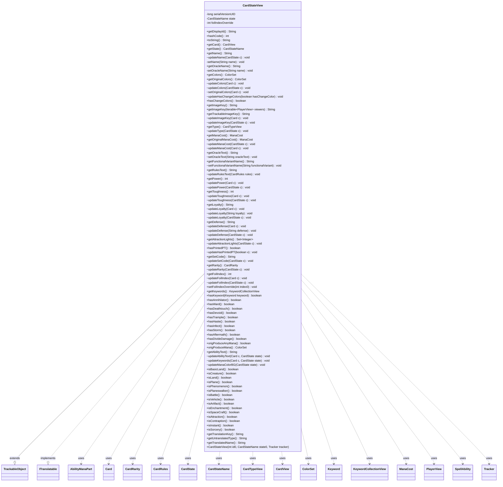

---
aliases:
  - CardStateView
tags:
  - java/class
  - module/forge-game
  - pkg/forge/game/card
fqn: forge.game.card.CardView.CardStateView
package: forge.game.card
module: forge-game
kind: Class
---

# CardStateView

**Package:** `forge.game.card`   **Module:** `forge-game`   **Kind:** Class



## Relationships
**Extends:**
- [[forge.trackable.TrackableObject|TrackableObject]]
**Implements:**
- [[forge.util.ITranslatable|ITranslatable]]
**Uses:**
- [[forge.card.CardRarity|CardRarity]]
- [[forge.card.CardRules|CardRules]]
- [[forge.card.CardStateName|CardStateName]]
- [[forge.card.CardTypeView|CardTypeView]]
- [[forge.card.ColorSet|ColorSet]]
- [[forge.card.mana.ManaCost|ManaCost]]
- [[forge.game.card.Card|Card]]
- [[forge.game.card.CardState|CardState]]
- [[forge.game.card.CardView|CardView]]
- [[forge.game.keyword.Keyword|Keyword]]
- [[forge.game.keyword.KeywordCollectionView|KeywordCollectionView]]
- [[forge.game.player.PlayerView|PlayerView]]
- [[forge.game.spellability.AbilityManaPart|AbilityManaPart]]
- [[forge.game.spellability.SpellAbility|SpellAbility]]
- [[forge.trackable.Tracker|Tracker]]

## Design Description

CardStateView is a lightweight, serializable view object representing a single named state (e.g., front, back, or face-down) of a card for presentation to the UI and remote clients. As a nested non-static class of CardView, it accesses its enclosing card instance directly while extending TrackableObject to store all displayable attributes—name, colors, mana cost, type, power/toughness, loyalty, keywords, rarity, image key, and rules text—as tracked properties whose changes propagate automatically to observers. It implements ITranslatable to supply localization keys for the card's name and type.

The design cleanly separates the mutable game model from its observable projection: package-private `update*` methods pull values from the live `Card` or `CardState` and write them via `set(TrackableProperty.*)`, while public getters expose them. Visibility logic (face-down handling, viewer-based image masking, clone source substitution) and convenience type-predicate methods keep display concerns encapsulated within the view rather than the engine.

## Source
`forge-game/src/main/java/forge/game/card/CardView.java` — declaration excerpt

```java
    public class CardStateView extends TrackableObject implements ITranslatable {
        private static final long serialVersionUID = 6673944200513430607L;

        private final CardStateName state;

        public CardStateView(final int id0, final CardStateName state0, final Tracker tracker) {
            super(id0, tracker);
            state = state0;
        }

        public String getDisplayId() {
            if (getState().equals(CardStateName.FaceDown)) {
                return "H" + getHiddenId();
            }
            final int id = getId();
            if (id > 0) {
                return String.valueOf(getId());
            }
            return StringUtils.EMPTY;
        }

        @Override
        public int hashCode() {
            return Objects.hash(getId(), state);
        }

        @Override
        public String toString() {
            return (getName() + " (" + getDisplayId() + ")").trim();
        }

        public CardView getCard() {
            return CardView.this;
        }

        public CardStateName getState() {
            return state;
        }

        public String getName() {
            return get(TrackableProperty.Name);
        }
        void updateName(CardState c) {
            Card card = c.getCard();
            setName(card.getDisplayName(c));
            setOracleName(card.getName(c));

            if (CardView.this.getCurrentState() == this) {
                CardView.this.updateName(card);
            }
        }
        private void setName(String name) {
            set(TrackableProperty.Name, name);
        }

        /**
         * @return The name of the card, unaltered by flavor names.
         */
        public String getOracleName() {
            return get(TrackableProperty.OracleName);
        }
        private void setOracleName(String name) {
            set(TrackableProperty.OracleName, name);
        }

        public ColorSet getColors() {
            return get(TrackableProperty.Colors);
        }
        public ColorSet getOriginalColors() {
            return get(TrackableProperty.OriginalColors);
        }
        void updateColors(Card c) {
            set(TrackableProperty.Colors, c.getColor());
        }
        void updateColors(CardState c) {
            set(TrackableProperty.Colors, c.getColor());
        }
        void setOriginalColors(Card c) {
            set(TrackableProperty.OriginalColors, c.getColor());
        }
        void updateHasChangeColors(boolean hasChangeColor) {
            set(TrackableProperty.HasChangedColors, hasChangeColor);
        }
        public boolean hasChangeColors() { return get(TrackableProperty.HasChangedColors); }

        public String getImageKey() {
            return getImageKey(null);
        }
        public String getImageKey(Iterable<PlayerView> viewers) {
            if (getState() == CardStateName.FaceDown) {
                return getCard().getFacedownImageKey();
            }
            if (canBeShownToAny(viewers)) {
                if (isCloned() && StaticData.instance().useSourceImageForClone()) {
                    return getBackup().getCurrentState().getImageKey(viewers);
                }
                return get(TrackableProperty.ImageKey);
            }
            return ImageKeys.getTokenKey(ImageKeys.HIDDEN_CARD);
        }
        /*
        * Use this for revealing purposes only
        * */
        public String getTrackableImageKey() {
            return get(TrackableProperty.ImageKey);
        }
        void updateImageKey(Card c) {
            set(TrackableProperty.ImageKey, c.getImageKey());
        }
        void updateImageKey(CardState c) {
            set(TrackableProperty.ImageKey, c.getImageKey());
        }

        public CardTypeView getType() {
            if (getState() != CardStateName.Original && isFaceDown() && !isInZone(EnumSet.of(ZoneType.Battlefield, ZoneType.Stack))) {
                return CardType.EMPTY;
            }
            return get(TrackableProperty.Type);
        }
        void updateType(CardState c) {
            set(TrackableProperty.Type, c.getTypeWithChanges());
        }

        public ManaCost getManaCost() {
            return get(TrackableProperty.ManaCost);
        }
        public ManaCost getOriginalManaCost() {
            return get(TrackableProperty.OriginalManaCost);
        }
        void updateManaCost(CardState c) {
            set(TrackableProperty.ManaCost, c.getPerpetualAdjustedManaCost());
            set(TrackableProperty.OriginalManaCost, c.getManaCost());
        }
        void updateManaCost(Card c) {
            set(TrackableProperty.ManaCost, c.getCurrentState().getPerpetualAdjustedManaCost());
            set(TrackableProperty.OriginalManaCost, c.getManaCost());
        }

        public String getOracleText() {
            return get(TrackableProperty.OracleText);
        }
        void setOracleText(String oracleText) {
            set(TrackableProperty.OracleText, oracleText.replace("\\n", "\r\n\r\n").trim());
        }

        public String getFunctionalVariantName() {
            return get(TrackableProperty.FunctionalVariant);
        }
        void setFunctionalVariantName(String functionalVariant) {
            set(TrackableProperty.FunctionalVariant, functionalVariant);
        }

        public String getRulesText() {
            return get(TrackableProperty.RulesText);
        }
        void updateRulesText(CardRules rules) {
            String rulesText = null;

            if (rules != null && rules.getType().isVanguard()) {
                boolean decHand = rules.getHand() < 0;
                boolean decLife = rules.getLife() < 0;
                String handSize = Localizer.getInstance().getMessageorUseDefault("lblHandSize", "Hand Size")
                        + (!decHand ? ": +" : ": ") + rules.getHand();
                String startingLife = Localizer.getInstance().getMessageorUseDefault("lblStartingLife", "Starting Life")
                        + (!decLife ? ": +" : ": ") + rules.getLife();
                rulesText = handSize + "\r\n" + startingLife;
            }
            set(TrackableProperty.RulesText, rulesText);
        }

        public int getPower() {
            return get(TrackableProperty.Power);
        }
        void updatePower(Card c) {
            int num;
            if (hasPrintedPT() && !isCreature()) {
                // use printed value so user can still see it
                num = c.getCurrentPower();
            } else {
                num = c.getNetPower();
            }
            if (c.getCurrentState().getView() != this && c.getAlternateState() != null) {
                num = num - c.getBasePower() + c.getAlternateState().getBasePower();
            }
            set(TrackableProperty.Power, num);
        }
        void updatePower(CardState c) {
            Card card = c.getCard();
            if (card != null) {
                updatePower(card); //TODO: find a better way to do this
                return;
            }
            set(TrackableProperty.Power, c.getBasePower());
        }

        public int getToughness() {
            return get(TrackableProperty.Toughness);
        }
        void updateToughness(Card c) {
            int num;
            if (hasPrintedPT() && !isCreature()) {
                // use printed value so user can still see it
                num = c.getCurrentToughness();
            } else {
                num = c.getNetToughness();
            }
            if (c.getCurrentState().getView() != this && c.getAlternateState() != null) {
                num = num - c.getBaseToughness() + c.getAlternateState().getBaseToughness();
            }
            set(TrackableProperty.Toughness, num);
        }
        void updateToughness(CardState c) {
            Card card = c.getCard();
            if (card != null) {
                updateToughness(card); //TODO: find a better way to do this
                return;
            }
            set(TrackableProperty.Toughness, c.getBaseToughness());
        }

        public String getLoyalty() {
            return get(TrackableProperty.Loyalty);
        }
        void updateLoyalty(Card c) {
            if (c.isInZone(ZoneType.Battlefield)) {
                updateLoyalty(String.valueOf(c.getCurrentLoyalty()));
            } else {
                updateLoyalty(c.getCurrentState().getBaseLoyalty());
            }
        }
        void updateLoyalty(String loyalty) {
            set(TrackableProperty.Loyalty, loyalty);
        }
        void updateLoyalty(CardState c) {
            if (CardView.this.getCurrentState() == this) {
                Card card = c.getCard();
                if (card != null) {
                    if (card.isInZone(ZoneType.Battlefield)) {
                        updateLoyalty(card);
                    } else {
                        updateLoyalty(c.getBaseLoyalty());
                    }

                    return;
                }
            }
            set(TrackableProperty.Loyalty, "0"); //alternates don't need loyalty
        }

        public String getDefense() {
            return get(TrackableProperty.Defense);
        }
        void updateDefense(Card c) {
            if (c.isInZone(ZoneType.Battlefield)) {
                updateDefense(String.valueOf(c.getCurrentDefense()));
            } else {
                updateDefense(c.getCurrentState().getBaseDefense());
            }
        }
        void updateDefense(String defense) {
            set(TrackableProperty.Defense, defense);
        }
        void updateDefense(CardState c) {
            if (CardView.this.getCurrentState() == this) {
                Card card = c.getCard();
                if (card != null) {
                    if (card.isInZone(ZoneType.Battlefield)) {
                        updateDefense(card);
                    } else {
                        updateDefense(c.getBaseDefense());
                    }

                    return;
                }
            }
            updateDefense("0");
        }

        public Set<Integer> getAttractionLights() {
            return get(TrackableProperty.AttractionLights);
        }
        void updateAttractionLights(CardState c) {
            set(TrackableProperty.AttractionLights, c.getAttractionLights());
        }

        public boolean hasPrintedPT() {
            return get(TrackableProperty.HasPrintedPT);
        }
        void updateHasPrintedPT(boolean v) {
            set(TrackableProperty.HasPrintedPT, v);
        }

        public String getSetCode() {
            return get(TrackableProperty.SetCode);
        }
        void updateSetCode(CardState c) {
            set(TrackableProperty.SetCode, c.getSetCode());
        }

        public CardRarity getRarity() {
            return get(TrackableProperty.Rarity);
        }
        void updateRarity(CardState c) {
            set(TrackableProperty.Rarity, c.getRarity());
        }

        private int foilIndexOverride = -1;
        public int getFoilIndex() {
            if (foilIndexOverride >= 0) {
                return foilIndexOverride;
            }
            return get(TrackableProperty.FoilIndex);
        }
        void updateFoilIndex(Card c) {
            updateFoilIndex(c.getCurrentState());
        }
        void updateFoilIndex(CardState c) {
            set(TrackableProperty.FoilIndex, c.getFoil());
        }
        public void setFoilIndexOverride(int index0) {
            if (index0 < 0) {
                index0 = CardEdition.getRandomFoil(getSetCode());
            }
            foilIndexOverride = index0;
        }

        public KeywordCollectionView getKeywords()  { return get(TrackableProperty.Keywords); }
        public boolean hasKeyword(Keyword keyword) { return getKeywords().contains(keyword); }

        public boolean hasAnnihilator() { return get(TrackableProperty.HasAnnihilator); }
        public boolean hasWard() { return get(TrackableProperty.HasWard); }

        public boolean hasDeathtouch() { return hasKeyword(Keyword.DEATHTOUCH); }
        public boolean hasDevoid() { return hasKeyword(Keyword.DEVOID); }
        public boolean hasTrample() { return hasKeyword(Keyword.TRAMPLE); }
        public boolean hasHaste() { return hasKeyword(Keyword.HASTE); }
        public boolean hasInfect() { return hasKeyword(Keyword.INFECT); }
        public boolean hasStorm() { return hasKeyword(Keyword.STORM); }
        public boolean hasAftermath() { return hasKeyword(Keyword.AFTERMATH); }

        public boolean hasDivideDamage() { return get(TrackableProperty.HasDivideDamage); }

        public boolean origProduceAnyMana() {
            return get(TrackableProperty.OrigProduceAnyMana);
        }
        public ColorSet origProduceMana() {
            return get(TrackableProperty.OrigProduceMana);
        }

        public String getAbilityText() {
            return get(TrackableProperty.AbilityText);
        }
        void updateAbilityText(Card c, CardState state) {
            set(TrackableProperty.AbilityText, c.getAbilityText(state));
        }
        void updateKeywords(Card c, CardState state) {
            c.updateKeywordsCache(state);
            set(TrackableProperty.Keywords, state.getCachedKeywords().getView());
            // deeper check for Idris
            set(TrackableProperty.HasAnnihilator, c.hasKeyword(Keyword.ANNIHILATOR, state) || state.getTriggers().anyMatch(t -> t.isKeyword(Keyword.ANNIHILATOR)));
            set(TrackableProperty.HasWard, c.hasKeyword(Keyword.WARD, state) || state.getTriggers().anyMatch(t -> t.isKeyword(Keyword.WARD)));
            updateAbilityText(c, state);
            //update Trackable Mana Color for BG Colors
            updateManaColorBG(state);

            set(TrackableProperty.HasDivideDamage, c.hasKeyword("You may assign CARDNAME's combat damage divided as " +
                    "you choose among defending player and/or any number of creatures they control."));
        }
        void updateManaColorBG(CardState state) {
            boolean anyMana = false;
            boolean cMana = false;
            byte colors = 0;
            for (SpellAbility sa : state.getManaAbilities()) {
                if (sa == null)
                    continue;
                for (AbilityManaPart mp : sa.getAllManaParts()) {
                    if (mp.isAnyMana()) {
                        anyMana = true;
                        continue;
                    }

                    String[] colorsProduced = mp.mana(sa).split(" ");

                    //todo improve this
                    for (final String s : colorsProduced) {
                        switch (s.toUpperCase()) {
                            case "R":
                                colors |= MagicColor.RED;
                                break;
                            case "G":
                                colors |= MagicColor.GREEN;
                                break;
                            case "B":
                                colors |= MagicColor.BLACK;
                                break;
                            case "U":
                                colors |= MagicColor.BLUE;
                                break;
                            case "W":
                                colors |= MagicColor.WHITE;
                                break;
                            case "C":
                                cMana = true;
                                break;
                        }
                    }
                }
            }
            set(TrackableProperty.OrigProduceMana, colors > 0 ? ColorSet.fromMask(colors) : cMana ? ColorSet.C : null);
            set(TrackableProperty.OrigProduceAnyMana, anyMana);
        }

        public boolean isBasicLand() {
            return getType().isBasicLand();
        }
        public boolean isCreature() {
            return getType().isCreature();
        }
        public boolean isLand() {
            return getType().isLand();
        }
        public boolean isPlane() {
            return getType().isPlane();
        }
        public boolean isPhenomenon() {
            return getType().isPhenomenon();
        }
        public boolean isPlaneswalker() {
            return getType().isPlaneswalker();
        }

        public boolean isBattle() {
            return getType().isBattle();
        }
        public boolean isVehicle() {
            return getType().hasSubtype("Vehicle");
        }
        public boolean isArtifact() {
            return getType().isArtifact();
        }
        public boolean isEnchantment() {
            return getType().isEnchantment();
        }
        public boolean isSpaceCraft() {
            return getType().hasSubtype("Spacecraft");
        }
        public boolean isAttraction() {
            return getType().isAttraction();
        }
        public boolean isContraption() {
            return getType().isContraption();
        }
        public boolean isInstant() {
            return getType().isInstant();
        }
        public boolean isSorcery() {
            return getType().isSorcery();
        }

        @Override
        public String getTranslationKey() {
            String key = getName();
            String variant = getFunctionalVariantName();
            if(StringUtils.isNotEmpty(variant))
                key = key + " $" + variant;
            return key;
        }

        @Override
        public String getUntranslatedType() {
            return getType().toString();
        }

        @Override
        public String getTranslatedName() {
            return CardTranslation.getTranslatedName(this);
        }
    }
```
