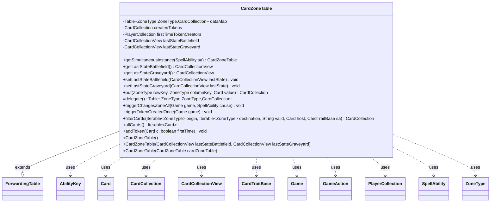

---
aliases:
  - CardZoneTable
tags:
  - java/class
  - module/forge-game
  - pkg/forge/game/card
fqn: forge.game.card.CardZoneTable
package: forge.game.card
module: forge-game
kind: Class
---

# CardZoneTable

**Package:** `forge.game.card` &nbsp; **Module:** `forge-game` &nbsp; **Kind:** Class



## Relationships
**Uses:**
- [[forge.game.CardTraitBase|CardTraitBase]]
- [[forge.game.Game|Game]]
- [[forge.game.GameAction|GameAction]]
- [[forge.game.ability.AbilityKey|AbilityKey]]
- [[forge.game.card.Card|Card]]
- [[forge.game.card.CardCollection|CardCollection]]
- [[forge.game.card.CardCollectionView|CardCollectionView]]
- [[forge.game.player.PlayerCollection|PlayerCollection]]
- [[forge.game.spellability.SpellAbility|SpellAbility]]
- [[forge.game.zone.ZoneType|ZoneType]]

## Design Description

CardZoneTable records card movements between zones during a single game event, mapping each (origin, destination) zone pair to the collection of cards that made that transition. It extends Guava's `ForwardingTable<ZoneType, ZoneType, CardCollection>`, delegating storage to a backing `HashBasedTable` while overriding `put` to accumulate cards into per-cell `CardCollection`s rather than replacing them. Beyond bookkeeping, it captures the last-known battlefield and graveyard states (as defensive copies) needed for last-known-information lookups, and tracks created tokens and their first-time creators.

Its central responsibility is firing batched zone-change side effects: `triggerChangesZoneAll` updates timestamps, refreshes leaves-the-battlefield triggers, and raises the `ChangesZoneAll` and `TokenCreatedOnce` triggers via the `Game`'s trigger handler. The `getSimultaneousInstance` factory coordinates with replacement effects so destination-altering moves share one table, ensuring simultaneous events resolve together. `filterCards` queries the recorded moves by origin/destination and a validity predicate, resolving cards through their last-known state.

## Source
`forge-game/src/main/java/forge/game/card/CardZoneTable.java`

```java
/**
 * 
 */
package forge.game.card;

import com.google.common.collect.ForwardingTable;
import com.google.common.collect.HashBasedTable;
import com.google.common.collect.Iterables;
import com.google.common.collect.Table;
import forge.game.CardTraitBase;
import forge.game.Game;
import forge.game.GameAction;
import forge.game.ability.AbilityKey;
import forge.game.player.PlayerCollection;
import forge.game.replacement.ReplacementType;
import forge.game.spellability.SpellAbility;
import forge.game.trigger.TriggerType;
import forge.game.zone.ZoneType;
import forge.util.IterableUtil;

import java.util.Map;

public class CardZoneTable extends ForwardingTable<ZoneType, ZoneType, CardCollection> {
    // TODO use EnumBasedTable if exist
    private Table<ZoneType, ZoneType, CardCollection> dataMap = HashBasedTable.create();

    private CardCollection createdTokens = new CardCollection();
    private PlayerCollection firstTimeTokenCreators = new PlayerCollection();

    private CardCollectionView lastStateBattlefield;
    private CardCollectionView lastStateGraveyard;
    
    public CardZoneTable() {
        this(null, null);
    }

    public CardZoneTable(CardCollectionView lastStateBattlefield, CardCollectionView lastStateGraveyard) {
        setLastStateBattlefield(lastStateBattlefield);
        setLastStateGraveyard(lastStateGraveyard);
    }

    public CardZoneTable(CardZoneTable cardZoneTable) {
        this.putAll(cardZoneTable);
        lastStateBattlefield = cardZoneTable.getLastStateBattlefield();
        lastStateGraveyard = cardZoneTable.getLastStateGraveyard();
    }

    public static CardZoneTable getSimultaneousInstance(SpellAbility sa) {
        if (sa.isReplacementAbility() && sa.getReplacementEffect().getMode() == ReplacementType.Moved
                && sa.getReplacingObject(AbilityKey.InternalTriggerTable) != null) {
            // if a RE changes the destination zone try to make it simultaneous
            return (CardZoneTable) sa.getReplacingObject(AbilityKey.InternalTriggerTable);    
        }
        GameAction ga = sa.getHostCard().getGame().getAction();
        return new CardZoneTable(
                ga.getLastState(AbilityKey.LastStateBattlefield, sa, null, true),
                ga.getLastState(AbilityKey.LastStateGraveyard, sa, null, true));
    }

    public CardCollectionView getLastStateBattlefield() {
        return lastStateBattlefield;
    }
    public CardCollectionView getLastStateGraveyard() {
        return lastStateGraveyard;
    }
    public void setLastStateBattlefield(CardCollectionView lastState) {
        // store it in a new object, it might be from Game which can also refresh itself
        lastStateBattlefield = lastState == null ? CardCollection.EMPTY : new CardCollection(lastState);
    }
    public void setLastStateGraveyard(CardCollectionView lastState) {
        lastStateGraveyard = lastState == null ? CardCollection.EMPTY : new CardCollection(lastState);
    }

    /**
     * special put logic, add Card to Card Collection
     */
    public CardCollection put(ZoneType rowKey, ZoneType columnKey, Card value) {
        if (rowKey == null) {
            rowKey = ZoneType.None;
        }
        if (columnKey == null) {
            columnKey = ZoneType.None;
        }
        CardCollection old;
        if (contains(rowKey, columnKey)) {
            old = get(rowKey, columnKey);
            old.add(value);
        } else {
            old = new CardCollection(value);
            delegate().put(rowKey, columnKey, old);
        }
        return old;
    }

    @Override
    protected Table<ZoneType, ZoneType, CardCollection> delegate() {
        return dataMap;
    }

    public void triggerChangesZoneAll(final Game game, final SpellAbility cause) {
        triggerTokenCreatedOnce(game);
        if (cause != null && cause.getReplacingObject(AbilityKey.InternalTriggerTable) == this) {
            // will be handled by original "cause" instead
            return;
        }
        if (!isEmpty()) {
            for (Card c : allCards()) {
                if (c.isInPlay()) {
                    c.updateWorldTimestamp(game.getTimestamp());
                }
            }

            // this should still refresh for empty battlefield
            if (lastStateBattlefield != CardCollection.EMPTY) {
                game.getTriggerHandler().resetActiveTriggers(false, lastStateBattlefield);
                // register all LTB trigger from last state battlefield
                for (Card lki : lastStateBattlefield) {
                    game.getTriggerHandler().registerActiveLTBTrigger(lki);
                }
            }

            final Map<AbilityKey, Object> runParams = AbilityKey.newMap();
            runParams.put(AbilityKey.Cards, new CardZoneTable(this));
            runParams.put(AbilityKey.Cause, cause);
            game.getTriggerHandler().runTrigger(TriggerType.ChangesZoneAll, runParams, false);
        }
        final CardZoneTable untilTable = game.getUntilHostLeavesPlayTriggerList();
        if (this != untilTable) {
            untilTable.triggerChangesZoneAll(game, null);
            untilTable.clear();
        }
    }

    private void triggerTokenCreatedOnce(Game game) {
        if (!createdTokens.isEmpty()) {
            final Map<AbilityKey, Object> runParams = AbilityKey.newMap();
            runParams.put(AbilityKey.Cards, createdTokens);
            runParams.put(AbilityKey.FirstTime, firstTimeTokenCreators);
            game.getTriggerHandler().runTrigger(TriggerType.TokenCreatedOnce, runParams, false);
        }
    }

    public CardCollection filterCards(Iterable<ZoneType> origin, Iterable<ZoneType> destination, String valid, Card host, CardTraitBase sa) {
        CardCollection allCards = new CardCollection();
        if (destination != null && !IterableUtil.any(destination, d -> columnKeySet().contains(d))) {
            return allCards;
        }
        if (origin != null) {
            for (ZoneType z : origin) {
                if (containsRow(z)) {
                    CardCollectionView lkiLookup = CardCollection.EMPTY;
                    // CR 603.10a
                    if (z == ZoneType.Battlefield) {
                        lkiLookup = lastStateBattlefield;
                    }
                    if (z == ZoneType.Graveyard && destination == null) {
                        lkiLookup = lastStateGraveyard;
                    }
                    if (destination != null) {
                        for (ZoneType zt : destination) {
                            if (row(z).containsKey(zt)) {
                                for (Card c : row(z).get(zt)) {
                                    if (lkiLookup != CardCollection.EMPTY && !lkiLookup.contains(c)) {
                                        // this can happen if e.g. a mutated permanent dies
                                        continue;
                                    }
                                    allCards.add(lkiLookup.get(c));
                                }
                            }
                        }
                    } else {
                        for (CardCollection cc : row(z).values()) {
                            for (Card c : cc) {
                                if (lkiLookup != CardCollection.EMPTY && !lkiLookup.contains(c)) {
                                    continue;
                                }
                                allCards.add(lkiLookup.get(c));
                            }
                        }
                    }
                }
            }
        } else if (destination != null) {
            for (ZoneType zt : destination) {
                for (CardCollection c : column(zt).values()) {
                    allCards.addAll(c);
                }
            }
        } else {
            for (CardCollection c : values()) {
                allCards.addAll(c);
            }
        }

        if (valid != null) {
            allCards = CardLists.getValidCards(allCards, valid, host.getController(), host, sa);
        }
        return allCards;
    }

    public Iterable<Card> allCards() {
        return Iterables.concat(values());
    }

    public void addToken(Card c, boolean firstTime) {
        createdTokens.add(c);
        if (firstTime) {
            firstTimeTokenCreators.add(c.getOwner());
        }
    }
}
```
