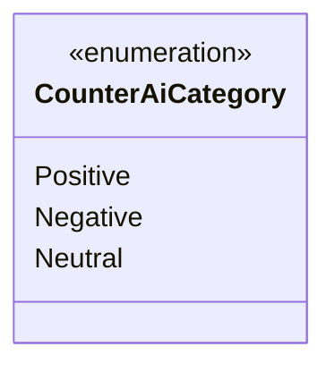

---
aliases:
  - CounterAiCategory
tags:
  - java/enum
  - module/forge-game
  - pkg/forge/game/card
fqn: forge.game.card.CounterAiCategory
package: forge.game.card
module: forge-game
kind: Enum
---

# CounterAiCategory

**Package:** `forge.game.card` &nbsp; **Module:** `forge-game` &nbsp; **Kind:** Enum



## Design Description

CounterAiCategory is a lightweight enumeration in the `forge.game.card` package that classifies card counters by their strategic value to the AI. It defines three mutually exclusive constants—Positive, Negative, and Neutral—representing whether a given counter type benefits, harms, or is indifferent to the controlling player from the AI's evaluation standpoint.

As a pure enum with no fields, constructors, or behavior, it serves purely as a typed vocabulary shared across the game model's counter-handling and AI decision logic, replacing ad-hoc strings or magic numbers with compile-time-safe categories. Its minimalism reflects deliberate design intent: the classification semantics live in the consumers that map specific counter kinds to these categories, keeping the enum itself stable and free of game-rule coupling.

## Source
`forge-game/src/main/java/forge/game/card/CounterAiCategory.java`

```java
package forge.game.card;

public enum CounterAiCategory {
    Positive,
    Negative,
    Neutral;
}
```
