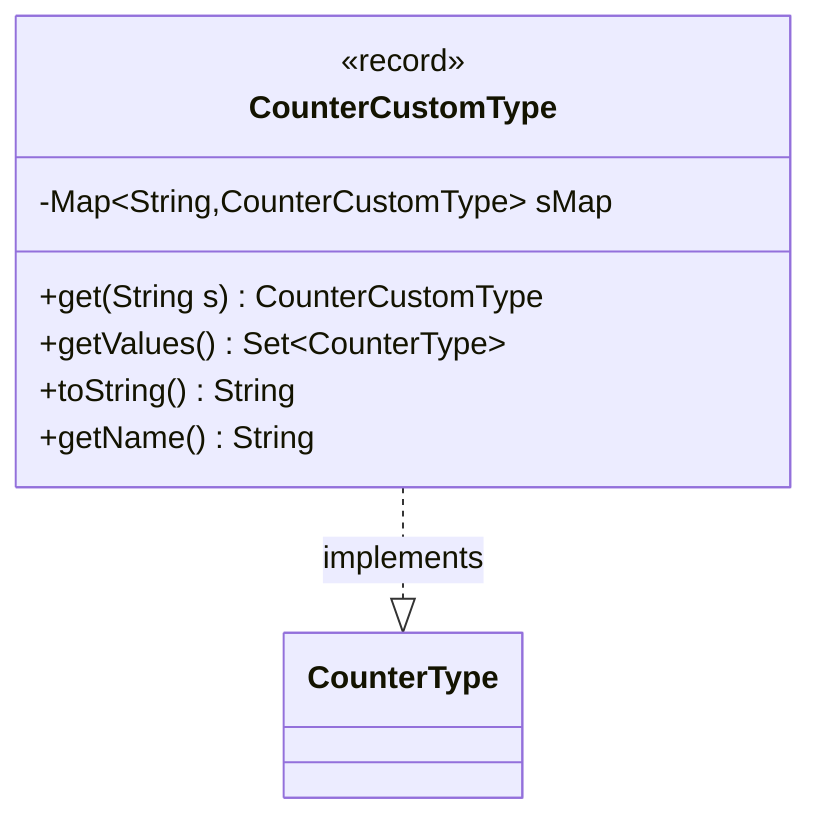

---
aliases:
  - CounterCustomType
tags:
  - java/record
  - module/forge-game
  - pkg/forge/game/card
fqn: forge.game.card.CounterCustomType
package: forge.game.card
module: forge-game
kind: Record
---

# CounterCustomType

**Package:** `forge.game.card` &nbsp; **Module:** `forge-game` &nbsp; **Kind:** Record



## Relationships
**Implements:**
- [[forge.game.card.CounterType|CounterType]]

## Design Description

`CounterCustomType` is an immutable record representing a user- or card-defined counter identified solely by its `keyword` string. It implements the `CounterType` interface, supplying the named-counter contract (`getName`, `toString`) for counters that fall outside the built-in enumerated set, allowing the engine to handle arbitrary custom counter kinds uniformly alongside standard ones.

Its design intent centers on interning: a static `Map` cache backs the factory method `get`, which lazily creates and reuses a single instance per keyword, ensuring identity and avoiding duplicate objects for the same counter name. `getValues` exposes the currently known custom types as a `Set<CounterType>`, using a `LinkedHashSet` to preserve insertion order. The record's value semantics make these flyweight instances safe to share throughout the game model.

## Source
`forge-game/src/main/java/forge/game/card/CounterCustomType.java`

```java
package forge.game.card;

import java.util.Map;
import java.util.Set;
import java.util.LinkedHashSet;

import com.google.common.collect.Maps;

public record CounterCustomType(String keyword) implements CounterType {
    private static Map<String, CounterCustomType> sMap = Maps.newHashMap();

    public static CounterCustomType get(String s) {
        if (!sMap.containsKey(s)) {
            sMap.put(s, new CounterCustomType(s));
        }
        return sMap.get(s);
    }

    public static Set<CounterType> getValues() {
        return new LinkedHashSet<CounterType>(sMap.values());
    }
    
    @Override
    public String toString() {
        return keyword;
    }

    public String getName() {
        return keyword;
    }
}
```
