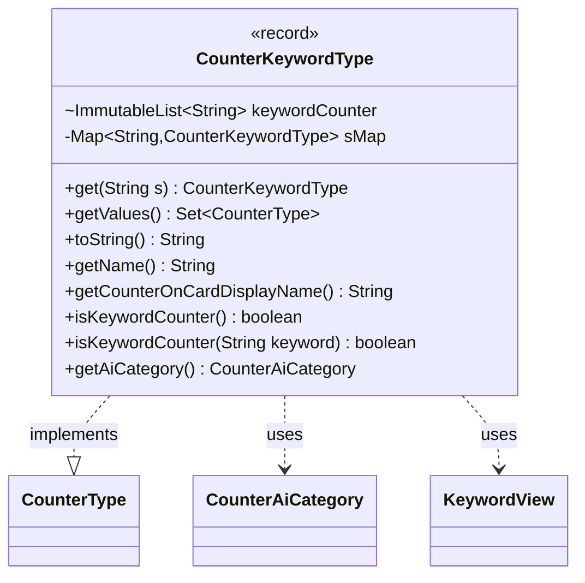

---
aliases:
  - CounterKeywordType
tags:
  - java/record
  - module/forge-game
  - pkg/forge/game/card
fqn: forge.game.card.CounterKeywordType
package: forge.game.card
module: forge-game
kind: Record
---

# CounterKeywordType

**Package:** `forge.game.card`   **Module:** `forge-game`   **Kind:** Record



## Relationships
**Implements:**
- [[forge.game.card.CounterType|CounterType]]
**Uses:**
- [[forge.game.card.CounterAiCategory|CounterAiCategory]]
- [[forge.game.keyword.KeywordView|KeywordView]]

## Design Description

CounterKeywordType is an immutable record that models a Magic keyword existing as a counter on a card (per rule 122.1b, e.g. Flying, Indestructible, Decayed), wrapping a single `KeywordView`. It implements the `CounterType` interface, supplying keyword-counter–specific behavior: display names derived from the keyword's title, a constant `true` for `isKeywordCounter()`, and AI valuation via `getAiCategory()` (negative only for Decayed, positive otherwise).

A static factory `get(String)` interns instances in a shared map so each keyword counter is created once and reused, and `getValues()` enumerates the fixed rules-defined set ahead of any dynamically registered variants. The static `isKeywordCounter(String)` recognizes both the canonical list and parameterized forms like `Hexproof:`/`Trample:`. The design favors flyweight-style caching and delegation to `KeywordView`, keeping each counter a thin, value-based adapter between the keyword system and the `CounterType` abstraction.

## Source
`forge-game/src/main/java/forge/game/card/CounterKeywordType.java`

```java
package forge.game.card;

import java.util.Map;
import java.util.Set;
import java.util.LinkedHashSet;
import java.util.stream.Collectors;

import com.google.common.collect.ImmutableList;
import com.google.common.collect.Maps;

import forge.game.keyword.Keyword;
import forge.game.keyword.KeywordView;

public record CounterKeywordType(KeywordView keyword) implements CounterType {

    // Rule 122.1b
    static ImmutableList<String> keywordCounter = ImmutableList.of(
            "Flying", "First Strike", "Double Strike", "Deathtouch", "Decayed", "Exalted", "Haste", "Hexproof",
            "Indestructible", "Lifelink", "Menace", "Reach", "Shadow", "Trample", "Vigilance");
    private static Map<String, CounterKeywordType> sMap = Maps.newHashMap();

    public static CounterKeywordType get(String s) {
        if (!sMap.containsKey(s)) {
            sMap.put(s, new CounterKeywordType(Keyword.getInstance(s).getView()));
        }
        return sMap.get(s);
    }

    public static Set<CounterType> getValues() {
        // add fixed first
        Set<CounterType> result = keywordCounter.stream().map(CounterKeywordType::get).collect(Collectors.toCollection(LinkedHashSet::new));
        // add variable ones later
        result.addAll(sMap.values());
        return result;
    }
    
    @Override
    public String toString() {
        return keyword.original();
    }

    public String getName() {
        return keyword.title();
    }

    @Override
    public String getCounterOnCardDisplayName() {
        return keyword.title();
    }

    @Override
    public boolean isKeywordCounter() {
        return true;
    }

    public static boolean isKeywordCounter(String keyword) {
        if (keyword.startsWith("Hexproof:")) {
            return true;
        }
        if (keyword.startsWith("Trample:")) {
            return true;
        }
        return keywordCounter.contains(keyword);
    }

    @Override
    public CounterAiCategory getAiCategory() {
        if (Keyword.DECAYED.equals(keyword.keyword())) {
            return CounterAiCategory.Negative;
        }
        return CounterAiCategory.Positive;
    }
}
```

## Python
`forge/game/card/CounterKeywordType.py`

```python
from typing import Set

from forge.game.card.CounterType import CounterType
from forge.game.card.CounterAiCategory import CounterAiCategory
from forge.game.keyword.Keyword import Keyword
from forge.game.keyword.KeywordView import KeywordView


class CounterKeywordType(CounterType):

    # Rule 122.1b
    keywordCounter = [
        "Flying", "First Strike", "Double Strike", "Deathtouch", "Decayed", "Exalted", "Haste", "Hexproof",
        "Indestructible", "Lifelink", "Menace", "Reach", "Shadow", "Trample", "Vigilance"]
    sMap: dict[str, "CounterKeywordType"] = {}

    def __init__(self, keyword: KeywordView):
        self.keyword = keyword

    @staticmethod
    def get(s: str) -> "CounterKeywordType":
        if s not in CounterKeywordType.sMap:
            CounterKeywordType.sMap[s] = CounterKeywordType(Keyword.getInstance(s).getView())
        return CounterKeywordType.sMap[s]

    @staticmethod
    def getValues() -> Set[CounterType]:
        # add fixed first
        result = set(CounterKeywordType.get(s) for s in CounterKeywordType.keywordCounter)
        # add variable ones later
        result.update(CounterKeywordType.sMap.values())
        return result

    def toString(self) -> str:
        return self.keyword.original()

    def getName(self) -> str:
        return self.keyword.title()

    def getCounterOnCardDisplayName(self) -> str:
        return self.keyword.title()

    def isKeywordCounter(self) -> bool:
        return True

    @staticmethod
    def isKeywordCounter(keyword: str) -> bool:
        if keyword.startswith("Hexproof:"):
            return True
        if keyword.startswith("Trample:"):
            return True
        return keyword in CounterKeywordType.keywordCounter

    def getAiCategory(self) -> CounterAiCategory:
        if Keyword.DECAYED == self.keyword.keyword():
            return CounterAiCategory.Negative
        return CounterAiCategory.Positive
```
