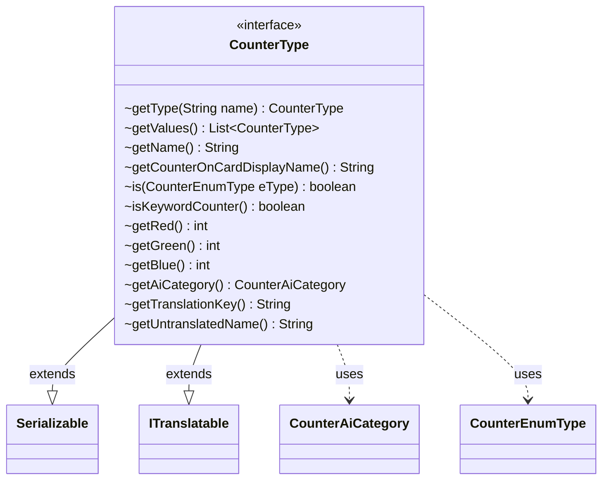

---
aliases:
  - CounterType
tags:
  - java/interface
  - module/forge-game
  - pkg/forge/game/card
fqn: forge.game.card.CounterType
package: forge.game.card
module: forge-game
kind: Interface
---

# CounterType

**Package:** `forge.game.card`   **Module:** `forge-game`   **Kind:** Interface



## Relationships
**Extends:**
- [[forge.util.ITranslatable|ITranslatable]]
**Uses:**
- [[forge.game.card.CounterAiCategory|CounterAiCategory]]
- [[forge.game.card.CounterEnumType|CounterEnumType]]

## Design Description

Counts the cards a player controls and tracks design intent—wait, no. Let me write the SDD.

`CounterType` is the central abstraction for the various kinds of counters that can be placed on cards (and players) in the Forge game engine. As an interface it defines the contract every counter must satisfy—its name, display name, RGB color, AI valuation category, and translation keys—while supplying sensible defaults (white color, `Positive` AI category, name-based display) so that concrete implementations need only override what differs. Static factory methods `getType` and `getValues` act as a façade over the three concrete families—`CounterEnumType` (standard game counters), `CounterKeywordType` (keyword counters), and `CounterCustomType` (user-defined)—resolving a name to the correct implementation and aggregating all instances.

By extending `Serializable` it allows counters to persist with game state, and by extending `ITranslatable` it integrates with Forge's localization framework, collaborating with `CounterAiCategory` and `CounterEnumType` to support AI decision-making and type queries.

## Source
`forge-game/src/main/java/forge/game/card/CounterType.java`

```java
package forge.game.card;

import java.io.Serializable;
import java.util.List;

import com.google.common.collect.Lists;

import forge.util.ITranslatable;

public interface CounterType extends Serializable, ITranslatable {

    static CounterType getType(String name) {
        if ("Any".equalsIgnoreCase(name)) {
            return null;
        }
        if (CounterKeywordType.isKeywordCounter(name)) {
            return CounterKeywordType.get(name);
        }
        try {
            return CounterEnumType.getType(name);
        } catch (final IllegalArgumentException ex) {
            return CounterCustomType.get(name);
        }
    }
    static List<CounterType> getValues() {
        List<CounterType> result = Lists.newArrayList();
        result.addAll(List.of(CounterEnumType.values()));
        result.addAll(CounterKeywordType.getValues());
        result.addAll(CounterCustomType.getValues());
        return result;
    }

    String getName();

    default String getCounterOnCardDisplayName() {
        return getName();
    }

    default boolean is(CounterEnumType eType) {
        return false;
    }

    default boolean isKeywordCounter() {
        return false;
    }

    default int getRed() {
        return 255;
    }

    default int getGreen() {
        return 255;
    }

    default int getBlue() {
        return 255;
    }

    default CounterAiCategory getAiCategory() {
        return CounterAiCategory.Positive;
    }

    @Override
    default String getTranslationKey() {
        return toString();
    }
    @Override
    default String getUntranslatedName() {
        return toString();
    }
}
```

## Python
`forge/game/card/CounterType.py`

```python
from forge.util.ITranslatable import ITranslatable
from forge.game.card.CounterAiCategory import CounterAiCategory
from forge.game.card.CounterEnumType import CounterEnumType
from forge.game.card.CounterKeywordType import CounterKeywordType
from forge.game.card.CounterCustomType import CounterCustomType


class CounterType(ITranslatable):

    @staticmethod
    def getType(name: str) -> "CounterType":
        if "Any".lower() == name.lower():
            return None
        if CounterKeywordType.isKeywordCounter(name):
            return CounterKeywordType.get(name)
        try:
            return CounterEnumType.getType(name)
        except ValueError:
            return CounterCustomType.get(name)

    @staticmethod
    def getValues() -> list["CounterType"]:
        result: list["CounterType"] = []
        result.extend(list(CounterEnumType.values()))
        result.extend(CounterKeywordType.getValues())
        result.extend(CounterCustomType.getValues())
        return result

    def getName(self) -> str:
        raise NotImplementedError

    def getCounterOnCardDisplayName(self) -> str:
        return self.getName()

    def is_(self, eType: CounterEnumType) -> bool:
        return False

    def isKeywordCounter(self) -> bool:
        return False

    def getRed(self) -> int:
        return 255

    def getGreen(self) -> int:
        return 255

    def getBlue(self) -> int:
        return 255

    def getAiCategory(self) -> CounterAiCategory:
        return CounterAiCategory.Positive

    def getTranslationKey(self) -> str:
        return self.__str__()

    def getUntranslatedName(self) -> str:
        return self.__str__()
```
