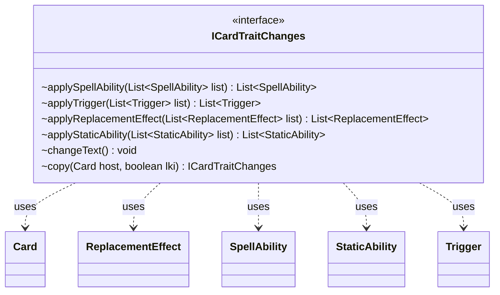

---
aliases:
  - ICardTraitChanges
tags:
  - java/interface
  - module/forge-game
  - pkg/forge/game/card
fqn: forge.game.card.ICardTraitChanges
package: forge.game.card
module: forge-game
kind: Interface
---

# ICardTraitChanges

**Package:** `forge.game.card` &nbsp; **Module:** `forge-game` &nbsp; **Kind:** Interface



## Relationships
**Uses:**
- [[forge.game.card.Card|Card]]
- [[forge.game.replacement.ReplacementEffect|ReplacementEffect]]
- [[forge.game.spellability.SpellAbility|SpellAbility]]
- [[forge.game.staticability.StaticAbility|StaticAbility]]
- [[forge.game.trigger.Trigger|Trigger]]

## Design Description

`ICardTraitChanges` defines a uniform contract for components that mutate a card's trait set—its spell abilities, triggers, replacement effects, and static abilities—as well as its rules text. Each `apply*` method takes a list of the relevant trait type and returns the transformed list, allowing implementors to filter, augment, or rewrite a card's behaviors during gameplay. By collaborating with `Card`, `SpellAbility`, `Trigger`, `ReplacementEffect`, and `StaticAbility`, it sits between a card's host and the engine's effect-resolution machinery.

The design favors composability and low friction: all mutation methods are `default` no-ops returning their input unchanged, so implementors override only the trait kinds they affect. `changeText()` signals text-altering changes, while `copy(Card host, boolean lki)` rebinds a change set to a new host—the `lki` flag supporting last-known-information snapshots needed when an effect's source has left play.

## Source
`forge-game/src/main/java/forge/game/card/ICardTraitChanges.java`

```java
package forge.game.card;

import java.util.List;

import forge.game.replacement.ReplacementEffect;
import forge.game.spellability.SpellAbility;
import forge.game.staticability.StaticAbility;
import forge.game.trigger.Trigger;

public interface ICardTraitChanges {
    default List<SpellAbility> applySpellAbility(List<SpellAbility> list) { return list;}
    default List<Trigger> applyTrigger(List<Trigger> list) { return list;}
    default List<ReplacementEffect> applyReplacementEffect(List<ReplacementEffect> list) { return list;}
    default List<StaticAbility> applyStaticAbility(List<StaticAbility> list) { return list;}
    
    default void changeText() {}
    ICardTraitChanges copy(Card host, boolean lki);
}
```
