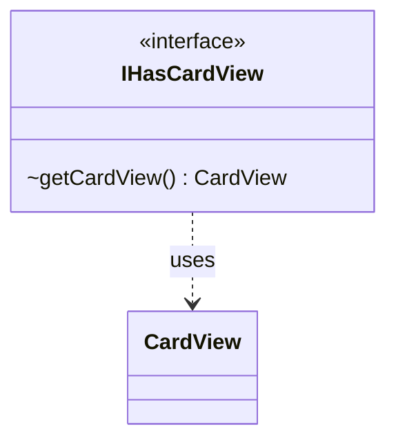

---
aliases:
  - IHasCardView
tags:
  - java/interface
  - module/forge-game
  - pkg/forge/game/card
fqn: forge.game.card.IHasCardView
package: forge.game.card
module: forge-game
kind: Interface
---

# IHasCardView

**Package:** `forge.game.card` &nbsp; **Module:** `forge-game` &nbsp; **Kind:** Interface



## Relationships
**Uses:**
- [[forge.game.card.CardView|CardView]]

## Design Description

Forge's `IHasCardView` is a minimal interface that abstracts the ability to supply a `CardView`—the view-model snapshot of a card used by the UI and observers. Its sole method, `getCardView()`, lets disparate game-model types expose a card-facing representation through a common contract without revealing their concrete implementations.

By depending only on `CardView`, the interface decouples view consumers from the underlying domain objects: any entity that can be rendered as a card (the card itself, or wrappers and proxies standing in for one) implements it, allowing client code to obtain a view uniformly. The deliberately single-method design reflects an interface-segregation intent, keeping the contract narrow and broadly implementable across the `forge.game.card` model.

## Source
`forge-game/src/main/java/forge/game/card/IHasCardView.java`

```java
package forge.game.card;

public interface IHasCardView {
    CardView getCardView();
}
```
