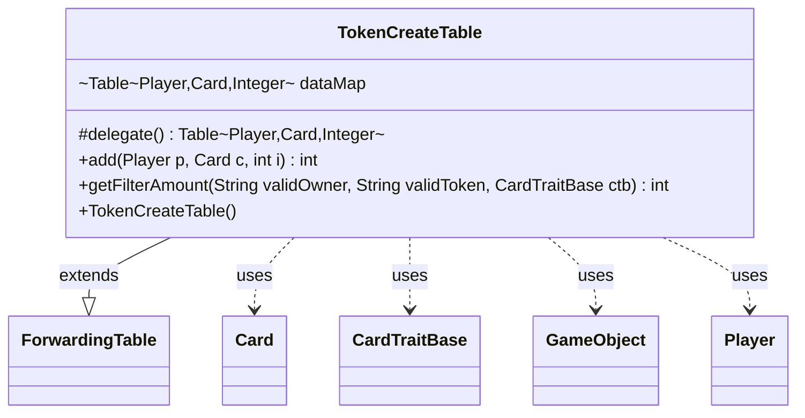

---
aliases:
  - TokenCreateTable
tags:
  - java/class
  - module/forge-game
  - pkg/forge/game/card
fqn: forge.game.card.TokenCreateTable
package: forge.game.card
module: forge-game
kind: Class
---

# TokenCreateTable

**Package:** `forge.game.card`   **Module:** `forge-game`   **Kind:** Class



## Relationships
**Uses:**
- [[forge.game.CardTraitBase|CardTraitBase]]
- [[forge.game.GameObject|GameObject]]
- [[forge.game.card.Card|Card]]
- [[forge.game.player.Player|Player]]

## Design Description

`TokenCreateTable` is a specialized tally that records how many tokens each `Player` has created under each originating token `Card`, keyed as a two-dimensional `(Player, Card) → Integer` count. It extends Guava's `ForwardingTable` and delegates all storage to an internal `HashBasedTable`, so it inherits the full `Table` API while adding only the domain-specific behavior it needs: `add` accumulates counts for a player/card pair, and `getFilterAmount` sums entries matching optional owner and token restrictions.

The design favors composition over reimplementation—the forwarding base keeps the class thin while exposing rich table operations (`rowKeySet`, `columnMap`, `cellSet`) used during filtering. `getFilterAmount` collaborates with `CardTraitBase` for evaluation context and with `GameObjectPredicates`/`CardLists` to resolve `validOwner` and `validToken` selectors against `Player` and `Card` keys, short-circuiting empty matches and special-casing the unfiltered dimensions to avoid unnecessary cell iteration. This supports MTG effects that count tokens conditionally on who made them or what they are.

## Source
`forge-game/src/main/java/forge/game/card/TokenCreateTable.java`

```java
package forge.game.card;

import com.google.common.collect.ForwardingTable;
import com.google.common.collect.HashBasedTable;
import com.google.common.collect.Table;
import forge.game.CardTraitBase;
import forge.game.GameObject;
import forge.game.GameObjectPredicates;
import forge.game.player.Player;

import java.util.List;
import java.util.Map;
import java.util.Objects;
import java.util.function.Predicate;
import java.util.stream.Collectors;

public class TokenCreateTable extends ForwardingTable<Player, Card, Integer> {

    Table<Player, Card, Integer> dataMap = HashBasedTable.create();
    
    public TokenCreateTable() {
    }

    @Override
    protected Table<Player, Card, Integer> delegate() {
        return dataMap;
    }

    public int add(Player p, Card c, int i) {
        int old = Objects.requireNonNullElse(this.get(p, c), 0);
        int newValue = old + i;
        this.put(p, c, newValue);
        return newValue;
    }

    public int getFilterAmount(String validOwner, String validToken, final CardTraitBase ctb) {
        final Card host = ctb.getHostCard();
        int result = 0;
        List<Card> filteredCards = null;
        List<Player> filteredPlayer = null;

        if (validOwner == null && validToken == null) {
            for (Integer i : values()) {
                result += i;
            }
            return result;
        }

        if (validOwner != null) {
            Predicate<GameObject> restriction = GameObjectPredicates.restriction(validOwner.split(","), host.getController(), host, ctb);
            filteredPlayer = rowKeySet().stream().filter(restriction).collect(Collectors.toList());
            if (filteredPlayer.isEmpty()) {
                return 0;
            }
        }
        if (validToken != null) {
            filteredCards = CardLists.getValidCardsAsList(columnKeySet(), validToken, host.getController(), host, ctb);
            if (filteredCards.isEmpty()) {
                return 0;
            }
        }

        if (filteredPlayer == null) {
            for (Map.Entry<Card, Map<Player, Integer>> e : columnMap().entrySet()) {
                for (Integer i : e.getValue().values()) {
                    result += i;
                }
            }
            return result;
        }

        if (filteredCards == null) {
            for (Map.Entry<Player, Map<Card, Integer>> e : rowMap().entrySet()) {
                for (Integer i : e.getValue().values()) {
                    result += i;
                }
            }
            return result;
        }

        for (Table.Cell<Player, Card, Integer> c : this.cellSet()) {
            if (!filteredPlayer.contains(c.getRowKey())) {
                continue;
            }
            if (!filteredCards.contains(c.getColumnKey())) {
                continue;
            }
            result += c.getValue();
        }

        return result;
    }
}
```

## Python
`forge/game/card/TokenCreateTable.py`

```python
from com.google.common.collect.ForwardingTable import ForwardingTable
from com.google.common.collect.HashBasedTable import HashBasedTable
from com.google.common.collect.Table import Table

from forge.game.CardTraitBase import CardTraitBase
from forge.game.GameObject import GameObject
from forge.game.GameObjectPredicates import GameObjectPredicates
from forge.game.player.Player import Player

from forge.game.card.Card import Card
from forge.game.card.CardLists import CardLists


class TokenCreateTable(ForwardingTable):

    def __init__(self):
        self.dataMap = HashBasedTable.create()

    def delegate(self) -> Table:
        return self.dataMap

    def add(self, p: Player, c: Card, i: int) -> int:
        old = self.get(p, c)
        if old is None:
            old = 0
        newValue = old + i
        self.put(p, c, newValue)
        return newValue

    def getFilterAmount(self, validOwner: str, validToken: str, ctb: CardTraitBase) -> int:
        host = ctb.getHostCard()
        result = 0
        filteredCards = None
        filteredPlayer = None

        if validOwner is None and validToken is None:
            for i in self.values():
                result += i
            return result

        if validOwner is not None:
            restriction = GameObjectPredicates.restriction(validOwner.split(","), host.getController(), host, ctb)
            filteredPlayer = [x for x in self.rowKeySet() if restriction(x)]
            if len(filteredPlayer) == 0:
                return 0
        if validToken is not None:
            filteredCards = CardLists.getValidCardsAsList(self.columnKeySet(), validToken, host.getController(), host, ctb)
            if len(filteredCards) == 0:
                return 0

        if filteredPlayer is None:
            for c, columnEntry in self.columnMap().items():
                for i in columnEntry.values():
                    result += i
            return result

        if filteredCards is None:
            for p, rowEntry in self.rowMap().items():
                for i in rowEntry.values():
                    result += i
            return result

        for c in self.cellSet():
            if c.getRowKey() not in filteredPlayer:
                continue
            if c.getColumnKey() not in filteredCards:
                continue
            result += c.getValue()

        return result
```
