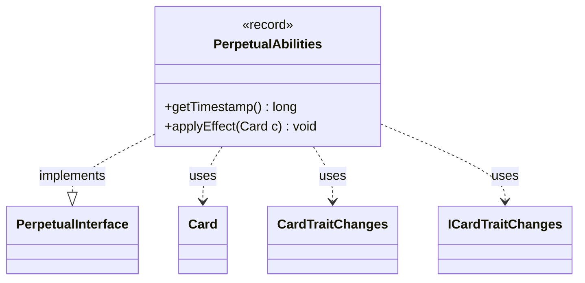

---
aliases:
  - PerpetualAbilities
tags:
  - java/record
  - module/forge-game
  - pkg/forge/game/card/perpetual
fqn: forge.game.card.perpetual.PerpetualAbilities
package: forge.game.card.perpetual
module: forge-game
kind: Record
---

# PerpetualAbilities

**Package:** `forge.game.card.perpetual` &nbsp; **Module:** `forge-game` &nbsp; **Kind:** Record



## Relationships
**Implements:**
- [[forge.game.card.perpetual.PerpetualInterface|PerpetualInterface]]
**Uses:**
- [[forge.game.card.Card|Card]]
- [[forge.game.card.CardTraitChanges|CardTraitChanges]]
- [[forge.game.card.ICardTraitChanges|ICardTraitChanges]]

## Design Description

PerpetualAbilities is an immutable record that bundles a timestamp with a set of trait modifications (`ICardTraitChanges`), representing a permanent ("perpetual") alteration applied to a card. As a concrete implementation of `PerpetualInterface`, it fulfills the contract for time-stamped effects that can be replayed against a `Card`, allowing the engine to layer perpetual changes deterministically by their ordering timestamp.

Its `applyEffect` method copies the stored changes onto the target card and registers them as changed card traits keyed by the record's timestamp. The design notably special-cases cost modifications: when the underlying change is a concrete `CardTraitChanges` that alters mana cost, it triggers recalculation of the card's perpetually adjusted mana cost. Using a record makes the effect a lightweight, value-based carrier, while delegation to `ICardTraitChanges.copy` keeps the actual trait-mutation logic decoupled from the perpetual-application mechanism.

## Source
`forge-game/src/main/java/forge/game/card/perpetual/PerpetualAbilities.java`

```java
package forge.game.card.perpetual;

import forge.game.card.Card;
import forge.game.card.CardTraitChanges;
import forge.game.card.ICardTraitChanges;

public record PerpetualAbilities(long timestamp, ICardTraitChanges changes) implements PerpetualInterface {

    @Override
    public long getTimestamp() {
        return timestamp;
    }

    @Override
    public void applyEffect(Card c) {
        c.addChangedCardTraits(changes.copy(c, false), timestamp, (long) 0, true);
        if (changes instanceof CardTraitChanges ctc && ctc.containsCostChange()) {
            c.calculatePerpetualAdjustedManaCost();
        }
    }
}
```
