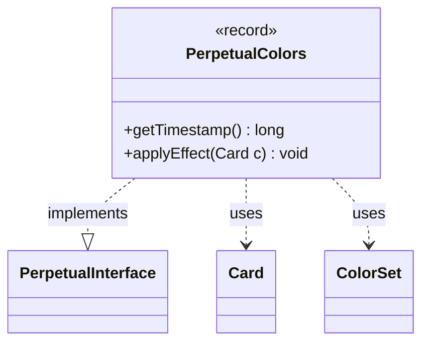

---
aliases:
  - PerpetualColors
tags:
  - java/record
  - module/forge-game
  - pkg/forge/game/card/perpetual
fqn: forge.game.card.perpetual.PerpetualColors
package: forge.game.card.perpetual
module: forge-game
kind: Record
---

# PerpetualColors

**Package:** `forge.game.card.perpetual`   **Module:** `forge-game`   **Kind:** Record



## Relationships
**Implements:**
- [[forge.game.card.perpetual.PerpetualInterface|PerpetualInterface]]
**Uses:**
- [[forge.card.ColorSet|ColorSet]]
- [[forge.game.card.Card|Card]]

## Design Description

PerpetualColors is an immutable record that captures a perpetual color modification applied to a card, bundling the colors to apply, an `overwrite` flag, and a `timestamp` that orders it among other lasting effects. As an implementation of `PerpetualInterface`, it participates in a family of timestamped, persistent card alterations: `getTimestamp()` exposes its ordering key, while `applyEffect(Card)` reapplies the change by delegating to `Card.addColor`.

The design favors data-plus-behavior minimalism. By collaborating with `ColorSet` (the immutable color payload) and `Card` (the mutation target), it keeps the perpetual effect self-contained and replayable—important because perpetual effects must be reasserted whenever a card's characteristics are recalculated. The `overwrite` flag is inverted into `addColor`'s additive parameter, letting one record express either color addition or full replacement, and the null final argument signals no associated long-term-effect grouping.

## Source
`forge-game/src/main/java/forge/game/card/perpetual/PerpetualColors.java`

```java
package forge.game.card.perpetual;

import forge.card.ColorSet;
import forge.game.card.Card;

public record PerpetualColors(long timestamp, ColorSet colors, boolean overwrite) implements PerpetualInterface {

    @Override
    public long getTimestamp() {
        return timestamp;
    }

    @Override
    public void applyEffect(Card c) {
        c.addColor(colors, !overwrite, timestamp, null);
    }

}
```

## Python
`forge/game/card/perpetual/PerpetualColors.py`

```python
from forge.game.card.perpetual.PerpetualInterface import PerpetualInterface
from forge.card.ColorSet import ColorSet
from forge.game.card.Card import Card


class PerpetualColors(PerpetualInterface):

    def __init__(self, timestamp: int, colors: ColorSet, overwrite: bool):
        self.timestamp = timestamp
        self.colors = colors
        self.overwrite = overwrite

    def getTimestamp(self) -> int:
        return self.timestamp

    def applyEffect(self, c: Card) -> None:
        c.addColor(self.colors, not self.overwrite, self.timestamp, None)
```
