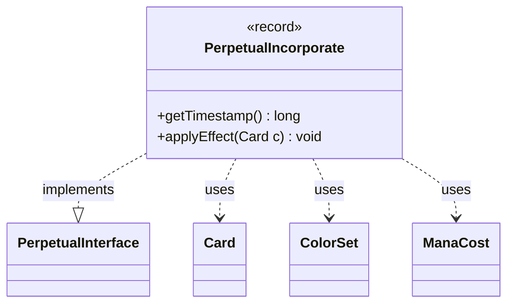

---
aliases:
  - PerpetualIncorporate
tags:
  - java/record
  - module/forge-game
  - pkg/forge/game/card/perpetual
fqn: forge.game.card.perpetual.PerpetualIncorporate
package: forge.game.card.perpetual
module: forge-game
kind: Record
---

# PerpetualIncorporate

**Package:** `forge.game.card.perpetual` &nbsp; **Module:** `forge-game` &nbsp; **Kind:** Record



## Relationships
**Implements:**
- [[forge.game.card.perpetual.PerpetualInterface|PerpetualInterface]]
**Uses:**
- [[forge.card.ColorSet|ColorSet]]
- [[forge.card.mana.ManaCost|ManaCost]]
- [[forge.game.card.Card|Card]]

## Design Description

The `PerpetualIncorporate` record captures a continuous, "perpetual" modification that grafts an Incorporate ability's color and mana characteristics onto a card. Implementing `PerpetualInterface`, it pairs a `timestamp` (exposed via `getTimestamp()`) with a `ManaCost`, letting the engine order and reconcile competing perpetual effects deterministically.

Its sole behavioral method, `applyEffect(Card)`, derives a `ColorSet` from the incorporate cost's color profile and reapplies it to the target `Card`, while also layering in the additional mana cost—both stamped with the record's timestamp so they integrate with Forge's timestamp-based continuous-effect system. The record form signals that the effect is immutable value data: once created it simply describes what to reapply whenever the card's state is recomputed, keeping the perpetual modification self-contained and side-effect-free apart from its deliberate mutation of the card.

## Source
`forge-game/src/main/java/forge/game/card/perpetual/PerpetualIncorporate.java`

```java
package forge.game.card.perpetual;

import forge.card.ColorSet;
import forge.card.mana.ManaCost;
import forge.game.card.Card;

public record PerpetualIncorporate(long timestamp, ManaCost incorporate) implements PerpetualInterface {
    @Override
    public long getTimestamp() {
        return timestamp;
    }

    @Override
    public void applyEffect(Card c) {
        ColorSet colors = ColorSet.fromMask(incorporate.getColorProfile());
        c.addChangedManaCost(incorporate, true, timestamp, (long) 0);
        c.addColorByText(colors, true, timestamp, null);
    }
}
```
