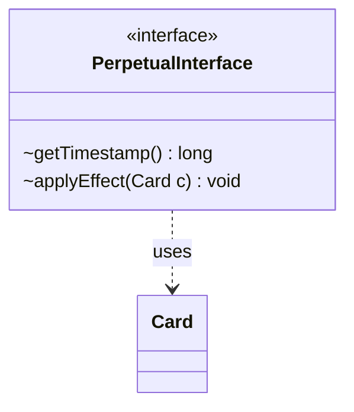

---
aliases:
  - PerpetualInterface
tags:
  - java/interface
  - module/forge-game
  - pkg/forge/game/card/perpetual
fqn: forge.game.card.perpetual.PerpetualInterface
package: forge.game.card.perpetual
module: forge-game
kind: Interface
---

# PerpetualInterface

**Package:** `forge.game.card.perpetual` &nbsp; **Module:** `forge-game` &nbsp; **Kind:** Interface



## Relationships
**Uses:**
- [[forge.game.card.Card|Card]]

## Design Description

A `PerpetualInterface` defines the contract for perpetual effects—continuous modifications applied to a `Card` that persist for the remainder of a game regardless of normal duration or layer rules. Implementations expose two operations: `getTimestamp()`, which returns the timestamp marking when the effect was established (used to order overlapping perpetual effects deterministically), and `applyEffect(Card)`, which mutates the supplied card to realize the effect.

As a minimal interface, it decouples the card-state machinery from the concrete varieties of perpetual modification, letting diverse implementations be stored and replayed uniformly through a common type. Its sole collaborator is `Card`, the target of every effect, reflecting a deliberately narrow responsibility: encapsulate one timestamped, idempotently re-applicable change to a card.

## Source
`forge-game/src/main/java/forge/game/card/perpetual/PerpetualInterface.java`

```java
package forge.game.card.perpetual;

import forge.game.card.Card;

public interface PerpetualInterface {
    long getTimestamp();
    void applyEffect(Card c);
}
```
