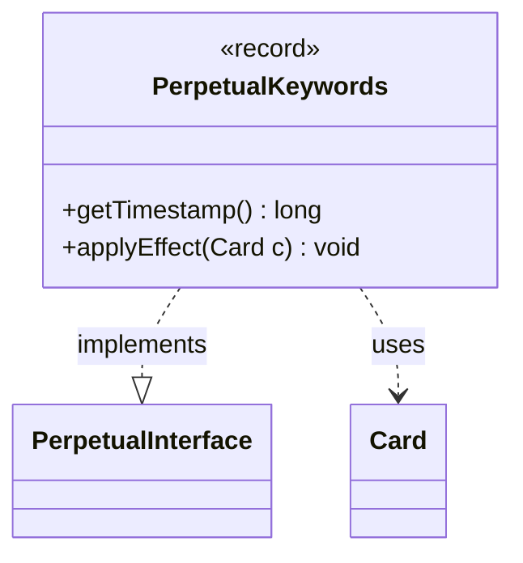

---
aliases:
  - PerpetualKeywords
tags:
  - java/record
  - module/forge-game
  - pkg/forge/game/card/perpetual
fqn: forge.game.card.perpetual.PerpetualKeywords
package: forge.game.card.perpetual
module: forge-game
kind: Record
---

# PerpetualKeywords

**Package:** `forge.game.card.perpetual`   **Module:** `forge-game`   **Kind:** Record



## Relationships
**Implements:**
- [[forge.game.card.perpetual.PerpetualInterface|PerpetualInterface]]
**Uses:**
- [[forge.game.card.Card|Card]]

## Design Description

PerpetualKeywords is an immutable record that captures a "perpetual" modification to a card's keyword set—keywords to grant, keywords to strip, and a flag to remove all existing ones—stamped with a creation timestamp for ordering. As a record it provides value-based identity and concise, final state, fitting the engine's continuous-effects model where layered changes are resolved by timestamp.

It realizes the PerpetualInterface contract, exposing `getTimestamp()` for ordering against other perpetual effects and `applyEffect(Card)` to enact the change. The latter collaborates with Card, delegating to `addChangedCardKeywords` so the card itself owns the bookkeeping of its changed-keyword layers; the null final argument signals no removal-by-type. The design favors small, declarative effect objects that the card replays in timestamp order, keeping perpetual keyword logic decoupled from the broader effect-resolution machinery.

## Source
`forge-game/src/main/java/forge/game/card/perpetual/PerpetualKeywords.java`

```java
package forge.game.card.perpetual;

import java.util.List;

import forge.game.card.Card;

public record PerpetualKeywords(long timestamp, List<String> addKeywords, List<String> removeKeywords, boolean removeAll) implements PerpetualInterface {
    @Override
    public long getTimestamp() {
        return timestamp;
    }

    @Override
    public void applyEffect(Card c) {
        c.addChangedCardKeywords(addKeywords, removeKeywords, removeAll, timestamp, null);
    }
}
```

## Python
`forge/game/card/perpetual/PerpetualKeywords.py`

```python
from dataclasses import dataclass

from forge.game.card.perpetual.PerpetualInterface import PerpetualInterface
from forge.game.card.Card import Card


@dataclass(frozen=True)
class PerpetualKeywords(PerpetualInterface):
    timestamp: int
    addKeywords: list[str]
    removeKeywords: list[str]
    removeAll: bool

    def getTimestamp(self) -> int:
        return self.timestamp

    def applyEffect(self, c: Card) -> None:
        c.addChangedCardKeywords(self.addKeywords, self.removeKeywords, self.removeAll, self.timestamp, None)
```
