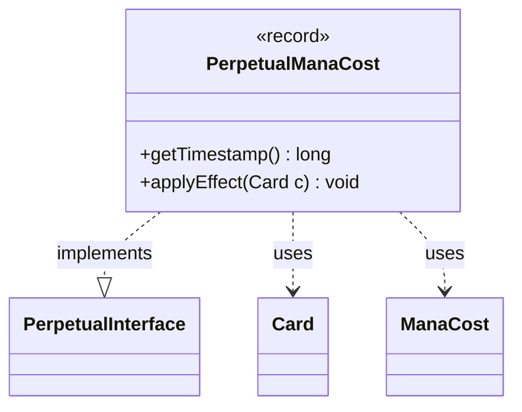

---
aliases:
  - PerpetualManaCost
tags:
  - java/record
  - module/forge-game
  - pkg/forge/game/card/perpetual
fqn: forge.game.card.perpetual.PerpetualManaCost
package: forge.game.card.perpetual
module: forge-game
kind: Record
---

# PerpetualManaCost

**Package:** `forge.game.card.perpetual` &nbsp; **Module:** `forge-game` &nbsp; **Kind:** Record



## Relationships
**Implements:**
- [[forge.game.card.perpetual.PerpetualInterface|PerpetualInterface]]
**Uses:**
- [[forge.card.mana.ManaCost|ManaCost]]
- [[forge.game.card.Card|Card]]

## Design Description

PerpetualManaCost is an immutable record that captures a permanent mana-cost modification applied to a card, pairing a creation `timestamp` with the `ManaCost` to impose. As an implementation of `PerpetualInterface`, it conforms to the engine's contract for time-ordered perpetual effects: `getTimestamp()` exposes the timestamp used to sequence competing modifications, while `applyEffect(Card)` re-applies the change to a given `Card`. The actual mutation is delegated to the card itself via `addChangedManaCost`, keeping the record a lightweight, side-effect-bearing carrier of intent rather than a manager of state.

The record form signals deliberate immutability and value semantics, so each perpetual mana-cost change is a discrete, comparable snapshot. By collaborating with `Card` and `ManaCost` only through narrow calls, it stays decoupled from broader game logic, allowing the card's effect-tracking machinery to own ordering and reapplication concerns.

## Source
`forge-game/src/main/java/forge/game/card/perpetual/PerpetualManaCost.java`

```java
package forge.game.card.perpetual;

import forge.card.mana.ManaCost;
import forge.game.card.Card;

public record PerpetualManaCost(long timestamp, ManaCost manaCost) implements PerpetualInterface {
    @Override
    public long getTimestamp() {
        return timestamp;
    }

    @Override
    public void applyEffect(Card c) {
        c.addChangedManaCost(manaCost, false, timestamp, (long) 0);
    }
}
```
