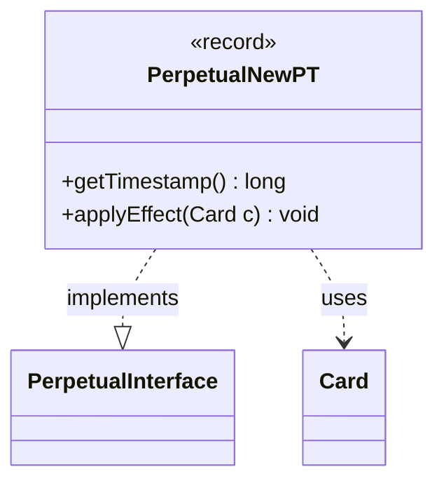

---
aliases:
  - PerpetualNewPT
tags:
  - java/record
  - module/forge-game
  - pkg/forge/game/card/perpetual
fqn: forge.game.card.perpetual.PerpetualNewPT
package: forge.game.card.perpetual
module: forge-game
kind: Record
---

# PerpetualNewPT

**Package:** `forge.game.card.perpetual` &nbsp; **Module:** `forge-game` &nbsp; **Kind:** Record



## Relationships
**Implements:**
- [[forge.game.card.perpetual.PerpetualInterface|PerpetualInterface]]
**Uses:**
- [[forge.game.card.Card|Card]]

## Design Description

PerpetualNewPT is an immutable record capturing a perpetual power/toughness override applied to a card, storing the new power, toughness, and a creation timestamp. As an implementation of `PerpetualInterface`, it participates in the family of perpetual effects that persist across zone changes and reapplications; the timestamp it exposes via `getTimestamp()` lets the game layer order it deterministically against other perpetual modifications. Its sole behavior, `applyEffect(Card)`, delegates to the collaborating `Card` by calling `addNewPT` with the stored values and a zero layer argument, re-stamping the characteristic-defining P/T whenever the effect is replayed. The record form signals that the effect is a lightweight, value-based descriptor: it carries no mutable state and defers all actual mutation to the `Card` it acts upon, keeping the perpetual-effect definition cleanly separated from the card state it modifies.

## Source
`forge-game/src/main/java/forge/game/card/perpetual/PerpetualNewPT.java`

```java
package forge.game.card.perpetual;

import forge.game.card.Card;

public record PerpetualNewPT(long timestamp, Integer power, Integer toughness) implements PerpetualInterface {

    @Override
    public long getTimestamp() {
        return timestamp;
    }

    @Override
    public void applyEffect(Card c) {
        c.addNewPT(power, toughness, timestamp, (long) 0);
    }
}
```
