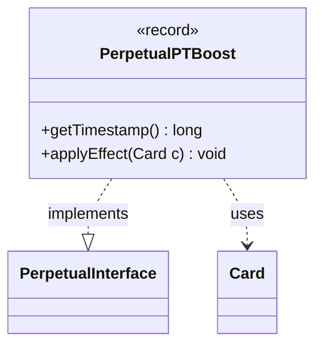

---
aliases:
  - PerpetualPTBoost
tags:
  - java/record
  - module/forge-game
  - pkg/forge/game/card/perpetual
fqn: forge.game.card.perpetual.PerpetualPTBoost
package: forge.game.card.perpetual
module: forge-game
kind: Record
---

# PerpetualPTBoost

**Package:** `forge.game.card.perpetual` &nbsp; **Module:** `forge-game` &nbsp; **Kind:** Record



## Relationships
**Implements:**
- [[forge.game.card.perpetual.PerpetualInterface|PerpetualInterface]]
**Uses:**
- [[forge.game.card.Card|Card]]

## Design Description

`PerpetualPTBoost` is an immutable record that encapsulates a permanent ("perpetual") power/toughness modification applied to a card, capturing the boost amount (`power`, `toughness`) alongside the `timestamp` that orders it among other continuous effects. As an implementation of `PerpetualInterface`, it conforms to the engine's contract for perpetual effects—exposing its ordering timestamp via `getTimestamp()` and reapplying itself on demand through `applyEffect(Card)`—so it can be stored and replayed polymorphically alongside other perpetual modifications.

Its sole collaborator is `Card`: `applyEffect` delegates to `Card.addPTBoost`, forwarding the stored values and timestamp so the boost survives state resets and re-derivation of the card's characteristics. The record form signals deliberate design intent—these effects are value objects, immutable and identity-free, with the timestamp guaranteeing deterministic layering order. Using boxed `Integer` fields allows a boost to affect only power or only toughness when one component is null.

## Source
`forge-game/src/main/java/forge/game/card/perpetual/PerpetualPTBoost.java`

```java
package forge.game.card.perpetual;

import forge.game.card.Card;

public record PerpetualPTBoost(long timestamp, Integer power, Integer toughness) implements PerpetualInterface {

    @Override
    public long getTimestamp() {
        return timestamp;
    }

    @Override
    public void applyEffect(Card c) {
        c.addPTBoost(power, toughness, timestamp, (long) 0);
    }
}
```
