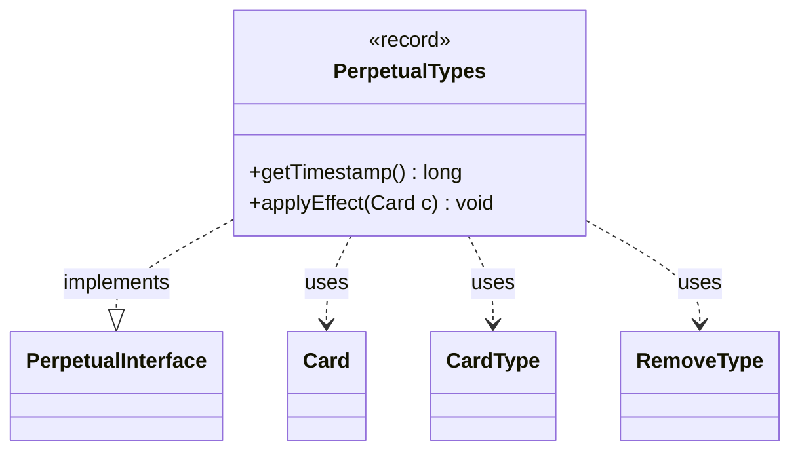

---
aliases:
  - PerpetualTypes
tags:
  - java/record
  - module/forge-game
  - pkg/forge/game/card/perpetual
fqn: forge.game.card.perpetual.PerpetualTypes
package: forge.game.card.perpetual
module: forge-game
kind: Record
---

# PerpetualTypes

**Package:** `forge.game.card.perpetual` &nbsp; **Module:** `forge-game` &nbsp; **Kind:** Record



## Relationships
**Implements:**
- [[forge.game.card.perpetual.PerpetualInterface|PerpetualInterface]]
**Uses:**
- [[forge.card.CardType|CardType]]
- [[forge.card.RemoveType|RemoveType]]
- [[forge.game.card.Card|Card]]

## Design Description

PerpetualTypes is an immutable record that encapsulates a permanent ("perpetual") change to a card's type line, bundling a timestamp with the types to add, the types to remove, and a set of broader type categories to strip. As a `PerpetualInterface` implementation, it participates in Forge's ordered collection of perpetual effects, exposing `getTimestamp()` so layered modifications can be applied and resolved in chronological order. Its `applyEffect(Card)` method delegates to `Card.addChangedCardTypes`, registering the type alterations against the supplied card under its own timestamp. Modeling each effect as a record keeps the data tied to a single timestamp and makes the effect a self-contained, replayable unit, while collaboration with `CardType` and `RemoveType` keeps type-mutation logic centralized in the card itself rather than duplicated here.

## Source
`forge-game/src/main/java/forge/game/card/perpetual/PerpetualTypes.java`

```java
package forge.game.card.perpetual;

import java.util.Set;

import forge.card.CardType;
import forge.card.RemoveType;
import forge.game.card.Card;

public record PerpetualTypes(long timestamp, CardType addTypes, CardType removeTypes, Set<RemoveType> removeXTypes) implements PerpetualInterface {

    @Override
    public long getTimestamp() {
        return timestamp;
    }

    @Override
    public void applyEffect(Card c) {
        c.addChangedCardTypes(addTypes, removeTypes, false, removeXTypes, timestamp, (long) 0, true, false);
    }

}
```
