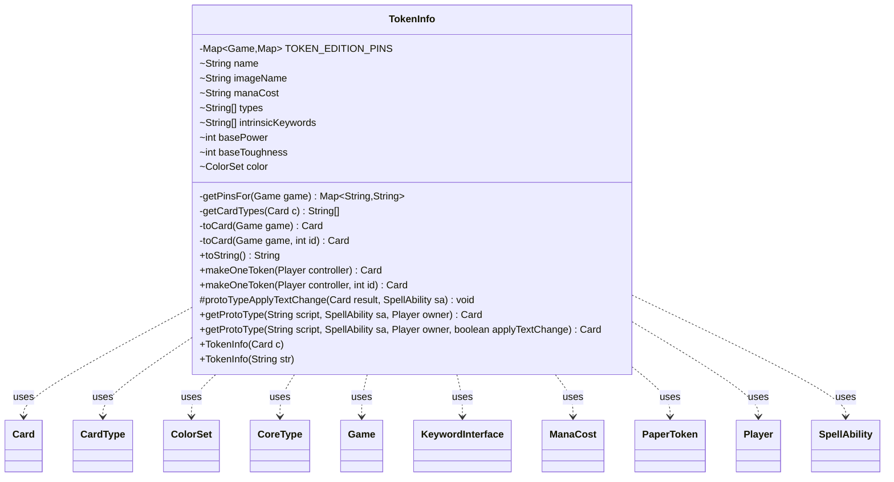

---
aliases:
  - TokenInfo
tags:
  - java/class
  - module/forge-game
  - pkg/forge/game/card/token
fqn: forge.game.card.token.TokenInfo
package: forge.game.card.token
module: forge-game
kind: Class
---

# TokenInfo

**Package:** `forge.game.card.token` &nbsp; **Module:** `forge-game` &nbsp; **Kind:** Class



## Relationships
**Uses:**
- [[forge.card.CardType|CardType]]
- [[forge.card.CardType.CoreType|CoreType]]
- [[forge.card.ColorSet|ColorSet]]
- [[forge.card.mana.ManaCost|ManaCost]]
- [[forge.game.Game|Game]]
- [[forge.game.card.Card|Card]]
- [[forge.game.keyword.KeywordInterface|KeywordInterface]]
- [[forge.game.player.Player|Player]]
- [[forge.game.spellability.SpellAbility|SpellAbility]]
- [[forge.item.PaperToken|PaperToken]]

## Design Description

TokenInfo is an immutable value object that captures the defining attributes of a Magic token—name, image, mana cost, types, intrinsic keywords, base power/toughness, and color—decoupled from any live game instance. It can be built directly from an existing `Card` or parsed from a comma-delimited script string (with a symmetric `toString()` for serialization), and it acts as a factory that materializes concrete `Card` instances into a given `Game` via `toCard`, `makeOneToken`, and the static `getProtoType`.

As a standalone class (no supertype), it serves as the bridge between static token definitions and runtime game state, collaborating with `Card`, `Game`, `Player`, `SpellAbility`, `CardType`/`CoreType`, `ColorSet`, `ManaCost`, `KeywordInterface`, and `PaperToken`. Notable design intent includes a per-`Game` edition-pin map using weak keys so finished games are garbage-collected while same-type tokens share consistent art, and `protoTypeApplyTextChange`, which applies spell-driven color and type text substitutions—rewriting colors, subtypes, modifiable keywords, and generated names—so tokens reflect copy-effect text changes.

## Source
`forge-game/src/main/java/forge/game/card/token/TokenInfo.java`

```java
package forge.game.card.token;

import com.google.common.base.Joiner;
import com.google.common.collect.Iterables;
import com.google.common.collect.Lists;
import forge.ImageKeys;
import forge.StaticData;
import forge.card.CardType;
import forge.card.ColorSet;
import forge.card.GamePieceType;
import forge.card.MagicColor;
import forge.card.mana.ManaCost;
import forge.game.Game;
import forge.game.ability.AbilityUtils;
import forge.game.card.Card;
import forge.game.card.CardFactory;
import forge.game.card.CardFactoryUtil;
import forge.game.card.CardUtil;
import forge.game.keyword.KeywordInterface;
import forge.game.player.Player;
import forge.game.spellability.SpellAbility;
import forge.item.PaperToken;
import org.apache.commons.lang3.StringUtils;

import java.util.List;
import java.util.Map;
import java.util.Objects;
import java.util.WeakHashMap;
import java.util.concurrent.ConcurrentHashMap;

public class TokenInfo {
    // Per-game pin so same-type tokens share art. Weak keys GC finished games.
    private static final Map<Game, Map<String, String>> TOKEN_EDITION_PINS =
            java.util.Collections.synchronizedMap(new WeakHashMap<>());

    private static Map<String, String> getPinsFor(Game game) {
        return TOKEN_EDITION_PINS.computeIfAbsent(game, g -> new ConcurrentHashMap<>());
    }

    final String name;
    final String imageName;
    final String manaCost;
    final String[] types;
    final String[] intrinsicKeywords;
    final int basePower;
    final int baseToughness;
    final ColorSet color;

    public TokenInfo(Card c) {
        // TODO: Figure out how to handle legacy images?
        this.name = c.getName();
        this.imageName = ImageKeys.getTokenImageName(c.getImageKey());
        this.manaCost = c.getManaCost().toString();
        this.color = c.getCurrentState().getColor();
        this.types = getCardTypes(c);

        List<String> list = Lists.newArrayList();
        for (KeywordInterface inst : c.getKeywords()) {
            list.add(inst.getOriginal());
        }

        this.intrinsicKeywords   = list.toArray(new String[0]);
        this.basePower = c.getBasePower();
        this.baseToughness = c.getBaseToughness();
    }

    public TokenInfo(String str) {
        final String[] tokenInfo = str.split(",");
        int power = 0;
        int toughness = 0;
        String manaCost = "0";
        String[] types = null;
        String[] keywords = null;
        String imageName = null;
        ColorSet color = null;
        for (String info : tokenInfo) {
            int index = info.indexOf(':');
            if (index == -1) {
                continue;
            }
            String remainder = info.substring(index + 1);
            if (info.startsWith("P:")) {
                power = Integer.parseInt(remainder);
            } else if (info.startsWith("T:")) {
                toughness = Integer.parseInt(remainder);
            } else if (info.startsWith("Cost:")) {
                manaCost = remainder;
            } else if (info.startsWith("Types:")) {
                types = remainder.split("-");
            } else if (info.startsWith("Keywords:")) {
                keywords = remainder.split("-");
            } else if (info.startsWith("Image:")) {
                imageName = remainder;
            } else if (info.startsWith("Color:")) {
                color = ColorSet.fromNames(remainder);
            }
        }

        this.name = tokenInfo[0];
        this.imageName = imageName;
        this.manaCost = manaCost;
        this.types = types;
        this.intrinsicKeywords = keywords;
        this.basePower = power;
        this.baseToughness = toughness;
        this.color = color;
    }

    private static String[] getCardTypes(Card c) {
        List<String> relevantTypes = Lists.newArrayList();
        for (CardType.CoreType t : c.getType().getCoreTypes()) {
            relevantTypes.add(t.name());
        }
        c.getType().getSubtypes().forEach(relevantTypes::add);
        if (c.getType().isLegendary()) {
            relevantTypes.add("Legendary");
        }
        return relevantTypes.toArray(new String[0]);
    }

    private Card toCard(Game game) {
        return toCard(game, game.nextCardId());
    }

    private Card toCard(Game game, int id) {
        final Card c = new Card(id, game);
        c.setName(name);
        c.setImageKey(ImageKeys.getTokenKey(imageName));

        c.setColor(color == null ? ColorSet.fromManaCost(new ManaCost(manaCost)) : color);
        c.setGamePieceType(GamePieceType.TOKEN);

        for (final String t : types) {
            c.addType(t);
        }

        c.setBasePower(basePower);
        c.setBaseToughness(baseToughness);
        return c;
    }

    @Override
    public String toString() {
        StringBuilder sb = new StringBuilder();
        sb.append(name).append(',');
        sb.append("P:").append(basePower).append(',');
        sb.append("T:").append(baseToughness).append(',');
        sb.append("Cost:").append(manaCost).append(',');
        sb.append("Color:").append(color).append(",");
        sb.append("Types:").append(Joiner.on('-').join(types)).append(',');
        sb.append("Keywords:").append(Joiner.on('-').join(intrinsicKeywords)).append(',');
        sb.append("Image:").append(imageName);
        return sb.toString();
    }

    public Card makeOneToken(final Player controller) {
        return makeOneToken(controller, controller.getGame().nextCardId());
    }

    public Card makeOneToken(final Player controller, int id) {
        final Game game = controller.getGame();
        final Card c = toCard(game, id);

        c.setOwner(controller);
        c.setGamePieceType(GamePieceType.TOKEN);
        CardFactoryUtil.setupKeywordedAbilities(c);
        // add them later to prevent setupKeywords from adding them multiple times
        for (final String kw : intrinsicKeywords) {
            c.addIntrinsicKeyword(kw);
        }
        return c;
    }

    static protected void protoTypeApplyTextChange(final Card result, final SpellAbility sa) {
        // update Token with CardTextChanges
        Map<String, String> colorMap = sa.getChangedTextColors();
        Map<String, String> typeMap = sa.getChangedTextTypes();
        if (!colorMap.isEmpty()) {
            if (!result.isColorless()) {
                // change Token Colors
                byte color = result.getColor().getColor();

                for (final Map.Entry<String, String> e : colorMap.entrySet()) {
                    byte v = MagicColor.fromName(e.getValue());
                    // Any used by Swirl the Mists
                    if ("Any".equals(e.getKey())) {
                        for (final byte c : MagicColor.WUBRG) {
                            // try to replace color flips
                            if ((color & c) != 0) {
                                color &= ~c;
                                color |= v;
                            }
                        }
                    } else {
                        byte c = MagicColor.fromName(e.getKey());
                        // try to replace color flips
                        if ((color & c) != 0) {
                            color &= ~c;
                            color |= v;
                        }
                    }
                }

                result.setColor(ColorSet.fromMask(color));
            }
        }
        if (!typeMap.isEmpty()) {
            CardType type = new CardType(result.getType());
            final boolean nameGenerated = result.getName().endsWith(" Token");
            boolean typeChanged = false;

            if (!Iterables.isEmpty(type.getSubtypes())) {
                for (final Map.Entry<String, String> e : typeMap.entrySet()) {
                    if (type.hasSubtype(e.getKey())) {
                        type.remove(e.getKey());
                        type.add(e.getValue());
                        typeChanged = true;
                    }
                }
            }

            if (typeChanged) {
                result.setType(type);

                // update generated Name
                if (nameGenerated) {
                    result.setName(StringUtils.join(type.getSubtypes(), " ") + " Token");
                }
            }
        }

        // replace Intrinsic Keyword
        List<KeywordInterface> toRemove = Lists.newArrayList();
        List<String> toAdd = Lists.newArrayList();
        for (final KeywordInterface k : result.getCurrentState().getIntrinsicKeywords()) {
            final String o = k.getOriginal();
            // only Modifiable should go there
            if (!CardUtil.isKeywordModifiable(o)) {
                continue;
            }
            String r = o;
            // replace types
            for (final Map.Entry<String, String> e : typeMap.entrySet()) {
                final String key = e.getKey();
                final String pkey = CardType.getPluralType(key);
                final String value = e.getValue();
                final String pvalue = CardType.getPluralType(e.getValue());
                r = r.replaceAll(pkey, pvalue);
                r = r.replaceAll(key, value);
            }
            // replace color words
            for (final Map.Entry<String, String> e : colorMap.entrySet()) {
                final String vName = e.getValue();
                final String vCaps = StringUtils.capitalize(vName);
                final String vLow = vName.toLowerCase();
                if ("Any".equals(e.getKey())) {
                    for (final byte c : MagicColor.WUBRG) {
                        final String cName = MagicColor.toLongString(c);
                        final String cNameCaps = StringUtils.capitalize(cName);
                        final String cNameLow = cName.toLowerCase();
                        r = r.replaceAll(cNameCaps, vCaps);
                        r = r.replaceAll(cNameLow, vLow);
                    }
                } else {
                    final String cName = e.getKey();
                    final String cNameCaps = StringUtils.capitalize(cName);
                    final String cNameLow = cName.toLowerCase();
                    r = r.replaceAll(cNameCaps, vCaps);
                    r = r.replaceAll(cNameLow, vLow);
                }
            }
            if (!r.equals(o)) {
                toRemove.add(k);
                toAdd.add(r);
            }
        }
        for (final KeywordInterface k : toRemove) {
            result.getCurrentState().removeIntrinsicKeyword(k);
        }
        result.addIntrinsicKeywords(toAdd);

        result.getCurrentState().changeTextIntrinsic(colorMap, typeMap);
    }

    static public Card getProtoType(final String script, final SpellAbility sa, final Player owner) {
        return getProtoType(script, sa, owner, !sa.hasParam("LockTokenScript"));
    }
    static public Card getProtoType(final String script, final SpellAbility sa, final Player owner, boolean applyTextChange) {
        // script might be null, or sa might be null
        if (script == null || sa == null) {
            return null;
        }
        final Card host = sa.getHostCard();
        final Game game = host.getGame();

        Card editionHost = sa.getOriginalHost();
        if (sa.getKeyword() != null && sa.getKeyword().getStatic() != null) {
            editionHost = sa.getKeyword().getStatic().getHostCard();
        }
        String edition = Objects.requireNonNullElse(editionHost, host).getSetCode();
        edition = Objects.requireNonNullElse(StaticData.instance().getCardEdition(edition).getTokenSet(script), edition);
        Map<String, String> pins = getPinsFor(game);
        String pinned = pins.get(script);
        if (pinned != null) edition = pinned;
        PaperToken token = StaticData.instance().getAllTokens().getToken(script, edition);
        if (token != null && pinned == null) {
            pins.put(script, token.getEdition());
        }

        if (token == null) {
            return null;
        }
        final Card result = CardFactory.getCard(token, owner, game);

        if (sa.hasParam("TokenPower")) {
            String str = sa.getParam("TokenPower");
            result.setBasePowerString(str);
            result.setBasePower(AbilityUtils.calculateAmount(host, str, sa));
        }

        if (sa.hasParam("TokenToughness")) {
            String str = sa.getParam("TokenToughness");
            result.setBaseToughnessString(str);
            result.setBaseToughness(AbilityUtils.calculateAmount(host, str, sa));
        }

        if (applyTextChange) {
            protoTypeApplyTextChange(result, sa);
        }

        // need to be done after text change so it isn't affected by that
        if (sa.hasParam("TokenTypes")) {
            String types = sa.getParam("TokenTypes");
            types = types.replace("ChosenType", host.getChosenType());
            result.addType(types);
            result.setName(types);
        }

        if (sa.hasParam("TokenColors")) {
            String colors = sa.getParam("TokenColors");
            colors = colors.replace("ChosenColor", host.getChosenColor());
            result.setColor(colors.split(","));
        }

        return result;
    }
}
```
