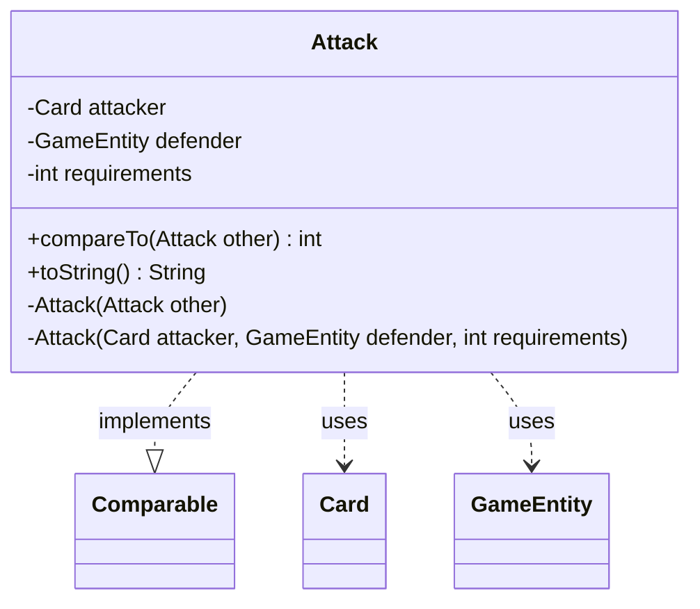

---
aliases:
  - Attack
tags:
  - java/class
  - module/forge-game
  - pkg/forge/game/combat
fqn: forge.game.combat.AttackConstraints.Attack
package: forge.game.combat
module: forge-game
kind: Class
---

# Attack

**Package:** `forge.game.combat`   **Module:** `forge-game`   **Kind:** Class



## Relationships
**Uses:**
- [[forge.game.GameEntity|GameEntity]]
- [[forge.game.card.Card|Card]]

## Design Description

The Attack class is a private static nested helper within `AttackConstraints`, modeling a single proposed attack as an immutable association of an attacking `Card`, its target `GameEntity` defender, and an integer `requirements` weight. Its primary responsibility is to make candidate attacks rankable: by implementing `Comparable<Attack>`, it orders instances solely by their `requirements` count via `Integer.compare`, allowing the enclosing constraint solver to sort and prioritize attacks.

The design favors encapsulation and immutability—`final` fields, private constructors (including a copy constructor), and `private static` scope confine its use entirely to `AttackConstraints`. It collaborates with `Card` and `GameEntity` purely as opaque references for identity and display, with `toString` producing a compact `[requirements] attacker to defender` representation for debugging.

## Source
`forge-game/src/main/java/forge/game/combat/AttackConstraints.java` — declaration excerpt

```java
    private final static class Attack implements Comparable<Attack> {
        private final Card attacker;
        private final GameEntity defender;
        private int requirements;
        private Attack(final Attack other) {
            this(other.attacker, other.defender, other.requirements);
        }
        private Attack(final Card attacker, final GameEntity defender, final int requirements) {
            this.attacker = attacker;
            this.defender = defender;
            this.requirements = requirements;
        }
        @Override
        public int compareTo(final Attack other) {
            return Integer.compare(this.requirements, other.requirements);
        }
        @Override
        public String toString() {
            return "[" + requirements + "] " + attacker + " to " + defender; 
        }
    }
```
