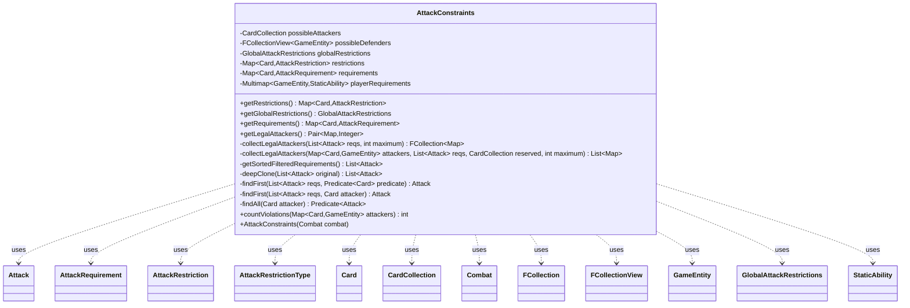

---
aliases:
  - AttackConstraints
tags:
  - java/class
  - module/forge-game
  - pkg/forge/game/combat
fqn: forge.game.combat.AttackConstraints
package: forge.game.combat
module: forge-game
kind: Class
---

# AttackConstraints

**Package:** `forge.game.combat`   **Module:** `forge-game`   **Kind:** Class



## Relationships
**Uses:**
- [[forge.game.GameEntity|GameEntity]]
- [[forge.game.card.Card|Card]]
- [[forge.game.card.CardCollection|CardCollection]]
- [[forge.game.combat.AttackConstraints.Attack|Attack]]
- [[forge.game.combat.AttackRequirement|AttackRequirement]]
- [[forge.game.combat.AttackRestriction|AttackRestriction]]
- [[forge.game.combat.AttackRestrictionType|AttackRestrictionType]]
- [[forge.game.combat.Combat|Combat]]
- [[forge.game.combat.GlobalAttackRestrictions|GlobalAttackRestrictions]]
- [[forge.game.staticability.StaticAbility|StaticAbility]]
- [[forge.util.collect.FCollection|FCollection]]
- [[forge.util.collect.FCollectionView|FCollectionView]]

## Design Description

AttackConstraints models the legality of a Magic combat declaration: given a `Combat`, it gathers the attacking player's creatures as possible attackers and the available `GameEntity` defenders, then builds per-creature `AttackRestriction` and `AttackRequirement` maps alongside `GlobalAttackRestrictions` and static "must attack" `playerRequirements`. Its core responsibility is to compute a legal attack assignment — `getLegalAttackers()` returns the creature-to-defender mapping that satisfies all restrictions while violating the fewest requirements, and `countViolations()` scores any candidate.

The class is a self-contained solver rather than a participant in an inheritance hierarchy: it collaborates with `Combat`, `Card`, `CardCollection`, and the restriction/requirement types but extends nothing. Notable design intent includes the private immutable `Attack` value type used to drive a recursive, backtracking search (`collectLegalAttackers` clones requirement lists to explore branches with and without each creature), priority sorting of requirements, and explicit handling of restriction types such as `ONLY_ALONE`, `NOT_ALONE`, and `NEED_TWO_OTHERS`.

## Source
`forge-game/src/main/java/forge/game/combat/AttackConstraints.java`

```java
package forge.game.combat;

import java.util.Collection;
import java.util.Collections;
import java.util.Comparator;
import java.util.Iterator;
import java.util.LinkedHashMap;
import java.util.List;
import java.util.Map;
import java.util.Map.Entry;
import java.util.NoSuchElementException;
import java.util.Objects;
import java.util.Set;
import java.util.function.Predicate;
import java.util.stream.Collectors;

import com.google.common.collect.*;
import forge.util.IterableUtil;
import org.apache.commons.lang3.tuple.Pair;

import forge.game.GameEntity;
import forge.game.card.Card;
import forge.game.card.CardCollection;
import forge.game.staticability.StaticAbility;
import forge.game.staticability.StaticAbilityMustAttack;
import forge.util.collect.FCollection;
import forge.util.collect.FCollectionView;

public class AttackConstraints {

    private final CardCollection possibleAttackers;
    private final FCollectionView<GameEntity> possibleDefenders;
    private final GlobalAttackRestrictions globalRestrictions;

    private final Map<Card, AttackRestriction> restrictions = Maps.newHashMap();
    private final Map<Card, AttackRequirement> requirements = Maps.newHashMap();
    private final Multimap<GameEntity, StaticAbility> playerRequirements;

    public AttackConstraints(final Combat combat) {
        possibleAttackers = combat.getAttackingPlayer().getCreaturesInPlay();
        possibleDefenders = combat.getDefenders();
        globalRestrictions = GlobalAttackRestrictions.getGlobalRestrictions(combat.getAttackingPlayer(), possibleDefenders);
        playerRequirements = StaticAbilityMustAttack.mustAttackSpecific(combat.getAttackingPlayer(), possibleDefenders);

        // TODO extend for "SharedTurnModes"
        for (final Card possibleAttacker : possibleAttackers) {
            restrictions.put(possibleAttacker, new AttackRestriction(possibleAttacker, possibleDefenders));

            final Multimap<Card, StaticAbility> causesToAttack = StaticAbilityMustAttack.getAttackRequirements(possibleAttacker,
                    possibleAttackers.stream().filter(p -> !p.equals(possibleAttacker)).collect(Collectors.toList()));

            final AttackRequirement r = new AttackRequirement(possibleAttacker, causesToAttack, possibleDefenders);
            requirements.put(possibleAttacker, r);
        }
    }

    public Map<Card, AttackRestriction> getRestrictions() {
        return restrictions;
    }
    public GlobalAttackRestrictions getGlobalRestrictions() {
        return globalRestrictions;
    }

    public Map<Card, AttackRequirement> getRequirements() {
        return requirements;
    }

    /**
     * Get a set of legal attackers.
     * 
     * @return a {@link Pair} of
     *         <ul>
     *         <li>A {@link Map} mapping attacking creatures to defenders;</li>
     *         <li>The number of requirements fulfilled by this attack.</li>
     *         </ul>
     */
    public Pair<Map<Card, GameEntity>, Integer> getLegalAttackers() {
        final int myMax = Math.min(Objects.requireNonNullElse(globalRestrictions.getMax(), Integer.MAX_VALUE), possibleAttackers.size());
        if (myMax == 0) {
            return Pair.of(Collections.emptyMap(), 0);
        }

        final Map<Map<Card, GameEntity>, Integer> possible = new LinkedHashMap<>();
        final List<Attack> reqs = getSortedFilteredRequirements();
        final CardCollection myPossibleAttackers = new CardCollection(possibleAttackers);

        // First, remove all requirements of creatures that aren't going attack this combat anyway
        final CardCollection attackersToRemove = new CardCollection();
        for (final Card attacker : myPossibleAttackers) {
            final Set<AttackRestrictionType> types = restrictions.get(attacker).getTypes();
            if ((types.contains(AttackRestrictionType.NEED_TWO_OTHERS)     && myMax <= 2
                    ) || (
                 types.contains(AttackRestrictionType.NOT_ALONE)           && myMax <= 1
                    ) || (
                 types.contains(AttackRestrictionType.NEED_BLACK_OR_GREEN) && myMax <= 1
                    ) || (
                 types.contains(AttackRestrictionType.NEED_GREATER_POWER)  && myMax <= 1
                            )) {
                reqs.removeIf(findAll(attacker));
                attackersToRemove.add(attacker);
            }
        }
        myPossibleAttackers.removeAll(attackersToRemove);
        attackersToRemove.clear();

        // Next, remove creatures with constraints that can't be fulfilled.
        for (final Card attacker : myPossibleAttackers) {
            final Set<AttackRestrictionType> types = restrictions.get(attacker).getTypes();
            if (types.contains(AttackRestrictionType.NEED_BLACK_OR_GREEN)) {
                if (!myPossibleAttackers.anyMatch(AttackRestrictionType.NEED_BLACK_OR_GREEN.getPredicate(attacker))) {
                    attackersToRemove.add(attacker);
                }
            } else if (types.contains(AttackRestrictionType.NEED_GREATER_POWER)) {
                if (!myPossibleAttackers.anyMatch(AttackRestrictionType.NEED_GREATER_POWER.getPredicate(attacker))) {
                    attackersToRemove.add(attacker);
                }
            }
        }
        myPossibleAttackers.removeAll(attackersToRemove);
        for (final Card toRemove : attackersToRemove) {
            reqs.removeIf(findAll(toRemove));
        }

        // First, successively try each creature that must attack alone.
        for (final Card attacker : myPossibleAttackers) {
            if (restrictions.get(attacker).getTypes().contains(AttackRestrictionType.ONLY_ALONE)) {
                final Attack attack = findFirst(reqs, attacker);
                if (attack == null) {
                    // no requirements, we don't care anymore
                    continue;
                }
                final Map<Card, GameEntity> attackMap = ImmutableMap.of(attack.attacker, attack.defender);
                final int violations = countViolations(attackMap);
                if (violations != -1) {
                    possible.put(attackMap, violations);
                }
                // remove them from the requirements, as they'll not be relevant to this calculation any more
                reqs.removeIf(findAll(attacker));
            }
        }

        // Now try all others (plus empty attack) and count their violations
        final FCollection<Map<Card, GameEntity>> legalAttackers = collectLegalAttackers(reqs, myMax);
        possible.putAll(Maps.asMap(legalAttackers.asSet(), this::countViolations));
        int empty = countViolations(Collections.emptyMap());
        if (empty != -1) {
            possible.put(Collections.emptyMap(), empty);
        }

        // take the case with the fewest violations
        return possible.entrySet().stream()
                .min(Comparator.comparingInt(Entry::getValue))
                .map(e -> Pair.of(e.getKey(), e.getValue()))
                .orElseThrow(NoSuchElementException::new);
    }

    private FCollection<Map<Card, GameEntity>> collectLegalAttackers(final List<Attack> reqs, final int maximum) {
        return new FCollection<>
                (collectLegalAttackers(Collections.emptyMap(), deepClone(reqs), new CardCollection(), maximum));
    }
    private List<Map<Card, GameEntity>> collectLegalAttackers(final Map<Card, GameEntity> attackers, final List<Attack> reqs, final CardCollection reserved, final int maximum) {
        final List<Map<Card, GameEntity>> result = Lists.newLinkedList();

        int localMaximum = maximum;
        final boolean isLimited = globalRestrictions.getMax() != null;
        final Map<Card, GameEntity> myAttackers = Maps.newHashMap(attackers);
        final Map<GameEntity, Integer> toDefender = new LinkedHashMap<>();
        int attackersNeeded = 0;

        outer: while (!reqs.isEmpty()) {
            final Iterator<Attack> iterator = reqs.iterator();
            final Attack req = iterator.next();
            final boolean isReserved = reserved.contains(req.attacker);

            boolean skip = false;
            if (!isReserved) {
                if (localMaximum <= 0) {
                    // can't add any more creatures (except reserved creatures)
                    skip = true;
                } else if (req.requirements == 0 && attackersNeeded == 0 && reserved.isEmpty()) {
                    // we don't need this creature
                    skip = true;
                }
            }
            final Integer defMax = globalRestrictions.getDefenderMax().get(req.defender);
            if (defMax != null && toDefender.getOrDefault(req.defender, 0) >= defMax) {
                // too many to this defender already
                skip = true;
            } else if (null != CombatUtil.getAttackCost(req.attacker.getGame(), req.attacker, req.defender)) {
                // has to pay a cost: skip!
                skip = true;
            }

            if (skip) {
                iterator.remove();
                continue;
            }

            boolean haveTriedWithout = false;
            final AttackRestriction restriction = restrictions.get(req.attacker);
            final AttackRequirement requirement = requirements.get(req.attacker);

            // construct the predicate restrictions
            final Collection<Predicate<Card>> predicateRestrictions = Lists.newLinkedList();
            for (final AttackRestrictionType rType : restriction.getTypes()) {
                final Predicate<Card> predicate = rType.getPredicate(req.attacker);
                if (predicate != null) {
                    predicateRestrictions.add(predicate);
                }
            }

            if (!requirement.getCausesToAttack().isEmpty()) {
                final List<Attack> clonedReqs = deepClone(reqs);
                for (final Entry<Card, Collection<StaticAbility>> causesToAttack : requirement.getCausesToAttack().asMap().entrySet()) {
                    for (final Attack a : IterableUtil.filter(reqs, findAll(causesToAttack.getKey()))) {
                        a.requirements += causesToAttack.getValue().size();
                    }
                }
                // if maximum < no of possible attackers, try both with and without this creature
                if (isLimited) {
                    // try without
                    clonedReqs.removeIf(findAll(req.attacker));
                    final CardCollection clonedReserved = new CardCollection(reserved);
                    result.addAll(collectLegalAttackers(myAttackers, clonedReqs, clonedReserved, localMaximum));
                    haveTriedWithout = true;
                }
            }

            for (final Predicate<Card> predicateRestriction : predicateRestrictions) {
                if (Sets.union(myAttackers.keySet(), reserved.asSet()).stream().anyMatch(predicateRestriction)) {
                    // predicate fulfilled already, ignore!
                    continue;
                }
                // otherwise: reserve first creature to match it!
                final Attack match = findFirst(reqs, predicateRestriction);
                if (match == null) {
                    // no match: remove this creature completely
                    reqs.removeIf(findAll(req.attacker));
                    continue outer;
                }
                // found one! add it to reserve and lower local maximum
                reserved.add(match.attacker);
                localMaximum--;

                // if limited, try both with and without this creature
                if (!haveTriedWithout && isLimited) {
                    // try without
                    final List<Attack> clonedReqs = deepClone(reqs);
                    clonedReqs.removeIf(findAll(req.attacker));
                    final CardCollection clonedReserved = new CardCollection(reserved);
                    result.addAll(collectLegalAttackers(myAttackers, clonedReqs, clonedReserved, localMaximum));
                    haveTriedWithout = true;
                }
            }

            // finally: add the creature
            myAttackers.put(req.attacker, req.defender);
            toDefender.merge(req.defender, 1, Integer::sum);
            reqs.removeIf(findAll(req.attacker));
            reserved.remove(req.attacker);
            localMaximum--;

            // need two other attackers: set that number to the number of attackers we still need (but never < 0)
            if (restrictions.get(req.attacker).getTypes().contains(AttackRestrictionType.NEED_TWO_OTHERS)) {
                final int previousNeeded = attackersNeeded;
                attackersNeeded = Math.max(3 - (myAttackers.size() + reserved.size()), 0);
                localMaximum -= Math.max(attackersNeeded - previousNeeded, 0);
            } else if (restrictions.get(req.attacker).getTypes().contains(AttackRestrictionType.NOT_ALONE)) {
                attackersNeeded = Math.max(2 - (myAttackers.size() + reserved.size()), 0);
            }
        }

        // success if we've added everything we want
        if (reserved.isEmpty() && attackersNeeded == 0) {
            result.add(myAttackers);
        }

        return result;
    }

    private final static class Attack implements Comparable<Attack> {
        private final Card attacker;
        private final GameEntity defender;
        private int requirements;
        private Attack(final Attack other) {
            this(other.attacker, other.defender, other.requirements);
        }
        private Attack(final Card attacker, final GameEntity defender, final int requirements) {
            this.attacker = attacker;
            this.defender = defender;
            this.requirements = requirements;
        }
        @Override
        public int compareTo(final Attack other) {
            return Integer.compare(this.requirements, other.requirements);
        }
        @Override
        public String toString() {
            return "[" + requirements + "] " + attacker + " to " + defender; 
        }
    }

    private List<Attack> getSortedFilteredRequirements() {
        final List<Attack> result = Lists.newArrayList();
        final Map<Card, List<Pair<GameEntity, Integer>>> sortedRequirements = Maps.transformValues(requirements, AttackRequirement::getSortedRequirements);
        for (final Entry<Card, List<Pair<GameEntity, Integer>>> reqList : sortedRequirements.entrySet()) {
            final AttackRestriction restriction = restrictions.get(reqList.getKey());
            final List<Pair<GameEntity, Integer>> list = reqList.getValue();
            for (Pair<GameEntity, Integer> attackReq : list) {
                if (restriction.canAttack(attackReq.getLeft())) {
                    result.add(new Attack(reqList.getKey(), attackReq.getLeft(), attackReq.getRight()));
                }
            }
        }

        Collections.sort(result, Comparator.reverseOrder());

        Multimap<GameEntity, StaticAbility> playerReqs = MultimapBuilder.hashKeys().arrayListValues().build(playerRequirements);
        CardCollection usedAttackers = new CardCollection();
        while (!playerReqs.isEmpty()) {
            Map.Entry<GameEntity, Collection<StaticAbility>> playerReq = playerReqs.asMap().entrySet().stream()
                    .max(Comparator.comparing(e -> e.getValue().size())).orElse(null);
            // find best attack to also fulfill the additional requirements
            Attack bestMatch = result.stream().filter(att -> !usedAttackers.contains(att.attacker) && att.defender.equals(playerReq.getKey())).findFirst().orElse(null);
            if (bestMatch != null) {
                bestMatch.requirements += playerReq.getValue().size();
                usedAttackers.add(bestMatch.attacker);
                // recalculate remaining requirements
                playerReqs.values().removeAll(playerReq.getValue());
            } else {
                playerReqs.removeAll(playerReq.getKey());
            }
        }
        if (!usedAttackers.isEmpty()) {
            // order could have changed
            Collections.sort(result, Comparator.reverseOrder());
        }

        return result;
    }
    private static List<Attack> deepClone(final List<Attack> original) {
        final List<Attack> newList = Lists.newLinkedList();
        for (final Attack attack : original) {
            newList.add(new Attack(attack));
        }
        return newList;
    }
    private static Attack findFirst(final List<Attack> reqs, final Predicate<Card> predicate) {
        for (final Attack req : reqs) {
            if (predicate.test(req.attacker)) {
                return req;
            }
        }
        return null;
    }
    private static Attack findFirst(final List<Attack> reqs, final Card attacker) {
        return findFirst(reqs, attacker::equals);
    }
    private static Predicate<Attack> findAll(final Card attacker) {
        return input -> input.attacker.equals(attacker);
    }

    /**
     * @param attackers
     *            a {@link Map} of each attacking {@link Card} to the
     *            {@link GameEntity} it's attacking.
     * @return the number of requirements violated by this attack, or -1 if a
     *         restriction is violated.
     */
    public final int countViolations(final Map<Card, GameEntity> attackers) {
        if (!globalRestrictions.isLegal(attackers)) {
            return -1;
        }
        for (final Entry<Card, GameEntity> attacker : attackers.entrySet()) {
            final AttackRestriction restriction = restrictions.get(attacker.getKey());
            if (restriction != null && !restriction.canAttack(attacker.getKey(), attackers)) {
                // Violating a restriction!
                return -1;
            }
        }

        int violations = 0;
        for (final Card possibleAttacker : possibleAttackers) {
            final AttackRequirement requirement = requirements.get(possibleAttacker);
            if (requirement != null) {
                violations += requirement.countViolations(attackers.get(possibleAttacker), attackers);
            }
        }

        Multimap<StaticAbility, GameEntity> inverted = MultimapBuilder.hashKeys().arrayListValues().build();
        for (Collection<GameEntity> defSet : Multimaps.invertFrom(playerRequirements, inverted).asMap().values()) {
            if (Collections.disjoint(defSet, attackers.values())) {
                violations++;
            }
        }

        return violations;
    }
}
```

## Python
`forge/game/combat/AttackConstraints.py`

```python
import typing
from typing import Dict, List, Optional, Tuple

from forge.game.GameEntity import GameEntity
from forge.game.card.Card import Card
from forge.game.card.CardCollection import CardCollection
from forge.game.combat.AttackRequirement import AttackRequirement
from forge.game.combat.AttackRestriction import AttackRestriction
from forge.game.combat.AttackRestrictionType import AttackRestrictionType
from forge.game.combat.Combat import Combat
from forge.game.combat.CombatUtil import CombatUtil
from forge.game.combat.GlobalAttackRestrictions import GlobalAttackRestrictions
from forge.game.staticability.StaticAbility import StaticAbility
from forge.game.staticability.StaticAbilityMustAttack import StaticAbilityMustAttack
from forge.util.IterableUtil import IterableUtil
from forge.util.collect.FCollection import FCollection
from forge.util.collect.FCollectionView import FCollectionView


def _removeIf(lst, predicate):
    lst[:] = [x for x in lst if not predicate(x)]


class AttackConstraints:

    class Attack:
        def __init__(self, attacker, defender, requirements):
            self.attacker = attacker
            self.defender = defender
            self.requirements = requirements

        def compareTo(self, other):
            return (self.requirements > other.requirements) - (self.requirements < other.requirements)

        def __lt__(self, other):
            return self.requirements < other.requirements

        def __str__(self):
            return "[" + str(self.requirements) + "] " + str(self.attacker) + " to " + str(self.defender)

    def __init__(self, combat: Combat):
        self.possibleAttackers = combat.getAttackingPlayer().getCreaturesInPlay()
        self.possibleDefenders = combat.getDefenders()
        self.globalRestrictions = GlobalAttackRestrictions.getGlobalRestrictions(combat.getAttackingPlayer(), self.possibleDefenders)
        self.playerRequirements = StaticAbilityMustAttack.mustAttackSpecific(combat.getAttackingPlayer(), self.possibleDefenders)

        self.restrictions: Dict[Card, AttackRestriction] = {}
        self.requirements: Dict[Card, AttackRequirement] = {}

        # TODO extend for "SharedTurnModes"
        for possibleAttacker in self.possibleAttackers:
            self.restrictions[possibleAttacker] = AttackRestriction(possibleAttacker, self.possibleDefenders)

            causesToAttack = StaticAbilityMustAttack.getAttackRequirements(
                possibleAttacker,
                [p for p in self.possibleAttackers if p != possibleAttacker])

            r = AttackRequirement(possibleAttacker, causesToAttack, self.possibleDefenders)
            self.requirements[possibleAttacker] = r

    def getRestrictions(self) -> Dict[Card, AttackRestriction]:
        return self.restrictions

    def getGlobalRestrictions(self) -> GlobalAttackRestrictions:
        return self.globalRestrictions

    def getRequirements(self) -> Dict[Card, AttackRequirement]:
        return self.requirements

    def getLegalAttackers(self) -> Tuple[Dict[Card, GameEntity], int]:
        gmax = self.globalRestrictions.getMax()
        myMax = min(gmax if gmax is not None else 2147483647, self.possibleAttackers.size())
        if myMax == 0:
            return ({}, 0)

        possible = []
        reqs = self.getSortedFilteredRequirements()
        myPossibleAttackers = CardCollection(self.possibleAttackers)

        # First, remove all requirements of creatures that aren't going attack this combat anyway
        attackersToRemove = CardCollection()
        for attacker in myPossibleAttackers:
            types = self.restrictions.get(attacker).getTypes()
            if ((AttackRestrictionType.NEED_TWO_OTHERS in types and myMax <= 2)
                    or (AttackRestrictionType.NOT_ALONE in types and myMax <= 1)
                    or (AttackRestrictionType.NEED_BLACK_OR_GREEN in types and myMax <= 1)
                    or (AttackRestrictionType.NEED_GREATER_POWER in types and myMax <= 1)):
                _removeIf(reqs, AttackConstraints.findAll(attacker))
                attackersToRemove.add(attacker)
        myPossibleAttackers.removeAll(attackersToRemove)
        attackersToRemove.clear()

        # Next, remove creatures with constraints that can't be fulfilled.
        for attacker in myPossibleAttackers:
            types = self.restrictions.get(attacker).getTypes()
            if AttackRestrictionType.NEED_BLACK_OR_GREEN in types:
                if not myPossibleAttackers.anyMatch(AttackRestrictionType.NEED_BLACK_OR_GREEN.getPredicate(attacker)):
                    attackersToRemove.add(attacker)
            elif AttackRestrictionType.NEED_GREATER_POWER in types:
                if not myPossibleAttackers.anyMatch(AttackRestrictionType.NEED_GREATER_POWER.getPredicate(attacker)):
                    attackersToRemove.add(attacker)
        myPossibleAttackers.removeAll(attackersToRemove)
        for toRemove in attackersToRemove:
            _removeIf(reqs, AttackConstraints.findAll(toRemove))

        # First, successively try each creature that must attack alone.
        for attacker in myPossibleAttackers:
            if AttackRestrictionType.ONLY_ALONE in self.restrictions.get(attacker).getTypes():
                attack = AttackConstraints.findFirst(reqs, attacker)
                if attack is None:
                    # no requirements, we don't care anymore
                    continue
                attackMap = {attack.attacker: attack.defender}
                violations = self.countViolations(attackMap)
                if violations != -1:
                    possible.append((attackMap, violations))
                # remove them from the requirements, as they'll not be relevant to this calculation any more
                _removeIf(reqs, AttackConstraints.findAll(attacker))

        # Now try all others (plus empty attack) and count their violations
        legalAttackers = self.collectLegalAttackers(reqs, myMax)
        for m in legalAttackers.asSet():
            possible.append((m, self.countViolations(m)))
        empty = self.countViolations({})
        if empty != -1:
            possible.append(({}, empty))

        # take the case with the fewest violations
        return min(possible, key=lambda e: e[1])

    def collectLegalAttackers(self, *args):
        if len(args) == 2:
            reqs, maximum = args
            return FCollection(
                self.collectLegalAttackers({}, AttackConstraints.deepClone(reqs), CardCollection(), maximum))

        attackers, reqs, reserved, maximum = args
        result = []

        localMaximum = maximum
        isLimited = self.globalRestrictions.getMax() is not None
        myAttackers = dict(attackers)
        toDefender: Dict[GameEntity, int] = {}
        attackersNeeded = 0

        while reqs:
            req = reqs[0]
            isReserved = reserved.contains(req.attacker)

            skip = False
            if not isReserved:
                if localMaximum <= 0:
                    # can't add any more creatures (except reserved creatures)
                    skip = True
                elif req.requirements == 0 and attackersNeeded == 0 and reserved.isEmpty():
                    # we don't need this creature
                    skip = True
            defMax = self.globalRestrictions.getDefenderMax().get(req.defender)
            if defMax is not None and toDefender.get(req.defender, 0) >= defMax:
                # too many to this defender already
                skip = True
            elif CombatUtil.getAttackCost(req.attacker.getGame(), req.attacker, req.defender) is not None:
                # has to pay a cost: skip!
                skip = True

            if skip:
                del reqs[0]
                continue

            haveTriedWithout = False
            restriction = self.restrictions.get(req.attacker)
            requirement = self.requirements.get(req.attacker)

            # construct the predicate restrictions
            predicateRestrictions = []
            for rType in restriction.getTypes():
                predicate = rType.getPredicate(req.attacker)
                if predicate is not None:
                    predicateRestrictions.append(predicate)

            if not requirement.getCausesToAttack().isEmpty():
                clonedReqs = AttackConstraints.deepClone(reqs)
                for cKey, cVals in requirement.getCausesToAttack().asMap().items():
                    for a in IterableUtil.filter(reqs, AttackConstraints.findAll(cKey)):
                        a.requirements += len(cVals)
                # if maximum < no of possible attackers, try both with and without this creature
                if isLimited:
                    # try without
                    _removeIf(clonedReqs, AttackConstraints.findAll(req.attacker))
                    clonedReserved = CardCollection(reserved)
                    result.extend(self.collectLegalAttackers(myAttackers, clonedReqs, clonedReserved, localMaximum))
                    haveTriedWithout = True

            continue_outer = False
            for predicateRestriction in predicateRestrictions:
                union = set(myAttackers.keys()) | set(reserved.asSet())
                if any(predicateRestriction(c) for c in union):
                    # predicate fulfilled already, ignore!
                    continue
                # otherwise: reserve first creature to match it!
                match = AttackConstraints.findFirst(reqs, predicateRestriction)
                if match is None:
                    # no match: remove this creature completely
                    _removeIf(reqs, AttackConstraints.findAll(req.attacker))
                    continue_outer = True
                    break
                # found one! add it to reserve and lower local maximum
                reserved.add(match.attacker)
                localMaximum -= 1

                # if limited, try both with and without this creature
                if not haveTriedWithout and isLimited:
                    # try without
                    clonedReqs = AttackConstraints.deepClone(reqs)
                    _removeIf(clonedReqs, AttackConstraints.findAll(req.attacker))
                    clonedReserved = CardCollection(reserved)
                    result.extend(self.collectLegalAttackers(myAttackers, clonedReqs, clonedReserved, localMaximum))
                    haveTriedWithout = True

            if continue_outer:
                continue

            # finally: add the creature
            myAttackers[req.attacker] = req.defender
            toDefender[req.defender] = toDefender.get(req.defender, 0) + 1
            _removeIf(reqs, AttackConstraints.findAll(req.attacker))
            reserved.remove(req.attacker)
            localMaximum -= 1

            # need two other attackers: set that number to the number of attackers we still need (but never < 0)
            if AttackRestrictionType.NEED_TWO_OTHERS in self.restrictions.get(req.attacker).getTypes():
                previousNeeded = attackersNeeded
                attackersNeeded = max(3 - (len(myAttackers) + reserved.size()), 0)
                localMaximum -= max(attackersNeeded - previousNeeded, 0)
            elif AttackRestrictionType.NOT_ALONE in self.restrictions.get(req.attacker).getTypes():
                attackersNeeded = max(2 - (len(myAttackers) + reserved.size()), 0)

        # success if we've added everything we want
        if reserved.isEmpty() and attackersNeeded == 0:
            result.append(myAttackers)

        return result

    def getSortedFilteredRequirements(self) -> List["AttackConstraints.Attack"]:
        result = []
        sortedRequirements = {card: req.getSortedRequirements() for card, req in self.requirements.items()}
        for card, lst in sortedRequirements.items():
            restriction = self.restrictions.get(card)
            for attackReq in lst:
                if restriction.canAttack(attackReq.getLeft()):
                    result.append(AttackConstraints.Attack(card, attackReq.getLeft(), attackReq.getRight()))

        result.sort(key=lambda a: a.requirements, reverse=True)

        playerReqs = {k: list(v) for k, v in self.playerRequirements.asMap().items()}
        usedAttackers = CardCollection()
        while any(playerReqs.values()):
            playerReq = max((it for it in playerReqs.items() if it[1]), key=lambda e: len(e[1]), default=None)
            if playerReq is None:
                break
            key, vals = playerReq
            # find best attack to also fulfill the additional requirements
            bestMatch = next((att for att in result
                              if not usedAttackers.contains(att.attacker) and att.defender == key), None)
            if bestMatch is not None:
                bestMatch.requirements += len(vals)
                usedAttackers.add(bestMatch.attacker)
                # recalculate remaining requirements
                valsSnapshot = list(vals)
                for k2 in list(playerReqs.keys()):
                    playerReqs[k2] = [s for s in playerReqs[k2] if s not in valsSnapshot]
            else:
                playerReqs.pop(key, None)
        if not usedAttackers.isEmpty():
            # order could have changed
            result.sort(key=lambda a: a.requirements, reverse=True)

        return result

    @staticmethod
    def deepClone(original):
        newList = []
        for attack in original:
            newList.append(AttackConstraints.Attack(attack.attacker, attack.defender, attack.requirements))
        return newList

    @staticmethod
    def findFirst(reqs, predicate):
        if not callable(predicate):
            attacker = predicate
            predicate = lambda c: c == attacker
        for req in reqs:
            if predicate(req.attacker):
                return req
        return None

    @staticmethod
    def findAll(attacker):
        return lambda input: input.attacker == attacker

    def countViolations(self, attackers: Dict[Card, GameEntity]) -> int:
        if not self.globalRestrictions.isLegal(attackers):
            return -1
        for attacker in attackers.items():
            restriction = self.restrictions.get(attacker[0])
            if restriction is not None and not restriction.canAttack(attacker[0], attackers):
                # Violating a restriction!
                return -1

        violations = 0
        for possibleAttacker in self.possibleAttackers:
            requirement = self.requirements.get(possibleAttacker)
            if requirement is not None:
                violations += requirement.countViolations(attackers.get(possibleAttacker), attackers)

        inverted: Dict[StaticAbility, List[GameEntity]] = {}
        for ge, abilities in self.playerRequirements.asMap().items():
            for sa in abilities:
                inverted.setdefault(sa, []).append(ge)
        attackerDefenders = list(attackers.values())
        for defSet in inverted.values():
            if all(d not in attackerDefenders for d in defSet):
                violations += 1

        return violations
```
