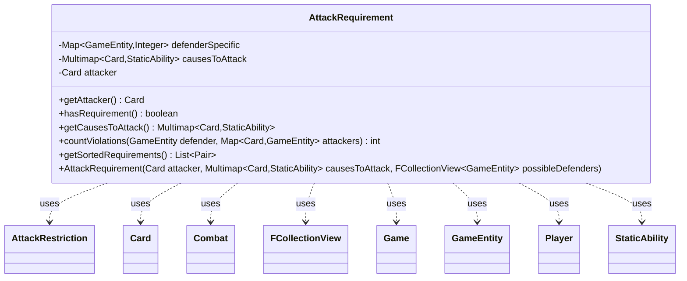

---
aliases:
  - AttackRequirement
tags:
  - java/class
  - module/forge-game
  - pkg/forge/game/combat
fqn: forge.game.combat.AttackRequirement
package: forge.game.combat
module: forge-game
kind: Class
---

# AttackRequirement

**Package:** `forge.game.combat`   **Module:** `forge-game`   **Kind:** Class



## Relationships
**Uses:**
- [[forge.game.Game|Game]]
- [[forge.game.GameEntity|GameEntity]]
- [[forge.game.card.Card|Card]]
- [[forge.game.combat.AttackRestriction|AttackRestriction]]
- [[forge.game.combat.Combat|Combat]]
- [[forge.game.player.Player|Player]]
- [[forge.game.staticability.StaticAbility|StaticAbility]]
- [[forge.util.collect.FCollectionView|FCollectionView]]

## Design Description

AttackRequirement encapsulates the "must attack" obligations imposed on a single attacking Card during the combat declaration phase. Built from the attacker, a Multimap of cards-that-cause-attacks-with-their-StaticAbilities, and the possible defenders, its constructor consolidates every source of compulsion—goad, MustAttack static abilities, and defender-specific demands—into a per-GameEntity weight map, while pruning defenders that have left an opposing battlefield or belong to players no longer in the game.

As a plain helper collaborating with Combat, AttackRestriction, and GlobalAttackRestrictions, it exposes query methods rather than enforcing rules itself: hasRequirement reports whether any obligation exists, countViolations scores how badly a proposed attack assignment breaches these requirements (discounting cases neutralized by ONLY_ALONE restrictions, attack costs, or global maximums), and getSortedRequirements ranks defenders by demand. This separation lets the combat AI and validation logic treat requirement-satisfaction as an optimizable cost, keeping legality decisions in the surrounding combat framework.

## Source
`forge-game/src/main/java/forge/game/combat/AttackRequirement.java`

```java
package forge.game.combat;

import java.util.LinkedHashMap;
import java.util.Collection;
import java.util.List;
import java.util.Map;
import java.util.Objects;

import forge.game.staticability.StaticAbility;
import forge.game.staticability.StaticAbilityMustAttack;
import org.apache.commons.lang3.tuple.Pair;

import com.google.common.collect.Lists;
import com.google.common.collect.Multimap;

import forge.game.Game;
import forge.game.GameEntity;
import forge.game.card.Card;
import forge.game.player.Player;
import forge.util.collect.FCollectionView;

public class AttackRequirement {

    private final Map<GameEntity, Integer> defenderSpecific;
    private final Multimap<Card, StaticAbility> causesToAttack;
    private final Card attacker;

    public AttackRequirement(final Card attacker, final Multimap<Card, StaticAbility> causesToAttack, final FCollectionView<GameEntity> possibleDefenders) {
        this.defenderSpecific = new LinkedHashMap<>();
        this.attacker = attacker;
        this.causesToAttack = causesToAttack;

        final Game game = attacker.getGame();
        int nAttackAnything = 0;

        if (attacker.isGoaded()) {
            // Goad has two requirements but the other is handled by CombatUtil currently
            nAttackAnything += attacker.getGoaded().size();
        }

        //MustAttack static check
        final List<GameEntity> mustAttack = StaticAbilityMustAttack.entitiesMustAttack(attacker);
        for (GameEntity e : mustAttack) {
            if (e.equals(attacker)) {
                nAttackAnything++;
            } else {
                defenderSpecific.merge(e, 1, Integer::sum);
            }
        }

        for (final GameEntity defender : possibleDefenders) {
            // use put here because we want to always put it, even if the value is 0
            defenderSpecific.merge(defender, nAttackAnything, Integer::sum);
        }

        // Remove GameEntities that are no longer on an opposing battlefield or are
        // related to Players who have lost the game
        final List<GameEntity> toRemove = Lists.newArrayListWithCapacity(defenderSpecific.size());
        for (final GameEntity entity : defenderSpecific.keySet()) {
            boolean removeThis = false;
            if (entity instanceof Player) {
                if (!((Player) entity).isInGame()) {
                    removeThis = true;
                }
            } else if (entity instanceof Card) {
                final Card reqPW = (Card) entity;
                final Card gamePW = game.getCardState(reqPW, null);
                if (gamePW == null || !gamePW.getController().isInGame() || !gamePW.equalsWithGameTimestamp(reqPW)
                        || (!gamePW.isBattle() && !gamePW.getController().isOpponentOf(attacker.getController()))) {
                    removeThis = true;
                }
            }
            if (removeThis) {
                toRemove.add(entity);
            }
        }
        defenderSpecific.keySet().removeAll(toRemove);
    }

    public Card getAttacker() {
        return attacker;
    }

    public boolean hasRequirement() {
        return defenderSpecific.values().stream().anyMatch(i -> i > 0 ) || !causesToAttack.isEmpty();
    }

    public final Multimap<Card, StaticAbility> getCausesToAttack() {
        return causesToAttack;
    }

    public int countViolations(final GameEntity defender, final Map<Card, GameEntity> attackers) {
        if (!hasRequirement()) {
            return 0;
        }

        final boolean isAttacking = defender != null;
        int violations = defenderSpecific.values().stream().mapToInt(Integer::intValue).sum()
                - (isAttacking ? defenderSpecific.getOrDefault(defender, 0) : 0);
        if (isAttacking) {
            final Combat combat = defender.getGame().getCombat();
            final Map<Card, AttackRestriction> constraints = combat.getAttackConstraints().getRestrictions();

            // check if a restriction will apply such that the requirement is no longer relevant
            if (attackers.size() != 1 || !constraints.get(attackers.entrySet().iterator().next().getKey()).getTypes().contains(AttackRestrictionType.ONLY_ALONE)) {
                for (final Map.Entry<Card, Collection<StaticAbility>> mustAttack : causesToAttack.asMap().entrySet()) {
                    if (constraints.get(mustAttack.getKey()).getTypes().contains(AttackRestrictionType.ONLY_ALONE)) continue;
                    int max = Objects.requireNonNullElse(GlobalAttackRestrictions.getGlobalRestrictions(mustAttack.getKey().getController(), combat.getDefenders()).getMax(), Integer.MAX_VALUE);

                    // only count violations if the forced creature can actually attack and has no cost incurred for doing so
                    if (attackers.size() < max && !attackers.containsKey(mustAttack.getKey()) && CombatUtil.canAttack(mustAttack.getKey()) && CombatUtil.getAttackCost(defender.getGame(), mustAttack.getKey(), defender) == null) {
                        violations += mustAttack.getValue().size();
                    }
                }
            }
        }
        return violations;
    }

    public List<Pair<GameEntity, Integer>> getSortedRequirements() {
        final List<Pair<GameEntity, Integer>> entries = Lists.newArrayListWithCapacity(defenderSpecific.size());
        for (final Map.Entry<GameEntity, Integer> entry : defenderSpecific.entrySet()) {
            entries.add(Pair.of(entry.getKey(), entry.getValue()));
        }
        entries.sort(Map.Entry.comparingByValue());
        return entries;
    }

}
```

## Python
`forge/game/combat/AttackRequirement.py`

```python
from typing import List

from forge.game.Game import Game
from forge.game.GameEntity import GameEntity
from forge.game.card.Card import Card
from forge.game.combat.AttackRestriction import AttackRestriction
from forge.game.combat.AttackRestrictionType import AttackRestrictionType
from forge.game.combat.Combat import Combat
from forge.game.combat.CombatUtil import CombatUtil
from forge.game.combat.GlobalAttackRestrictions import GlobalAttackRestrictions
from forge.game.player.Player import Player
from forge.game.staticability.StaticAbility import StaticAbility
from forge.game.staticability.StaticAbilityMustAttack import StaticAbilityMustAttack
from forge.util.collect.FCollectionView import FCollectionView


class AttackRequirement:

    def __init__(self, attacker: Card, causesToAttack, possibleDefenders: FCollectionView):
        self.defenderSpecific: dict[GameEntity, int] = {}
        self.attacker = attacker
        self.causesToAttack = causesToAttack

        game = attacker.getGame()
        nAttackAnything = 0

        if attacker.isGoaded():
            # Goad has two requirements but the other is handled by CombatUtil currently
            nAttackAnything += len(attacker.getGoaded())

        # MustAttack static check
        mustAttack = StaticAbilityMustAttack.entitiesMustAttack(attacker)
        for e in mustAttack:
            if e == attacker:
                nAttackAnything += 1
            else:
                self.defenderSpecific[e] = self.defenderSpecific.get(e, 0) + 1

        for defender in possibleDefenders:
            # use put here because we want to always put it, even if the value is 0
            self.defenderSpecific[defender] = self.defenderSpecific.get(defender, 0) + nAttackAnything

        # Remove GameEntities that are no longer on an opposing battlefield or are
        # related to Players who have lost the game
        toRemove: List[GameEntity] = []
        for entity in self.defenderSpecific.keys():
            removeThis = False
            if isinstance(entity, Player):
                if not entity.isInGame():
                    removeThis = True
            elif isinstance(entity, Card):
                reqPW = entity
                gamePW = game.getCardState(reqPW, None)
                if (gamePW is None or not gamePW.getController().isInGame() or not gamePW.equalsWithGameTimestamp(reqPW)
                        or (not gamePW.isBattle() and not gamePW.getController().isOpponentOf(attacker.getController()))):
                    removeThis = True
            if removeThis:
                toRemove.append(entity)
        for entity in toRemove:
            del self.defenderSpecific[entity]

    def getAttacker(self) -> Card:
        return self.attacker

    def hasRequirement(self) -> bool:
        return any(i > 0 for i in self.defenderSpecific.values()) or not self.causesToAttack.isEmpty()

    def getCausesToAttack(self):
        return self.causesToAttack

    def countViolations(self, defender: GameEntity, attackers: dict[Card, GameEntity]) -> int:
        if not self.hasRequirement():
            return 0

        isAttacking = defender is not None
        violations = sum(self.defenderSpecific.values()) \
            - (self.defenderSpecific.get(defender, 0) if isAttacking else 0)
        if isAttacking:
            combat = defender.getGame().getCombat()
            constraints = combat.getAttackConstraints().getRestrictions()

            # check if a restriction will apply such that the requirement is no longer relevant
            if len(attackers) != 1 or AttackRestrictionType.ONLY_ALONE not in constraints.get(next(iter(attackers.items()))[0]).getTypes():
                for mustAttackKey, mustAttackValue in self.causesToAttack.asMap().items():
                    if AttackRestrictionType.ONLY_ALONE in constraints.get(mustAttackKey).getTypes():
                        continue
                    max_ = GlobalAttackRestrictions.getGlobalRestrictions(mustAttackKey.getController(), combat.getDefenders()).getMax()
                    if max_ is None:
                        max_ = 2147483647

                    # only count violations if the forced creature can actually attack and has no cost incurred for doing so
                    if len(attackers) < max_ and mustAttackKey not in attackers and CombatUtil.canAttack(mustAttackKey) and CombatUtil.getAttackCost(defender.getGame(), mustAttackKey, defender) is None:
                        violations += len(mustAttackValue)
        return violations

    def getSortedRequirements(self) -> List:
        entries = []
        for key, value in self.defenderSpecific.items():
            entries.append((key, value))
        entries.sort(key=lambda entry: entry[1])
        return entries
```
