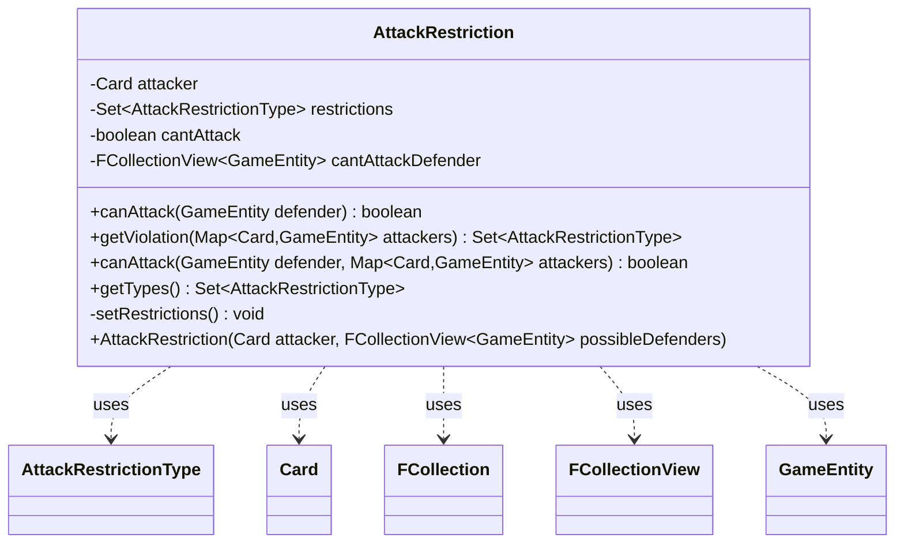

---
aliases:
  - AttackRestriction
tags:
  - java/class
  - module/forge-game
  - pkg/forge/game/combat
fqn: forge.game.combat.AttackRestriction
package: forge.game.combat
module: forge-game
kind: Class
---

# AttackRestriction

**Package:** `forge.game.combat` &nbsp; **Module:** `forge-game` &nbsp; **Kind:** Class



## Relationships
**Uses:**
- [[forge.game.GameEntity|GameEntity]]
- [[forge.game.card.Card|Card]]
- [[forge.game.combat.AttackRestrictionType|AttackRestrictionType]]
- [[forge.util.collect.FCollection|FCollection]]
- [[forge.util.collect.FCollectionView|FCollectionView]]

## Design Description

AttackRestriction evaluates the Magic-specific attack legality constraints on a single attacking `Card`, encapsulating the question "may this creature attack, and against which defenders, given who else is attacking." Constructed from the attacker and its possible defenders, it translates the creature's restriction keywords into an `EnumSet` of `AttackRestrictionType` values and precomputes which defenders are off-limits via `CombatUtil`, short-circuiting to a blanket `cantAttack` flag when a restriction makes any attack impossible.

It collaborates with `Card`, `GameEntity`, and the `FCollection`/`FCollectionView` collections to model attacker and defenders, and delegates per-rule predicate logic to `AttackRestrictionType`. The `canAttack` overloads separate defender-level legality from declaration-wide constraints, while `getViolation` reports exactly which restrictions a proposed set of attackers breaches—supporting both validation and incremental combat planning. The unmodifiable `getTypes` view reflects deliberate immutability of the computed restriction state.

## Source
`forge-game/src/main/java/forge/game/combat/AttackRestriction.java`

```java
package forge.game.combat;

import java.util.*;

import forge.game.GameEntity;
import forge.game.card.Card;
import forge.util.collect.FCollection;
import forge.util.collect.FCollectionView;

public class AttackRestriction {

    private final Card attacker;
    private final Set<AttackRestrictionType> restrictions = EnumSet.noneOf(AttackRestrictionType.class);
    private boolean cantAttack;
    private final FCollectionView<GameEntity> cantAttackDefender;

    public AttackRestriction(final Card attacker, final FCollectionView<GameEntity> possibleDefenders) {
        this.attacker = attacker;
        setRestrictions();

        final FCollection<GameEntity> cantAttackDefender = new FCollection<>();
        for (final GameEntity defender : possibleDefenders) {
            if (!CombatUtil.canAttack(attacker, defender)) {
                cantAttackDefender.add(defender);
            }
        }
        this.cantAttackDefender = cantAttackDefender;

        if ((restrictions.contains(AttackRestrictionType.ONLY_ALONE) && (
                restrictions.contains(AttackRestrictionType.NEED_GREATER_POWER) ||
                restrictions.contains(AttackRestrictionType.NEED_BLACK_OR_GREEN) ||
                restrictions.contains(AttackRestrictionType.NOT_ALONE) ||
                restrictions.contains(AttackRestrictionType.NEED_TWO_OTHERS))
                ) || (
                        restrictions.contains(AttackRestrictionType.NEVER)
                ) || (
                        cantAttackDefender.size() == possibleDefenders.size())) {
            cantAttack = true;
        }
    }

    public boolean canAttack(final GameEntity defender) {
        return !cantAttack && !cantAttackDefender.contains(defender);
    }

    public Set<AttackRestrictionType> getViolation(final Map<Card, GameEntity> attackers) {
        final Set<AttackRestrictionType> violations = EnumSet.noneOf(AttackRestrictionType.class);
        final int nAttackers = attackers.size();
        if (restrictions.contains(AttackRestrictionType.ONLY_ALONE) && nAttackers > 1) {
            violations.add(AttackRestrictionType.ONLY_ALONE);
        }
        if (restrictions.contains(AttackRestrictionType.NEED_GREATER_POWER)
                && attackers.keySet().stream().noneMatch(AttackRestrictionType.NEED_GREATER_POWER.getPredicate(attacker))) {
            violations.add(AttackRestrictionType.NEED_GREATER_POWER);
        }
        if (restrictions.contains(AttackRestrictionType.NEED_BLACK_OR_GREEN)
                && attackers.keySet().stream().noneMatch(AttackRestrictionType.NEED_BLACK_OR_GREEN.getPredicate(attacker))) {
            violations.add(AttackRestrictionType.NEED_BLACK_OR_GREEN);
        }
        if (restrictions.contains(AttackRestrictionType.NOT_ALONE) && nAttackers <= 1) {
            violations.add(AttackRestrictionType.NOT_ALONE);
        }
        if (restrictions.contains(AttackRestrictionType.NEED_TWO_OTHERS) && nAttackers <= 2) {
            violations.add(AttackRestrictionType.NEED_TWO_OTHERS);
        }
        return violations;
    }

    public boolean canAttack(final GameEntity defender, final Map<Card, GameEntity> attackers) {
        if (!canAttack(defender)) {
            return false;
        }

        return getViolation(attackers).isEmpty();
    }

    public Set<AttackRestrictionType> getTypes() {
        return Collections.unmodifiableSet(restrictions);
    }

    private void setRestrictions() {
        if (attacker.hasKeyword("CARDNAME can only attack alone.")) {
            restrictions.add(AttackRestrictionType.ONLY_ALONE);
        }

        if (attacker.hasKeyword("CARDNAME can't attack unless a creature with greater power also attacks.")) {
            restrictions.add(AttackRestrictionType.NEED_GREATER_POWER);
        }

        if (attacker.hasKeyword("CARDNAME can't attack unless a black or green creature also attacks.")) {
            restrictions.add(AttackRestrictionType.NEED_BLACK_OR_GREEN);
        }

        if (attacker.hasKeyword("CARDNAME can't attack or block alone.") || attacker.hasKeyword("CARDNAME can't attack alone.")) {
            restrictions.add(AttackRestrictionType.NOT_ALONE);
        }

        if (attacker.hasKeyword("CARDNAME can't attack unless at least two other creatures attack.")) {
            restrictions.add(AttackRestrictionType.NEED_TWO_OTHERS);
        }
    }

}
```
