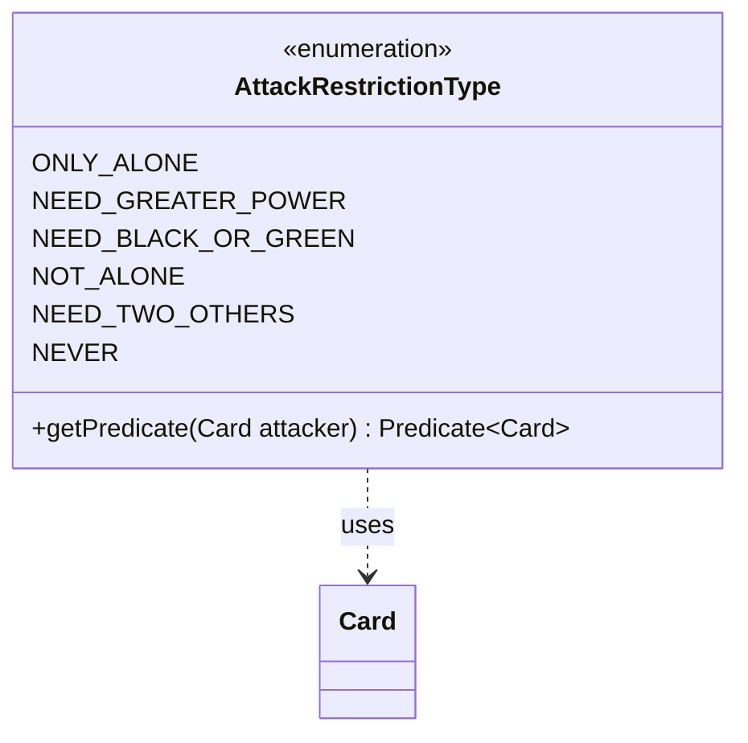

---
aliases:
  - AttackRestrictionType
tags:
  - java/enum
  - module/forge-game
  - pkg/forge/game/combat
fqn: forge.game.combat.AttackRestrictionType
package: forge.game.combat
module: forge-game
kind: Enum
---

# AttackRestrictionType

**Package:** `forge.game.combat`   **Module:** `forge-game`   **Kind:** Enum



## Relationships
**Uses:**
- [[forge.game.card.Card|Card]]

## Design Description

AttackRestrictionType enumerates the distinct ways a creature may be forbidden or conditioned from attacking in Forge's combat system, residing in the `forge.game.combat` package alongside the broader attack-legality machinery. Each constant names a restriction (such as ONLY_ALONE, NEED_GREATER_POWER, or NEVER), and the enum centralizes the logic for translating that rule into a concrete filter via `getPredicate(Card attacker)`, which returns a `Predicate<Card>` describing which other creatures satisfy the restriction relative to the given attacker.

The design delegates the actual matching to reusable `CardPredicates` factories and `MagicColor` constants, keeping each case a compact, composable expression—for instance, NEED_BLACK_OR_GREEN combines a color test with an exclusion of the attacker itself. By returning null for constants like NEVER and ONLY_ALONE, it signals that those cases carry no per-card predicate and are handled by the surrounding combat code, making the enum a lightweight strategy holder rather than a self-contained validator.

## Source
`forge-game/src/main/java/forge/game/combat/AttackRestrictionType.java`

```java
package forge.game.combat;

import forge.card.MagicColor;
import forge.game.card.Card;
import forge.game.card.CardPredicates;

import java.util.function.Predicate;

public enum AttackRestrictionType {

    ONLY_ALONE,
    NEED_GREATER_POWER,
    NEED_BLACK_OR_GREEN,
    NOT_ALONE,
    NEED_TWO_OTHERS,
    NEVER;

    public Predicate<Card> getPredicate(final Card attacker) {
        switch (this) {
            case NEED_GREATER_POWER:
                return CardPredicates.hasGreaterPowerThan(attacker.getNetPower());
            case NEED_BLACK_OR_GREEN:
                return CardPredicates.isColor((byte) (MagicColor.BLACK | MagicColor.GREEN))
                        // may explicitly not be black/green itself
                        .and(Predicate.not(attacker::equals));
            case NOT_ALONE:
                return x -> true;
            default:
        }
        return null;
    }
}
```

## Python
`forge/game/combat/AttackRestrictionType.py`

```python
from enum import Enum
from typing import Callable, Optional

from forge.card.MagicColor import MagicColor
from forge.game.card.Card import Card
from forge.game.card.CardPredicates import CardPredicates


class AttackRestrictionType(Enum):

    ONLY_ALONE = "ONLY_ALONE"
    NEED_GREATER_POWER = "NEED_GREATER_POWER"
    NEED_BLACK_OR_GREEN = "NEED_BLACK_OR_GREEN"
    NOT_ALONE = "NOT_ALONE"
    NEED_TWO_OTHERS = "NEED_TWO_OTHERS"
    NEVER = "NEVER"

    def getPredicate(self, attacker: Card) -> Optional[Callable[[Card], bool]]:
        if self is AttackRestrictionType.NEED_GREATER_POWER:
            return CardPredicates.hasGreaterPowerThan(attacker.getNetPower())
        elif self is AttackRestrictionType.NEED_BLACK_OR_GREEN:
            return CardPredicates.isColor((MagicColor.BLACK | MagicColor.GREEN) & 0xFF) \
                .and_(lambda x: not attacker.equals(x))
        elif self is AttackRestrictionType.NOT_ALONE:
            return lambda x: True
        return None
```
