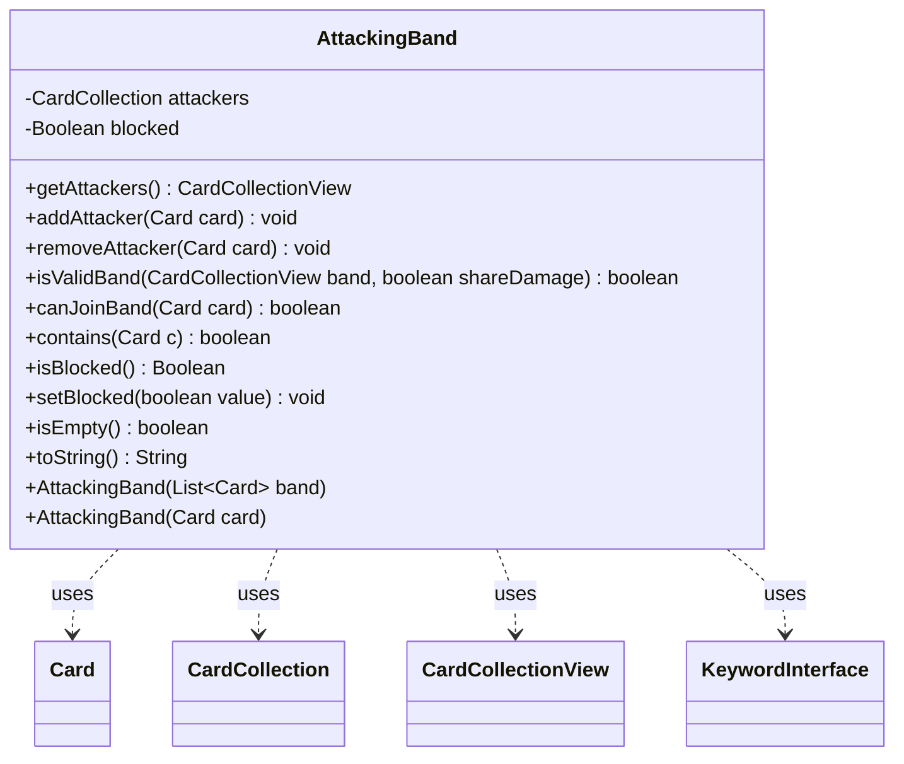

---
aliases:
  - AttackingBand
tags:
  - java/class
  - module/forge-game
  - pkg/forge/game/combat
fqn: forge.game.combat.AttackingBand
package: forge.game.combat
module: forge-game
kind: Class
---

# AttackingBand

**Package:** `forge.game.combat` &nbsp; **Module:** `forge-game` &nbsp; **Kind:** Class



## Relationships
**Uses:**
- [[forge.game.card.Card|Card]]
- [[forge.game.card.CardCollection|CardCollection]]
- [[forge.game.card.CardCollectionView|CardCollectionView]]
- [[forge.game.keyword.KeywordInterface|KeywordInterface]]

## Design Description

`AttackingBand` models a single band of attacking creatures within the combat subsystem, wrapping a `CardCollection` of attackers together with a tri-state `blocked` flag (null, true, or false) that deliberately persists once set so a band stays blocked even after its blockers are removed before damage. It exposes basic membership operations—adding, removing, and querying attackers—and renders its state symbolically via `toString()`.

Its central responsibility is enforcing the rules of the Banding keyword: the static `isValidBand` validates that a proposed group is legal, checking for sufficient `Keyword.BANDING` creatures (one suffices to share damage, all-but-one to form a band) and honoring "bands with other" restrictions by matching each card's `KeywordInterface` original text against the rest of the band. The instance helper `canJoinBand` reuses this logic to test prospective additions. The class collaborates closely with `Card`, `CardCollectionView`, and `CardLists`, keeping band-legality rules centralized rather than scattered across the combat flow.

## Source
`forge-game/src/main/java/forge/game/combat/AttackingBand.java`

```java
package forge.game.combat;

import forge.game.card.Card;
import forge.game.card.CardCollection;
import forge.game.card.CardCollectionView;
import forge.game.card.CardLists;
import forge.game.keyword.Keyword;
import forge.game.keyword.KeywordInterface;

import java.util.List;

public class AttackingBand {
    private CardCollection attackers = new CardCollection();
    private Boolean blocked = null; // even if all blockers were killed before FS or CD, band remains blocked

    public AttackingBand(final List<Card> band) {
        attackers.addAll(band);
    }

    public AttackingBand(final Card card) {
        attackers.add(card);
    }

    public CardCollectionView getAttackers() { return attackers; }

    public void addAttacker(Card card) { attackers.add(card); }
    public void removeAttacker(Card card) { attackers.remove(card); }

    public static boolean isValidBand(CardCollectionView band, boolean shareDamage) {
        if (band.isEmpty()) {
            // An empty band is not a valid band
            return false;
        }

        int bandingCreatures = CardLists.getKeyword(band, Keyword.BANDING).size();
        int neededBandingCreatures = shareDamage ? 1 : band.size() - 1;
        if (neededBandingCreatures <= bandingCreatures) {
            // For starting a band, only one can be non-Banding
            // For sharing damage, only one needs to be Banding
            return true;
        }

        for (Card c : CardLists.getKeyword(band, Keyword.BANDSWITH)) {
            for (KeywordInterface kw : c.getKeywords(Keyword.BANDSWITH)) {
                String o = kw.getOriginal();
                String m[] = o.split(":");

                if (CardLists.getValidCards(band, m[1], c.getController(), c, null).size() == band.size()) {
                    return true;
                }
            }
        }

        return false;
    }

    public boolean canJoinBand(Card card) {
        // Trying to join an existing band, attackers should be non-empty and card should exist
        CardCollection newBand = new CardCollection(attackers);
        if (card != null) {
            newBand.add(card);
        }

        return isValidBand(newBand, false);
    }

    public boolean contains(Card c) {
        return attackers.contains(c);
    }

    public Boolean isBlocked() { return blocked; }
    public void setBlocked(boolean value) { blocked = value; }

    /**
     * TODO: Write javadoc for this method.
     * @return
     */
    public boolean isEmpty() {
        // TODO Auto-generated method stub
        return attackers.isEmpty();
    }

    /* (non-Javadoc)
     * @see java.lang.Object#toString()
     */
    @Override
    public String toString() {
        return String.format("%s %s", attackers.toString(), blocked == null ? " ? " : blocked ? ">||" : ">>>" );
    }

}
```
