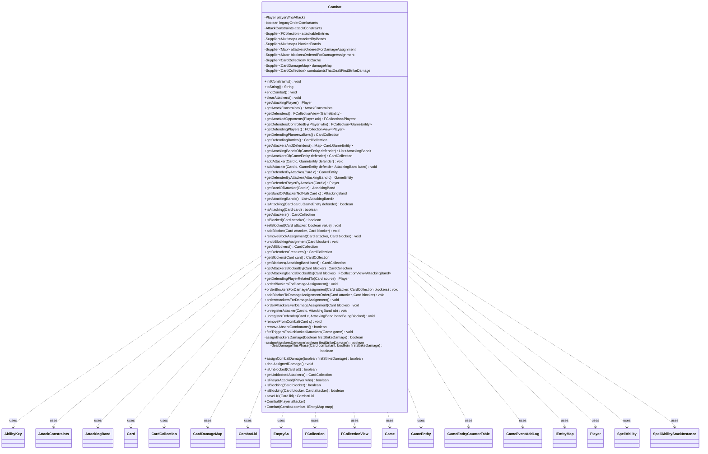

---
aliases:
  - Combat
tags:
  - java/class
  - module/forge-game
  - pkg/forge/game/combat
fqn: forge.game.combat.Combat
package: forge.game.combat
module: forge-game
kind: Class
---

# Combat

**Package:** `forge.game.combat`   **Module:** `forge-game`   **Kind:** Class



## Relationships
**Uses:**
- [[forge.game.Game|Game]]
- [[forge.game.GameEntity|GameEntity]]
- [[forge.game.GameEntityCounterTable|GameEntityCounterTable]]
- [[forge.game.IEntityMap|IEntityMap]]
- [[forge.game.ability.AbilityKey|AbilityKey]]
- [[forge.game.card.Card|Card]]
- [[forge.game.card.CardCollection|CardCollection]]
- [[forge.game.card.CardDamageMap|CardDamageMap]]
- [[forge.game.combat.AttackConstraints|AttackConstraints]]
- [[forge.game.combat.AttackingBand|AttackingBand]]
- [[forge.game.combat.CombatLki|CombatLki]]
- [[forge.game.event.GameEventAddLog|GameEventAddLog]]
- [[forge.game.player.Player|Player]]
- [[forge.game.spellability.SpellAbility|SpellAbility]]
- [[forge.game.spellability.SpellAbility.EmptySa|EmptySa]]
- [[forge.game.spellability.SpellAbilityStackInstance|SpellAbilityStackInstance]]
- [[forge.util.collect.FCollection|FCollection]]
- [[forge.util.collect.FCollectionView|FCollectionView]]

## Design Description

The Combat class models the complete combat phase of a Magic: the Gathering game for a single attacking player, serving as the authoritative record of which creatures attack which defenders (players, planeswalkers, or battles), how attackers are grouped into AttackingBands, and which blockers oppose them. It owns the full combat lifecycle—declaring attackers and blockers, ordering combatants for damage assignment, computing and applying first-strike and regular combat damage, and tearing down state at end of combat.

Notably, its mutable collections are wrapped in memoized Guava Suppliers for lazy, thread-safe initialization, and a copy constructor remaps every reference through an IEntityMap to support game-state cloning. It delegates constraint validation to AttackConstraints, preserves last-known-information via CombatLki and an lkiCache so removed combatants are still queryable, and collaborates with Card, Player, Game, and the trigger/replacement systems to enforce rules like banding, trample, double strike, and unblocked-attacker triggers.

## Source
`forge-game/src/main/java/forge/game/combat/Combat.java`

```java
/*
 * Forge: Play Magic: the Gathering.
 * Copyright (C) 2011  Forge Team
 *
 * This program is free software: you can redistribute it and/or modify
 * it under the terms of the GNU General Public License as published by
 * the Free Software Foundation, either version 3 of the License, or
 * (at your option) any later version.
 *
 * This program is distributed in the hope that it will be useful,
 * but WITHOUT ANY WARRANTY; without even the implied warranty of
 * MERCHANTABILITY or FITNESS FOR A PARTICULAR PURPOSE.  See the
 * GNU General Public License for more details.
 *
 * You should have received a copy of the GNU General Public License
 * along with this program.  If not, see <http://www.gnu.org/licenses/>.
 */
package forge.game.combat;

import com.google.common.base.Supplier;
import com.google.common.base.Suppliers;
import com.google.common.collect.ArrayListMultimap;
import com.google.common.collect.Lists;
import com.google.common.collect.Maps;
import com.google.common.collect.Multimap;
import com.google.common.collect.Multimaps;
import com.google.common.collect.Table;
import forge.game.*;
import forge.game.ability.AbilityKey;
import forge.game.event.GameEventAddLog;
import forge.game.ability.ApiType;
import forge.game.card.*;
import forge.game.keyword.Keyword;
import forge.game.player.Player;
import forge.game.player.PlayerActionConfirmMode;
import forge.game.replacement.ReplacementType;
import forge.game.spellability.SpellAbility;
import forge.game.spellability.SpellAbilityStackInstance;
import forge.game.staticability.StaticAbilityAssignCombatDamageAsUnblocked;
import forge.game.trigger.TriggerType;
import forge.game.zone.ZoneType;
import forge.util.IterableUtil;
import forge.util.Localizer;
import forge.util.collect.FCollection;
import forge.util.collect.FCollectionView;
import org.apache.commons.lang3.tuple.Pair;

import java.util.*;
import java.util.Map.Entry;

/**
 * <p>
 * Combat class.
 * </p>
 *
 * @author Forge
 * @version $Id$
 */
public class Combat {
    private final Player playerWhoAttacks;
    private boolean legacyOrderCombatants;
    private AttackConstraints attackConstraints;
    // Defenders, as they are attacked by hostile forces
    private final Supplier<FCollection<GameEntity>> attackableEntries = Suppliers.memoize(FCollection::new);
    // Keyed by attackable defender (player or planeswalker or battle)
    private final Supplier<Multimap<GameEntity, AttackingBand>> attackedByBands = Suppliers.memoize(() -> Multimaps.synchronizedMultimap(ArrayListMultimap.create()));
    private final Supplier<Multimap<AttackingBand, Card>> blockedBands = Suppliers.memoize(() -> Multimaps.synchronizedMultimap(ArrayListMultimap.create()));
    private final Supplier<Map<Card, CardCollection>> attackersOrderedForDamageAssignment = Suppliers.memoize(Maps::newHashMap);
    private final Supplier<Map<Card, CardCollection>> blockersOrderedForDamageAssignment = Suppliers.memoize(Maps::newHashMap);
    private final Supplier<CardCollection> lkiCache = Suppliers.memoize(CardCollection::new);
    private final Supplier<CardDamageMap> damageMap = Suppliers.memoize(CardDamageMap::new);

    // List holds creatures who have dealt 1st strike damage to disallow them deal damage on regular basis (unless they have double-strike KW)
    private final Supplier<CardCollection> combatantsThatDealtFirstStrikeDamage = Suppliers.memoize(CardCollection::new);

    public Combat(final Player attacker) {
        playerWhoAttacks = attacker;
        legacyOrderCombatants = playerWhoAttacks.getGame().getRules().hasOrderCombatants();
        initConstraints();
    }

    public Combat(Combat combat, IEntityMap map) {
        playerWhoAttacks = map.map(combat.playerWhoAttacks);
        for (GameEntity entry : combat.attackableEntries.get()) {
            attackableEntries.get().add(map.map(entry));
        }

        HashMap<AttackingBand, AttackingBand> bandsMap = new HashMap<>();
        for (Entry<GameEntity, AttackingBand> entry : combat.attackedByBands.get().entries()) {
            AttackingBand origBand = entry.getValue();
            ArrayList<Card> attackers = new ArrayList<>();
            for (Card c : origBand.getAttackers()) {
                attackers.add(map.map(c));
            }
            AttackingBand newBand = new AttackingBand(attackers);
            Boolean blocked = entry.getValue().isBlocked();
            if (blocked != null) {
                newBand.setBlocked(blocked);
            }
            bandsMap.put(origBand, newBand);
            attackedByBands.get().put(map.map(entry.getKey()), newBand);
        }
        for (Entry<AttackingBand, Card> entry : combat.blockedBands.get().entries()) {
            blockedBands.get().put(bandsMap.get(entry.getKey()), map.map(entry.getValue()));
        }

        for (Entry<Card, CardCollection> entry : combat.attackersOrderedForDamageAssignment.get().entrySet()) {
            attackersOrderedForDamageAssignment.get().put(map.map(entry.getKey()), map.mapCollection(entry.getValue()));
        }
        for (Entry<Card, CardCollection> entry : combat.blockersOrderedForDamageAssignment.get().entrySet()) {
            blockersOrderedForDamageAssignment.get().put(map.map(entry.getKey()), map.mapCollection(entry.getValue()));
        }
        // Note: Doesn't currently set up lkiCache, since it's just a cache and not strictly needed...
        for (Table.Cell<Card, GameEntity, Integer> entry : combat.damageMap.get().cellSet()) {
            damageMap.get().put(map.map(entry.getRowKey()), map.map(entry.getColumnKey()), entry.getValue());
        }

        attackConstraints = new AttackConstraints(this);
    }

    public void initConstraints() {
        attackableEntries.get().clear();
        // Create keys for all possible attack targets
        attackableEntries.get().addAll(CombatUtil.getAllPossibleDefenders(playerWhoAttacks));
        attackConstraints = new AttackConstraints(this);
    }

    @Override
    public String toString() {
        StringBuilder sb = new StringBuilder();
        for (GameEntity defender : attackableEntries.get()) {
            CardCollection attackers = getAttackersOf(defender);
            if (attackers.isEmpty()) {
                continue;
            }
            sb.append(defender);
            sb.append(" is being attacked by:\n");
            for (Card attacker : attackers) {
                sb.append("  ").append(attacker).append("\n");
                for (Card blocker : getBlockers(attacker)) {
                    sb.append("  ... blocked by: ").append(blocker).append("\n");
                }
            }
        }
        if (sb.length() == 0) {
            return "<no attacks>";
        }
        return sb.toString();
    }

    public void endCombat() {
        //backup attackers and blockers
        CardCollection attackers = getAttackers();
        CardCollection blockers = getAllBlockers();

        //clear all combat-related collections
        attackableEntries.get().clear();
        attackedByBands.get().clear();
        blockedBands.get().clear();
        attackersOrderedForDamageAssignment.get().clear();
        blockersOrderedForDamageAssignment.get().clear();
        lkiCache.get().clear();
        combatantsThatDealtFirstStrikeDamage.get().clear();

        //clear tracking for cards that care about "this combat"
        Game game = playerWhoAttacks.getGame();
        for (Card c : game.getCardsIncludePhasingIn(ZoneType.Battlefield)) {
            c.getDamageHistory().endCombat();
        }
        playerWhoAttacks.clearAttackedPlayersMyCombat();

        //update view for all attackers and blockers
        for (Card c : attackers) {
            c.updateAttackingForView();
        }
        for (Card c : blockers) {
            c.updateBlockingForView();
        }
    }

    public final void clearAttackers() {
        for (final Card attacker : getAttackers()) {
            removeFromCombat(attacker);
        }
    }

    public final Player getAttackingPlayer() {
        return playerWhoAttacks;
    }

    public final AttackConstraints getAttackConstraints() {
        return attackConstraints;
    }
    public final FCollectionView<GameEntity> getDefenders() {
        return attackableEntries.get();
    }

    //gets attacked player opponents (ignores planeswalkers)
    public final FCollection<Player> getAttackedOpponents(Player atk) {
        FCollection<Player> attackedOpps = new FCollection<>();
        if (atk == playerWhoAttacks) {
            for (Player defender : getDefendingPlayers()) {
                if (!getAttackersOf(defender).isEmpty()) {
                    attackedOpps.add(defender);
                }
            }
        }
        return attackedOpps;
    }

    public final FCollection<GameEntity> getDefendersControlledBy(Player who) {
        FCollection<GameEntity> res = new FCollection<>();
        for (GameEntity ge : attackableEntries.get()) {
            // if defender is the player himself or his cards
            if (ge == who || ge instanceof Card && ((Card) ge).getController() == who) {
                res.add(ge);
            }
        }
        return res;
    }

    public final FCollectionView<Player> getDefendingPlayers() {
        return new FCollection<>(IterableUtil.filter(attackableEntries.get(), Player.class));
    }

    public final CardCollection getDefendingPlaneswalkers() {
        return CardLists.filter(IterableUtil.filter(attackableEntries.get(), Card.class), CardPredicates.PLANESWALKERS);
    }

    public final CardCollection getDefendingBattles() {
        return CardLists.filter(IterableUtil.filter(attackableEntries.get(), Card.class), CardPredicates.BATTLES);
    }

    public final Map<Card, GameEntity> getAttackersAndDefenders() {
        return Maps.asMap(getAttackers().asSet(), this::getDefenderByAttacker);
    }

    public final List<AttackingBand> getAttackingBandsOf(GameEntity defender) {
        return Lists.newArrayList(attackedByBands.get().get(defender));
    }

    public final CardCollection getAttackersOf(GameEntity defender) {
        CardCollection result = new CardCollection();
        if (!attackedByBands.get().containsKey(defender))
            return result;
        for (AttackingBand v : attackedByBands.get().get(defender)) {
            result.addAll(v.getAttackers());
        }
        return result;
    }

    public final void addAttacker(final Card c, GameEntity defender) {
        addAttacker(c, defender, null);
    }
    public final void addAttacker(final Card c, GameEntity defender, AttackingBand band) {
        Collection<AttackingBand> attackersOfDefender = attackedByBands.get().get(defender);
        if (attackersOfDefender == null) {
            System.out.println("Trying to add Attacker " + c + " to missing defender " + defender);
            return;
        }

        // This is trying to fix the issue of an attacker existing in two bands at once
        AttackingBand existingBand = getBandOfAttacker(c);
        if (existingBand != null) {
            existingBand.removeAttacker(c);
        }

        if (band == null || !attackersOfDefender.contains(band)) {
            band = new AttackingBand(c);
            attackersOfDefender.add(band);
        } else {
            band.addAttacker(c);
        }
        c.updateAttackingForView();
    }

    public final GameEntity getDefenderByAttacker(final Card c) {
        return getDefenderByAttacker(getBandOfAttacker(c));
    }
    public final GameEntity getDefenderByAttacker(final AttackingBand c) {
        for (Entry<GameEntity, AttackingBand> e : attackedByBands.get().entries()) {
            if (e.getValue() == c) {
                return e.getKey();
            }
        }
        return null;
    }

    public final Player getDefenderPlayerByAttacker(final Card c) {
        GameEntity defender = getDefenderByAttacker(c);

        if (defender instanceof Player def) {
            return def;
        }

        // maybe attack on a controlled planeswalker?
        if (defender instanceof Card def) {
            if (def.isBattle()) {
                return def.getProtectingPlayer();
            } else {
                return def.getController();
            }
        }

        return null;
    }

    // takes LKI into consideration, should use it at all times (though a single iteration over multimap seems faster)
    public final AttackingBand getBandOfAttacker(final Card c) {
        if (c == null) {
            return null;
        }
        for (AttackingBand ab : attackedByBands.get().values()) {
            if (ab.contains(c)) {
                return ab;
            }
        }
        CombatLki lki = lkiCache.get().get(c).getCombatLKI();
        return lki == null || !lki.isAttacker ? null : lki.getFirstBand();
    }

    public final AttackingBand getBandOfAttackerNotNull(final Card c) {
        AttackingBand band = getBandOfAttacker(c);
        if (band == null) {
            throw new NullPointerException("No band for attacker " + c);
        }
        return band;
    }

    public final List<AttackingBand> getAttackingBands() {
        return Lists.newArrayList(attackedByBands.get().values());
    }

    public boolean isAttacking(Card card, GameEntity defender) {
        AttackingBand ab = getBandOfAttacker(card);
        for (Entry<GameEntity, AttackingBand> ee : attackedByBands.get().entries()) {
            if (ee.getValue() == ab) {
                return ee.getKey() == defender;
            }
        }
        return false;
    }

    /**
     * Checks if a card is currently attacking, returns false if the card is not currently attacking, even if its LKI was.
     */
    public final boolean isAttacking(Card card) {
        for (AttackingBand ab : attackedByBands.get().values()) {
            if (ab.contains(card)) {
                return true;
            }
        }
        return false;
    }

    public final CardCollection getAttackers() {
        CardCollection result = new CardCollection();
        for (AttackingBand ab : attackedByBands.get().values()) {
            result.addAll(ab.getAttackers());
        }
        return result;
    }

    public final boolean isBlocked(final Card attacker) {
        AttackingBand band = getBandOfAttacker(attacker);
        return band != null && Boolean.TRUE.equals(band.isBlocked());
    }

    // Some cards in Alpha may UNBLOCK an attacker, so second parameter is not always-true
    public final void setBlocked(final Card attacker, boolean value) {
        getBandOfAttackerNotNull(attacker).setBlocked(value); // called by Curtain of Light, Dazzling Beauty, Trap Runner
    }

    public final void addBlocker(final Card attacker, final Card blocker) {
        final AttackingBand band = getBandOfAttackerNotNull(attacker);
        blockedBands.get().put(band, blocker);
        // If damage is already assigned, add this blocker as a "late entry"
        if (blockersOrderedForDamageAssignment.get().containsKey(attacker)) {
            addBlockerToDamageAssignmentOrder(attacker, blocker);
        }
        blocker.updateBlockingForView();
    }

    // remove blocker from specific attacker
    public final void removeBlockAssignment(final Card attacker, final Card blocker) {
        AttackingBand band = getBandOfAttackerNotNull(attacker);
        Collection<Card> cc = blockedBands.get().get(band);
        if (cc != null) {
            cc.remove(blocker);
        }
        blocker.updateBlockingForView();
    }

    // remove blocker from everywhere
    public final void undoBlockingAssignment(final Card blocker) {
        CardCollection toRemove = new CardCollection(blocker);
        blockedBands.get().values().removeAll(toRemove);
        blocker.updateBlockingForView();
    }

    public final CardCollection getAllBlockers() {
        CardCollection result = new CardCollection();
        for (Card blocker : blockedBands.get().values()) {
            if (!result.contains(blocker)) {
                result.add(blocker);
            }
        }
        return result;
    }

    public final CardCollection getDefendersCreatures() {
        CardCollection result = new CardCollection();
        for (Card attacker : getAttackers()) {
            Player defender = getDefenderPlayerByAttacker(attacker);
            if (defender != null) {
                CardCollection cc = defender.getCreaturesInPlay();
                result.addAll(cc);
            }
        }
        return result;
    }

    public final CardCollection getBlockers(final Card card) {
        // If requesting the ordered blocking list pass true, directly.
        return getBlockers(getBandOfAttacker(card));
    }
    public final CardCollection getBlockers(final AttackingBand band) {
        Collection<Card> blockers = blockedBands.get().get(band);
        return blockers == null ? new CardCollection() : new CardCollection(blockers);
    }

    public final CardCollection getAttackersBlockedBy(final Card blocker) {
        CardCollection blocked =  new CardCollection();
        for (Entry<AttackingBand, Card> s : blockedBands.get().entries()) {
            if (s.getValue().equals(blocker)) {
                blocked.addAll(s.getKey().getAttackers());
            }
        }
        return blocked;
    }

    public final FCollectionView<AttackingBand> getAttackingBandsBlockedBy(Card blocker) {
        FCollection<AttackingBand> bands = new FCollection<>();
        for (Entry<AttackingBand, Card> kv : blockedBands.get().entries()) {
            if (kv.getValue().equals(blocker)) {
                bands.add(kv.getKey());
            }
        }
        return bands;
    }

    public Player getDefendingPlayerRelatedTo(final Card source) {
        Card attacker = source;
        if (source.isAura() || source.isFortification()) {
            attacker = source.getEnchantingCard();
        }
        else if (source.isEquipment()) {
            attacker = source.getEquipping();
        }

        // return the corresponding defender
        return getDefenderPlayerByAttacker(attacker);
    }

    /** If there are multiple blockers, the Attacker declares the Assignment Order */
    public void orderBlockersForDamageAssignment() { // this method performs controller's role
        List<Pair<Card, CardCollection>> blockersNeedManualOrdering = new ArrayList<>();
        for (AttackingBand band : attackedByBands.get().values()) {
            if (band.isEmpty()) continue;

            Collection<Card> blockers = blockedBands.get().get(band);
            if (blockers == null || blockers.isEmpty()) {
                continue;
            }

            for (Card attacker : band.getAttackers()) {
                if (blockers.size() <= 1) {
                    orderBlockersForDamageAssignment(attacker, new CardCollection(blockers));
                }
                else { // process it a bit later
                    blockersNeedManualOrdering.add(Pair.of(attacker, new CardCollection(blockers))); // we know there's a list
                }
            }
        }

        // brought this out of iteration on bands to avoid concurrency problems
        for (Pair<Card, CardCollection> pair : blockersNeedManualOrdering) {
            orderBlockersForDamageAssignment(pair.getLeft(), pair.getRight());
        }
    }

    /** If there are multiple blockers, the Attacker declares the Assignment Order */
    public void orderBlockersForDamageAssignment(Card attacker, CardCollection blockers) { // this method performs controller's role
        if (blockers.size() <= 1 || !this.legacyOrderCombatants) {
            blockersOrderedForDamageAssignment.get().put(attacker, new CardCollection(blockers));
            return;
        }

        // Damage Ordering needs to take cards like Melee into account, is that happening?
        CardCollection orderedBlockers = playerWhoAttacks.getController().orderBlockers(attacker, blockers); // we know there's a list
        blockersOrderedForDamageAssignment.get().put(attacker, orderedBlockers);

        // Display the chosen order of blockers in the log
        // TODO: this is best done via a combat panel update
        StringBuilder sb = new StringBuilder();
        sb.append(playerWhoAttacks.getName());
        sb.append(" has ordered blockers for ");
        sb.append(attacker);
        sb.append(": ");
        for (int i = 0; i < orderedBlockers.size(); i++) {
            sb.append(orderedBlockers.get(i));
            if (i != orderedBlockers.size() - 1) {
                sb.append(", ");
            }
        }
        playerWhoAttacks.getGame().fireEvent(new GameEventAddLog(GameLogEntryType.COMBAT, sb.toString()));
    }

    /**
     * Add a blocker to the damage assignment order of an attacker. The
     * relative order of creatures already blocking the attacker may not be
     * changed. Performs controller's role.
     *
     * @param attacker the attacking creature.
     * @param blocker the blocking creature.
     */
    public void addBlockerToDamageAssignmentOrder(Card attacker, Card blocker) {
        final CardCollection oldBlockers = blockersOrderedForDamageAssignment.get().get(attacker);
        if (oldBlockers == null || oldBlockers.isEmpty()) {
            blockersOrderedForDamageAssignment.get().put(attacker, new CardCollection(blocker));
        } else if (this.legacyOrderCombatants) {
            CardCollection orderedBlockers = playerWhoAttacks.getController().orderBlocker(attacker, blocker, oldBlockers);
            blockersOrderedForDamageAssignment.get().put(attacker, orderedBlockers);
        } else {
            oldBlockers.add(blocker);
            blockersOrderedForDamageAssignment.get().put(attacker, oldBlockers);
        }
    }

    public void orderAttackersForDamageAssignment() { // this method performs controller's role
        // If there are multiple blockers, the Attacker declares the Assignment Order
        for (final Card blocker : getAllBlockers()) {
            orderAttackersForDamageAssignment(blocker);
        }
    }

    public void orderAttackersForDamageAssignment(Card blocker) { // this method performs controller's role
        CardCollection attackers = getAttackersBlockedBy(blocker);
        // They need a reverse map here: Blocker => List<Attacker>

        Player blockerCtrl = blocker.getController();
        CardCollection orderedAttacker = attackers.size() <= 1 || !this.legacyOrderCombatants ? attackers : blockerCtrl.getController().orderAttackers(blocker, attackers);

        // Damage Ordering needs to take cards like Melee into account, is that happening?
        attackersOrderedForDamageAssignment.get().put(blocker, orderedAttacker);
    }

    // removes references to this attacker from all indices and orders
    public void unregisterAttacker(final Card c, AttackingBand ab) {
        blockersOrderedForDamageAssignment.get().remove(c);

        Collection<Card> blockers = blockedBands.get().get(ab);
        if (blockers != null) {
            for (Card b : blockers) {
                // Clear removed attacker from assignment order
                if (attackersOrderedForDamageAssignment.get().containsKey(b)) {
                    attackersOrderedForDamageAssignment.get().get(b).remove(c);
                }
            }
        }

        // restore the original defender in case it was changed before the creature was
        // removed from combat but before the trigger resolved (e.g. Ulamog, the Ceaseless
        // Hunger + Portal Mage + Unsummon)
        Game game = c.getGame();
        for (SpellAbilityStackInstance si : game.getStack()) {
            if (si.isTrigger() && c.equals(si.getSourceCard())) {
                GameEntity origDefender = (GameEntity)si.getTriggeringObject(AbilityKey.OriginalDefender);
                if (origDefender != null) {
                    si.updateTriggeringObject(AbilityKey.Defender, origDefender);
                    if (origDefender instanceof Player) {
                        si.updateTriggeringObject(AbilityKey.DefendingPlayer, origDefender);
                    } else if (origDefender instanceof Card) {
                        si.updateTriggeringObject(AbilityKey.DefendingPlayer, ((Card)origDefender).getController());
                    }
                }
            }
        }
    }

    // removes references to this defender from all indices and orders
    public void unregisterDefender(final Card c, AttackingBand bandBeingBlocked) {
        attackersOrderedForDamageAssignment.get().remove(c);
        for (Card atk : bandBeingBlocked.getAttackers()) {
            if (blockersOrderedForDamageAssignment.get().containsKey(atk)) {
                blockersOrderedForDamageAssignment.get().get(atk).remove(c);
            }
        }
    }

    // remove a combatant whose side is unknown
    public final void removeFromCombat(final Card c) {
        AttackingBand ab = getBandOfAttacker(c);
        if (ab != null) {
            unregisterAttacker(c, ab);
            ab.removeAttacker(c);
            c.updateAttackingForView();
            return;
        }

        // if not found in attackers, look for this card in blockers
        for (Entry<AttackingBand, Card> be : blockedBands.get().entries()) {
            if (be.getValue().equals(c)) {
                unregisterDefender(c, be.getKey());
            }
        }

        for (Card battleOrPW : IterableUtil.filter(attackableEntries.get(), Card.class)) {
            if (battleOrPW.equals(c)) {
                Multimap<GameEntity, AttackingBand> attackerBuffer = ArrayListMultimap.create();
                Collection<AttackingBand> bands = attackedByBands.get().get(c);
                for (AttackingBand abDef : bands) {
                    unregisterDefender(c, abDef);
                    // Rule 506.4c workaround to keep creatures in combat
                    Card fake = new Card(-1, c.getGame());
                    fake.setName("<Nothing>");
                    fake.setController(c.getController(), 0);
                    attackerBuffer.put(fake, abDef);
                }
                bands.clear();
                attackedByBands.get().putAll(attackerBuffer);
                break;
            }
        }

        // remove card from map
        while (blockedBands.get().values().remove(c));
        c.updateBlockingForView();
    }

    public final boolean removeAbsentCombatants() {
        // CR 506.4 iterate all attackers and remove illegal declarations
        CardCollection missingCombatants = new CardCollection();
        for (Entry<GameEntity, AttackingBand> ee : attackedByBands.get().entries()) {
            for (Card c : ee.getValue().getAttackers()) {
                if (!c.isInPlay() || !c.isCreature()) {
                    missingCombatants.add(c);
                }
            }
            if (ee.getKey() instanceof Card c) {
                if (!c.isBattle() && !c.isPlaneswalker()) {
                    missingCombatants.add(c);
                }
            }
        }

        for (Entry<AttackingBand, Card> be : blockedBands.get().entries()) {
            Card blocker = be.getValue();
            if (!blocker.isInPlay() || !blocker.isCreature()) {
                missingCombatants.add(blocker);
            }
        }

        if (missingCombatants.isEmpty()) { return false; }

        for (Card c : missingCombatants) {
            removeFromCombat(c);
        }
        return true;
    }

    // Call this method right after turn-based action of declare blockers has been performed
    public final void fireTriggersForUnblockedAttackers(final Game game) {
        boolean bFlag = false;
        List<GameEntity> defenders = Lists.newArrayList();
        for (AttackingBand ab : attackedByBands.get().values()) {
            Collection<Card> blockers = blockedBands.get().get(ab);
            boolean isBlocked = blockers != null && !blockers.isEmpty();
            ab.setBlocked(isBlocked);

            if (!isBlocked) {
                bFlag = true;
                defenders.add(getDefenderByAttacker(ab));
                for (Card attacker : ab.getAttackers()) {
                    // Run Unblocked Trigger
                    final Map<AbilityKey, Object> runParams = AbilityKey.newMap();
                    runParams.put(AbilityKey.Attacker, attacker);
                    runParams.put(AbilityKey.Defender, getDefenderByAttacker(attacker));
                    runParams.put(AbilityKey.DefendingPlayer, getDefenderPlayerByAttacker(attacker));
                    game.getTriggerHandler().runTrigger(TriggerType.AttackerUnblocked, runParams, false);
                }
            }
        }
        if (bFlag) {
            // triggers for Coveted Jewel
            // currently there is only one attacking player
            // should be updated when two-headed-giant is done
            final Map<AbilityKey, Object> runParams = AbilityKey.newMap();
            runParams.put(AbilityKey.AttackingPlayer, getAttackingPlayer());
            runParams.put(AbilityKey.Defenders, defenders);
            game.getTriggerHandler().runTrigger(TriggerType.AttackerUnblockedOnce, runParams, false);
        }
    }

    private boolean assignBlockersDamage(boolean firstStrikeDamage) {
        // Assign damage by Blockers
        final CardCollection blockers = getAllBlockers();
        boolean assignedDamage = false;

        for (final Card blocker : blockers) {
            if (!dealDamageThisPhase(blocker, firstStrikeDamage)) {
                continue;
            }

            if (firstStrikeDamage) {
                combatantsThatDealtFirstStrikeDamage.get().add(blocker);
            }

            // Run replacement effects
            blocker.getGame().getReplacementHandler().run(ReplacementType.AssignDealDamage, AbilityKey.mapFromAffected(blocker));

            CardCollection attackers = attackersOrderedForDamageAssignment.get().get(blocker);

            final int damage = blocker.getNetCombatDamage();

            if (attackers != null && !attackers.isEmpty()) {
                Player attackingPlayer = getAttackingPlayer();
                Player assigningPlayer = blocker.getController();

                Player defender = null;
                boolean divideCombatDamageAsChoose = blocker.hasKeyword("You may assign CARDNAME's combat damage divided as you choose among " +
                        "defending player and/or any number of creatures they control.")
                        && blocker.getController().getController().confirmStaticApplication(blocker, PlayerActionConfirmMode.AlternativeDamageAssignment,
                        Localizer.getInstance().getMessage("lblAssignCombatDamageAsChoose",
                                blocker.getTranslatedName()), null);
                // choose defending player
                if (divideCombatDamageAsChoose) {
                    defender = blocker.getController().getController().chooseSingleEntityForEffect(attackingPlayer.getOpponents(), null, Localizer.getInstance().getMessage("lblChoosePlayer"), null);
                    attackers = defender.getCreaturesInPlay();
                }

                if (AttackingBand.isValidBand(attackers, true))
                    assigningPlayer = attackingPlayer;

                assignedDamage = true;
                Map<Card, Integer> map = assigningPlayer.getController().assignCombatDamage(blocker, attackers, null, damage, defender, divideCombatDamageAsChoose || assigningPlayer != blocker.getController() || !this.legacyOrderCombatants);
                for (Entry<Card, Integer> dt : map.entrySet()) {
                    // Butcher Orgg
                    if (dt.getKey() == null && dt.getValue() > 0) {
                        damageMap.get().put(blocker, defender, dt.getValue());
                    } else {
                        dt.getKey().addAssignedDamage(dt.getValue(), blocker);
                        damageMap.get().put(blocker, dt.getKey(), dt.getValue());
                    }
                }
            }
        }
        return assignedDamage;
    }

    private boolean assignAttackersDamage(boolean firstStrikeDamage) {
        // Assign damage by Attackers
        CardCollection orderedBlockers = null;
        final CardCollection attackers = getAttackers();
        boolean assignedDamage = false;
        while (!attackers.isEmpty()) {
            final Card attacker = attackers.getFirst();
            if (!dealDamageThisPhase(attacker, firstStrikeDamage)) {
                attackers.remove(attacker);
                continue;
            }

            if (firstStrikeDamage) {
                combatantsThatDealtFirstStrikeDamage.get().add(attacker);
            }

            // Run replacement effects
            attacker.getGame().getReplacementHandler().run(ReplacementType.AssignDealDamage, AbilityKey.mapFromAffected(attacker));

            // If potential damage is 0, continue along
            final int damageDealt = attacker.getNetCombatDamage();
            if (damageDealt <= 0) {
                attackers.remove(attacker);
                continue;
            }

            AttackingBand band = getBandOfAttacker(attacker);
            if (band == null) {
                attackers.remove(attacker);
                continue;
            }

            GameEntity defender = getDefenderByAttacker(band);
            Player assigningPlayer = getAttackingPlayer();
            orderedBlockers = blockersOrderedForDamageAssignment.get().get(attacker);
            // Defensive Formation is very similar to Banding with Blockers
            // It allows the defending player to assign damage instead of the attacking player
            if (defender instanceof Player && defender.hasKeyword("You assign combat damage of each creature attacking you.")) {
                assigningPlayer = (Player)defender;
            }
            else if (orderedBlockers != null && AttackingBand.isValidBand(orderedBlockers, true)) {
                assigningPlayer = orderedBlockers.get(0).getController();
            }

            boolean assignToPlayer = false;
            if (StaticAbilityAssignCombatDamageAsUnblocked.assignCombatDamageAsUnblocked(attacker, false)) {
                assignToPlayer = true;
            }
            if (!assignToPlayer && attacker.getGame().getCombat().isBlocked(attacker)
                    && StaticAbilityAssignCombatDamageAsUnblocked.assignCombatDamageAsUnblocked(attacker)) {
                assignToPlayer = assigningPlayer.getController().confirmStaticApplication(attacker, PlayerActionConfirmMode.AlternativeDamageAssignment,
                        Localizer.getInstance().getMessage("lblAssignCombatDamageWerentBlocked",
                                attacker.getTranslatedName()), null);
            }

            boolean divideCombatDamageAsChoose = false;
            boolean assignCombatDamageToCreature = false;
            boolean trampler = attacker.hasKeyword(Keyword.TRAMPLE);
            if (!assignToPlayer) {
                divideCombatDamageAsChoose = getDefendersCreatures().size() > 0 &&
                        attacker.hasKeyword("You may assign CARDNAME's combat damage divided as you choose among " +
                                "defending player and/or any number of creatures they control.")
                        && assigningPlayer.getController().confirmStaticApplication(attacker, PlayerActionConfirmMode.AlternativeDamageAssignment,
                        Localizer.getInstance().getMessage("lblAssignCombatDamageAsChoose",
                                attacker.getTranslatedName()), null);
                if (defender instanceof Card && divideCombatDamageAsChoose) {
                    defender = getDefenderPlayerByAttacker(attacker);
                }

                assignCombatDamageToCreature = !attacker.getGame().getCombat().isBlocked(attacker) && getDefendersCreatures().size() > 0 &&
                        attacker.hasKeyword("If CARDNAME is unblocked, you may have it assign its combat damage to a creature defending player controls.") &&
                        assigningPlayer.getController().confirmStaticApplication(attacker, PlayerActionConfirmMode.AlternativeDamageAssignment,
                                Localizer.getInstance().getMessage("lblAssignCombatDamageToCreature", attacker.getTranslatedName()), null);
                if (divideCombatDamageAsChoose) {
                    if (orderedBlockers == null || orderedBlockers.isEmpty()) {
                        orderedBlockers = getDefendersCreatures();
                    } else {
                        for (Card c : getDefendersCreatures()) {
                            if (!orderedBlockers.contains(c)) {
                                orderedBlockers.add(c);
                            }
                        }
                    }
                }
            }

            assignedDamage = true;
            // If the Attacker is unblocked, or it's a trampler and has 0 blockers, deal damage to defender
            if (defender instanceof Card && !((Card) defender).isBattle() && attacker.hasKeyword("Trample:Planeswalker")) {
                if (orderedBlockers == null || orderedBlockers.isEmpty()) {
                    orderedBlockers = new CardCollection((Card) defender);
                } else {
                    orderedBlockers.add((Card) defender);
                }
                defender = getDefenderPlayerByAttacker(attacker);
            }
            if (assignToPlayer) {
                attackers.remove(attacker);
                damageMap.get().put(attacker, defender, damageDealt);
            }
            else if (orderedBlockers == null || orderedBlockers.isEmpty()) {
                attackers.remove(attacker);
                if (assignCombatDamageToCreature) {
                    final SpellAbility emptySA = new SpellAbility.EmptySa(ApiType.Cleanup, attacker);
                    Card chosen = attacker.getController().getController().chooseCardsForEffect(getDefendersCreatures(),
                            emptySA, Localizer.getInstance().getMessage("lblChooseCreature"), 1, 1, false, null).get(0);
                    damageMap.get().put(attacker, chosen, damageDealt);
                } else if (trampler || !band.isBlocked()) { // this is called after declare blockers, no worries 'bout nulls in isBlocked
                    if (defender == null) {
                        defender = getDefenderPlayerByAttacker(attacker);
                        System.err.println("[COMBAT] defender is null, getDefenderPlayerByAttacker(attacker) result: " + defender);
                    }
                    // this will fail if defender is null, and it doesn't allow null values..
                    damageMap.get().put(attacker, defender, damageDealt);
                } // No damage happens if blocked but no blockers left
            } else {
                Map<Card, Integer> map = assigningPlayer.getController().assignCombatDamage(attacker, orderedBlockers, attackers,
                        damageDealt, defender, divideCombatDamageAsChoose || getAttackingPlayer() != assigningPlayer || !this.legacyOrderCombatants);

                attackers.remove(attacker);
                // player wants to assign another first
                if (map == null) {
                    // add to end
                    attackers.add(attacker);
                    continue;
                }

                for (Entry<Card, Integer> dt : map.entrySet()) {
                    if (dt.getKey() == null) {
                        if (dt.getValue() > 0) {
                            if (defender instanceof Card) {
                                ((Card) defender).addAssignedDamage(dt.getValue(), attacker);
                            }
                            damageMap.get().put(attacker, defender, dt.getValue());
                        }
                    } else {
                        dt.getKey().addAssignedDamage(dt.getValue(), attacker);
                        damageMap.get().put(attacker, dt.getKey(), dt.getValue());
                    }
                }
            } // if !hasFirstStrike ...
        } // for
        return assignedDamage;
    }

    private boolean dealDamageThisPhase(Card combatant, boolean firstStrikeDamage) {
        // During first strike damage, double strike and first strike deal damage
        // During regular strike damage, double strike and anyone who hasn't dealt damage deal damage
        if (combatant.hasDoubleStrike()) {
            return true;
        }
        if (firstStrikeDamage && combatant.hasFirstStrike()) {
            return true;
        }
        return !firstStrikeDamage && !combatantsThatDealtFirstStrikeDamage.get().contains(combatant);
    }

    public final boolean assignCombatDamage(boolean firstStrikeDamage) {
        boolean assignedDamage = assignAttackersDamage(firstStrikeDamage);
        assignedDamage |= assignBlockersDamage(firstStrikeDamage);
        if (!firstStrikeDamage) {
            // Clear first strike damage list since it doesn't matter anymore
            combatantsThatDealtFirstStrikeDamage.get().clear();
        }
        return assignedDamage;
    }

    public void dealAssignedDamage() {
        final Game game = playerWhoAttacks.getGame();
        game.copyLastState();

        CardDamageMap preventMap = new CardDamageMap();
        GameEntityCounterTable counterTable = new GameEntityCounterTable();

        game.getAction().dealDamage(true, damageMap.get(), preventMap, counterTable, null);

        // copy last state again for dying replacement effects
        game.copyLastState();
    }

    public final boolean isUnblocked(final Card att) {
        AttackingBand band = getBandOfAttacker(att);
        return band != null && Boolean.FALSE.equals(band.isBlocked());
    }

    public final CardCollection getUnblockedAttackers() {
        CardCollection unblocked = new CardCollection();
        for (AttackingBand ab : attackedByBands.get().values()) {
            if (Boolean.FALSE.equals(ab.isBlocked())) {
                unblocked.addAll(ab.getAttackers());
            }
        }
        return unblocked;
    }

    public boolean isPlayerAttacked(Player who) {
        for (GameEntity defender : attackedByBands.get().keySet()) {
            Card defenderAsCard = defender instanceof Card ? (Card)defender : null;
            if ((null != defenderAsCard && (defenderAsCard.getController() != who && defenderAsCard.getProtectingPlayer() != who)) ||
                    (null == defenderAsCard && defender != who)) {
                continue; // defender is not related to player 'who'
            }
            for (AttackingBand ab : attackedByBands.get().get(defender)) {
                if (!ab.isEmpty()) {
                    return true;
                }
            }
        }
        return false;
    }

    public boolean isBlocking(Card blocker) {
        if (blockedBands.get().containsValue(blocker)) {
            return true; // is blocking something at the moment
        }

        if (!blocker.isLKI()) {
            return false;
        }

        CombatLki lki = lkiCache.get().get(blocker).getCombatLKI();
        return null != lki && !lki.isAttacker; // was blocking something anyway
    }

    public boolean isBlocking(Card blocker, Card attacker) {
        AttackingBand ab = getBandOfAttacker(attacker);
        Collection<Card> blockers = blockedBands.get().get(ab);
        if (blockers != null && blockers.contains(blocker)) {
            return true; // is blocking the attacker's band at the moment
        }

        if (!blocker.isLKI()) {
            return false;
        }

        CombatLki lki = lkiCache.get().get(blocker).getCombatLKI();
        return null != lki && !lki.isAttacker && lki.relatedBands.contains(ab); // was blocking that very band
    }

    public CombatLki saveLKI(Card lki) {
        if (!lki.isLKI()) {
            lki = CardCopyService.getLKICopy(lki);
        }
        FCollectionView<AttackingBand> attackersBlocked = null;
        final AttackingBand attackingBand = getBandOfAttacker(lki);
        final boolean isAttacker = attackingBand != null;
        if (isAttacker) {
            boolean found = false;
            for (AttackingBand ab : attackedByBands.get().values()) {
                if (ab.contains(lki)) {
                    found = true;
                    break;
                }
            }
            if (!found) {
                return null;
            }
        } else {
            attackersBlocked = getAttackingBandsBlockedBy(lki);
            if (attackersBlocked.isEmpty()) {
                return null; // card was not even in combat
            }
        }
        lkiCache.get().add(lki);
        final FCollectionView<AttackingBand> relatedBands = isAttacker ? new FCollection<>(attackingBand) : attackersBlocked;
        return new CombatLki(isAttacker, relatedBands);
    }
}
```

## Python
`forge/game/combat/Combat.py`

````python
forge/game/combat/Combat.py

```python
import sys

from forge.game.Game import Game
from forge.game.GameEntity import GameEntity
from forge.game.GameEntityCounterTable import GameEntityCounterTable
from forge.game.GameLogEntryType import GameLogEntryType
from forge.game.IEntityMap import IEntityMap
from forge.game.ability.AbilityKey import AbilityKey
from forge.game.ability.ApiType import ApiType
from forge.game.card.Card import Card
from forge.game.card.CardCollection import CardCollection
from forge.game.card.CardCopyService import CardCopyService
from forge.game.card.CardDamageMap import CardDamageMap
from forge.game.card.CardLists import CardLists
from forge.game.card.CardPredicates import CardPredicates
from forge.game.combat.AttackConstraints import AttackConstraints
from forge.game.combat.AttackingBand import AttackingBand
from forge.game.combat.CombatLki import CombatLki
from forge.game.combat.CombatUtil import CombatUtil
from forge.game.event.GameEventAddLog import GameEventAddLog
from forge.game.keyword.Keyword import Keyword
from forge.game.player.Player import Player
from forge.game.player.PlayerActionConfirmMode import PlayerActionConfirmMode
from forge.game.replacement.ReplacementType import ReplacementType
from forge.game.spellability.SpellAbility import SpellAbility
from forge.game.spellability.SpellAbility.EmptySa import EmptySa
from forge.game.spellability.SpellAbilityStackInstance import SpellAbilityStackInstance
from forge.game.staticability.StaticAbilityAssignCombatDamageAsUnblocked import StaticAbilityAssignCombatDamageAsUnblocked
from forge.game.trigger.TriggerType import TriggerType
from forge.game.zone.ZoneType import ZoneType
from forge.util.IterableUtil import IterableUtil
from forge.util.Localizer import Localizer
from forge.util.collect.FCollection import FCollection
from forge.util.collect.FCollectionView import FCollectionView


_UNSET = object()


class _ListMultimapKeyView:
    def __init__(self, owner, key):
        self._owner = owner
        self._key = key

    def add(self, value):
        self._owner._map.setdefault(self._key, []).append(value)
        return True

    def remove(self, value):
        values = self._owner._map.get(self._key)
        if values is not None and value in values:
            values.remove(value)
            if not values:
                del self._owner._map[self._key]
            return True
        return False

    def clear(self):
        if self._key in self._owner._map:
            del self._owner._map[self._key]

    def contains(self, value):
        values = self._owner._map.get(self._key)
        return values is not None and value in values

    def __contains__(self, value):
        return self.contains(value)

    def __iter__(self):
        values = self._owner._map.get(self._key)
        return iter(list(values)) if values is not None else iter(())

    def __len__(self):
        values = self._owner._map.get(self._key)
        return len(values) if values is not None else 0


class _ListMultimapValuesView:
    def __init__(self, owner):
        self._owner = owner

    def __iter__(self):
        result = []
        for values in self._owner._map.values():
            result.extend(values)
        return iter(result)

    def __contains__(self, value):
        return self._owner.containsValue(value)

    def remove(self, value):
        for key, values in list(self._owner._map.items()):
            if value in values:
                values.remove(value)
                if not values:
                    del self._owner._map[key]
                return True
        return False

    def removeAll(self, collection):
        changed = False
        targets = list(collection)
        for key, values in list(self._owner._map.items()):
            new_values = [v for v in values if v not in targets]
            if len(new_values) != len(values):
                changed = True
                if new_values:
                    self._owner._map[key] = new_values
                else:
                    del self._owner._map[key]
        return changed


class _ListMultimap:
    def __init__(self):
        self._map = {}

    def get(self, key):
        return _ListMultimapKeyView(self, key)

    def put(self, key, value):
        self._map.setdefault(key, []).append(value)
        return True

    def putAll(self, other):
        for key, value in other.entries():
            self.put(key, value)
        return True

    def entries(self):
        result = []
        for key, values in self._map.items():
            for value in list(values):
                result.append((key, value))
        return result

    def values(self):
        return _ListMultimapValuesView(self)

    def keySet(self):
        return [key for key, values in self._map.items() if values]

    def containsKey(self, key):
        values = self._map.get(key)
        return values is not None and len(values) > 0

    def containsValue(self, value):
        for values in self._map.values():
            if value in values:
                return True
        return False

    def clear(self):
        self._map.clear()


class Combat:
    def __init__(self, *args):
        self.playerWhoAttacks = None
        self.legacyOrderCombatants = False
        self.attackConstraints = None
        # Defenders, as they are attacked by hostile forces
        self.attackableEntries = FCollection()
        # Keyed by attackable defender (player or planeswalker or battle)
        self.attackedByBands = _ListMultimap()
        self.blockedBands = _ListMultimap()
        self.attackersOrderedForDamageAssignment = {}
        self.blockersOrderedForDamageAssignment = {}
        self.lkiCache = CardCollection()
        self.damageMap = CardDamageMap()
        # List holds creatures who have dealt 1st strike damage to disallow them deal damage on regular basis (unless they have double-strike KW)
        self.combatantsThatDealtFirstStrikeDamage = CardCollection()

        if len(args) == 2:
            self._init_from_combat(args[0], args[1])
        else:
            self._init_from_attacker(args[0])

    def _init_from_attacker(self, attacker):
        self.playerWhoAttacks = attacker
        self.legacyOrderCombatants = self.playerWhoAttacks.getGame().getRules().hasOrderCombatants()
        self.initConstraints()

    def _init_from_combat(self, combat, map):
        self.playerWhoAttacks = map.map(combat.playerWhoAttacks)
        for entry in combat.attackableEntries:
            self.attackableEntries.add(map.map(entry))

        bandsMap = {}
        for key, value in combat.attackedByBands.entries():
            origBand = value
            attackers = []
            for c in origBand.getAttackers():
                attackers.append(map.map(c))
            newBand = AttackingBand(attackers)
            blocked = value.isBlocked()
            if blocked is not None:
                newBand.setBlocked(blocked)
            bandsMap[origBand] = newBand
            self.attackedByBands.put(map.map(key), newBand)
        for key, value in combat.blockedBands.entries():
            self.blockedBands.put(bandsMap[key], map.map(value))

        for key, value in combat.attackersOrderedForDamageAssignment.items():
            self.attackersOrderedForDamageAssignment[map.map(key)] = map.mapCollection(value)
        for key, value in combat.blockersOrderedForDamageAssignment.items():
            self.blockersOrderedForDamageAssignment[map.map(key)] = map.mapCollection(value)
        # Note: Doesn't currently set up lkiCache, since it's just a cache and not strictly needed...
        for entry in combat.damageMap.cellSet():
            self.damageMap.put(map.map(entry.getRowKey()), map.map(entry.getColumnKey()), entry.getValue())

        self.attackConstraints = AttackConstraints(self)

    def initConstraints(self):
        self.attackableEntries.clear()
        # Create keys for all possible attack targets
        self.attackableEntries.addAll(CombatUtil.getAllPossibleDefenders(self.playerWhoAttacks))
        self.attackConstraints = AttackConstraints(self)

    def __str__(self):
        sb = []
        for defender in self.attackableEntries:
            attackers = self.getAttackersOf(defender)
            if attackers.isEmpty():
                continue
            sb.append(str(defender))
            sb.append(" is being attacked by:\n")
            for attacker in attackers:
                sb.append("  ")
                sb.append(str(attacker))
                sb.append("\n")
                for blocker in self.getBlockers(attacker):
                    sb.append("  ... blocked by: ")
                    sb.append(str(blocker))
                    sb.append("\n")
        if len("".join(sb)) == 0:
            return "<no attacks>"
        return "".join(sb)

    def endCombat(self):
        # backup attackers and blockers
        attackers = self.getAttackers()
        blockers = self.getAllBlockers()

        # clear all combat-related collections
        self.attackableEntries.clear()
        self.attackedByBands.clear()
        self.blockedBands.clear()
        self.attackersOrderedForDamageAssignment.clear()
        self.blockersOrderedForDamageAssignment.clear()
        self.lkiCache.clear()
        self.combatantsThatDealtFirstStrikeDamage.clear()

        # clear tracking for cards that care about "this combat"
        game = self.playerWhoAttacks.getGame()
        for c in game.getCardsIncludePhasingIn(ZoneType.Battlefield):
            c.getDamageHistory().endCombat()
        self.playerWhoAttacks.clearAttackedPlayersMyCombat()

        # update view for all attackers and blockers
        for c in attackers:
            c.updateAttackingForView()
        for c in blockers:
            c.updateBlockingForView()

    def clearAttackers(self):
        for attacker in self.getAttackers():
            self.removeFromCombat(attacker)

    def getAttackingPlayer(self):
        return self.playerWhoAttacks

    def getAttackConstraints(self):
        return self.attackConstraints

    def getDefenders(self):
        return self.attackableEntries

    # gets attacked player opponents (ignores planeswalkers)
    def getAttackedOpponents(self, atk):
        attackedOpps = FCollection()
        if atk is self.playerWhoAttacks:
            for defender in self.getDefendingPlayers():
                if not self.getAttackersOf(defender).isEmpty():
                    attackedOpps.add(defender)
        return attackedOpps

    def getDefendersControlledBy(self, who):
        res = FCollection()
        for ge in self.attackableEntries:
            # if defender is the player himself or his cards
            if ge is who or (isinstance(ge, Card) and ge.getController() is who):
                res.add(ge)
        return res

    def getDefendingPlayers(self):
        return FCollection(IterableUtil.filter(self.attackableEntries, Player))

    def getDefendingPlaneswalkers(self):
        return CardLists.filter(IterableUtil.filter(self.attackableEntries, Card), CardPredicates.PLANESWALKERS)

    def getDefendingBattles(self):
        return CardLists.filter(IterableUtil.filter(self.attackableEntries, Card), CardPredicates.BATTLES)

    def getAttackersAndDefenders(self):
        return {c: self.getDefenderByAttacker(c) for c in self.getAttackers().asSet()}

    def getAttackingBandsOf(self, defender):
        return list(self.attackedByBands.get(defender))

    def getAttackersOf(self, defender):
        result = CardCollection()
        if not self.attackedByBands.containsKey(defender):
            return result
        for v in self.attackedByBands.get(defender):
            result.addAll(v.getAttackers())
        return result

    def addAttacker(self, c, defender, band=None):
        attackersOfDefender = self.attackedByBands.get(defender)
        if attackersOfDefender is None:
            print("Trying to add Attacker " + str(c) + " to missing defender " + str(defender))
            return

        # This is trying to fix the issue of an attacker existing in two bands at once
        existingBand = self.getBandOfAttacker(c)
        if existingBand is not None:
            existingBand.removeAttacker(c)

        if band is None or band not in attackersOfDefender:
            band = AttackingBand(c)
            attackersOfDefender.add(band)
        else:
            band.addAttacker(c)
        c.updateAttackingForView()

    def getDefenderByAttacker(self, c):
        if isinstance(c, Card):
            return self.getDefenderByAttacker(self.getBandOfAttacker(c))
        for key, value in self.attackedByBands.entries():
            if value is c:
                return key
        return None

    def getDefenderPlayerByAttacker(self, c):
        defender = self.getDefenderByAttacker(c)

        if isinstance(defender, Player):
            return defender

        # maybe attack on a controlled planeswalker?
        if isinstance(defender, Card):
            if defender.isBattle():
                return defender.getProtectingPlayer()
            else:
                return defender.getController()

        return None

    # takes LKI into consideration, should use it at all times (though a single iteration over multimap seems faster)
    def getBandOfAttacker(self, c):
        if c is None:
            return None
        for ab in self.attackedByBands.values():
            if ab.contains(c):
                return ab
        lki = self.lkiCache.get(c).getCombatLKI()
        return None if (lki is None or not lki.isAttacker) else lki.getFirstBand()

    def getBandOfAttackerNotNull(self, c):
        band = self.getBandOfAttacker(c)
        if band is None:
            raise Exception("No band for attacker " + str(c))
        return band

    def getAttackingBands(self):
        return list(self.attackedByBands.values())

    def isAttacking(self, card, defender=_UNSET):
        if defender is _UNSET:
            for ab in self.attackedByBands.values():
                if ab.contains(card):
                    return True
            return False
        ab = self.getBandOfAttacker(card)
        for key, value in self.attackedByBands.entries():
            if value is ab:
                return key is defender
        return False

    def getAttackers(self):
        result = CardCollection()
        for ab in self.attackedByBands.values():
            result.addAll(ab.getAttackers())
        return result

    def isBlocked(self, attacker):
        band = self.getBandOfAttacker(attacker)
        return band is not None and band.isBlocked() is True

    # Some cards in Alpha may UNBLOCK an attacker, so second parameter is not always-true
    def setBlocked(self, attacker, value):
        self.getBandOfAttackerNotNull(attacker).setBlocked(value)  # called by Curtain of Light, Dazzling Beauty, Trap Runner

    def addBlocker(self, attacker, blocker):
        band = self.getBandOfAttackerNotNull(attacker)
        self.blockedBands.put(band, blocker)
        # If damage is already assigned, add this blocker as a "late entry"
        if attacker in self.blockersOrderedForDamageAssignment:
            self.addBlockerToDamageAssignmentOrder(attacker, blocker)
        blocker.updateBlockingForView()

    # remove blocker from specific attacker
    def removeBlockAssignment(self, attacker, blocker):
        band = self.getBandOfAttackerNotNull(attacker)
        cc = self.blockedBands.get(band)
        if cc is not None:
            cc.remove(blocker)
        blocker.updateBlockingForView()

    # remove blocker from everywhere
    def undoBlockingAssignment(self, blocker):
        toRemove = CardCollection(blocker)
        self.blockedBands.values().removeAll(toRemove)
        blocker.updateBlockingForView()

    def getAllBlockers(self):
        result = CardCollection()
        for blocker in self.blockedBands.values():
            if not result.contains(blocker):
                result.add(blocker)
        return result

    def getDefendersCreatures(self):
        result = CardCollection()
        for attacker in self.getAttackers():
            defender = self.getDefenderPlayerByAttacker(attacker)
            if defender is not None:
                cc = defender.getCreaturesInPlay()
                result.addAll(cc)
        return result

    def getBlockers(self, card):
        # If requesting the ordered blocking list pass true, directly.
        if isinstance(card, Card):
            return self.getBlockers(self.getBandOfAttacker(card))
        band = card
        blockers = self.blockedBands.get(band)
        return CardCollection() if blockers is None else CardCollection(blockers)

    def getAttackersBlockedBy(self, blocker):
        blocked = CardCollection()
        for key, value in self.blockedBands.entries():
            if value == blocker:
                blocked.addAll(key.getAttackers())
        return blocked

    def getAttackingBandsBlockedBy(self, blocker):
        bands = FCollection()
        for key, value in self.blockedBands.entries():
            if value == blocker:
                bands.add(key)
        return bands

    def getDefendingPlayerRelatedTo(self, source):
        attacker = source
        if source.isAura() or source.isFortification():
            attacker = source.getEnchantingCard()
        elif source.isEquipment():
            attacker = source.getEquipping()

        # return the corresponding defender
        return self.getDefenderPlayerByAttacker(attacker)

    # If there are multiple blockers, the Attacker declares the Assignment Order
    def orderBlockersForDamageAssignment(self, attacker=_UNSET, blockers=_UNSET):  # this method performs controller's role
        if attacker is _UNSET:
            blockersNeedManualOrdering = []
            for band in self.attackedByBands.values():
                if band.isEmpty():
                    continue

                blk = self.blockedBands.get(band)
                if blk is None or len(blk) == 0:
                    continue

                for atk in band.getAttackers():
                    if len(blk) <= 1:
                        self.orderBlockersForDamageAssignment(atk, CardCollection(blk))
                    else:  # process it a bit later
                        blockersNeedManualOrdering.append((atk, CardCollection(blk)))  # we know there's a list

            # brought this out of iteration on bands to avoid concurrency problems
            for pair in blockersNeedManualOrdering:
                self.orderBlockersForDamageAssignment(pair[0], pair[1])
            return

        if blockers.size() <= 1 or not self.legacyOrderCombatants:
            self.blockersOrderedForDamageAssignment[attacker] = CardCollection(blockers)
            return

        # Damage Ordering needs to take cards like Melee into account, is that happening?
        orderedBlockers = self.playerWhoAttacks.getController().orderBlockers(attacker, blockers)  # we know there's a list
        self.blockersOrderedForDamageAssignment[attacker] = orderedBlockers

        # Display the chosen order of blockers in the log
        # TODO: this is best done via a combat panel update
        sb = []
        sb.append(self.playerWhoAttacks.getName())
        sb.append(" has ordered blockers for ")
        sb.append(str(attacker))
        sb.append(": ")
        for i in range(orderedBlockers.size()):
            sb.append(str(orderedBlockers.get(i)))
            if i != orderedBlockers.size() - 1:
                sb.append(", ")
        self.playerWhoAttacks.getGame().fireEvent(GameEventAddLog(GameLogEntryType.COMBAT, "".join(sb)))

    def addBlockerToDamageAssignmentOrder(self, attacker, blocker):
        oldBlockers = self.blockersOrderedForDamageAssignment.get(attacker)
        if oldBlockers is None or oldBlockers.isEmpty():
            self.blockersOrderedForDamageAssignment[attacker] = CardCollection(blocker)
        elif self.legacyOrderCombatants:
            orderedBlockers = self.playerWhoAttacks.getController().orderBlocker(attacker, blocker, oldBlockers)
            self.blockersOrderedForDamageAssignment[attacker] = orderedBlockers
        else:
            oldBlockers.add(blocker)
            self.blockersOrderedForDamageAssignment[attacker] = oldBlockers

    def orderAttackersForDamageAssignment(self, blocker=_UNSET):  # this method performs controller's role
        if blocker is _UNSET:
            # If there are multiple blockers, the Attacker declares the Assignment Order
            for b in self.getAllBlockers():
                self.orderAttackersForDamageAssignment(b)
            return

        attackers = self.getAttackersBlockedBy(blocker)
        # They need a reverse map here: Blocker => List<Attacker>

        blockerCtrl = blocker.getController()
        orderedAttacker = attackers if (attackers.size() <= 1 or not self.legacyOrderCombatants) else blockerCtrl.getController().orderAttackers(blocker, attackers)

        # Damage Ordering needs to take cards like Melee into account, is that happening?
        self.attackersOrderedForDamageAssignment[blocker] = orderedAttacker

    # removes references to this attacker from all indices and orders
    def unregisterAttacker(self, c, ab):
        self.blockersOrderedForDamageAssignment.pop(c, None)

        blockers = self.blockedBands.get(ab)
        if blockers is not None:
            for b in blockers:
                # Clear removed attacker from assignment order
                if b in self.attackersOrderedForDamageAssignment:
                    self.attackersOrderedForDamageAssignment[b].remove(c)

        # restore the original defender in case it was changed before the creature was
        # removed from combat but before the trigger resolved (e.g. Ulamog, the Ceaseless
        # Hunger + Portal Mage + Unsummon)
        game = c.getGame()
        for si in game.getStack():
            if si.isTrigger() and c == si.getSourceCard():
                origDefender = si.getTriggeringObject(AbilityKey.OriginalDefender)
                if origDefender is not None:
                    si.updateTriggeringObject(AbilityKey.Defender, origDefender)
                    if isinstance(origDefender, Player):
                        si.updateTriggeringObject(AbilityKey.DefendingPlayer, origDefender)
                    elif isinstance(origDefender, Card):
                        si.updateTriggeringObject(AbilityKey.DefendingPlayer, origDefender.getController())

    # removes references to this defender from all indices and orders
    def unregisterDefender(self, c, bandBeingBlocked):
        self.attackersOrderedForDamageAssignment.pop(c, None)
        for atk in bandBeingBlocked.getAttackers():
            if atk in self.blockersOrderedForDamageAssignment:
                self.blockersOrderedForDamageAssignment[atk].remove(c)

    # remove a combatant whose side is unknown
    def removeFromCombat(self, c):
        ab = self.getBandOfAttacker(c)
        if ab is not None:
            self.unregisterAttacker(c, ab)
            ab.removeAttacker(c)
            c.updateAttackingForView()
            return

        # if not found in attackers, look for this card in blockers
        for key, value in self.blockedBands.entries():
            if value == c:
                self.unregisterDefender(c, key)

        for battleOrPW in IterableUtil.filter(self.attackableEntries, Card):
            if battleOrPW == c:
                attackerBuffer = _ListMultimap()
                bands = self.attackedByBands.get(c)
                for abDef in bands:
                    self.unregisterDefender(c, abDef)
                    # Rule 506.4c workaround to keep creatures in combat
                    fake = Card(-1, c.getGame())
                    fake.setName("<Nothing>")
                    fake.setController(c.getController(), 0)
                    attackerBuffer.put(fake, abDef)
                bands.clear()
                self.attackedByBands.putAll(attackerBuffer)
                break

        # remove card from map
        while self.blockedBands.values().remove(c):
            pass
        c.updateBlockingForView()

    def removeAbsentCombatants(self):
        # CR 506.4 iterate all attackers and remove illegal declarations
        missingCombatants = CardCollection()
        for key, value in self.attackedByBands.entries():
            for c in value.getAttackers():
                if not c.isInPlay() or not c.isCreature():
                    missingCombatants.add(c)
            if isinstance(key, Card):
                if not key.isBattle() and not key.isPlaneswalker():
                    missingCombatants.add(key)

        for key, value in self.blockedBands.entries():
            blocker = value
            if not blocker.isInPlay() or not blocker.isCreature():
                missingCombatants.add(blocker)

        if missingCombatants.isEmpty():
            return False

        for c in missingCombatants:
            self.removeFromCombat(c)
        return True

    # Call this method right after turn-based action of declare blockers has been performed
    def fireTriggersForUnblockedAttackers(self, game):
        bFlag = False
        defenders = []
        for ab in self.attackedByBands.values():
            blockers = self.blockedBands.get(ab)
            isBlocked = blockers is not None and len(blockers) > 0
            ab.setBlocked(isBlocked)

            if not isBlocked:
                bFlag = True
                defenders.append(self.getDefenderByAttacker(ab))
                for attacker in ab.getAttackers():
                    # Run Unblocked Trigger
                    runParams = AbilityKey.newMap()
                    runParams[AbilityKey.Attacker] = attacker
                    runParams[AbilityKey.Defender] = self.getDefenderByAttacker(attacker)
                    runParams[AbilityKey.DefendingPlayer] = self.getDefenderPlayerByAttacker(attacker)
                    game.getTriggerHandler().runTrigger(TriggerType.AttackerUnblocked, runParams, False)
        if bFlag:
            # triggers for Coveted Jewel
            # currently there is only one attacking player
            # should be updated when two-headed-giant is done
            runParams = AbilityKey.newMap()
            runParams[AbilityKey.AttackingPlayer] = self.getAttackingPlayer()
            runParams[AbilityKey.Defenders] = defenders
            game.getTriggerHandler().runTrigger(TriggerType.AttackerUnblockedOnce, runParams, False)

    def assignBlockersDamage(self, firstStrikeDamage):
        # Assign damage by Blockers
        blockers = self.getAllBlockers()
        assignedDamage = False

        for blocker in blockers:
            if not self.dealDamageThisPhase(blocker, firstStrikeDamage):
                continue

            if firstStrikeDamage:
                self.combatantsThatDealtFirstStrikeDamage.add(blocker)

            # Run replacement effects
            blocker.getGame().getReplacementHandler().run(ReplacementType.AssignDealDamage, AbilityKey.mapFromAffected(blocker))

            attackers = self.attackersOrderedForDamageAssignment.get(blocker)

            damage = blocker.getNetCombatDamage()

            if attackers is not None and not attackers.isEmpty():
                attackingPlayer = self.getAttackingPlayer()
                assigningPlayer = blocker.getController()

                defender = None
                divideCombatDamageAsChoose = blocker.hasKeyword("You may assign CARDNAME's combat damage divided as you choose among defending player and/or any number of creatures they control.") \
                    and blocker.getController().getController().confirmStaticApplication(blocker, PlayerActionConfirmMode.AlternativeDamageAssignment,
                        Localizer.getInstance().getMessage("lblAssignCombatDamageAsChoose", blocker.getTranslatedName()), None)
                # choose defending player
                if divideCombatDamageAsChoose:
                    defender = blocker.getController().getController().chooseSingleEntityForEffect(attackingPlayer.getOpponents(), None, Localizer.getInstance().getMessage("lblChoosePlayer"), None)
                    attackers = defender.getCreaturesInPlay()

                if AttackingBand.isValidBand(attackers, True):
                    assigningPlayer = attackingPlayer

                assignedDamage = True
                map = assigningPlayer.getController().assignCombatDamage(blocker, attackers, None, damage, defender, divideCombatDamageAsChoose or assigningPlayer is not blocker.getController() or not self.legacyOrderCombatants)
                for k, v in map.items():
                    # Butcher Orgg
                    if k is None and v > 0:
                        self.damageMap.put(blocker, defender, v)
                    else:
                        k.addAssignedDamage(v, blocker)
                        self.damageMap.put(blocker, k, v)
        return assignedDamage

    def assignAttackersDamage(self, firstStrikeDamage):
        # Assign damage by Attackers
        orderedBlockers = None
        attackers = self.getAttackers()
        assignedDamage = False
        while not attackers.isEmpty():
            attacker = attackers.getFirst()
            if not self.dealDamageThisPhase(attacker, firstStrikeDamage):
                attackers.remove(attacker)
                continue

            if firstStrikeDamage:
                self.combatantsThatDealtFirstStrikeDamage.add(attacker)

            # Run replacement effects
            attacker.getGame().getReplacementHandler().run(ReplacementType.AssignDealDamage, AbilityKey.mapFromAffected(attacker))

            # If potential damage is 0, continue along
            damageDealt = attacker.getNetCombatDamage()
            if damageDealt <= 0:
                attackers.remove(attacker)
                continue

            band = self.getBandOfAttacker(attacker)
            if band is None:
                attackers.remove(attacker)
                continue

            defender = self.getDefenderByAttacker(band)
            assigningPlayer = self.getAttackingPlayer()
            orderedBlockers = self.blockersOrderedForDamageAssignment.get(attacker)
            # Defensive Formation is very similar to Banding with Blockers
            # It allows the defending player to assign damage instead of the attacking player
            if isinstance(defender, Player) and defender.hasKeyword("You assign combat damage of each creature attacking you."):
                assigningPlayer = defender
            elif orderedBlockers is not None and AttackingBand.isValidBand(orderedBlockers, True):
                assigningPlayer = orderedBlockers.get(0).getController()

            assignToPlayer = False
            if StaticAbilityAssignCombatDamageAsUnblocked.assignCombatDamageAsUnblocked(attacker, False):
                assignToPlayer = True
            if not assignToPlayer and attacker.getGame().getCombat().isBlocked(attacker) \
                    and StaticAbilityAssignCombatDamageAsUnblocked.assignCombatDamageAsUnblocked(attacker):
                assignToPlayer = assigningPlayer.getController().confirmStaticApplication(attacker, PlayerActionConfirmMode.AlternativeDamageAssignment,
                    Localizer.getInstance().getMessage("lblAssignCombatDamageWerentBlocked", attacker.getTranslatedName()), None)

            divideCombatDamageAsChoose = False
            assignCombatDamageToCreature = False
            trampler = attacker.hasKeyword(Keyword.TRAMPLE)
            if not assignToPlayer:
                divideCombatDamageAsChoose = self.getDefendersCreatures().size() > 0 and \
                    attacker.hasKeyword("You may assign CARDNAME's combat damage divided as you choose among defending player and/or any number of creatures they control.") \
                    and assigningPlayer.getController().confirmStaticApplication(attacker, PlayerActionConfirmMode.AlternativeDamageAssignment,
                        Localizer.getInstance().getMessage("lblAssignCombatDamageAsChoose", attacker.getTranslatedName()), None)
                if isinstance(defender, Card) and divideCombatDamageAsChoose:
                    defender = self.getDefenderPlayerByAttacker(attacker)

                assignCombatDamageToCreature = (not attacker.getGame().getCombat().isBlocked(attacker)) and self.getDefendersCreatures().size() > 0 and \
                    attacker.hasKeyword("If CARDNAME is unblocked, you may have it assign its combat damage to a creature defending player controls.") and \
                    assigningPlayer.getController().confirmStaticApplication(attacker, PlayerActionConfirmMode.AlternativeDamageAssignment,
                        Localizer.getInstance().getMessage("lblAssignCombatDamageToCreature", attacker.getTranslatedName()), None)
                if divideCombatDamageAsChoose:
                    if orderedBlockers is None or orderedBlockers.isEmpty():
                        orderedBlockers = self.getDefendersCreatures()
                    else:
                        for c in self.getDefendersCreatures():
                            if not orderedBlockers.contains(c):
                                orderedBlockers.add(c)

            assignedDamage = True
            # If the Attacker is unblocked, or it's a trampler and has 0 blockers, deal damage to defender
            if isinstance(defender, Card) and not defender.isBattle() and attacker.hasKeyword("Trample:Planeswalker"):
                if orderedBlockers is None or orderedBlockers.isEmpty():
                    orderedBlockers = CardCollection(defender)
                else:
                    orderedBlockers.add(defender)
                defender = self.getDefenderPlayerByAttacker(attacker)
            if assignToPlayer:
                attackers.remove(attacker)
                self.damageMap.put(attacker, defender, damageDealt)
            elif orderedBlockers is None or orderedBlockers.isEmpty():
                attackers.remove(attacker)
                if assignCombatDamageToCreature:
                    emptySA = EmptySa(ApiType.Cleanup, attacker)
                    chosen = attacker.getController().getController().chooseCardsForEffect(self.getDefendersCreatures(),
                        emptySA, Localizer.getInstance().getMessage("lblChooseCreature"), 1, 1, False, None).get(0)
                    self.damageMap.put(attacker, chosen, damageDealt)
                elif trampler or not band.isBlocked():  # this is called after declare blockers, no worries 'bout nulls in isBlocked
                    if defender is None:
                        defender = self.getDefenderPlayerByAttacker(attacker)
                        print("[COMBAT] defender is null, getDefenderPlayerByAttacker(attacker) result: " + str(defender), file=sys.stderr)
                    # this will fail if defender is null, and it doesn't allow null values..
                    self.damageMap.put(attacker, defender, damageDealt)
                # No damage happens if blocked but no blockers left
            else:
                map = assigningPlayer.getController().assignCombatDamage(attacker, orderedBlockers, attackers,
                    damageDealt, defender, divideCombatDamageAsChoose or self.getAttackingPlayer() is not assigningPlayer or not self.legacyOrderCombatants)

                attackers.remove(attacker)
                # player wants to assign another first
                if map is None:
                    # add to end
                    attackers.add(attacker)
                    continue

                for k, v in map.items():
                    if k is None:
                        if v > 0:
                            if isinstance(defender, Card):
                                defender.addAssignedDamage(v, attacker)
                            self.damageMap.put(attacker, defender, v)
                    else:
                        k.addAssignedDamage(v, attacker)
                        self.damageMap.put(attacker, k, v)
        return assignedDamage

    def dealDamageThisPhase(self, combatant, firstStrikeDamage):
        # During first strike damage, double strike and first strike deal damage
        # During regular strike damage, double strike and anyone who hasn't dealt damage deal damage
        if combatant.hasDoubleStrike():
            return True
        if firstStrikeDamage and combatant.hasFirstStrike():
            return True
        return not firstStrikeDamage and not self.combatantsThatDealtFirstStrikeDamage.contains(combatant)

    def assignCombatDamage(self, firstStrikeDamage):
        assignedDamage = self.assignAttackersDamage(firstStrikeDamage)
        assignedDamage |= self.assignBlockersDamage(firstStrikeDamage)
        if not firstStrikeDamage:
            # Clear first strike damage list since it doesn't matter anymore
            self.combatantsThatDealtFirstStrikeDamage.clear()
        return assignedDamage

    def dealAssignedDamage(self):
        game = self.playerWhoAttacks.getGame()
        game.copyLastState()

        preventMap = CardDamageMap()
        counterTable = GameEntityCounterTable()

        game.getAction().dealDamage(True, self.damageMap, preventMap, counterTable, None)

        # copy last state again for dying replacement effects
        game.copyLastState()

    def isUnblocked(self, att):
        band = self.getBandOfAttacker(att)
        return band is not None and band.isBlocked() is False

    def getUnblockedAttackers(self):
        unblocked = CardCollection()
        for ab in self.attackedByBands.values():
            if ab.isBlocked() is False:
                unblocked.addAll(ab.getAttackers())
        return unblocked

    def isPlayerAttacked(self, who):
        for defender in self.attackedByBands.keySet():
            defenderAsCard = defender if isinstance(defender, Card) else None
            if (defenderAsCard is not None and (defenderAsCard.getController() is not who and defenderAsCard.getProtectingPlayer() is not who)) or \
                    (defenderAsCard is None and defender is not who):
                continue  # defender is not related to player 'who'
            for ab in self.attackedByBands.get(defender):
                if not ab.isEmpty():
                    return True
        return False

    def isBlocking(self, blocker, attacker=_UNSET):
        if attacker is _UNSET:
            if self.blockedBands.containsValue(blocker):
                return True  # is blocking something at the moment

            if not blocker.isLKI():
                return False

            lki = self.lkiCache.get(blocker).getCombatLKI()
            return lki is not None and not lki.isAttacker  # was blocking something anyway

        ab = self.getBandOfAttacker(attacker)
        blockers = self.blockedBands.get(ab)
        if blockers is not None and blocker in blockers:
            return True  # is blocking the attacker's band at the moment

        if not blocker.isLKI():
            return False

        lki = self.lkiCache.get(blocker).getCombatLKI()
        return lki is not None and not lki.isAttacker and lki.relatedBands.contains(ab)  # was blocking that very band

    def saveLKI(self, lki):
        if not lki.isLKI():
            lki = CardCopyService.getLKICopy(lki)
        attackersBlocked = None
        attackingBand = self.getBandOfAttacker(lki)
        isAttacker = attackingBand is not None
        if isAttacker:
            found = False
            for ab in self.attackedByBands.values():
                if ab.contains(lki):
                    found = True
                    break
            if not found:
                return None
        else:
            attackersBlocked = self.getAttackingBandsBlockedBy(lki)
            if attackersBlocked.isEmpty():
                return None  # card was not even in combat
        self.lkiCache.add(lki)
        relatedBands = FCollection(attackingBand) if isAttacker else attackersBlocked
        return CombatLki(isAttacker, relatedBands)
````
