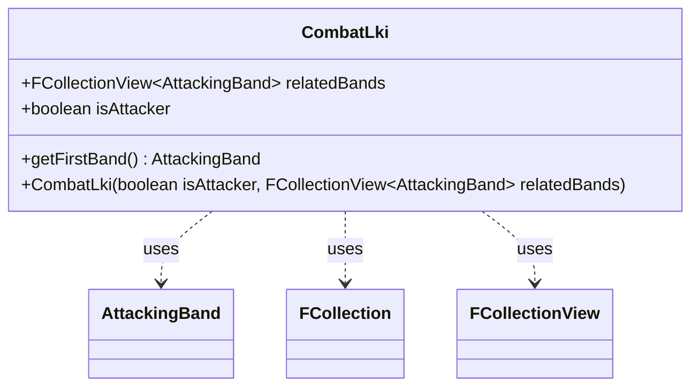

---
aliases:
  - CombatLki
tags:
  - java/class
  - module/forge-game
  - pkg/forge/game/combat
fqn: forge.game.combat.CombatLki
package: forge.game.combat
module: forge-game
kind: Class
---

# CombatLki

**Package:** `forge.game.combat` &nbsp; **Module:** `forge-game` &nbsp; **Kind:** Class



## Relationships
**Uses:**
- [[forge.game.combat.AttackingBand|AttackingBand]]
- [[forge.util.collect.FCollection|FCollection]]
- [[forge.util.collect.FCollectionView|FCollectionView]]

## Design Description

The Software Design Description:

CombatLki is a small immutable data holder that captures a "last-known-information" snapshot of a creature's combat participation, recording whether it was attacking (`isAttacker`) and the set of attacking bands it belonged to (`relatedBands`). It collaborates primarily with AttackingBand, exposing a convenience `getFirstBand()` accessor that returns the first band or null when none exist.

Notably, the constructor defensively copies the supplied `FCollectionView<AttackingBand>` into a new `FCollection`, decoupling the stored snapshot from the live combat state so later mutations cannot alter the preserved information. The `final` fields reinforce this immutability, making the type a safe, lightweight record passed around to preserve combat context after the actual combat objects have changed. It depends only on the collection utilities (`FCollection`/`FCollectionView`) and `AttackingBand`, with no supertype beyond `Object`.

## Source
`forge-game/src/main/java/forge/game/combat/CombatLki.java`

```java
package forge.game.combat;

import forge.util.collect.FCollection;
import forge.util.collect.FCollectionView;

/** 
 * TODO: Write javadoc for this type.
 *
 */
public class CombatLki {

    public final FCollectionView<AttackingBand> relatedBands;
    public final boolean isAttacker;

    public CombatLki(boolean isAttacker, FCollectionView<AttackingBand> relatedBands) {
        this.isAttacker = isAttacker;
        this.relatedBands = new FCollection<>(relatedBands);
    }

    public AttackingBand getFirstBand() {
        return relatedBands.isEmpty() ? null : relatedBands.get(0);
    }

}
```
