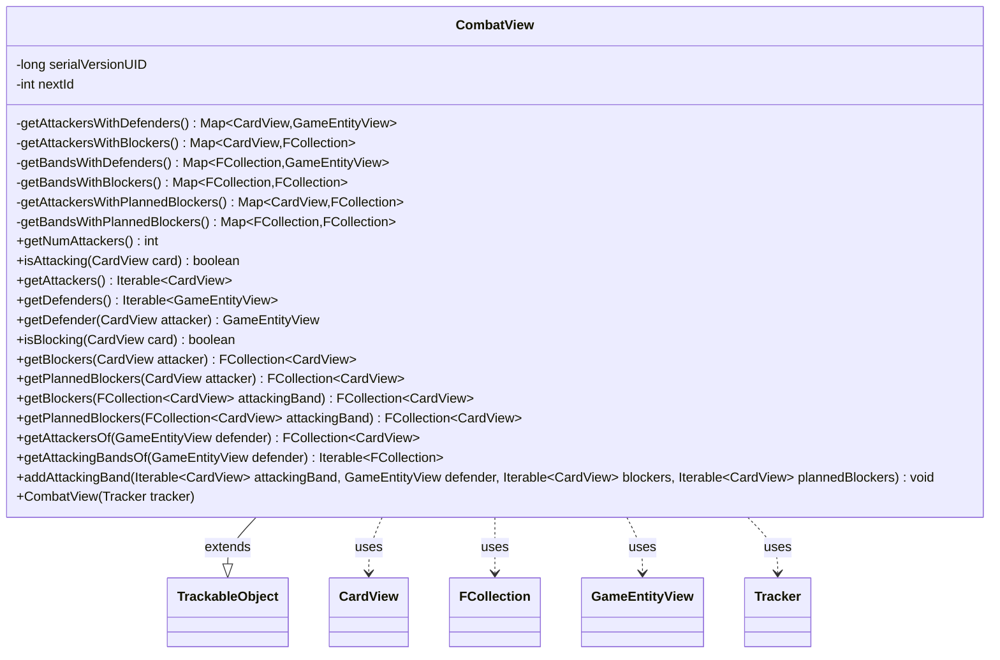

---
aliases:
  - CombatView
tags:
  - java/class
  - module/forge-game
  - pkg/forge/game/combat
fqn: forge.game.combat.CombatView
package: forge.game.combat
module: forge-game
kind: Class
---

# CombatView

**Package:** `forge.game.combat` &nbsp; **Module:** `forge-game` &nbsp; **Kind:** Class



## Relationships
**Extends:**
- [[forge.trackable.TrackableObject|TrackableObject]]
**Uses:**
- [[forge.game.GameEntityView|GameEntityView]]
- [[forge.game.card.CardView|CardView]]
- [[forge.trackable.Tracker|Tracker]]
- [[forge.util.collect.FCollection|FCollection]]

## Design Description

CombatView is a read-only, presentation-layer snapshot of a combat's structure, exposing which attackers are assigned to which defenders and which (actual and planned) blockers oppose each attacker or attacking band. As a `TrackableObject` subtype, it stores its six relationship maps as `TrackableProperty` values so changes propagate through the engine's `Tracker`-based view-synchronization mechanism, keeping the UI in sync with the underlying game state. It collaborates with `CardView`, `GameEntityView`, and `FCollection` to model attackers, defenders/banding, and blocker groups respectively.

Notable design intent: instances take unique negative IDs (`nextId--`) deliberately to stay unregistered with the tracker—each combat view is a distinct, transient object rather than a shared tracked entity. Concurrent maps plus `synchronized` defensive copies make reads thread-safe, and parallel "planned blocker" maps support a targeting/preview overlay separate from committed blocks.

## Source
`forge-game/src/main/java/forge/game/combat/CombatView.java`

```java
package forge.game.combat;

import java.util.ArrayList;
import java.util.HashSet;
import java.util.List;
import java.util.Map;
import java.util.Map.Entry;
import java.util.concurrent.ConcurrentHashMap;

import com.google.common.collect.Lists;

import forge.game.GameEntityView;
import forge.game.card.CardView;
import forge.trackable.TrackableObject;
import forge.trackable.TrackableProperty;
import forge.trackable.Tracker;
import forge.util.collect.FCollection;

public class CombatView extends TrackableObject {
    private static final long serialVersionUID = 68085618912864942L;

    // Unique negative IDs so TrackableObject.equals() distinguishes instances.
    // Negative IDs avoid tracker registration (only id >= 0 is registered).
    private static int nextId = -2;

    public CombatView(final Tracker tracker) {
        super(nextId--, tracker);
        set(TrackableProperty.AttackersWithDefenders, new ConcurrentHashMap<CardView, GameEntityView>());
        set(TrackableProperty.AttackersWithBlockers, new ConcurrentHashMap<CardView, FCollection<CardView>>());
        set(TrackableProperty.BandsWithDefenders, new ConcurrentHashMap<FCollection<CardView>, GameEntityView>());
        set(TrackableProperty.BandsWithBlockers, new ConcurrentHashMap<FCollection<CardView>, FCollection<CardView>>());
        set(TrackableProperty.AttackersWithPlannedBlockers, new ConcurrentHashMap<CardView, FCollection<CardView>>());
        set(TrackableProperty.BandsWithPlannedBlockers, new ConcurrentHashMap<FCollection<CardView>, FCollection<CardView>>());
    }
    private Map<CardView, GameEntityView> getAttackersWithDefenders() {
        return get(TrackableProperty.AttackersWithDefenders);
    }
    private Map<CardView, FCollection<CardView>> getAttackersWithBlockers() {
        return get(TrackableProperty.AttackersWithBlockers);
    }
    private Map<FCollection<CardView>, GameEntityView> getBandsWithDefenders() {
        return get(TrackableProperty.BandsWithDefenders);
    }
    private Map<FCollection<CardView>, FCollection<CardView>> getBandsWithBlockers() {
        return get(TrackableProperty.BandsWithBlockers);
    }
    private Map<CardView, FCollection<CardView>> getAttackersWithPlannedBlockers() {
        return get(TrackableProperty.AttackersWithPlannedBlockers);
    }
    private Map<FCollection<CardView>, FCollection<CardView>> getBandsWithPlannedBlockers() {
        return get(TrackableProperty.BandsWithPlannedBlockers);
    }

    public int getNumAttackers() {
        return getAttackersWithDefenders().size();
    }

    public boolean isAttacking(final CardView card) {
        return getAttackersWithDefenders().containsKey(card);
    }

    public Iterable<CardView> getAttackers() {
        final HashSet<CardView> allAttackers;
        synchronized (this) {
            allAttackers = new HashSet<>(getAttackersWithDefenders().keySet());
        }
        return allAttackers;
    }

    public Iterable<GameEntityView> getDefenders() {
        final HashSet<GameEntityView> allDefenders;
        synchronized (this) {
            allDefenders = new HashSet<>(getAttackersWithDefenders().values());
        }
        return allDefenders;
    }

    public GameEntityView getDefender(final CardView attacker) {
        return getAttackersWithDefenders().get(attacker);
    }

    public boolean isBlocking(final CardView card) {
        final List<FCollection<CardView>> allBlockers;
        synchronized (this) {
            allBlockers = Lists.newArrayList(getAttackersWithBlockers().values());
        }
        for (final FCollection<CardView> blockers : allBlockers) {
            if (blockers == null) {
                continue;
            }
            if (blockers.contains(card)) {
                return true;
            }
        }
        return false;
    }

    /**
     * @param attacker
     * @return the blockers associated with an attacker, or {@code null} if the
     *         attacker is unblocked.
     */
    public FCollection<CardView> getBlockers(final CardView attacker) {
        return getAttackersWithBlockers().get(attacker);
    }

    /**
     * @param attacker
     * @return the blockers associated with an attacker, or {@code null} if the
     *         attacker is unblocked (planning stage, for targeting overlay).
     */
    public FCollection<CardView> getPlannedBlockers(final CardView attacker) {
        return getAttackersWithPlannedBlockers().get(attacker);
    }

    /**
     * Get an {@link Iterable} of the blockers of the specified band, or
     * {@code null} if that band is unblocked.
     * 
     * @param attackingBand
     *            an {@link Iterable} representing an attacking band.
     * @return an {@link Iterable} of {@link CardView} objects, or {@code null}.
     */
    public FCollection<CardView> getBlockers(final FCollection<CardView> attackingBand) {
        return getBandsWithBlockers().get(attackingBand);
    }

    /**
     * Get an {@link Iterable} of the blockers of the specified band, or
     * {@code null} if that band is unblocked (planning stage, for targeting overlay).
     * 
     * @param attackingBand
     *            an {@link Iterable} representing an attacking band.
     * @return an {@link Iterable} of {@link CardView} objects, or {@code null}.
     */
    public FCollection<CardView> getPlannedBlockers(final FCollection<CardView> attackingBand) {
        return getBandsWithPlannedBlockers().get(attackingBand);
    }

    public FCollection<CardView> getAttackersOf(final GameEntityView defender) {
        final List<Entry<CardView, GameEntityView>> attackersWithDefenders;
        synchronized (this) {
            attackersWithDefenders = Lists.newArrayList(getAttackersWithDefenders().entrySet());
        }
        final FCollection<CardView> views = new FCollection<>();
        for (final Entry<CardView, GameEntityView> entry : attackersWithDefenders) {
            if (defender != null && defender.equals(entry.getValue())) {
                views.add(entry.getKey());
            }
        }
        return views;
    }
    public Iterable<FCollection<CardView>> getAttackingBandsOf(final GameEntityView defender) {
        final List<Entry<FCollection<CardView>, GameEntityView>> bandsWithDefenders;
        synchronized (this) {
            bandsWithDefenders = Lists.newArrayList(getBandsWithDefenders().entrySet());
        }
        final List<FCollection<CardView>> views = new ArrayList<>();
        for (final Entry<FCollection<CardView>, GameEntityView> entry : bandsWithDefenders) {
            if (entry.getValue().equals(defender)) {
                views.add(entry.getKey());
            }
        }
        return views;
    }

    public void addAttackingBand(final Iterable<CardView> attackingBand, final GameEntityView defender, final Iterable<CardView> blockers, final Iterable<CardView> plannedBlockers) {
        if (defender == null) { return; }

        final FCollection<CardView> attackingBandCopy = new FCollection<>();
        final FCollection<CardView> blockersCopy = new FCollection<>();
        final FCollection<CardView> plannedBlockersCopy = new FCollection<>();

        attackingBandCopy.addAll(attackingBand);
        if (blockers != null) {
            blockersCopy.addAll(blockers);
        }
        if (plannedBlockers != null) {
            plannedBlockersCopy.addAll(plannedBlockers);
        }

        for (final CardView attacker : attackingBandCopy) {
            this.getAttackersWithDefenders().put(attacker, defender);
            this.getAttackersWithBlockers().put(attacker, blockersCopy);
            this.getAttackersWithPlannedBlockers().put(attacker, plannedBlockersCopy);
        }
        this.getBandsWithDefenders().put(attackingBandCopy, defender);
        this.getBandsWithBlockers().put(attackingBandCopy, blockersCopy);
        this.getBandsWithPlannedBlockers().put(attackingBandCopy, plannedBlockersCopy);
    }
}
```
