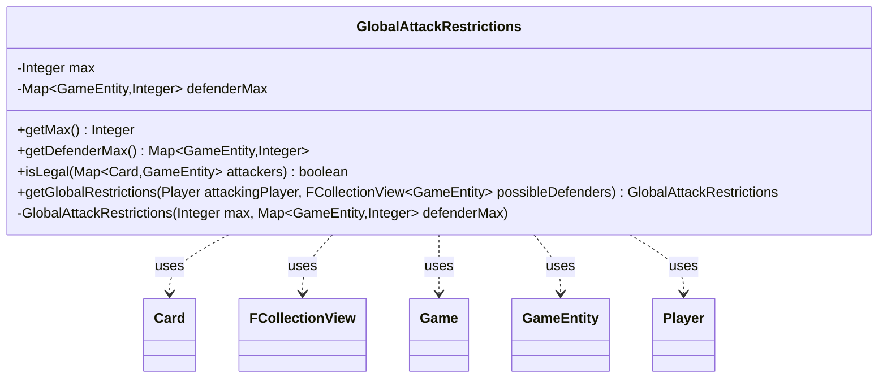

---
aliases:
  - GlobalAttackRestrictions
tags:
  - java/class
  - module/forge-game
  - pkg/forge/game/combat
fqn: forge.game.combat.GlobalAttackRestrictions
package: forge.game.combat
module: forge-game
kind: Class
---

# GlobalAttackRestrictions

**Package:** `forge.game.combat` &nbsp; **Module:** `forge-game` &nbsp; **Kind:** Class



## Relationships
**Uses:**
- [[forge.game.Game|Game]]
- [[forge.game.GameEntity|GameEntity]]
- [[forge.game.card.Card|Card]]
- [[forge.game.player.Player|Player]]
- [[forge.util.collect.FCollectionView|FCollectionView]]

## Design Description

GlobalAttackRestrictions is an immutable value object that captures the combat-wide limits on how many creatures may attack and how many may be assigned to each individual defender. It exposes the overall cap (`max`) and a per-defender cap map (`defenderMax`) through read-only accessors, and validates a proposed set of attacker-to-defender assignments via `isLegal`, rejecting any declaration that exceeds the global total or any defender's quota (where a quota of zero forbids attacking that defender entirely).

Instances are produced only through the static `getGlobalRestrictions` factory, which queries `StaticAbilityAttackRestrict` against the current `Game` to derive both the global and per-defender limits from active static abilities; the private constructor enforces this controlled creation. It collaborates with the combat domain types—`Player`, `GameEntity` defenders, `Card` attackers, and `FCollectionView`—serving as a stateless rules helper that the attack-declaration logic consults to enforce restriction effects.

## Source
`forge-game/src/main/java/forge/game/combat/GlobalAttackRestrictions.java`

```java
package forge.game.combat;

import java.util.Map;
import java.util.Objects;

import com.google.common.collect.Maps;

import forge.game.Game;
import forge.game.GameEntity;
import forge.game.card.Card;
import forge.game.player.Player;
import forge.game.staticability.StaticAbilityAttackRestrict;
import forge.util.collect.FCollectionView;

public class GlobalAttackRestrictions {

    private final Integer max;
    private final Map<GameEntity, Integer> defenderMax;
    private GlobalAttackRestrictions(final Integer max, final Map<GameEntity, Integer> defenderMax) {
        this.max = max;
        this.defenderMax = defenderMax;
    }

    public Integer getMax() {
        return max;
    }
    public Map<GameEntity, Integer> getDefenderMax() {
        return defenderMax;
    }

    public boolean isLegal(final Map<Card, GameEntity> attackers) {
        if (max != null && attackers.size() > max) {
            return false;
        }

        return attackers.values().stream().distinct().noneMatch(defender -> {
            final Integer max = defenderMax.get(defender);
            if (max == null) {
                return false;
            }
            if (max == 0) {
                // there's at least one creature attacking this defender
                return true;
            }
            return attackers.values().stream().filter(attDef -> attDef == defender).count() > max;
        });
    }

    /**
     * <p>
     * Get all global restrictions (applying to all creatures).
     * </p>
     * 
     * @param attackingPlayer
     *            the {@link Player} declaring attack.
     * @return a {@link GlobalAttackRestrictions} object.
     */
    public static GlobalAttackRestrictions getGlobalRestrictions(final Player attackingPlayer, final FCollectionView<GameEntity> possibleDefenders) {
        final Map<GameEntity, Integer> defenderMax = Maps.newHashMapWithExpectedSize(possibleDefenders.size());
        final Game game = attackingPlayer.getGame();

        Integer max = StaticAbilityAttackRestrict.globalAttackRestrict(game);

        for (final GameEntity defender : possibleDefenders) {
            final Integer defMax = StaticAbilityAttackRestrict.attackRestrictNum(defender);
            if (defMax != null) {
                defenderMax.put(defender, defMax);
            }
        }
        if (defenderMax.size() == possibleDefenders.size()) {
            // maximum on each defender, global maximum is sum of these
            max = Math.min(Objects.requireNonNullElse(max, Integer.MAX_VALUE), defenderMax.values().stream().mapToInt(Integer::intValue).sum());
        }

        return new GlobalAttackRestrictions(max, defenderMax);
    }
}
```
