---
aliases:
  - Cost
tags:
  - java/class
  - module/forge-game
  - pkg/forge/game/cost
fqn: forge.game.cost.Cost
package: forge.game.cost
module: forge-game
kind: Class
---

# Cost

**Package:** `forge.game.cost`   **Module:** `forge-game`   **Kind:** Class



```mermaid
classDiagram
    class Cost {
        -long serialVersionUID
        -boolean isAbility
        -List~CostPart~ costParts
        -boolean isMandatory
        -boolean tapCost
        -String[] NUM_NAMES
        +Cost Zero
        +hasTapCost() boolean
        -cacheTapCost() void
        +hasNoManaCost() boolean
        +hasManaCost() boolean
        +hasSpecificCostType(Class~CostPart~ costType) boolean
        +hasOnlySpecificCostType(Class~CostPart~ costType) boolean
        +getCostPartByType(Class~T~ costType) T
        +getCostParts() List~CostPart~
        +sort() void
        +getCostPartsWithZeroMana() List~CostPart~
        +isOnlyManaCost() boolean
        +getTotalMana() ManaCost
        +isMandatory() boolean
        +setMandatory(boolean b) void
        +isAbility() boolean
        +getMaxWaterbend() String
        -parseCostPart(String parse, boolean tapCost, boolean untapCost) CostPart
        -abCostParse(String parse, int numParse) String[]
        +copy() Cost
        +copyWithNoMana() Cost
        +copyWithDefinedMana(String manaCost) Cost
        +copyWithDefinedMana(ManaCost manaCost) Cost
        +getCostMana() CostPartMana
        +getCostEnergy() CostPayEnergy
        +refundPaidCost(Card source) void
        +isUndoable() boolean
        +isReusuableResource() boolean
        +isRenewableResource() boolean
        +toString() String
        +toStringAlt() String
        +toSimpleString() String
        -spellToString(boolean bFlag) String
        -abilityToString() String
        +convertAmountTypeToWords(Integer i, String amount, String type) String
        +convertIntAndTypeToWords(int i, String type) String
        +convertAmountTypeToWords(String amount, String type) String
        +mergeTo(Cost source, int amt, SpellAbility sa) void
        +add(Cost cost1) Cost
        +add(Cost cost1, boolean mergeAdditional) Cost
        +add(Cost cost, boolean mergeAdditional, SpellAbility sa) Cost
        +applyTextChangeEffects(CardTraitBase trait) void
        +canPay(SpellAbility sa, Player payer, boolean effect) boolean
        +hasXInAnyCostPart() boolean
        +getMaxForNonManaX(SpellAbility ability, Player payer, boolean effect) Integer
        -Cost()
        -Cost(int genericMana)
        +Cost(ManaCost cost, boolean bAbility)
        +Cost(String parse, boolean bAbility)
        +Cost(String parse, boolean bAbility, boolean intrinsic)
    }
    Cost ..|> Serializable : implements
    Cost ..> Card : uses
    Cost ..> CardTraitBase : uses
    Cost ..> CostAddMana : uses
    Cost ..> CostBehold : uses
    Cost ..> CostBeholdExile : uses
    Cost ..> CostBlight : uses
    Cost ..> CostChooseColor : uses
    Cost ..> CostChooseCreatureType : uses
    Cost ..> CostCollectEvidence : uses
    Cost ..> CostDamage : uses
    Cost ..> CostDiscard : uses
    Cost ..> CostDraw : uses
    Cost ..> CostEnlist : uses
    Cost ..> CostExert : uses
    Cost ..> CostExile : uses
    Cost ..> CostExileFromStack : uses
    Cost ..> CostExiledMoveToGrave : uses
    Cost ..> CostFlipCoin : uses
    Cost ..> CostForage : uses
    Cost ..> CostGainControl : uses
    Cost ..> CostGainLife : uses
    Cost ..> CostMill : uses
    Cost ..> CostPart : uses
    Cost ..> CostPartMana : uses
    Cost ..> CostPartWithList : uses
    Cost ..> CostPayEnergy : uses
    Cost ..> CostPayLife : uses
    Cost ..> CostPayShards : uses
    Cost ..> CostPromiseGift : uses
    Cost ..> CostPutCardToLib : uses
    Cost ..> CostPutCounter : uses
    Cost ..> CostRemoveAnyCounter : uses
    Cost ..> CostRemoveCounter : uses
    Cost ..> CostReturn : uses
    Cost ..> CostReveal : uses
    Cost ..> CostRevealChosen : uses
    Cost ..> CostRollDice : uses
    Cost ..> CostSacrifice : uses
    Cost ..> CostTap : uses
    Cost ..> CostTapType : uses
    Cost ..> CostUnattach : uses
    Cost ..> CostUntap : uses
    Cost ..> CostUntapType : uses
    Cost ..> CostWaterbend : uses
    Cost ..> ManaCost : uses
    Cost ..> ManaCostBeingPaid : uses
    Cost ..> Player : uses
    Cost ..> SpellAbility : uses
    Cost ..> ZoneType : uses
```

## Relationships
**Uses:**
- [[forge.card.mana.ManaCost|ManaCost]]
- [[forge.game.CardTraitBase|CardTraitBase]]
- [[forge.game.card.Card|Card]]
- [[forge.game.cost.CostAddMana|CostAddMana]]
- [[forge.game.cost.CostBehold|CostBehold]]
- [[forge.game.cost.CostBeholdExile|CostBeholdExile]]
- [[forge.game.cost.CostBlight|CostBlight]]
- [[forge.game.cost.CostChooseColor|CostChooseColor]]
- [[forge.game.cost.CostChooseCreatureType|CostChooseCreatureType]]
- [[forge.game.cost.CostCollectEvidence|CostCollectEvidence]]
- [[forge.game.cost.CostDamage|CostDamage]]
- [[forge.game.cost.CostDiscard|CostDiscard]]
- [[forge.game.cost.CostDraw|CostDraw]]
- [[forge.game.cost.CostEnlist|CostEnlist]]
- [[forge.game.cost.CostExert|CostExert]]
- [[forge.game.cost.CostExile|CostExile]]
- [[forge.game.cost.CostExileFromStack|CostExileFromStack]]
- [[forge.game.cost.CostExiledMoveToGrave|CostExiledMoveToGrave]]
- [[forge.game.cost.CostFlipCoin|CostFlipCoin]]
- [[forge.game.cost.CostForage|CostForage]]
- [[forge.game.cost.CostGainControl|CostGainControl]]
- [[forge.game.cost.CostGainLife|CostGainLife]]
- [[forge.game.cost.CostMill|CostMill]]
- [[forge.game.cost.CostPart|CostPart]]
- [[forge.game.cost.CostPartMana|CostPartMana]]
- [[forge.game.cost.CostPartWithList|CostPartWithList]]
- [[forge.game.cost.CostPayEnergy|CostPayEnergy]]
- [[forge.game.cost.CostPayLife|CostPayLife]]
- [[forge.game.cost.CostPayShards|CostPayShards]]
- [[forge.game.cost.CostPromiseGift|CostPromiseGift]]
- [[forge.game.cost.CostPutCardToLib|CostPutCardToLib]]
- [[forge.game.cost.CostPutCounter|CostPutCounter]]
- [[forge.game.cost.CostRemoveAnyCounter|CostRemoveAnyCounter]]
- [[forge.game.cost.CostRemoveCounter|CostRemoveCounter]]
- [[forge.game.cost.CostReturn|CostReturn]]
- [[forge.game.cost.CostReveal|CostReveal]]
- [[forge.game.cost.CostRevealChosen|CostRevealChosen]]
- [[forge.game.cost.CostRollDice|CostRollDice]]
- [[forge.game.cost.CostSacrifice|CostSacrifice]]
- [[forge.game.cost.CostTap|CostTap]]
- [[forge.game.cost.CostTapType|CostTapType]]
- [[forge.game.cost.CostUnattach|CostUnattach]]
- [[forge.game.cost.CostUntap|CostUntap]]
- [[forge.game.cost.CostUntapType|CostUntapType]]
- [[forge.game.cost.CostWaterbend|CostWaterbend]]
- [[forge.game.mana.ManaCostBeingPaid|ManaCostBeingPaid]]
- [[forge.game.player.Player|Player]]
- [[forge.game.spellability.SpellAbility|SpellAbility]]
- [[forge.game.zone.ZoneType|ZoneType]]

## Design Description

The `Cost` class models the complete payment requirement of a spell or activated ability as an ordered, mutable aggregate of `CostPart` components. Implementing `Serializable`, it holds a `List<CostPart>`—mana, taps, sacrifices, life payments, counter manipulation, and dozens of other effects—and exposes queries (`hasManaCost`, `getCostPartByType`, `isOnlyManaCost`), payability checks (`canPay`), and human-readable renderings (`toString`, `toSimpleString`).

Its central responsibility is parsing Forge's cost-string DSL: the constructor and `parseCostPart` factory translate tokens like `Sac<1/Creature>` or `PayLife<2>` into concrete `CostPart` subclasses, then `sort()` orders them by payment priority. Acting as a composite over the `CostPart` hierarchy, it delegates per-part behavior (refund, undoability, text-change effects) while caching whether a tap is involved for summoning-sickness checks. Rich `copy`/`add`/`mergeTo` operations let cost modifiers combine and scale costs immutably-by-copy, and static factories like `Cost.Zero` provide shared defaults.

## Source
`forge-game/src/main/java/forge/game/cost/Cost.java`

```java
/*
 * Forge: Play Magic: the Gathering.
 * Copyright (C) 2011  Forge Team
 *
 * This program is free software: you can redistribute it and/or modify
 * it under the terms of the GNU General Public License as published by
 * the Free Software Foundation, either version 3 of the License, or
 * (at your option) any later version.
 *
 * This program is distributed in the hope that it will be useful,
 * but WITHOUT ANY WARRANTY; without even the implied warranty of
 * MERCHANTABILITY or FITNESS FOR A PARTICULAR PURPOSE.  See the
 * GNU General Public License for more details.
 *
 * You should have received a copy of the GNU General Public License
 * along with this program.  If not, see <http://www.gnu.org/licenses/>.
 */
package forge.game.cost;

import com.google.common.collect.Lists;
import forge.card.CardType;
import forge.card.mana.ManaCost;
import forge.game.CardTraitBase;
import forge.game.card.Card;
import forge.game.card.CounterEnumType;
import forge.game.card.CounterType;
import forge.game.mana.ManaCostBeingPaid;
import forge.game.player.Player;
import forge.game.spellability.SpellAbility;
import forge.game.zone.ZoneType;
import forge.util.Lang;
import forge.util.TextUtil;
import org.apache.commons.lang3.ObjectUtils;
import org.apache.commons.lang3.StringUtils;

import java.io.Serializable;
import java.util.ArrayList;
import java.util.Arrays;
import java.util.List;

/**
 * <p>
 * Cost class.
 * </p>
 *
 * @author Forge
 * @version $Id$
 */
public class Cost implements Serializable {
    /**
     * Serializables need a version ID.
     */
    private static final long serialVersionUID = 1L;
    private boolean isAbility = true;
    private final List<CostPart> costParts = Lists.newArrayList();
    private boolean isMandatory = false;

    // Primarily used for Summoning Sickness awareness
    private boolean tapCost = false;

    public final boolean hasTapCost() {
        return this.tapCost;
    }

    private void cacheTapCost() {
        tapCost = hasSpecificCostType(CostTap.class);
    }

    public final boolean hasNoManaCost() {
        return this.getCostMana() == null;
    }

    public final boolean hasManaCost() {
        return this.getCostMana() != null;
    }

    public final boolean hasSpecificCostType(Class<? extends CostPart> costType) {
        for (CostPart p : getCostParts()) {
            if (costType.isInstance(p)) {
                return true;
            }
        }
        return false;
    }

    public final boolean hasOnlySpecificCostType(Class<? extends CostPart> costType) {
        for (CostPart p : getCostParts()) {
            if (!costType.isInstance(p)) {
                return false;
            }
        }
        return true;
    }

    @SuppressWarnings("unchecked")
    public <T extends CostPart> T getCostPartByType(Class<T> costType) {
        for (CostPart p : getCostParts()) {
            if (costType.isInstance(p)) {
                return (T)p;
            }
        }
        return null;
    }

    /**
     * Gets the cost parts.
     *
     * @return the cost parts
     */
    public final List<CostPart> getCostParts() {
        return this.costParts;
    }

    public void sort() {
        // Things that need to happen first should be 0-4 (Tap, PayMana)
        // Things that happen that are generally undoable 5 (Pretty much everything)
        // Things that are annoying to undo 6-10 (PayLife, GainControl)
        // Things that are hard to undo 11+ (Zone Changing things)
        // Things that are pretty much happen at the end (Untap) 16+
        // Things that NEED to happen last 100+

        this.costParts.sort((o1, o2) -> ObjectUtils.compare(o1.paymentOrder(), o2.paymentOrder()));
    }

    /**
     * Get the cost parts, always including a mana cost part (which may be
     * zero).
     *
     * @return the cost parts, possibly with an extra zero mana {@link
     * CostPartMana}.
     */
    public final List<CostPart> getCostPartsWithZeroMana() {
        if (this.hasManaCost()) {
            return this.costParts;
        }
        final List<CostPart> newCostParts = Lists.newArrayListWithCapacity(this.costParts.size() + 1);
        newCostParts.addAll(this.costParts);
        newCostParts.add(new CostPartMana(ManaCost.ZERO, null));
        return newCostParts;
    }

    /**
     * <p>
     * isOnlyManaCost.
     * </p>
     *
     * @return a boolean.
     */
    public final boolean isOnlyManaCost() {
        // used by Morph, Equip and some string builders
        for (final CostPart part : this.costParts) {
            if (!(part instanceof CostPartMana)) {
                return false;
            }
        }

        return true;
    }

    /**
     * <p>
     * getTotalMana.
     * </p>
     *
     * @return a {@link java.lang.String} object.
     */
    public final ManaCost getTotalMana() {
        CostPartMana manapart = getCostMana();
        return manapart == null ? ManaCost.ZERO : manapart.getMana();
    }

    /**
     * <p>
     * isMandatory
     * </p>
     *
     * @return boolean
     */
    public final boolean isMandatory() {
        return this.isMandatory;
    }
    public final void setMandatory(boolean b) {
        isMandatory = b;
    }

    public final boolean isAbility() {
        return this.isAbility;
    }

    public final String getMaxWaterbend() {
        for (CostPart cp : this.costParts) {
            if (cp instanceof CostPartMana) {
                return ((CostPartMana) cp).getMaxWaterbend();
            }
        }
        return null;
    }

    private Cost() {

    }

    private Cost(int genericMana) {
        costParts.add(new CostPartMana(ManaCost.get(genericMana), null));
    }

    // Parsing Strings

    public Cost(ManaCost cost, final boolean bAbility) {
        this.isAbility = bAbility;
        costParts.add(new CostPartMana(cost, null));
    }

    public Cost(String parse, final boolean bAbility) {
        this(parse, bAbility, true);
    }

    /**
     * <p>
     * Constructor for Cost.
     * </p>
     * @param parse
     *            a {@link java.lang.String} object.
     * @param bAbility
     *            a boolean.
     */
    public Cost(String parse, final boolean bAbility, final boolean intrinsic) {
        this.isAbility = bAbility;
        // when adding new costs for cost string, place them here

        String xMin = "";
        boolean untapCost = false;

        StringBuilder manaParts = new StringBuilder();
        String[] parts = TextUtil.splitWithParenthesis(parse, ' ', '<', '>');

        // make this before parse so that classes that need it get data in their constructor
        for (String part : parts) {
            if (part.equals("T") || part.equals("Tap"))
                this.tapCost = true;
            if (part.equals("Q") || part.equals("Untap"))
                untapCost = true;
        }

        CostPartMana parsedMana = null;
        for (String part : parts) {
            if (part.startsWith("XMin")) {
                xMin = part;
            } else if ("Mandatory".equals(part)) {
                this.isMandatory = true;
            } else {
                CostPart cp = parseCostPart(part, tapCost, untapCost);
                if (null != cp)
                    if (cp instanceof CostPartMana p) {
                        parsedMana = p;
                    } else {
                        if (cp instanceof CostPartWithList p) {
                            p.setIntrinsic(intrinsic);
                        }
                        this.costParts.add(cp);
                    }
                else
                    manaParts.append(part).append(" ");
            }
        }

        if (parsedMana == null && (manaParts.length() > 0 || !xMin.isEmpty())) {
            parsedMana = new CostPartMana(new ManaCost(manaParts.toString()), xMin.isEmpty() ? null : xMin);
        }
        if (parsedMana != null) {
            costParts.add(parsedMana);
        }

        // technically the user might pay the costs in any order
        // but needs to activate mana ability first
        sort();
    }

    private static CostPart parseCostPart(String parse, boolean tapCost, boolean untapCost) {
        if (parse.startsWith("Mana<")) {
            final String[] splitStr = TextUtil.split(abCostParse(parse, 1)[0], '\\');
            final String restriction = splitStr.length > 1 ? splitStr[1] : null;
            return new CostPartMana(new ManaCost(splitStr[0]), restriction);
        }

        if (parse.startsWith("tapXType<")) {
            final String[] splitStr = abCostParse(parse, 3);
            final String description = splitStr.length > 2 ? splitStr[2] : null;
            return new CostTapType(splitStr[0], splitStr[1], description, tapCost);
        }

        if (parse.startsWith("untapYType<")) {
            final String[] splitStr = abCostParse(parse, 3);
            final String description = splitStr.length > 2 ? splitStr[2] : null;
            return new CostUntapType(splitStr[0], splitStr[1], description, untapCost);
        }

        if (parse.startsWith("SubCounter<")) {
            // SubCounter<NumCounters/CounterType/{Type/Description/Zone}>
            final String[] splitStr = abCostParse(parse, 5);
            final String type = splitStr.length > 2 ? splitStr[2] : "CARDNAME";
            final String description = splitStr.length > 3 ? splitStr[3] : null;
            final List<ZoneType> zone = splitStr.length > 4 ? ZoneType.listValueOf(splitStr[4]) : Lists.newArrayList(ZoneType.Battlefield);
            boolean oneOrMore = false;
            if (splitStr[0].equals("X1+")) {
                oneOrMore = true;
                splitStr[0] = "X";
            }

            return new CostRemoveCounter(splitStr[0], CounterType.getType(splitStr[1]), type, description, zone, oneOrMore);
        }

        if (parse.startsWith("AddCounter<")) {
            // AddCounter<NumCounters/CounterType>
            final String[] splitStr = abCostParse(parse, 4);
            final String target = splitStr.length > 2 ? splitStr[2] : "CARDNAME";
            final String description = splitStr.length > 3 ? splitStr[3] : null;
            return new CostPutCounter(splitStr[0], CounterType.getType(splitStr[1]), target, description);
        }

        // While no card has "PayLife<2> PayLife<3> there might be a card that
        // Changes Cost by adding a Life Payment
        if (parse.startsWith("PayLife<")) {
            // PayLife<LifeCost>
            final String[] splitStr = abCostParse(parse, 2);
            final String description = splitStr.length > 1 ? splitStr[1] : null;
            return new CostPayLife(splitStr[0], description);
        }

        if (parse.startsWith("PayEnergy<")) {
            // Payenergy<EnergyCost>
            final String[] splitStr = abCostParse(parse, 1);
            return new CostPayEnergy(splitStr[0]);
        }
        if (parse.startsWith("PayShards<")) { //Adventure specific energy-esque tokens
            // Payshards<ShardCost>
            final String[] splitStr = abCostParse(parse, 1);
            return new CostPayShards(splitStr[0]);
        }

        if (parse.startsWith("GainLife<")) {
            // PayLife<LifeCost>
            final String[] splitStr = abCostParse(parse, 3);
            int cnt = splitStr.length > 2 ? "*".equals(splitStr[2]) ? Integer.MAX_VALUE : Integer.parseInt(splitStr[2]) : 1;
            return new CostGainLife(splitStr[0], splitStr[1], cnt);
        }

        if (parse.startsWith("GainControl<")) {
            final String[] splitStr = abCostParse(parse, 3);
            final String description = splitStr.length > 2 ? splitStr[2] : null;
            return new CostGainControl(splitStr[0], splitStr[1], description);
        }

        if (parse.startsWith("Unattach<")) {
            // Unattach<Type/Desc>
            final String[] splitStr = abCostParse(parse, 2);
            final String description = splitStr.length > 1 ? splitStr[1] : null;
            return new CostUnattach(splitStr[0], description);
        }

        if (parse.startsWith("ChooseColor<")) {
            // ChooseColor<NumToChoose>
            //TODO expand this to set off different UI for Specialize
            final String[] splitStr = abCostParse(parse, 1);
            return new CostChooseColor(splitStr[0]);
        }

        if (parse.startsWith("ChooseCreatureType<")) {
            final String[] splitStr = abCostParse(parse, 1);
            return new CostChooseCreatureType(splitStr[0]);
        }

        if (parse.startsWith("DamageYou<")) {
            // Damage<NumDmg>
            final String[] splitStr = abCostParse(parse, 1);
            return new CostDamage(splitStr[0]);
        }

        if (parse.startsWith("Mill<")) {
            // Mill<NumCards>
            final String[] splitStr = abCostParse(parse, 1);
            return new CostMill(splitStr[0]);
        }

        if (parse.startsWith("FlipCoin<")) {
            // FlipCoin<NumCoins>
            final String[] splitStr = abCostParse(parse, 1);
            return new CostFlipCoin(splitStr[0]);
        }

        if (parse.startsWith("RollDice<")) {
            // RollDice<NumDice/Sides/ResultSVar>
            final String[] splitStr = abCostParse(parse, 4);
            final String description = splitStr.length > 3 ? splitStr[3] : null;
            return new CostRollDice(splitStr[0], splitStr[1], splitStr[2], description);
        }

        if (parse.startsWith("Discard<")) {
            // Discard<NumCards/Type>
            final String[] splitStr = abCostParse(parse, 3);
            final String description = splitStr.length > 2 ? splitStr[2] : null;
            return new CostDiscard(splitStr[0], splitStr[1], description);
        }

        if (parse.startsWith("AddMana<")) {
            // AddMana<Num/Type>
            final String[] splitStr = abCostParse(parse, 3);
            final String description = splitStr.length > 2 ? splitStr[2] : null;
            return new CostAddMana(splitStr[0], splitStr[1], description);
        }

        if (parse.startsWith("Sac<")) {
            final String[] splitStr = abCostParse(parse, 3);
            final String description = splitStr.length > 2 ? splitStr[2] : null;
            return new CostSacrifice(splitStr[0], splitStr[1], description);
        }

        if (parse.startsWith("RemoveAnyCounter<")) {
            final String[] splitStr = abCostParse(parse, 4);
            final String description = splitStr.length > 3 ? splitStr[3] : null;
            boolean oneOrMore = false;
            if (splitStr[0].equals("X1+")) {
                oneOrMore = true;
                splitStr[0] = "X";
            }
            return new CostRemoveAnyCounter(splitStr[0], CounterType.getType(splitStr[1]), splitStr[2], description, oneOrMore);
        }

        if (parse.startsWith("Exile<")) {
            final String[] splitStr = abCostParse(parse, 3);
            final String description = splitStr.length > 2 ? splitStr[2] : null;
            return new CostExile(splitStr[0], splitStr[1], description, ZoneType.Battlefield);
        }

        if (parse.startsWith("ExileFromHand<")) {
            final String[] splitStr = abCostParse(parse, 3);
            final String description = splitStr.length > 2 ? splitStr[2] : null;
            return new CostExile(splitStr[0], splitStr[1], description, ZoneType.Hand);
        }

        if (parse.startsWith("ExileFromGrave<")) {
            final String[] splitStr = abCostParse(parse, 3);
            final String description = splitStr.length > 2 ? splitStr[2] : null;
            return new CostExile(splitStr[0], splitStr[1], description, ZoneType.Graveyard);
        }

        if (parse.startsWith("ExileFromStack<")) {
            final String[] splitStr = abCostParse(parse, 3);
            final String description = splitStr.length > 2 ? splitStr[2] : null;
            return new CostExileFromStack(splitStr[0], splitStr[1], description);
        }

        if (parse.startsWith("ExileFromTop<")) {
            final String[] splitStr = abCostParse(parse, 3);
            final String description = splitStr.length > 2 ? splitStr[2] : null;
            return new CostExile(splitStr[0], splitStr[1], description, ZoneType.Library);
        }

        if (parse.startsWith("ExileAnyGrave<")) {
            final String[] splitStr = abCostParse(parse, 3);
            final String description = splitStr.length > 2 ? splitStr[2] : null;
            return new CostExile(splitStr[0], splitStr[1], description, ZoneType.Graveyard, -1);
        }

        if (parse.startsWith("ExileSameGrave<")) {
            final String[] splitStr = abCostParse(parse, 3);
            final String description = splitStr.length > 2 ? splitStr[2] : null;
            return new CostExile(splitStr[0], splitStr[1], description, ZoneType.Graveyard, 0);
        }

        if (parse.startsWith("ExileCtrlOrGrave<")) {
            final String[] splitStr = abCostParse(parse, 3);
            final String description = splitStr.length > 2 ? splitStr[2] : null;
            return new CostExile(splitStr[0], splitStr[1], description,
                    new ArrayList<>(Arrays.asList(ZoneType.Battlefield, ZoneType.Graveyard)));
        }

        if (parse.startsWith("PromiseGift")) {
            return new CostPromiseGift();
        }

        if (parse.startsWith("Return<")) {
            final String[] splitStr = abCostParse(parse, 3);
            final String description = splitStr.length > 2 ? splitStr[2] : null;
            return new CostReturn(splitStr[0], splitStr[1], description);
        }

        if (parse.startsWith("ChooseCard<")) {
            final String[] splitStr = abCostParse(parse, 3);
            final String description = splitStr.length > 2 ? splitStr[2] : null;
            return new CostReveal(splitStr[0], splitStr[1], description, "All");
        }

        if (parse.startsWith("Reveal<")) {
            final String[] splitStr = abCostParse(parse, 3);
            final String description = splitStr.length > 2 ? splitStr[2] : null;
            return new CostReveal(splitStr[0], splitStr[1], description);
        }

        if (parse.startsWith("RevealFromExile<")) {
            final String[] splitStr = abCostParse(parse, 3);
            final String description = splitStr.length > 2 ? splitStr[2] : null;
            return new CostReveal(splitStr[0], splitStr[1], description, "Exile");
        }

        if (parse.startsWith("RevealOrChoose<")) {
            final String[] splitStr = abCostParse(parse, 3);
            final String description = splitStr.length > 2 ? splitStr[2] : null;
            return new CostReveal(splitStr[0], splitStr[1], description, "Hand,Battlefield");
        }

        if (parse.startsWith("Behold<")) {
            final String[] splitStr = abCostParse(parse, 3);
            final String description = splitStr.length > 2 ? splitStr[2] : null;
            return new CostBehold(splitStr[0], splitStr[1], description);
        }

        if (parse.startsWith("BeholdExile<")) {
            final String[] splitStr = abCostParse(parse, 3);
            final String description = splitStr.length > 2 ? splitStr[2] : null;
            return new CostBeholdExile(splitStr[0], splitStr[1], description);
        }

        if (parse.startsWith("ExiledMoveToGrave<")) {
            final String[] splitStr = abCostParse(parse, 3);
            final String description = splitStr.length > 2 ? splitStr[2] : null;
            return new CostExiledMoveToGrave(splitStr[0], splitStr[1], description);
        }

        if (parse.startsWith("Draw<")) {
            final String[] splitStr = abCostParse(parse, 2);
            return new CostDraw(splitStr[0], splitStr[1]);
        }

        if (parse.startsWith("PutCardToLibFromHand<")) {
            final String[] splitStr = abCostParse(parse, 4);
            final String description = splitStr.length > 3 ? splitStr[3] : null;
            return new CostPutCardToLib(splitStr[0], splitStr[1], splitStr[2], description, ZoneType.Hand);
        }

        if (parse.startsWith("PutCardToLibFromGrave<")) {
            final String[] splitStr = abCostParse(parse, 4);
            final String description = splitStr.length > 3 ? splitStr[3] : null;
            return new CostPutCardToLib(splitStr[0], splitStr[1], splitStr[2], description, ZoneType.Graveyard);
        }

        if (parse.startsWith("PutCardToLibFromSameGrave<")) {
            final String[] splitStr = abCostParse(parse, 4);
            final String description = splitStr.length > 3 ? splitStr[3] : null;
            return new CostPutCardToLib(splitStr[0], splitStr[1], splitStr[2], description, ZoneType.Graveyard, true);
        }

        if (parse.startsWith("PutCardToLibFromBattlefield<")) {
            final String[] splitStr = abCostParse(parse, 4);
            final String description = splitStr.length > 3 ? splitStr[3] : null;
            return new CostPutCardToLib(splitStr[0], splitStr[1], splitStr[2], description, ZoneType.Battlefield);
        }

        if (parse.startsWith("Exert<")) {
            final String[] splitStr = abCostParse(parse, 3);
            final String description = splitStr.length > 2 ? splitStr[2] : null;
            return new CostExert(splitStr[0], splitStr[1], description);
        }

        if (parse.startsWith("Enlist<")) {
            final String[] splitStr = abCostParse(parse, 3);
            final String description = splitStr.length > 2 ? splitStr[2] : null;
            return new CostEnlist(splitStr[0], splitStr[1], description);
        }

        if (parse.startsWith("CollectEvidence<")) {
            final String[] splitStr = abCostParse(parse, 1);
            return new CostCollectEvidence(splitStr[0]);
        }

        if (parse.startsWith("RevealChosen<")) {
            final String[] splitStr = abCostParse(parse, 2);
            return new CostRevealChosen(splitStr[0], splitStr.length > 1 ? splitStr[1] : null);
        }

        if (parse.startsWith("Waterbend<")) {
            final String[] splitStr = abCostParse(parse, 1);
            return new CostWaterbend(splitStr[0]);
        }

        if (parse.startsWith("Blight<")) {
            final String[] splitStr = abCostParse(parse, 1);
            return new CostBlight(splitStr[0]);
        }

        if (parse.equals("Forage")) {
            return new CostForage();
        }

        // These won't show up with multiples
        if (parse.equals("Untap") || parse.equals("Q")) {
            return new CostUntap();
        }

        if (parse.equals("T")) {
            return new CostTap();
        }
        return null;
    }

    /**
     * <p>
     * abCostParse.
     * </p>
     *
     * @param parse
     *            a {@link java.lang.String} object.
     * @param numParse
     *            a int.
     * @return an array of {@link java.lang.String} objects.
     */
    private static String[] abCostParse(final String parse, final int numParse) {
        final int startPos = 1 + parse.indexOf("<");
        final int endPos = parse.indexOf(">", startPos);
        String str = parse.substring(startPos, endPos);
        final String[] splitStr = TextUtil.split(str, '/', numParse);
        return splitStr;
    }

    public final Cost copy() {
        Cost toRet = new Cost();
        toRet.isAbility = this.isAbility;
        toRet.isMandatory = this.isMandatory;
        for (CostPart cp : this.costParts) {
            toRet.costParts.add(cp.copy());
        }
        toRet.cacheTapCost();
        return toRet;
    }

    public final Cost copyWithNoMana() {
        Cost toRet = new Cost(0);
        toRet.isAbility = this.isAbility;
        for (CostPart cp : this.costParts) {
            if (!(cp instanceof CostPartMana))
                toRet.costParts.add(cp.copy());
        }
        toRet.cacheTapCost();
        return toRet;
    }

    public final Cost copyWithDefinedMana(String manaCost) {
        return copyWithDefinedMana(new ManaCost(manaCost));
    }
    public final Cost copyWithDefinedMana(ManaCost manaCost) {
        Cost toRet = copyWithNoMana();
        toRet.costParts.add(new CostPartMana(manaCost, null));
        toRet.cacheTapCost();
        return toRet;
    }

    public final CostPartMana getCostMana() {
        for (final CostPart part : this.costParts) {
            if (part instanceof CostPartMana) {
                return (CostPartMana) part;
            }
        }
        return null;
    }

    public final CostPayEnergy getCostEnergy() {
        for (final CostPart part : this.costParts) {
            if (part instanceof CostPayEnergy) {
                return (CostPayEnergy) part;
            }
        }
        return null;
    }

    /**
     * <p>
     * refundPaidCost.
     * </p>
     *
     * @param source a {@link Card} object.
     */
    public final void refundPaidCost(final Card source) {
        // prereq: isUndoable is called first
        for (final CostPart part : this.costParts) {
            part.refund(source);
        }
    }

    /**
     * <p>
     * isUndoable.
     * </p>
     *
     * @return a boolean.
     */
    public final boolean isUndoable() {
        for (final CostPart part : this.costParts) {
            if (!part.isUndoable()) {
                return false;
            }
        }

        return true;
    }

    /**
     * <p>
     * isReusuableResource.
     * </p>
     *
     * @return a boolean.
     */
    public final boolean isReusuableResource() {
        for (final CostPart part : this.costParts) {
            if (!part.isReusable()) {
                return false;
            }
        }

        return this.isAbility;
    }

    /**
     * <p>
     * isRenewableResource.
     * </p>
     *
     * @return a boolean.
     */
    public final boolean isRenewableResource() {
        for (final CostPart part : this.costParts) {
            if (!part.isRenewable()) {
                return false;
            }
        }

        return this.isAbility;
    }

    /**
     * <p>
     * toString.
     * </p>
     *
     * @return a {@link java.lang.String} object.
     */
    @Override
    public final String toString() {
        if (this.isAbility) {
            return this.abilityToString();
        } else {
            return this.spellToString(true);
        }
    }

    // maybe add a conversion method that turns the amounts into words 1=a(n),
    // 2=two etc.

    /**
     * <p>
     * toStringAlt.
     * </p>
     *
     * @return a {@link java.lang.String} object.
     */
    public final String toStringAlt() {
        return this.spellToString(false);
    }

    /**
     * <p>
     * toSimpleString.
     * </p>
     *
     * @return a {@link java.lang.String} object.
     */
    public final String toSimpleString() {
        final StringBuilder cost = new StringBuilder();
        boolean first = true;
        for (final CostPart part : this.costParts) {
            if (!first) {
                cost.append(", ");
            }
            cost.append(part.toString());
            first = false;
        }
        return cost.toString();
    }

    /**
     * <p>
     * spellToString.
     * </p>
     *
     * @param bFlag
     *            a boolean.
     * @return a {@link java.lang.String} object.
     */
    private String spellToString(final boolean bFlag) {
        final StringBuilder cost = new StringBuilder();
        boolean first = true;

        if (bFlag) {
            cost.append("As an additional cost to cast this spell, ");
        } else {
            // usually no additional mana cost for spells
            // only three Alliances cards have additional mana costs, but they
            // are basically kicker/multikicker
            /*
             * if (!getTotalMana().equals("0")) {
             * cost.append("pay ").append(getTotalMana()); first = false; }
             */
        }

        for (final CostPart part : this.costParts) {
            if (part instanceof CostPartMana) {
                continue;
            }
            if (!first) {
                cost.append(" and ");
            }
            if (bFlag) {
                cost.append(StringUtils.uncapitalize(part.toString()));
            } else {
                cost.append(part.toString());
            }
            first = false;
        }

        if (first) {
            return "";
        }

        if (bFlag) {
            cost.append(".").append("\n");
        }

        return cost.toString();
    }

    /**
     * <p>
     * abilityToString.
     * </p>
     *
     * @return a {@link java.lang.String} object.
     */
    private String abilityToString() {
        final StringBuilder cost = new StringBuilder();
        boolean first = true;

        for (final CostPart part : this.costParts) {
            boolean append = true;
            if (!first) {
                if (part instanceof CostPartMana) {
                    cost.insert(0, ", ").insert(0, part.toString());
                    append = false;
                } else {
                    cost.append(", ");
                }
            }
            if (append) {
                cost.append(part.toString());
            }
            first = false;
        }

        if (first) {
            cost.append("0");
        }

        return cost.toString();
    }

    // TODO: If a Cost needs to pay more than 10 of something, fill this array as appropriate
    /**
     * Constant.
     * <code>numNames="{zero, a, two, three, four, five, six, "{trunked}</code>
     */
    private static final String[] NUM_NAMES = { "zero", "a", "two", "three", "four", "five", "six", "seven", "eight", "nine", "ten" };

    /**
     * Convert amount type to words.
     *
     * @param i
     *            the i
     * @param amount
     *            the amount
     * @param type
     *            the type
     * @return the string
     */
    public static String convertAmountTypeToWords(final Integer i, final String amount, final String type) {
        if (i == null) {
            return Cost.convertAmountTypeToWords(amount, type);
        }

        return Cost.convertIntAndTypeToWords(i, type);
    }

    /**
     * <p>
     * convertIntAndTypeToWords.
     * </p>
     *
     * @param i
     *            a int.
     * @param type
     *            a {@link java.lang.String} object.
     * @return a {@link java.lang.String} object.
     */
    public static String convertIntAndTypeToWords(final int i, String type) {
        if (i == 1 && type.startsWith("another")) {
            return type; //prevent returning "an another"
        }

        final StringBuilder sb = new StringBuilder();

        if (i >= Cost.NUM_NAMES.length) {
            sb.append(i);
        }
        else if (i == 1 && Lang.startsWithVowel(type)) {
            sb.append("an");
        }
        else {
            sb.append(Cost.NUM_NAMES[i]);
        }

        sb.append(" ");
        if (1 != i) {
            String [] typewords = type.split(" ");
            String lastWord = typewords[typewords.length - 1];
            sb.append(CardType.isASubType(lastWord) ? type.replace(lastWord, CardType.getPluralType(lastWord))
                    : type + "s");
        } else {
            sb.append(type);
        }

        return sb.toString();
    }

    /**
     * Convert amount type to words.
     *
     * @param amount
     *            the amount
     * @param type
     *            the type
     * @return the string
     */
    public static String convertAmountTypeToWords(final String amount, final String type) {
        final StringBuilder sb = new StringBuilder();

        sb.append(amount);
        sb.append(" ");
        sb.append(type);

        return sb.toString();
    }

    public void mergeTo(Cost source, int amt, final SpellAbility sa) {
        // multiply to create the full cost
        if (amt > 1) {
            // to double itself we need to work on a copy
            Cost sourceCpy = source.copy();
            for (int i = 1; i < amt; ++i) {
                // in theory setAmount could be used instead but it depends on the cost complexity (probably not worth trying to determine that first)
                source.add(sourceCpy);
            }
        }
        // combine costs (these shouldn't mix together)
        this.add(source, false, sa);
    }

    public Cost add(Cost cost1) {
        return add(cost1, true);
    }
    public Cost add(Cost cost1, boolean mergeAdditional) {
        return add(cost1, mergeAdditional, null);
    }
    public Cost add(Cost cost, boolean mergeAdditional, final SpellAbility sa) {
        CostPartMana mPartOld = this.getCostMana();
        List<CostPart> toRemove = Lists.newArrayList();
        for (final CostPart part : cost.getCostParts()) {
            if (part instanceof CostPartMana && ((CostPartMana) part).getMana().isZero()) {
                continue; // do not add Zero Mana
            } else if (part instanceof CostPartMana && mPartOld != null) {
                CostPartMana mPart = (CostPartMana) part;
                ManaCostBeingPaid manaCost = new ManaCostBeingPaid(mPart.getMana());
                costParts.remove(mPartOld);
                int xMin = Math.max(mPart.getXMin(), mPartOld.getXMin());
                manaCost.addManaCost(mPartOld.getMana());
                if (mPartOld.isExiledCreatureCost() || mPartOld.isEnchantedCreatureCost() || xMin > 0) {
                    // need to explicitly copy the ExiledCreatureCost/EnchantedCreatureCost
                    costParts.add(0, new CostPartMana(manaCost.toManaCost(), mPartOld.isExiledCreatureCost(), mPartOld.isEnchantedCreatureCost(), xMin));
                } else {
                    costParts.add(0, new CostPartMana(manaCost.toManaCost(), null));
                }
                getCostMana().setMaxWaterbend(mPart.getMaxWaterbend());
            } else if (part instanceof CostPutCounter || (mergeAdditional && // below usually not desired because they're from different causes
                    (part instanceof CostDiscard || part instanceof CostDraw ||
                    part instanceof CostAddMana || part instanceof CostPayLife ||
                    part instanceof CostSacrifice || part instanceof CostTapType ||
                    part instanceof CostExile))) {
                boolean alreadyAdded = false;
                for (final CostPart other : costParts) {
                    Integer otherAmount = other.convertAmount();
                    // support X loyalty
                    if (otherAmount == null && sa != null && sa.isPwAbility()) {
                        otherAmount = other.getAbilityAmount(sa);
                    }
                    if ((other.getClass().equals(part.getClass()) || (part instanceof CostPutCounter && ((CostPutCounter)part).getCounter().is(CounterEnumType.LOYALTY))) &&
                            part.getType().equals(other.getType()) &&
                            StringUtils.isNumeric(part.getAmount()) &&
                            otherAmount != null) {
                        String amount = String.valueOf(part.convertAmount() + otherAmount);
                        if (part instanceof CostPutCounter) { // CR 606.5 path for Carth
                            if (other instanceof CostPutCounter && ((CostPutCounter)other).getCounter().equals(((CostPutCounter) part).getCounter())) {
                                costParts.add(new CostPutCounter(amount, ((CostPutCounter) part).getCounter(), part.getType(), part.getTypeDescription()));
                            } else if (other instanceof CostRemoveCounter && ((CostRemoveCounter)other).counter.is(CounterEnumType.LOYALTY)) {
                                Integer counters = otherAmount - part.convertAmount();
                                // the cost can turn positive if multiple Carth raise it
                                if (counters < 0) {
                                    costParts.add(new CostPutCounter(String.valueOf(counters *-1), CounterEnumType.LOYALTY, part.getType(), part.getTypeDescription()));
                                } else {
                                    costParts.add(new CostRemoveCounter(String.valueOf(counters), CounterEnumType.LOYALTY, part.getType(), part.getTypeDescription(), Lists.newArrayList(ZoneType.Battlefield) , false));
                                }
                            } else {
                                continue;
                            }
                        } else if (part instanceof CostSacrifice) {
                            costParts.add(new CostSacrifice(amount, part.getType(), part.getTypeDescription()));
                        } else if (part instanceof CostDiscard) {
                            costParts.add(new CostDiscard(amount, part.getType(), part.getTypeDescription()));
                        } else if (part instanceof CostDraw) {
                            costParts.add(new CostDraw(amount, part.getType()));
                        } else if (part instanceof CostTapType) {
                            CostTapType tappart = (CostTapType)part;
                            costParts.add(new CostTapType(amount, part.getType(), part.getTypeDescription(), !tappart.canTapSource));
                        } else if (part instanceof CostAddMana) {
                            costParts.add(new CostAddMana(amount, part.getType(), part.getTypeDescription()));
                        } else if (part instanceof CostPayLife) {
                            costParts.add(new CostPayLife(amount, part.getTypeDescription()));
                        } else if (part instanceof CostExile) {
                            costParts.add(new CostExile(amount, part.getType(), part.getTypeDescription(), ((CostExile) part).getFrom()));
                        }
                        toRemove.add(other);
                        alreadyAdded = true;
                        break;
                    }
                }
                if (!alreadyAdded) {
                    costParts.add(part);
                }
            } else {
                costParts.add(part);
            }
        }
        costParts.removeAll(toRemove);
        this.sort();
        return this;
    }

    public final void applyTextChangeEffects(final CardTraitBase trait) {
        for (final CostPart part : this.getCostParts()) {
            part.applyTextChangeEffects(trait);
        }
    }

    public boolean canPay(SpellAbility sa, Player payer, final boolean effect) {
        for (final CostPart part : this.getCostParts()) {
            if (!part.canPay(sa, payer, effect)) {
                return false;
            }
        }

        return true;
    }

    public boolean hasXInAnyCostPart() {
        boolean xCost = false;
        for (CostPart p : this.getCostParts()) {
            if (p instanceof CostPartMana) {
                if (((CostPartMana) p).getAmountOfX() > 0) {
                    xCost = true;
                    break;
                }
            } else if (p.getAmount().equals("X")) {
                xCost = true;
                break;
            }
        }
        return xCost;
    }

    public Integer getMaxForNonManaX(final SpellAbility ability, final Player payer, final boolean effect) {
        Integer val = null;
        for (CostPart p : getCostParts()) {
            if (!p.getAmount().equals("X")) {
                continue;
            }

            val = ObjectUtils.min(val, p.getMaxAmountX(ability, payer, effect));
        }
        // extra 0 check
        if (val != null && val <= 0 && hasManaCost() && getCostMana().getXMin() > 0) {
            val = null;
        }
        return val;
    }
    public static final Cost Zero = new Cost(0);
}
```

## Python
`forge/game/cost/Cost.py`

```python
from forge.card.CardType import CardType
from forge.card.mana.ManaCost import ManaCost
from forge.game.CardTraitBase import CardTraitBase
from forge.game.card.Card import Card
from forge.game.card.CounterEnumType import CounterEnumType
from forge.game.card.CounterType import CounterType
from forge.game.mana.ManaCostBeingPaid import ManaCostBeingPaid
from forge.game.player.Player import Player
from forge.game.spellability.SpellAbility import SpellAbility
from forge.game.zone.ZoneType import ZoneType
from forge.util.Lang import Lang
from forge.util.TextUtil import TextUtil
from forge.game.cost.CostAddMana import CostAddMana
from forge.game.cost.CostBehold import CostBehold
from forge.game.cost.CostBeholdExile import CostBeholdExile
from forge.game.cost.CostBlight import CostBlight
from forge.game.cost.CostChooseColor import CostChooseColor
from forge.game.cost.CostChooseCreatureType import CostChooseCreatureType
from forge.game.cost.CostCollectEvidence import CostCollectEvidence
from forge.game.cost.CostDamage import CostDamage
from forge.game.cost.CostDiscard import CostDiscard
from forge.game.cost.CostDraw import CostDraw
from forge.game.cost.CostEnlist import CostEnlist
from forge.game.cost.CostExert import CostExert
from forge.game.cost.CostExile import CostExile
from forge.game.cost.CostExileFromStack import CostExileFromStack
from forge.game.cost.CostExiledMoveToGrave import CostExiledMoveToGrave
from forge.game.cost.CostFlipCoin import CostFlipCoin
from forge.game.cost.CostForage import CostForage
from forge.game.cost.CostGainControl import CostGainControl
from forge.game.cost.CostGainLife import CostGainLife
from forge.game.cost.CostMill import CostMill
from forge.game.cost.CostPart import CostPart
from forge.game.cost.CostPartMana import CostPartMana
from forge.game.cost.CostPartWithList import CostPartWithList
from forge.game.cost.CostPayEnergy import CostPayEnergy
from forge.game.cost.CostPayLife import CostPayLife
from forge.game.cost.CostPayShards import CostPayShards
from forge.game.cost.CostPromiseGift import CostPromiseGift
from forge.game.cost.CostPutCardToLib import CostPutCardToLib
from forge.game.cost.CostPutCounter import CostPutCounter
from forge.game.cost.CostRemoveAnyCounter import CostRemoveAnyCounter
from forge.game.cost.CostRemoveCounter import CostRemoveCounter
from forge.game.cost.CostReturn import CostReturn
from forge.game.cost.CostReveal import CostReveal
from forge.game.cost.CostRevealChosen import CostRevealChosen
from forge.game.cost.CostRollDice import CostRollDice
from forge.game.cost.CostSacrifice import CostSacrifice
from forge.game.cost.CostTap import CostTap
from forge.game.cost.CostTapType import CostTapType
from forge.game.cost.CostUnattach import CostUnattach
from forge.game.cost.CostUntap import CostUntap
from forge.game.cost.CostUntapType import CostUntapType
from forge.game.cost.CostWaterbend import CostWaterbend


def _uncapitalize(s: str) -> str:
    if not s:
        return s
    return s[0].lower() + s[1:]


def _isNumeric(s: str) -> bool:
    return s is not None and len(s) > 0 and s.isdigit()


class Cost:
    """
    Cost class.

    @author Forge
    """
    serialVersionUID = 1

    def __init__(self, *args):
        self.isAbility = True
        self.costParts = []
        self.isMandatory = False
        # Primarily used for Summoning Sickness awareness
        self.tapCost = False

        if len(args) == 0:
            return
        if len(args) == 1:
            genericMana = args[0]
            self.costParts.append(CostPartMana(ManaCost.get(genericMana), None))
            return
        if len(args) == 2:
            first, bAbility = args
            if isinstance(first, ManaCost):
                self.isAbility = bAbility
                self.costParts.append(CostPartMana(first, None))
                return
            self._init_parse(first, bAbility, True)
            return
        if len(args) == 3:
            parse, bAbility, intrinsic = args
            self._init_parse(parse, bAbility, intrinsic)
            return

    def hasTapCost(self) -> bool:
        return self.tapCost

    def cacheTapCost(self) -> None:
        self.tapCost = self.hasSpecificCostType(CostTap)

    def hasNoManaCost(self) -> bool:
        return self.getCostMana() is None

    def hasManaCost(self) -> bool:
        return self.getCostMana() is not None

    def hasSpecificCostType(self, costType) -> bool:
        for p in self.getCostParts():
            if isinstance(p, costType):
                return True
        return False

    def hasOnlySpecificCostType(self, costType) -> bool:
        for p in self.getCostParts():
            if not isinstance(p, costType):
                return False
        return True

    def getCostPartByType(self, costType):
        for p in self.getCostParts():
            if isinstance(p, costType):
                return p
        return None

    def getCostParts(self) -> list:
        return self.costParts

    def sort(self) -> None:
        # Things that need to happen first should be 0-4 (Tap, PayMana)
        # Things that happen that are generally undoable 5 (Pretty much everything)
        # Things that are annoying to undo 6-10 (PayLife, GainControl)
        # Things that are hard to undo 11+ (Zone Changing things)
        # Things that are pretty much happen at the end (Untap) 16+
        # Things that NEED to happen last 100+
        self.costParts.sort(key=lambda o: o.paymentOrder())

    def getCostPartsWithZeroMana(self) -> list:
        if self.hasManaCost():
            return self.costParts
        newCostParts = []
        newCostParts.extend(self.costParts)
        newCostParts.append(CostPartMana(ManaCost.ZERO, None))
        return newCostParts

    def isOnlyManaCost(self) -> bool:
        # used by Morph, Equip and some string builders
        for part in self.costParts:
            if not isinstance(part, CostPartMana):
                return False
        return True

    def getTotalMana(self) -> ManaCost:
        manapart = self.getCostMana()
        return ManaCost.ZERO if manapart is None else manapart.getMana()

    def isMandatory(self) -> bool:
        return self.isMandatory

    def setMandatory(self, b: bool) -> None:
        self.isMandatory = b

    def isAbility(self) -> bool:
        return self.isAbility

    def getMaxWaterbend(self) -> str:
        for cp in self.costParts:
            if isinstance(cp, CostPartMana):
                return cp.getMaxWaterbend()
        return None

    # Parsing Strings

    def _init_parse(self, parse: str, bAbility: bool, intrinsic: bool) -> None:
        self.isAbility = bAbility
        # when adding new costs for cost string, place them here

        xMin = ""
        untapCost = False

        manaParts = []
        parts = TextUtil.splitWithParenthesis(parse, ' ', '<', '>')

        # make this before parse so that classes that need it get data in their constructor
        for part in parts:
            if part == "T" or part == "Tap":
                self.tapCost = True
            if part == "Q" or part == "Untap":
                untapCost = True

        parsedMana = None
        for part in parts:
            if part.startswith("XMin"):
                xMin = part
            elif part == "Mandatory":
                self.isMandatory = True
            else:
                cp = Cost.parseCostPart(part, self.tapCost, untapCost)
                if cp is not None:
                    if isinstance(cp, CostPartMana):
                        parsedMana = cp
                    else:
                        if isinstance(cp, CostPartWithList):
                            cp.setIntrinsic(intrinsic)
                        self.costParts.append(cp)
                else:
                    manaParts.append(part + " ")

        manaPartsStr = "".join(manaParts)
        if parsedMana is None and (len(manaPartsStr) > 0 or xMin != ""):
            parsedMana = CostPartMana(ManaCost(manaPartsStr), None if xMin == "" else xMin)
        if parsedMana is not None:
            self.costParts.append(parsedMana)

        # technically the user might pay the costs in any order
        # but needs to activate mana ability first
        self.sort()

    @staticmethod
    def parseCostPart(parse: str, tapCost: bool, untapCost: bool) -> CostPart:
        if parse.startswith("Mana<"):
            splitStr = TextUtil.split(Cost.abCostParse(parse, 1)[0], '\\')
            restriction = splitStr[1] if len(splitStr) > 1 else None
            return CostPartMana(ManaCost(splitStr[0]), restriction)

        if parse.startswith("tapXType<"):
            splitStr = Cost.abCostParse(parse, 3)
            description = splitStr[2] if len(splitStr) > 2 else None
            return CostTapType(splitStr[0], splitStr[1], description, tapCost)

        if parse.startswith("untapYType<"):
            splitStr = Cost.abCostParse(parse, 3)
            description = splitStr[2] if len(splitStr) > 2 else None
            return CostUntapType(splitStr[0], splitStr[1], description, untapCost)

        if parse.startswith("SubCounter<"):
            # SubCounter<NumCounters/CounterType/{Type/Description/Zone}>
            splitStr = Cost.abCostParse(parse, 5)
            type = splitStr[2] if len(splitStr) > 2 else "CARDNAME"
            description = splitStr[3] if len(splitStr) > 3 else None
            zone = ZoneType.listValueOf(splitStr[4]) if len(splitStr) > 4 else [ZoneType.Battlefield]
            oneOrMore = False
            if splitStr[0] == "X1+":
                oneOrMore = True
                splitStr[0] = "X"
            return CostRemoveCounter(splitStr[0], CounterType.getType(splitStr[1]), type, description, zone, oneOrMore)

        if parse.startswith("AddCounter<"):
            # AddCounter<NumCounters/CounterType>
            splitStr = Cost.abCostParse(parse, 4)
            target = splitStr[2] if len(splitStr) > 2 else "CARDNAME"
            description = splitStr[3] if len(splitStr) > 3 else None
            return CostPutCounter(splitStr[0], CounterType.getType(splitStr[1]), target, description)

        # While no card has "PayLife<2> PayLife<3> there might be a card that
        # Changes Cost by adding a Life Payment
        if parse.startswith("PayLife<"):
            # PayLife<LifeCost>
            splitStr = Cost.abCostParse(parse, 2)
            description = splitStr[1] if len(splitStr) > 1 else None
            return CostPayLife(splitStr[0], description)

        if parse.startswith("PayEnergy<"):
            # Payenergy<EnergyCost>
            splitStr = Cost.abCostParse(parse, 1)
            return CostPayEnergy(splitStr[0])
        if parse.startswith("PayShards<"):  # Adventure specific energy-esque tokens
            # Payshards<ShardCost>
            splitStr = Cost.abCostParse(parse, 1)
            return CostPayShards(splitStr[0])

        if parse.startswith("GainLife<"):
            # PayLife<LifeCost>
            splitStr = Cost.abCostParse(parse, 3)
            cnt = (2147483647 if "*" == splitStr[2] else int(splitStr[2])) if len(splitStr) > 2 else 1
            return CostGainLife(splitStr[0], splitStr[1], cnt)

        if parse.startswith("GainControl<"):
            splitStr = Cost.abCostParse(parse, 3)
            description = splitStr[2] if len(splitStr) > 2 else None
            return CostGainControl(splitStr[0], splitStr[1], description)

        if parse.startswith("Unattach<"):
            # Unattach<Type/Desc>
            splitStr = Cost.abCostParse(parse, 2)
            description = splitStr[1] if len(splitStr) > 1 else None
            return CostUnattach(splitStr[0], description)

        if parse.startswith("ChooseColor<"):
            # ChooseColor<NumToChoose>
            # TODO expand this to set off different UI for Specialize
            splitStr = Cost.abCostParse(parse, 1)
            return CostChooseColor(splitStr[0])

        if parse.startswith("ChooseCreatureType<"):
            splitStr = Cost.abCostParse(parse, 1)
            return CostChooseCreatureType(splitStr[0])

        if parse.startswith("DamageYou<"):
            # Damage<NumDmg>
            splitStr = Cost.abCostParse(parse, 1)
            return CostDamage(splitStr[0])

        if parse.startswith("Mill<"):
            # Mill<NumCards>
            splitStr = Cost.abCostParse(parse, 1)
            return CostMill(splitStr[0])

        if parse.startswith("FlipCoin<"):
            # FlipCoin<NumCoins>
            splitStr = Cost.abCostParse(parse, 1)
            return CostFlipCoin(splitStr[0])

        if parse.startswith("RollDice<"):
            # RollDice<NumDice/Sides/ResultSVar>
            splitStr = Cost.abCostParse(parse, 4)
            description = splitStr[3] if len(splitStr) > 3 else None
            return CostRollDice(splitStr[0], splitStr[1], splitStr[2], description)

        if parse.startswith("Discard<"):
            # Discard<NumCards/Type>
            splitStr = Cost.abCostParse(parse, 3)
            description = splitStr[2] if len(splitStr) > 2 else None
            return CostDiscard(splitStr[0], splitStr[1], description)

        if parse.startswith("AddMana<"):
            # AddMana<Num/Type>
            splitStr = Cost.abCostParse(parse, 3)
            description = splitStr[2] if len(splitStr) > 2 else None
            return CostAddMana(splitStr[0], splitStr[1], description)

        if parse.startswith("Sac<"):
            splitStr = Cost.abCostParse(parse, 3)
            description = splitStr[2] if len(splitStr) > 2 else None
            return CostSacrifice(splitStr[0], splitStr[1], description)

        if parse.startswith("RemoveAnyCounter<"):
            splitStr = Cost.abCostParse(parse, 4)
            description = splitStr[3] if len(splitStr) > 3 else None
            oneOrMore = False
            if splitStr[0] == "X1+":
                oneOrMore = True
                splitStr[0] = "X"
            return CostRemoveAnyCounter(splitStr[0], CounterType.getType(splitStr[1]), splitStr[2], description, oneOrMore)

        if parse.startswith("Exile<"):
            splitStr = Cost.abCostParse(parse, 3)
            description = splitStr[2] if len(splitStr) > 2 else None
            return CostExile(splitStr[0], splitStr[1], description, ZoneType.Battlefield)

        if parse.startswith("ExileFromHand<"):
            splitStr = Cost.abCostParse(parse, 3)
            description = splitStr[2] if len(splitStr) > 2 else None
            return CostExile(splitStr[0], splitStr[1], description, ZoneType.Hand)

        if parse.startswith("ExileFromGrave<"):
            splitStr = Cost.abCostParse(parse, 3)
            description = splitStr[2] if len(splitStr) > 2 else None
            return CostExile(splitStr[0], splitStr[1], description, ZoneType.Graveyard)

        if parse.startswith("ExileFromStack<"):
            splitStr = Cost.abCostParse(parse, 3)
            description = splitStr[2] if len(splitStr) > 2 else None
            return CostExileFromStack(splitStr[0], splitStr[1], description)

        if parse.startswith("ExileFromTop<"):
            splitStr = Cost.abCostParse(parse, 3)
            description = splitStr[2] if len(splitStr) > 2 else None
            return CostExile(splitStr[0], splitStr[1], description, ZoneType.Library)

        if parse.startswith("ExileAnyGrave<"):
            splitStr = Cost.abCostParse(parse, 3)
            description = splitStr[2] if len(splitStr) > 2 else None
            return CostExile(splitStr[0], splitStr[1], description, ZoneType.Graveyard, -1)

        if parse.startswith("ExileSameGrave<"):
            splitStr = Cost.abCostParse(parse, 3)
            description = splitStr[2] if len(splitStr) > 2 else None
            return CostExile(splitStr[0], splitStr[1], description, ZoneType.Graveyard, 0)

        if parse.startswith("ExileCtrlOrGrave<"):
            splitStr = Cost.abCostParse(parse, 3)
            description = splitStr[2] if len(splitStr) > 2 else None
            return CostExile(splitStr[0], splitStr[1], description,
                             [ZoneType.Battlefield, ZoneType.Graveyard])

        if parse.startswith("PromiseGift"):
            return CostPromiseGift()

        if parse.startswith("Return<"):
            splitStr = Cost.abCostParse(parse, 3)
            description = splitStr[2] if len(splitStr) > 2 else None
            return CostReturn(splitStr[0], splitStr[1], description)

        if parse.startswith("ChooseCard<"):
            splitStr = Cost.abCostParse(parse, 3)
            description = splitStr[2] if len(splitStr) > 2 else None
            return CostReveal(splitStr[0], splitStr[1], description, "All")

        if parse.startswith("Reveal<"):
            splitStr = Cost.abCostParse(parse, 3)
            description = splitStr[2] if len(splitStr) > 2 else None
            return CostReveal(splitStr[0], splitStr[1], description)

        if parse.startswith("RevealFromExile<"):
            splitStr = Cost.abCostParse(parse, 3)
            description = splitStr[2] if len(splitStr) > 2 else None
            return CostReveal(splitStr[0], splitStr[1], description, "Exile")

        if parse.startswith("RevealOrChoose<"):
            splitStr = Cost.abCostParse(parse, 3)
            description = splitStr[2] if len(splitStr) > 2 else None
            return CostReveal(splitStr[0], splitStr[1], description, "Hand,Battlefield")

        if parse.startswith("Behold<"):
            splitStr = Cost.abCostParse(parse, 3)
            description = splitStr[2] if len(splitStr) > 2 else None
            return CostBehold(splitStr[0], splitStr[1], description)

        if parse.startswith("BeholdExile<"):
            splitStr = Cost.abCostParse(parse, 3)
            description = splitStr[2] if len(splitStr) > 2 else None
            return CostBeholdExile(splitStr[0], splitStr[1], description)

        if parse.startswith("ExiledMoveToGrave<"):
            splitStr = Cost.abCostParse(parse, 3)
            description = splitStr[2] if len(splitStr) > 2 else None
            return CostExiledMoveToGrave(splitStr[0], splitStr[1], description)

        if parse.startswith("Draw<"):
            splitStr = Cost.abCostParse(parse, 2)
            return CostDraw(splitStr[0], splitStr[1])

        if parse.startswith("PutCardToLibFromHand<"):
            splitStr = Cost.abCostParse(parse, 4)
            description = splitStr[3] if len(splitStr) > 3 else None
            return CostPutCardToLib(splitStr[0], splitStr[1], splitStr[2], description, ZoneType.Hand)

        if parse.startswith("PutCardToLibFromGrave<"):
            splitStr = Cost.abCostParse(parse, 4)
            description = splitStr[3] if len(splitStr) > 3 else None
            return CostPutCardToLib(splitStr[0], splitStr[1], splitStr[2], description, ZoneType.Graveyard)

        if parse.startswith("PutCardToLibFromSameGrave<"):
            splitStr = Cost.abCostParse(parse, 4)
            description = splitStr[3] if len(splitStr) > 3 else None
            return CostPutCardToLib(splitStr[0], splitStr[1], splitStr[2], description, ZoneType.Graveyard, True)

        if parse.startswith("PutCardToLibFromBattlefield<"):
            splitStr = Cost.abCostParse(parse, 4)
            description = splitStr[3] if len(splitStr) > 3 else None
            return CostPutCardToLib(splitStr[0], splitStr[1], splitStr[2], description, ZoneType.Battlefield)

        if parse.startswith("Exert<"):
            splitStr = Cost.abCostParse(parse, 3)
            description = splitStr[2] if len(splitStr) > 2 else None
            return CostExert(splitStr[0], splitStr[1], description)

        if parse.startswith("Enlist<"):
            splitStr = Cost.abCostParse(parse, 3)
            description = splitStr[2] if len(splitStr) > 2 else None
            return CostEnlist(splitStr[0], splitStr[1], description)

        if parse.startswith("CollectEvidence<"):
            splitStr = Cost.abCostParse(parse, 1)
            return CostCollectEvidence(splitStr[0])

        if parse.startswith("RevealChosen<"):
            splitStr = Cost.abCostParse(parse, 2)
            return CostRevealChosen(splitStr[0], splitStr[1] if len(splitStr) > 1 else None)

        if parse.startswith("Waterbend<"):
            splitStr = Cost.abCostParse(parse, 1)
            return CostWaterbend(splitStr[0])

        if parse.startswith("Blight<"):
            splitStr = Cost.abCostParse(parse, 1)
            return CostBlight(splitStr[0])

        if parse == "Forage":
            return CostForage()

        # These won't show up with multiples
        if parse == "Untap" or parse == "Q":
            return CostUntap()

        if parse == "T":
            return CostTap()
        return None

    @staticmethod
    def abCostParse(parse: str, numParse: int) -> list:
        startPos = 1 + parse.index("<")
        endPos = parse.index(">", startPos)
        str_ = parse[startPos:endPos]
        splitStr = TextUtil.split(str_, '/', numParse)
        return splitStr

    def copy(self):
        toRet = Cost()
        toRet.isAbility = self.isAbility
        toRet.isMandatory = self.isMandatory
        for cp in self.costParts:
            toRet.costParts.append(cp.copy())
        toRet.cacheTapCost()
        return toRet

    def copyWithNoMana(self):
        toRet = Cost(0)
        toRet.isAbility = self.isAbility
        for cp in self.costParts:
            if not isinstance(cp, CostPartMana):
                toRet.costParts.append(cp.copy())
        toRet.cacheTapCost()
        return toRet

    def copyWithDefinedMana(self, manaCost):
        if isinstance(manaCost, str):
            return self.copyWithDefinedMana(ManaCost(manaCost))
        toRet = self.copyWithNoMana()
        toRet.costParts.append(CostPartMana(manaCost, None))
        toRet.cacheTapCost()
        return toRet

    def getCostMana(self) -> CostPartMana:
        for part in self.costParts:
            if isinstance(part, CostPartMana):
                return part
        return None

    def getCostEnergy(self) -> CostPayEnergy:
        for part in self.costParts:
            if isinstance(part, CostPayEnergy):
                return part
        return None

    def refundPaidCost(self, source: Card) -> None:
        # prereq: isUndoable is called first
        for part in self.costParts:
            part.refund(source)

    def isUndoable(self) -> bool:
        for part in self.costParts:
            if not part.isUndoable():
                return False
        return True

    def isReusuableResource(self) -> bool:
        for part in self.costParts:
            if not part.isReusable():
                return False
        return self.isAbility

    def isRenewableResource(self) -> bool:
        for part in self.costParts:
            if not part.isRenewable():
                return False
        return self.isAbility

    def __str__(self) -> str:
        if self.isAbility:
            return self.abilityToString()
        else:
            return self.spellToString(True)

    # maybe add a conversion method that turns the amounts into words 1=a(n),
    # 2=two etc.

    def toStringAlt(self) -> str:
        return self.spellToString(False)

    def toSimpleString(self) -> str:
        cost = []
        first = True
        for part in self.costParts:
            if not first:
                cost.append(", ")
            cost.append(str(part))
            first = False
        return "".join(cost)

    def spellToString(self, bFlag: bool) -> str:
        cost = []
        first = True

        if bFlag:
            cost.append("As an additional cost to cast this spell, ")
        else:
            # usually no additional mana cost for spells
            # only three Alliances cards have additional mana costs, but they
            # are basically kicker/multikicker
            pass

        for part in self.costParts:
            if isinstance(part, CostPartMana):
                continue
            if not first:
                cost.append(" and ")
            if bFlag:
                cost.append(_uncapitalize(str(part)))
            else:
                cost.append(str(part))
            first = False

        if first:
            return ""

        if bFlag:
            cost.append(".")
            cost.append("\n")

        return "".join(cost)

    def abilityToString(self) -> str:
        cost = ""
        first = True

        for part in self.costParts:
            append = True
            if not first:
                if isinstance(part, CostPartMana):
                    cost = str(part) + ", " + cost
                    append = False
                else:
                    cost = cost + ", "
            if append:
                cost = cost + str(part)
            first = False

        if first:
            cost = cost + "0"

        return cost

    # TODO: If a Cost needs to pay more than 10 of something, fill this array as appropriate
    NUM_NAMES = ["zero", "a", "two", "three", "four", "five", "six", "seven", "eight", "nine", "ten"]

    @staticmethod
    def convertAmountTypeToWords(*args) -> str:
        if len(args) == 3:
            i, amount, type = args
            if i is None:
                return Cost.convertAmountTypeToWords(amount, type)
            return Cost.convertIntAndTypeToWords(i, type)
        else:
            amount, type = args
            sb = []
            sb.append(amount)
            sb.append(" ")
            sb.append(type)
            return "".join(sb)

    @staticmethod
    def convertIntAndTypeToWords(i: int, type: str) -> str:
        if i == 1 and type.startswith("another"):
            return type  # prevent returning "an another"

        sb = []

        if i >= len(Cost.NUM_NAMES):
            sb.append(str(i))
        elif i == 1 and Lang.startsWithVowel(type):
            sb.append("an")
        else:
            sb.append(Cost.NUM_NAMES[i])

        sb.append(" ")
        if 1 != i:
            typewords = type.split(" ")
            lastWord = typewords[len(typewords) - 1]
            sb.append(type.replace(lastWord, CardType.getPluralType(lastWord)) if CardType.isASubType(lastWord)
                      else type + "s")
        else:
            sb.append(type)

        return "".join(sb)

    def mergeTo(self, source, amt: int, sa: SpellAbility) -> None:
        # multiply to create the full cost
        if amt > 1:
            # to double itself we need to work on a copy
            sourceCpy = source.copy()
            for i in range(1, amt):
                # in theory setAmount could be used instead but it depends on the cost complexity (probably not worth trying to determine that first)
                source.add(sourceCpy)
        # combine costs (these shouldn't mix together)
        self.add(source, False, sa)

    def add(self, cost, mergeAdditional: bool = True, sa: SpellAbility = None):
        mPartOld = self.getCostMana()
        toRemove = []
        for part in cost.getCostParts():
            if isinstance(part, CostPartMana) and part.getMana().isZero():
                continue  # do not add Zero Mana
            elif isinstance(part, CostPartMana) and mPartOld is not None:
                mPart = part
                manaCost = ManaCostBeingPaid(mPart.getMana())
                self.costParts.remove(mPartOld)
                xMin = max(mPart.getXMin(), mPartOld.getXMin())
                manaCost.addManaCost(mPartOld.getMana())
                if mPartOld.isExiledCreatureCost() or mPartOld.isEnchantedCreatureCost() or xMin > 0:
                    # need to explicitly copy the ExiledCreatureCost/EnchantedCreatureCost
                    self.costParts.insert(0, CostPartMana(manaCost.toManaCost(), mPartOld.isExiledCreatureCost(), mPartOld.isEnchantedCreatureCost(), xMin))
                else:
                    self.costParts.insert(0, CostPartMana(manaCost.toManaCost(), None))
                self.getCostMana().setMaxWaterbend(mPart.getMaxWaterbend())
            elif isinstance(part, CostPutCounter) or (mergeAdditional and  # below usually not desired because they're from different causes
                    (isinstance(part, CostDiscard) or isinstance(part, CostDraw) or
                     isinstance(part, CostAddMana) or isinstance(part, CostPayLife) or
                     isinstance(part, CostSacrifice) or isinstance(part, CostTapType) or
                     isinstance(part, CostExile))):
                alreadyAdded = False
                for other in self.costParts:
                    otherAmount = other.convertAmount()
                    # support X loyalty
                    if otherAmount is None and sa is not None and sa.isPwAbility():
                        otherAmount = other.getAbilityAmount(sa)
                    if ((other.__class__ == part.__class__ or (isinstance(part, CostPutCounter) and part.getCounter().is_(CounterEnumType.LOYALTY))) and
                            part.getType() == other.getType() and
                            _isNumeric(part.getAmount()) and
                            otherAmount is not None):
                        amount = str(part.convertAmount() + otherAmount)
                        if isinstance(part, CostPutCounter):  # CR 606.5 path for Carth
                            if isinstance(other, CostPutCounter) and other.getCounter() == part.getCounter():
                                self.costParts.append(CostPutCounter(amount, part.getCounter(), part.getType(), part.getTypeDescription()))
                            elif isinstance(other, CostRemoveCounter) and other.counter.is_(CounterEnumType.LOYALTY):
                                counters = otherAmount - part.convertAmount()
                                # the cost can turn positive if multiple Carth raise it
                                if counters < 0:
                                    self.costParts.append(CostPutCounter(str(counters * -1), CounterEnumType.LOYALTY, part.getType(), part.getTypeDescription()))
                                else:
                                    self.costParts.append(CostRemoveCounter(str(counters), CounterEnumType.LOYALTY, part.getType(), part.getTypeDescription(), [ZoneType.Battlefield], False))
                            else:
                                continue
                        elif isinstance(part, CostSacrifice):
                            self.costParts.append(CostSacrifice(amount, part.getType(), part.getTypeDescription()))
                        elif isinstance(part, CostDiscard):
                            self.costParts.append(CostDiscard(amount, part.getType(), part.getTypeDescription()))
                        elif isinstance(part, CostDraw):
                            self.costParts.append(CostDraw(amount, part.getType()))
                        elif isinstance(part, CostTapType):
                            tappart = part
                            self.costParts.append(CostTapType(amount, part.getType(), part.getTypeDescription(), not tappart.canTapSource))
                        elif isinstance(part, CostAddMana):
                            self.costParts.append(CostAddMana(amount, part.getType(), part.getTypeDescription()))
                        elif isinstance(part, CostPayLife):
                            self.costParts.append(CostPayLife(amount, part.getTypeDescription()))
                        elif isinstance(part, CostExile):
                            self.costParts.append(CostExile(amount, part.getType(), part.getTypeDescription(), part.getFrom()))
                        toRemove.append(other)
                        alreadyAdded = True
                        break
                if not alreadyAdded:
                    self.costParts.append(part)
            else:
                self.costParts.append(part)
        self.costParts = [p for p in self.costParts if not any(p is r for r in toRemove)]
        self.sort()
        return self

    def applyTextChangeEffects(self, trait: CardTraitBase) -> None:
        for part in self.getCostParts():
            part.applyTextChangeEffects(trait)

    def canPay(self, sa: SpellAbility, payer: Player, effect: bool) -> bool:
        for part in self.getCostParts():
            if not part.canPay(sa, payer, effect):
                return False
        return True

    def hasXInAnyCostPart(self) -> bool:
        xCost = False
        for p in self.getCostParts():
            if isinstance(p, CostPartMana):
                if p.getAmountOfX() > 0:
                    xCost = True
                    break
            elif p.getAmount() == "X":
                xCost = True
                break
        return xCost

    def getMaxForNonManaX(self, ability: SpellAbility, payer: Player, effect: bool):
        val = None
        for p in self.getCostParts():
            if p.getAmount() != "X":
                continue
            val = Cost._objectUtilsMin(val, p.getMaxAmountX(ability, payer, effect))
        # extra 0 check
        if val is not None and val <= 0 and self.hasManaCost() and self.getCostMana().getXMin() > 0:
            val = None
        return val

    @staticmethod
    def _objectUtilsMin(a, b):
        if a is None:
            return b
        if b is None:
            return a
        return a if a <= b else b


Cost.Zero = Cost(0)
```
