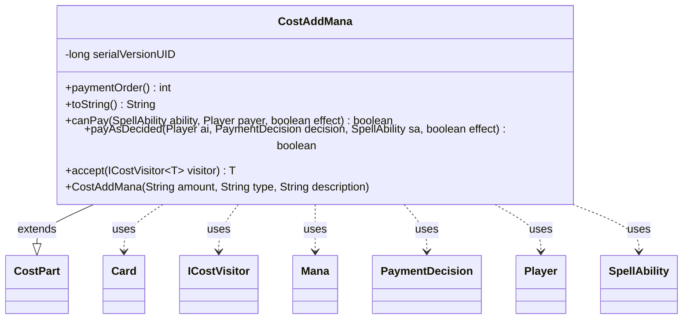

---
aliases:
  - CostAddMana
tags:
  - java/class
  - module/forge-game
  - pkg/forge/game/cost
fqn: forge.game.cost.CostAddMana
package: forge.game.cost
module: forge-game
kind: Class
---

# CostAddMana

**Package:** `forge.game.cost`   **Module:** `forge-game`   **Kind:** Class



## Relationships
**Extends:**
- [[forge.game.cost.CostPart|CostPart]]
**Uses:**
- [[forge.game.card.Card|Card]]
- [[forge.game.cost.ICostVisitor|ICostVisitor]]
- [[forge.game.cost.PaymentDecision|PaymentDecision]]
- [[forge.game.mana.Mana|Mana]]
- [[forge.game.player.Player|Player]]
- [[forge.game.spellability.SpellAbility|SpellAbility]]

## Design Description

`CostAddMana` is a concrete cost component that, despite its name, grants rather than consumes mana — it adds a specified quantity of mana of a given type to the paying player's pool. Extending the abstract `CostPart`, it overrides the standard cost contract: `canPay` always returns true since adding mana imposes no precondition, and `payAsDecided` constructs `Mana` objects (colorless for numeric types, otherwise resolved via `ManaAtom.fromName`) sourced from the `SpellAbility`'s host `Card` and deposits them into the player's mana pool. Its low `paymentOrder` of 5 ensures the mana is produced early, before costs that might spend it.

It collaborates with `SpellAbility` and `Player` to locate the source and target pool, and with `PaymentDecision` to determine the count. Participating in a visitor pattern, `accept` dispatches to `ICostVisitor`, keeping cost-type-specific handling external to the class hierarchy.

## Source
`forge-game/src/main/java/forge/game/cost/CostAddMana.java`

```java
/*
 * Forge: Play Magic: the Gathering.
 * Copyright (C) 2011  Forge Team
 *
 * This program is free software: you can redistribute it and/or modify
 * it under the terms of the GNU General Public License as published by
 * the Free Software Foundation, either version 3 of the License, or
 * (at your option) any later version.
 * 
 * This program is distributed in the hope that it will be useful,
 * but WITHOUT ANY WARRANTY; without even the implied warranty of
 * MERCHANTABILITY or FITNESS FOR A PARTICULAR PURPOSE.  See the
 * GNU General Public License for more details.
 * 
 * You should have received a copy of the GNU General Public License
 * along with this program.  If not, see <http://www.gnu.org/licenses/>.
 */
package forge.game.cost;

import forge.card.mana.ManaAtom;
import forge.game.card.Card;
import forge.game.mana.Mana;
import forge.game.player.Player;
import forge.game.spellability.SpellAbility;
import org.apache.commons.lang3.StringUtils;

import java.util.ArrayList;
import java.util.List;

/**
 * The Class CostAddMana.
 */
public class CostAddMana extends CostPart {
    /**
     * Serializables need a version ID.
     */
    private static final long serialVersionUID = 1L;

    /**
     * CostCostAddMana.
     * @param amount
     */
    public CostAddMana(final String amount, final String type, final String description) {
        super(amount, type, description);
    }

    public int paymentOrder() { return 5; }

    /*
     * (non-Javadoc)
     * 
     * @see forge.card.cost.CostPart#toString()
     */
    @Override
    public final String toString() {
        final StringBuilder sb = new StringBuilder();
        final Integer i = this.convertAmount();
        sb.append("Add ").append(StringUtils.repeat("{" + this.getType() + "}", i));
        return sb.toString();
    }

    /*
     * (non-Javadoc)
     * 
     * @see
     * forge.card.cost.CostPart#canPay(forge.card.spellability.SpellAbility,
     * forge.Card, forge.Player, forge.card.cost.Cost)
     */
    @Override
    public final boolean canPay(final SpellAbility ability, final Player payer, final boolean effect) {
        return true;
    }

    @Override
    public boolean payAsDecided(Player ai, PaymentDecision decision, SpellAbility sa, final boolean effect) {
        Card source = sa.getHostCard();

        List<Mana> manaProduced = new ArrayList<>();
        final String type = this.getType();
        for (int n = 0; n < decision.c; n++) {
            if (StringUtils.isNumeric(type)) {
                for (int i = Integer.parseInt(type); i > 0; i--) {
                    manaProduced.add(new Mana((byte)ManaAtom.COLORLESS, source, null, ai));
                }
            } else {
                byte attemptedMana = ManaAtom.fromName(type);
                // Commander rules removed mana generation to avoid colorless abusese
                /*
                if (cid != null) {
                    if (!cid.hasAnyColor(attemptedMana)) {
                        attemptedMana = (byte)ManaAtom.COLORLESS;
                    }
                }*/
                manaProduced.add(new Mana(attemptedMana, source, null, ai));
            }
        }
        ai.getManaPool().add(manaProduced);
        return true;
    }

    @Override
    public <T> T accept(ICostVisitor<T> visitor) {
        return visitor.visit(this);
    }
}
```

## Python
`forge/game/cost/CostAddMana.py`

```python
from forge.game.cost.CostPart import CostPart
from forge.card.mana.ManaAtom import ManaAtom
from forge.game.card.Card import Card
from forge.game.mana.Mana import Mana
from forge.game.player.Player import Player
from forge.game.spellability.SpellAbility import SpellAbility
from forge.game.cost.ICostVisitor import ICostVisitor
from forge.game.cost.PaymentDecision import PaymentDecision

from org.apache.commons.lang3.StringUtils import StringUtils


class CostAddMana(CostPart):
    """The Class CostAddMana."""

    serialVersionUID = 1

    def __init__(self, amount: str, type: str, description: str):
        """
        CostCostAddMana.
        :param amount:
        """
        super().__init__(amount, type, description)

    def paymentOrder(self) -> int:
        return 5

    def toString(self) -> str:
        sb = []
        i = self.convertAmount()
        sb.append("Add " + StringUtils.repeat("{" + self.getType() + "}", i))
        return "".join(sb)

    def canPay(self, ability: SpellAbility, payer: Player, effect: bool) -> bool:
        return True

    def payAsDecided(self, ai: Player, decision: PaymentDecision, sa: SpellAbility, effect: bool) -> bool:
        source = sa.getHostCard()

        manaProduced: list[Mana] = []
        type = self.getType()
        for n in range(decision.c):
            if StringUtils.isNumeric(type):
                i = int(type)
                while i > 0:
                    manaProduced.append(Mana(ManaAtom.COLORLESS & 0xFF, source, None, ai))
                    i -= 1
            else:
                attemptedMana = ManaAtom.fromName(type)
                # Commander rules removed mana generation to avoid colorless abusese
                #
                # if cid != None:
                #     if not cid.hasAnyColor(attemptedMana):
                #         attemptedMana = ManaAtom.COLORLESS
                #
                manaProduced.append(Mana(attemptedMana, source, None, ai))
        ai.getManaPool().add(manaProduced)
        return True

    def accept(self, visitor: ICostVisitor):
        return visitor.visit(self)
```
