---
aliases:
  - CostAdjustment
tags:
  - java/class
  - module/forge-game
  - pkg/forge/game/cost
fqn: forge.game.cost.CostAdjustment
package: forge.game.cost
module: forge-game
kind: Class
---

# CostAdjustment

**Package:** `forge.game.cost`   **Module:** `forge-game`   **Kind:** Class



```mermaid
classDiagram
    class CostAdjustment {
        +adjust(Cost cost, SpellAbility sa, boolean effect) Cost
        -applyRaiseCostAbility(Cost cost, SpellAbility sa, StaticAbility st) void
        +adjust(ManaCostBeingPaid cost, SpellAbility sa, Player payer, CardCollection cardsToDelveOut, boolean test, boolean effect) boolean
        -adjustCostByAssist(ManaCostBeingPaid cost, SpellAbility sa, boolean test) boolean
        -adjustCostByWaterbend(ManaCostBeingPaid cost, SpellAbility sa, Player payer, boolean test) void
        -adjustCostByConvokeOrImprovise(ManaCostBeingPaid cost, SpellAbility sa, Player payer, boolean artifacts, boolean creatures, boolean test) void
        -adjustCostByOffering(ManaCostBeingPaid cost, SpellAbility sa) void
        -adjustCostByEmerge(ManaCostBeingPaid cost, SpellAbility sa, Emerge emerge) void
        -applySetCostAbility(StaticAbility staticAbility, SpellAbility sa, ManaCostBeingPaid manaCost) void
        -applyReduceCostAbility(StaticAbility staticAbility, SpellAbility sa, ManaCostBeingPaid manaCost, int sumReduced) int
        -checkRequirement(SpellAbility sa, StaticAbility st) boolean
    }
    CostAdjustment ..> AbilityKey : uses
    CostAdjustment ..> Card : uses
    CostAdjustment ..> CardCollection : uses
    CostAdjustment ..> CardCollectionView : uses
    CostAdjustment ..> CardZoneTable : uses
    CostAdjustment ..> Cost : uses
    CostAdjustment ..> Emerge : uses
    CostAdjustment ..> Game : uses
    CostAdjustment ..> GameObject : uses
    CostAdjustment ..> KeywordInterface : uses
    CostAdjustment ..> ManaCost : uses
    CostAdjustment ..> ManaCostBeingPaid : uses
    CostAdjustment ..> ManaCostShard : uses
    CostAdjustment ..> Player : uses
    CostAdjustment ..> PlayerCollection : uses
    CostAdjustment ..> SpellAbility : uses
    CostAdjustment ..> StaticAbility : uses
    CostAdjustment ..> TargetChoices : uses
    CostAdjustment ..> Zone : uses
    CostAdjustment ..> ZoneType : uses
```

## Relationships
**Uses:**
- [[forge.card.mana.ManaCost|ManaCost]]
- [[forge.card.mana.ManaCostShard|ManaCostShard]]
- [[forge.game.Game|Game]]
- [[forge.game.GameObject|GameObject]]
- [[forge.game.ability.AbilityKey|AbilityKey]]
- [[forge.game.card.Card|Card]]
- [[forge.game.card.CardCollection|CardCollection]]
- [[forge.game.card.CardCollectionView|CardCollectionView]]
- [[forge.game.card.CardZoneTable|CardZoneTable]]
- [[forge.game.cost.Cost|Cost]]
- [[forge.game.keyword.Emerge|Emerge]]
- [[forge.game.keyword.KeywordInterface|KeywordInterface]]
- [[forge.game.mana.ManaCostBeingPaid|ManaCostBeingPaid]]
- [[forge.game.player.Player|Player]]
- [[forge.game.player.PlayerCollection|PlayerCollection]]
- [[forge.game.spellability.SpellAbility|SpellAbility]]
- [[forge.game.spellability.TargetChoices|TargetChoices]]
- [[forge.game.staticability.StaticAbility|StaticAbility]]
- [[forge.game.zone.Zone|Zone]]
- [[forge.game.zone.ZoneType|ZoneType]]

## Design Description

CostAdjustment is a stateless utility (all methods static) that centralizes the computation of how a spell's or ability's cost is modified before it is paid. Its first responsibility, via `adjust(Cost, …)`, is to raise the base Cost—applying Commander tax, explicit `RaiseCost` parameters, and battlefield-wide `RaiseCost` static abilities. Its second, via `adjust(ManaCostBeingPaid, …)`, drives the reduction and payment-alternative phase: it applies `ReduceCost`/`SetCost` static abilities in player-chosen order, then resolves keyword mechanics such as Delve, Convoke, Improvise, Offering, Emerge, Assist, and Waterbend.

The class collaborates broadly without owning state: it queries the Game for cards across Battlefield, Stack, and Command zones, filters StaticAbilities by mode, and delegates choices back to each Player's controller. The `checkRequirement` gatekeeper enforces a static ability's conditions and Valid* restrictions uniformly, while ordering guarantees—set costs applied last, generic reductions batched to handle hybrid mana—encode the game's precise rules sequencing.

## Source
`forge-game/src/main/java/forge/game/cost/CostAdjustment.java`

```java
package forge.game.cost;

import com.google.common.base.Strings;
import com.google.common.collect.Lists;
import forge.card.CardStateName;
import forge.card.mana.ManaAtom;
import forge.card.mana.ManaCost;
import forge.card.mana.ManaCostShard;
import forge.game.Game;
import forge.game.GameObject;
import forge.game.ability.AbilityKey;
import forge.game.ability.AbilityUtils;
import forge.game.card.*;
import forge.game.keyword.Emerge;
import forge.game.keyword.Keyword;
import forge.game.keyword.KeywordInterface;
import forge.game.mana.ManaCostBeingPaid;
import forge.game.player.Player;
import forge.game.player.PlayerCollection;
import forge.game.spellability.SpellAbility;
import forge.game.spellability.SpellAbilityPredicates;
import forge.game.spellability.TargetChoices;
import forge.game.staticability.StaticAbility;
import forge.game.staticability.StaticAbilityMode;
import forge.game.trigger.TriggerType;
import forge.game.zone.Zone;
import forge.game.zone.ZoneType;
import org.apache.commons.lang3.StringUtils;

import java.util.List;
import java.util.Map;
import java.util.Map.Entry;
import java.util.function.Predicate;

public class CostAdjustment {

    public static Cost adjust(final Cost cost, final SpellAbility sa, boolean effect) {
        if (sa.isTrigger() || cost == null || effect) {
            sa.setMaxWaterbend(cost);
            return cost;
        }

        final Player activator = sa.getActivatingPlayer();
        final Card host = sa.getHostCard();
        final Game game = activator.getGame();
        Cost result = cost.copy();
        boolean isStateChangeToFaceDown = false;

        if (sa.isSpell()) {
            if (sa.isCastFaceDown() && !host.isFaceDown()) {
                // Turn face down to apply cost modifiers correctly
                host.turnFaceDownNoUpdate();
                isStateChangeToFaceDown = true;
            }

            // Commander Tax there
            if (host.isCommander() && host.getCastFrom() != null && ZoneType.Command.equals(host.getCastFrom().getZoneType())) {
                int n = activator.getCommanderCast(host) * 2;
                if (n > 0) {
                    result.add(new Cost(ManaCost.get(n), false));
                }
            }
        }

        CardCollection cardsOnBattlefield = new CardCollection(game.getCardsIn(ZoneType.Battlefield));
        cardsOnBattlefield.addAll(game.getCardsIn(ZoneType.Stack));
        cardsOnBattlefield.addAll(game.getCardsIn(ZoneType.Command));
        if (!cardsOnBattlefield.contains(host)) {
            cardsOnBattlefield.add(host);
        }
        final List<StaticAbility> raiseAbilities = Lists.newArrayList();

        // Sort abilities to apply them in proper order
        for (Card c : cardsOnBattlefield) {
            for (final StaticAbility stAb : c.getStaticAbilities()) {
                if (stAb.checkMode(StaticAbilityMode.RaiseCost)) {
                    raiseAbilities.add(stAb);
                }
            }
        }

        if (sa.hasParam("RaiseCost")) {
            String raise = sa.getParam("RaiseCost");
            Cost inc;
            if (sa.hasSVar(raise)) {
                inc = new Cost(ManaCost.get(AbilityUtils.calculateAmount(host, raise, sa)), false);
            } else {
                inc = new Cost(raise, false);
            }
            result.add(inc);
        }

        for (final StaticAbility stAb : raiseAbilities) {
            applyRaiseCostAbility(result, sa, stAb);
        }

        // Reset card state (if changed)
        if (isStateChangeToFaceDown) {
            host.setState(CardStateName.Original, false);
            host.setFaceDown(false);
        }

        sa.setMaxWaterbend(result);

        return result;
    }

    private static void applyRaiseCostAbility(final Cost cost, final SpellAbility sa, final StaticAbility st) {
        final Card hostCard = st.getHostCard();

        if (!checkRequirement(sa, st)) {
            return;
        }

        final String scost = st.getParamOrDefault("Cost", "1");
        int count = 0;

        if (st.hasParam("ForEachShard")) {
            ManaCost mc = ManaCost.ZERO;
            if (sa.isSpell()) {
                mc = sa.getHostCard().getManaCost();
            } else if (sa.isAbility() && sa.getPayCosts().hasManaCost()) {
                // TODO check for AlternateCost$, it should always be part of the activation cost too
                mc = sa.getPayCosts().getCostMana().getMana();
            }
            byte atom = ManaAtom.fromName(st.getParam("ForEachShard").toLowerCase());
            for (ManaCostShard shard : mc) {
                if ((shard.getColorMask() & atom) != 0) {
                    ++count;
                }
            }
        } else if (st.hasParam("Amount")) {
            String amount = st.getParam("Amount");
            if ("Escalate".equals(amount)) {
                SpellAbility tail = sa.getTailAbility();
                if (tail.hasSVar("CharmOrder")) {
                    count = tail.getSVarInt("CharmOrder") - 1;
                }
            } else if ("Strive".equals(amount)) {
                for (TargetChoices tc : sa.getAllTargetChoices()) {
                    count += tc.size();
                }
                --count;
            } else if ("Spree".equals(amount) || "Tiered".equals(amount)) {
                SpellAbility sub = sa;
                while (sub != null) {
                    if (sub.hasParam("ModeCost")) {
                        Cost part = new Cost(sub.getParam("ModeCost"), sa.isAbility(), sa.getHostCard().equals(hostCard));
                        cost.mergeTo(part, count, sa);
                    }
                    sub = sub.getSubAbility();
                }
            } else if (StringUtils.isNumeric(amount)) {
                count = Integer.parseInt(amount);
            } else if (st.hasParam("Relative")) {
                // grab SVar here already to avoid potential collision when SA has one with same name
                count = AbilityUtils.calculateAmount(hostCard, st.hasSVar(amount) ? st.getSVar(amount) : amount, sa);
            } else {
                count = AbilityUtils.calculateAmount(hostCard, amount, st);
            }
        } else {
            // Amount 1 as default
            count = 1;
        }
        if (count > 0) {
            Cost part = new Cost(scost, sa.isAbility(), sa.getHostCard().equals(hostCard));
            cost.mergeTo(part, count, sa);
        }
    }

    // If cardsToDelveOut is null, will immediately exile the delved cards and remember them on the host card.
    // Otherwise, will return them in cardsToDelveOut and the caller is responsible for doing the above.
    public static boolean adjust(ManaCostBeingPaid cost, final SpellAbility sa, final Player payer, CardCollection cardsToDelveOut, boolean test, boolean effect) {
        if (effect) {
            adjustCostByWaterbend(cost, sa, payer, test);
        }
        if (effect || sa.isTrigger() || sa.isReplacementAbility()) {
            return true;
        }

        final Player activator = sa.getActivatingPlayer();
        final Game game = activator.getGame();
        final Card host = sa.getHostCard();

        boolean isStateChangeToFaceDown = false;
        if (sa.isSpell() && sa.isCastFaceDown() && !host.isFaceDown()) {
            // Turn face down to apply cost modifiers correctly
            host.turnFaceDownNoUpdate();
            isStateChangeToFaceDown = true;
        }

        CardCollection cardsOnBattlefield = new CardCollection(game.getCardsIn(ZoneType.Battlefield));
        cardsOnBattlefield.addAll(game.getCardsIn(ZoneType.Stack));
        cardsOnBattlefield.addAll(game.getCardsIn(ZoneType.Command));
        if (!cardsOnBattlefield.contains(host)) {
            cardsOnBattlefield.add(host);
        }
        final List<StaticAbility> reduceAbilities = Lists.newArrayList();
        final List<StaticAbility> setAbilities = Lists.newArrayList();

        // Sort abilities to apply them in proper order
        for (Card c : cardsOnBattlefield) {
            for (final StaticAbility stAb : c.getStaticAbilities()) {
                if (stAb.checkMode(StaticAbilityMode.ReduceCost) && checkRequirement(sa, stAb)) {
                    reduceAbilities.add(stAb);
                }
                else if (stAb.checkMode(StaticAbilityMode.SetCost)) {
                    setAbilities.add(stAb);
                }
            }
        }

        int sumGeneric = 0;
        if (sa.hasParam("ReduceCost")) {
            String cst = sa.getParam("ReduceCost");
            String amt = sa.getParamOrDefault("ReduceAmount", cst);
            int num = AbilityUtils.calculateAmount(host, amt, sa);

            if (sa.hasParam("ReduceAmount") && num > 0) {
                cost.subtractManaCost(new ManaCost(Strings.repeat(cst + " ", num)));
            } else {
                sumGeneric += num;
            }
        }
        if (sa.isPowerUp() && host.enteredThisTurn()) {
            // TODO handle hybrid ManaCost
            cost.subtractManaCost(host.getManaCost());
        }

        while (!reduceAbilities.isEmpty()) {
            StaticAbility choice = activator.getController().chooseSingleStaticAbility(reduceAbilities);
            reduceAbilities.remove(choice);
            sumGeneric += applyReduceCostAbility(choice, sa, cost, sumGeneric);
        }
        // need to reduce generic extra because of 2 hybrid mana
        cost.decreaseGenericMana(sumGeneric);

        if (sa.isSpell()) {
            for (String pip : sa.getPipsToReduce()) {
                cost.decreaseShard(ManaCostShard.parseNonGeneric(pip), 1);
            }
        }

        if (sa.isSpell() && sa.isOffering()) {
            adjustCostByOffering(cost, sa);
        }
        if (sa.isSpell() && sa.isEmerge() && sa.getKeyword() instanceof Emerge emerge) {
            adjustCostByEmerge(cost, sa, emerge);
        }

        // Set cost (only used by Trinisphere) is applied last
        for (final StaticAbility stAb : setAbilities) {
            applySetCostAbility(stAb, sa, cost);
        }

        if (sa.isSpell()) {
            if (host.hasKeyword(Keyword.ASSIST) && !adjustCostByAssist(cost, sa, test)) {
                return false;
            }

            if (host.hasKeyword(Keyword.DELVE)) {
                host.clearDelved();

                final CardZoneTable table = new CardZoneTable();
                final CardCollection mutableGrave = new CardCollection(activator.getCardsIn(ZoneType.Graveyard));
                final CardCollectionView toExile = activator.getController().chooseCardsToDelve(cost.getUnpaidShards(ManaCostShard.GENERIC), mutableGrave);
                for (final Card c : toExile) {
                    cost.decreaseGenericMana(1);
                    if (cardsToDelveOut != null) {
                        cardsToDelveOut.add(c);
                    } else if (!test) {
                        host.addDelved(c);
                        final Card d = game.getAction().exile(c, null, null);
                        host.addExiledCard(d);
                        d.setExiledWith(host);
                        d.setExiledBy(host.getController());
                        d.setExiledSA(sa);
                        table.put(ZoneType.Graveyard, d.getZone().getZoneType(), d);
                    }
                }
                table.triggerChangesZoneAll(game, sa);
            }
            if (host.hasKeyword(Keyword.CONVOKE)) {
                adjustCostByConvokeOrImprovise(cost, sa, activator, false, true, test);
            }
            if (host.hasKeyword(Keyword.IMPROVISE)) {
                adjustCostByConvokeOrImprovise(cost, sa, activator, true, false, test);
            }
        }

        if (sa.hasParam("TapCreaturesForMana")) {
            adjustCostByConvokeOrImprovise(cost, sa, activator, false, true, test);
        }

        adjustCostByWaterbend(cost, sa, payer, test);

        // Reset card state (if changed)
        if (isStateChangeToFaceDown) {
            host.setFaceDown(false);
            host.setState(CardStateName.Original, false);
        }

        return true;
    }
    // GetSpellCostChange

    private static boolean adjustCostByAssist(ManaCostBeingPaid cost, final SpellAbility sa, boolean test) {
        // 702.132a Assist is a static ability that modifies the rules of paying for the spell with assist (see rules 601.2g-h).
        // If the total cost to cast a spell with assist includes a generic mana component, before you activate mana abilities while casting it, you may choose another player.
        // That player has a chance to activate mana abilities. Once that player chooses not to activate any more mana abilities, you have a chance to activate mana abilities.
        // Before you begin to pay the total cost of the spell, the player you chose may pay for any amount of the generic mana in the spell’s total cost.
        int genericLeft = cost.getUnpaidShards(ManaCostShard.GENERIC);
        if (genericLeft == 0) {
            return true;
        }

        Player activator = sa.getActivatingPlayer();
        PlayerCollection otherPlayers = activator.getAllOtherPlayers();

        Player assistant = activator.getController().choosePlayerToAssistPayment(otherPlayers, sa, "Choose a player to assist paying this spell", genericLeft);
        if (assistant == null) {
            return true;
        }
        int requestedAmount = genericLeft;
        // TODO: Nice to have. Ask the player how much mana you are hoping someone will pay.
        return assistant.getController().helpPayForAssistSpell(cost, sa, genericLeft, requestedAmount);
    }

    private static void adjustCostByWaterbend(ManaCostBeingPaid cost, SpellAbility sa, Player payer, boolean test) {
        Integer maxWaterbend = sa.getMaxWaterbend();
        if (maxWaterbend != null && maxWaterbend > 0) {
            adjustCostByConvokeOrImprovise(cost, sa, payer, true, true, test);
        }
    }

    private static void adjustCostByConvokeOrImprovise(ManaCostBeingPaid cost, final SpellAbility sa, final Player payer, boolean artifacts, boolean creatures, boolean test) {
        if (creatures && !artifacts) {
            sa.clearTappedForConvoke();
        }

        CardCollectionView untappedCards = CardLists.filter(payer.getCardsIn(ZoneType.Battlefield),
                CardPredicates.CAN_TAP);

        Integer maxReduction = null;
        if (artifacts && creatures) {
            maxReduction = sa.getMaxWaterbend();
            Predicate <Card> isArtifactOrCreature = card -> card.isArtifact() || card.isCreature();
            untappedCards = CardLists.filter(untappedCards, isArtifactOrCreature);
        } else if (artifacts) {
            untappedCards = CardLists.filter(untappedCards, CardPredicates.ARTIFACTS);
        } else {
            untappedCards = CardLists.filter(untappedCards, CardPredicates.CREATURES);
        }

        Map<Card, ManaCostShard> convokedCards = payer.getController().chooseCardsForConvokeOrImprovise(sa,
                cost.toManaCost(), untappedCards, artifacts, creatures, maxReduction);

        CardCollection tapped = new CardCollection();
        for (final Entry<Card, ManaCostShard> conv : convokedCards.entrySet()) {
            Card c = conv.getKey();
            if (creatures && !artifacts) {
                sa.addTappedForConvoke(c);
            }
            cost.decreaseShard(conv.getValue(), 1);
            if (!test) {
                if (c.tap(true, sa, payer)) tapped.add(c);
            }
        }
        if (!tapped.isEmpty()) {
            final Map<AbilityKey, Object> runParams = AbilityKey.newMap();
            runParams.put(AbilityKey.Cards, tapped);
            payer.getGame().getTriggerHandler().runTrigger(TriggerType.TapAll, runParams, false);
        }
    }

    private static void adjustCostByOffering(final ManaCostBeingPaid cost, final SpellAbility sa) {
        String offeringType = "";
        for (KeywordInterface inst : sa.getHostCard().getKeywords(Keyword.OFFERING)) {
            final String kw = inst.getOriginal();
            offeringType = kw.split(":")[1];
            break;
        }

        CardCollectionView canOffer = CardLists.filter(sa.getActivatingPlayer().getCardsIn(ZoneType.Battlefield),
                CardPredicates.isType(offeringType), CardPredicates.canBeSacrificedBy(sa, false));

        final CardCollectionView toSacList = sa.getHostCard().getController().getController().choosePermanentsToSacrifice(sa, 0, 1, canOffer, offeringType);

        if (toSacList.isEmpty()) {
            return;
        }
        Card toSac = toSacList.getFirst();

        cost.subtractManaCost(toSac.getManaCost());

        sa.setSacrificedAsOffering(toSac);
        toSac.setUsedToPay(true); //stop it from interfering with mana input
    }

    private static void adjustCostByEmerge(final ManaCostBeingPaid cost, final SpellAbility sa, final Emerge emerge) {
        String validStr = emerge.getValidType();
        Player p = sa.getActivatingPlayer();
        CardCollectionView canEmerge = CardLists.filter(p.getCardsIn(ZoneType.Battlefield),
                CardPredicates.restriction(validStr, p, sa.getHostCard(), sa),
                CardPredicates.canBeSacrificedBy(sa, false));

        final CardCollectionView toSacList = p.getController().choosePermanentsToSacrifice(sa, 0, 1, canEmerge, validStr);

        if (toSacList.isEmpty()) {
            return;
        }
        Card toSac = toSacList.getFirst();

        cost.decreaseGenericMana(toSac.getCMC());

        sa.setSacrificedAsEmerge(toSac);
        toSac.setUsedToPay(true); //stop it from interfering with mana input
    }
    /**
     * Applies applyRaiseCostAbility ability.
     * 
     * @param staticAbility
     *            a StaticAbility
     * @param sa
     *            the SpellAbility
     * @param manaCost
     *            a ManaCost
     */
    private  static void applySetCostAbility(final StaticAbility staticAbility, final SpellAbility sa, final ManaCostBeingPaid manaCost) {
        final String amount = staticAbility.getParam("Amount");

        if (!checkRequirement(sa, staticAbility)) {
            return;
        }

        int value = Integer.parseInt(amount);

        if (staticAbility.hasParam("RaiseTo")) {
            value = Math.max(value - manaCost.getConvertedManaCost(), 0);
        }

        manaCost.increaseGenericMana(value);
    }

    /**
     * Applies applyReduceCostAbility ability.
     * 
     * @param staticAbility
     *            a StaticAbility
     * @param sa
     *            the SpellAbility
     * @param manaCost
     *            a ManaCost
     */
    private static int applyReduceCostAbility(final StaticAbility staticAbility, final SpellAbility sa, final ManaCostBeingPaid manaCost, int sumReduced) {
        //Can't reduce zero cost
        if (manaCost.toString().equals("{0}")) {
            return 0;
        }
        final Card hostCard = staticAbility.getHostCard();
        final Card card = sa.getHostCard();
        final String amount = staticAbility.getParam("Amount");

        int value;
        if ("AffectedX".equals(amount)) {
            value = AbilityUtils.calculateAmount(card, amount, staticAbility);
        } else if ("Undaunted".equals(amount)) {
            value = card.getController().getOpponents().size();
        } else if (staticAbility.hasParam("Relative")) {
            // TODO: update cards with "This spell costs X less to cast...if you..."
            // The caster is sa.getActivatingPlayer()
            // cards like Hostage Taker can cast spells from other players.
            value = AbilityUtils.calculateAmount(hostCard, staticAbility.hasSVar(amount) ? staticAbility.getSVar(amount) : amount, sa);
        } else {
            value = AbilityUtils.calculateAmount(hostCard, amount, staticAbility);
        }

        if (staticAbility.hasParam("UpTo")) {
            value = sa.getActivatingPlayer().getController().chooseNumberForCostReduction(sa, 0, value);
        }

        if (staticAbility.hasParam("Color")) {
            final String color = staticAbility.getParam("Color");
            int sumGeneric = 0;
            // might be problematic for weird hybrid combinations
            for (final String cost : color.split(" ")) {
                if (StringUtils.isNumeric(cost)) {
                    sumGeneric += Integer.parseInt(cost) * value;
                } else if (staticAbility.hasParam("IgnoreGeneric")) {
                    manaCost.decreaseShard(ManaCostShard.parseNonGeneric(cost), value);
                } else {
                    manaCost.subtractManaCost(new ManaCost(Strings.repeat(cost + " ", value)));
                }
            }
            return sumGeneric;
        } else {
            int minMana = 0;
            if (staticAbility.hasParam("MinMana")) {
                minMana = Integer.parseInt(staticAbility.getParam("MinMana"));
            }

            final int maxReduction = manaCost.getConvertedManaCost() - minMana - sumReduced;
            if (maxReduction > 0) {
                return Math.min(value, maxReduction);
            }
        }
        return 0;
    }    

    private static boolean checkRequirement(final SpellAbility sa, final StaticAbility st) {
        if (!st.checkConditions()) {
            return false;
        }

        final Card hostCard = st.getHostCard();
        final Player controller = hostCard.getController();
        final Player activator = sa.getActivatingPlayer();
        final Card card = sa.getHostCard();
        final Game game = hostCard.getGame();

        if (!st.matchesValidParam("ValidCard", card)) {
            return false;
        }
        if (!st.matchesValidParam("ValidSpell", sa)) {
            return false;
        }
        if (!st.matchesValidParam("Activator", activator)) {
            return false;
        }

        if (st.hasParam("Type")) {
            switch (st.getParam("Type")) {
                case "Spell" -> {
                    if (!sa.isSpell()) {
                        return false;
                    }
                    if (st.hasParam("OnlyFirstSpell")) {
                        if (activator == null) {
                            return false;
                        }
                        List<Card> list;
                        if (st.hasParam("ValidCard")) {
                            list = CardUtil.getThisTurnCast(st.getParam("ValidCard"), hostCard, st, controller);
                        } else {
                            list = game.getStack().getSpellsCastThisTurn();
                        }

                        if (st.hasParam("ValidSpell")) {
                            list = CardLists.filterAsList(list, CardPredicates.castSA(
                                    SpellAbilityPredicates.isValid(st.getParam("ValidSpell").split(","), controller, hostCard, st))
                            );
                        }

                        if (!CardLists.filterControlledBy(list, activator).isEmpty()) return false;
                    }
                }
                case "Ability" -> {
                    if (!sa.isActivatedAbility() || sa.isReplacementAbility()) {
                        return false;
                    }
                }
                case "Foretell" -> {
                    if (!sa.isForetelling()) {
                        return false;
                    }
                    if (st.hasParam("FirstForetell") && activator.getNumForetoldThisTurn() > 0) {
                        return false;
                    }
                }
            }

        }
        if (st.hasParam("AffectedZone")) {
            List<ZoneType> zones = ZoneType.listValueOf(st.getParam("AffectedZone"));
            if (sa.isSpell() && card.wasCast()) {
                if (!zones.contains(card.getCastFrom().getZoneType())) {
                    return false;
                }
            } else {
                Zone z = card.getLastKnownZone();
                if (z == null || !zones.contains(z.getZoneType())) {
                    return false;
                }
            }
        }
        if (st.hasParam("ValidTarget")) {
            SpellAbility curSa = sa;
            boolean targetValid = false;
            outer: while (curSa != null) {
                if (!curSa.usesTargeting()) {
                    curSa = curSa.getSubAbility();
                    continue;
                }
                for (GameObject target : curSa.getTargets()) {
                    if (target.isValid(st.getParam("ValidTarget").split(","), controller, hostCard, curSa)) {
                        targetValid = true;
                        break outer;
                    }
                }
                curSa = curSa.getSubAbility();
            }
            if (st.hasParam("UnlessValidTarget")) {
                if (targetValid) {
                    return false;
                }
            } else if (!targetValid) {
                return false;
            }
        }
        return true;
    }
}
```

## Python
`forge/game/cost/CostAdjustment.py`

```python
from forge.card.CardStateName import CardStateName
from forge.card.mana.ManaAtom import ManaAtom
from forge.card.mana.ManaCost import ManaCost
from forge.card.mana.ManaCostShard import ManaCostShard
from forge.game.Game import Game
from forge.game.GameObject import GameObject
from forge.game.ability.AbilityKey import AbilityKey
from forge.game.ability.AbilityUtils import AbilityUtils
from forge.game.card.Card import Card
from forge.game.card.CardCollection import CardCollection
from forge.game.card.CardCollectionView import CardCollectionView
from forge.game.card.CardZoneTable import CardZoneTable
from forge.game.card.CardLists import CardLists
from forge.game.card.CardPredicates import CardPredicates
from forge.game.card.CardUtil import CardUtil
from forge.game.cost.Cost import Cost
from forge.game.keyword.Emerge import Emerge
from forge.game.keyword.Keyword import Keyword
from forge.game.keyword.KeywordInterface import KeywordInterface
from forge.game.mana.ManaCostBeingPaid import ManaCostBeingPaid
from forge.game.player.Player import Player
from forge.game.player.PlayerCollection import PlayerCollection
from forge.game.spellability.SpellAbility import SpellAbility
from forge.game.spellability.SpellAbilityPredicates import SpellAbilityPredicates
from forge.game.spellability.TargetChoices import TargetChoices
from forge.game.staticability.StaticAbility import StaticAbility
from forge.game.staticability.StaticAbilityMode import StaticAbilityMode
from forge.game.trigger.TriggerType import TriggerType
from forge.game.zone.Zone import Zone
from forge.game.zone.ZoneType import ZoneType


class CostAdjustment:

    @staticmethod
    def adjust(cost: Cost, sa: SpellAbility, effect: bool) -> Cost:
        if sa.isTrigger() or cost is None or effect:
            sa.setMaxWaterbend(cost)
            return cost

        activator = sa.getActivatingPlayer()
        host = sa.getHostCard()
        game = activator.getGame()
        result = cost.copy()
        isStateChangeToFaceDown = False

        if sa.isSpell():
            if sa.isCastFaceDown() and not host.isFaceDown():
                # Turn face down to apply cost modifiers correctly
                host.turnFaceDownNoUpdate()
                isStateChangeToFaceDown = True

            # Commander Tax there
            if host.isCommander() and host.getCastFrom() is not None and ZoneType.Command == host.getCastFrom().getZoneType():
                n = activator.getCommanderCast(host) * 2
                if n > 0:
                    result.add(Cost(ManaCost.get(n), False))

        cardsOnBattlefield = CardCollection(game.getCardsIn(ZoneType.Battlefield))
        cardsOnBattlefield.addAll(game.getCardsIn(ZoneType.Stack))
        cardsOnBattlefield.addAll(game.getCardsIn(ZoneType.Command))
        if not cardsOnBattlefield.contains(host):
            cardsOnBattlefield.add(host)
        raiseAbilities: list[StaticAbility] = []

        # Sort abilities to apply them in proper order
        for c in cardsOnBattlefield:
            for stAb in c.getStaticAbilities():
                if stAb.checkMode(StaticAbilityMode.RaiseCost):
                    raiseAbilities.append(stAb)

        if sa.hasParam("RaiseCost"):
            raise_ = sa.getParam("RaiseCost")
            if sa.hasSVar(raise_):
                inc = Cost(ManaCost.get(AbilityUtils.calculateAmount(host, raise_, sa)), False)
            else:
                inc = Cost(raise_, False)
            result.add(inc)

        for stAb in raiseAbilities:
            CostAdjustment.applyRaiseCostAbility(result, sa, stAb)

        # Reset card state (if changed)
        if isStateChangeToFaceDown:
            host.setState(CardStateName.Original, False)
            host.setFaceDown(False)

        sa.setMaxWaterbend(result)

        return result

    @staticmethod
    def applyRaiseCostAbility(cost: Cost, sa: SpellAbility, st: StaticAbility) -> None:
        hostCard = st.getHostCard()

        if not CostAdjustment.checkRequirement(sa, st):
            return

        scost = st.getParamOrDefault("Cost", "1")
        count = 0

        if st.hasParam("ForEachShard"):
            mc = ManaCost.ZERO
            if sa.isSpell():
                mc = sa.getHostCard().getManaCost()
            elif sa.isAbility() and sa.getPayCosts().hasManaCost():
                # TODO check for AlternateCost$, it should always be part of the activation cost too
                mc = sa.getPayCosts().getCostMana().getMana()
            atom = ManaAtom.fromName(st.getParam("ForEachShard").lower())
            for shard in mc:
                if (shard.getColorMask() & atom) != 0:
                    count += 1
        elif st.hasParam("Amount"):
            amount = st.getParam("Amount")
            if "Escalate" == amount:
                tail = sa.getTailAbility()
                if tail.hasSVar("CharmOrder"):
                    count = tail.getSVarInt("CharmOrder") - 1
            elif "Strive" == amount:
                for tc in sa.getAllTargetChoices():
                    count += tc.size()
                count -= 1
            elif "Spree" == amount or "Tiered" == amount:
                sub = sa
                while sub is not None:
                    if sub.hasParam("ModeCost"):
                        part = Cost(sub.getParam("ModeCost"), sa.isAbility(), sa.getHostCard() == hostCard)
                        cost.mergeTo(part, count, sa)
                    sub = sub.getSubAbility()
            elif amount.isdigit():
                count = int(amount)
            elif st.hasParam("Relative"):
                # grab SVar here already to avoid potential collision when SA has one with same name
                count = AbilityUtils.calculateAmount(hostCard, st.getSVar(amount) if st.hasSVar(amount) else amount, sa)
            else:
                count = AbilityUtils.calculateAmount(hostCard, amount, st)
        else:
            # Amount 1 as default
            count = 1
        if count > 0:
            part = Cost(scost, sa.isAbility(), sa.getHostCard() == hostCard)
            cost.mergeTo(part, count, sa)

    # If cardsToDelveOut is null, will immediately exile the delved cards and remember them on the host card.
    # Otherwise, will return them in cardsToDelveOut and the caller is responsible for doing the above.
    @staticmethod
    def adjust(cost: ManaCostBeingPaid, sa: SpellAbility, payer: Player, cardsToDelveOut: CardCollection, test: bool, effect: bool) -> bool:
        if effect:
            CostAdjustment.adjustCostByWaterbend(cost, sa, payer, test)
        if effect or sa.isTrigger() or sa.isReplacementAbility():
            return True

        activator = sa.getActivatingPlayer()
        game = activator.getGame()
        host = sa.getHostCard()

        isStateChangeToFaceDown = False
        if sa.isSpell() and sa.isCastFaceDown() and not host.isFaceDown():
            # Turn face down to apply cost modifiers correctly
            host.turnFaceDownNoUpdate()
            isStateChangeToFaceDown = True

        cardsOnBattlefield = CardCollection(game.getCardsIn(ZoneType.Battlefield))
        cardsOnBattlefield.addAll(game.getCardsIn(ZoneType.Stack))
        cardsOnBattlefield.addAll(game.getCardsIn(ZoneType.Command))
        if not cardsOnBattlefield.contains(host):
            cardsOnBattlefield.add(host)
        reduceAbilities: list[StaticAbility] = []
        setAbilities: list[StaticAbility] = []

        # Sort abilities to apply them in proper order
        for c in cardsOnBattlefield:
            for stAb in c.getStaticAbilities():
                if stAb.checkMode(StaticAbilityMode.ReduceCost) and CostAdjustment.checkRequirement(sa, stAb):
                    reduceAbilities.append(stAb)
                elif stAb.checkMode(StaticAbilityMode.SetCost):
                    setAbilities.append(stAb)

        sumGeneric = 0
        if sa.hasParam("ReduceCost"):
            cst = sa.getParam("ReduceCost")
            amt = sa.getParamOrDefault("ReduceAmount", cst)
            num = AbilityUtils.calculateAmount(host, amt, sa)

            if sa.hasParam("ReduceAmount") and num > 0:
                cost.subtractManaCost(ManaCost((cst + " ") * num))
            else:
                sumGeneric += num
        if sa.isPowerUp() and host.enteredThisTurn():
            # TODO handle hybrid ManaCost
            cost.subtractManaCost(host.getManaCost())

        while reduceAbilities:
            choice = activator.getController().chooseSingleStaticAbility(reduceAbilities)
            reduceAbilities.remove(choice)
            sumGeneric += CostAdjustment.applyReduceCostAbility(choice, sa, cost, sumGeneric)
        # need to reduce generic extra because of 2 hybrid mana
        cost.decreaseGenericMana(sumGeneric)

        if sa.isSpell():
            for pip in sa.getPipsToReduce():
                cost.decreaseShard(ManaCostShard.parseNonGeneric(pip), 1)

        if sa.isSpell() and sa.isOffering():
            CostAdjustment.adjustCostByOffering(cost, sa)
        if sa.isSpell() and sa.isEmerge() and isinstance(sa.getKeyword(), Emerge):
            emerge = sa.getKeyword()
            CostAdjustment.adjustCostByEmerge(cost, sa, emerge)

        # Set cost (only used by Trinisphere) is applied last
        for stAb in setAbilities:
            CostAdjustment.applySetCostAbility(stAb, sa, cost)

        if sa.isSpell():
            if host.hasKeyword(Keyword.ASSIST) and not CostAdjustment.adjustCostByAssist(cost, sa, test):
                return False

            if host.hasKeyword(Keyword.DELVE):
                host.clearDelved()

                table = CardZoneTable()
                mutableGrave = CardCollection(activator.getCardsIn(ZoneType.Graveyard))
                toExile = activator.getController().chooseCardsToDelve(cost.getUnpaidShards(ManaCostShard.GENERIC), mutableGrave)
                for c in toExile:
                    cost.decreaseGenericMana(1)
                    if cardsToDelveOut is not None:
                        cardsToDelveOut.add(c)
                    elif not test:
                        host.addDelved(c)
                        d = game.getAction().exile(c, None, None)
                        host.addExiledCard(d)
                        d.setExiledWith(host)
                        d.setExiledBy(host.getController())
                        d.setExiledSA(sa)
                        table.put(ZoneType.Graveyard, d.getZone().getZoneType(), d)
                table.triggerChangesZoneAll(game, sa)
            if host.hasKeyword(Keyword.CONVOKE):
                CostAdjustment.adjustCostByConvokeOrImprovise(cost, sa, activator, False, True, test)
            if host.hasKeyword(Keyword.IMPROVISE):
                CostAdjustment.adjustCostByConvokeOrImprovise(cost, sa, activator, True, False, test)

        if sa.hasParam("TapCreaturesForMana"):
            CostAdjustment.adjustCostByConvokeOrImprovise(cost, sa, activator, False, True, test)

        CostAdjustment.adjustCostByWaterbend(cost, sa, payer, test)

        # Reset card state (if changed)
        if isStateChangeToFaceDown:
            host.setFaceDown(False)
            host.setState(CardStateName.Original, False)

        return True

    # GetSpellCostChange

    @staticmethod
    def adjustCostByAssist(cost: ManaCostBeingPaid, sa: SpellAbility, test: bool) -> bool:
        # 702.132a Assist is a static ability that modifies the rules of paying for the spell with assist (see rules 601.2g-h).
        # If the total cost to cast a spell with assist includes a generic mana component, before you activate mana abilities while casting it, you may choose another player.
        # That player has a chance to activate mana abilities. Once that player chooses not to activate any more mana abilities, you have a chance to activate mana abilities.
        # Before you begin to pay the total cost of the spell, the player you chose may pay for any amount of the generic mana in the spell's total cost.
        genericLeft = cost.getUnpaidShards(ManaCostShard.GENERIC)
        if genericLeft == 0:
            return True

        activator = sa.getActivatingPlayer()
        otherPlayers = activator.getAllOtherPlayers()

        assistant = activator.getController().choosePlayerToAssistPayment(otherPlayers, sa, "Choose a player to assist paying this spell", genericLeft)
        if assistant is None:
            return True
        requestedAmount = genericLeft
        # TODO: Nice to have. Ask the player how much mana you are hoping someone will pay.
        return assistant.getController().helpPayForAssistSpell(cost, sa, genericLeft, requestedAmount)

    @staticmethod
    def adjustCostByWaterbend(cost: ManaCostBeingPaid, sa: SpellAbility, payer: Player, test: bool) -> None:
        maxWaterbend = sa.getMaxWaterbend()
        if maxWaterbend is not None and maxWaterbend > 0:
            CostAdjustment.adjustCostByConvokeOrImprovise(cost, sa, payer, True, True, test)

    @staticmethod
    def adjustCostByConvokeOrImprovise(cost: ManaCostBeingPaid, sa: SpellAbility, payer: Player, artifacts: bool, creatures: bool, test: bool) -> None:
        if creatures and not artifacts:
            sa.clearTappedForConvoke()

        untappedCards = CardLists.filter(payer.getCardsIn(ZoneType.Battlefield),
                CardPredicates.CAN_TAP)

        maxReduction = None
        if artifacts and creatures:
            maxReduction = sa.getMaxWaterbend()
            isArtifactOrCreature = lambda card: card.isArtifact() or card.isCreature()
            untappedCards = CardLists.filter(untappedCards, isArtifactOrCreature)
        elif artifacts:
            untappedCards = CardLists.filter(untappedCards, CardPredicates.ARTIFACTS)
        else:
            untappedCards = CardLists.filter(untappedCards, CardPredicates.CREATURES)

        convokedCards = payer.getController().chooseCardsForConvokeOrImprovise(sa,
                cost.toManaCost(), untappedCards, artifacts, creatures, maxReduction)

        tapped = CardCollection()
        for c, shard in convokedCards.items():
            if creatures and not artifacts:
                sa.addTappedForConvoke(c)
            cost.decreaseShard(shard, 1)
            if not test:
                if c.tap(True, sa, payer):
                    tapped.add(c)
        if not tapped.isEmpty():
            runParams = AbilityKey.newMap()
            runParams.put(AbilityKey.Cards, tapped)
            payer.getGame().getTriggerHandler().runTrigger(TriggerType.TapAll, runParams, False)

    @staticmethod
    def adjustCostByOffering(cost: ManaCostBeingPaid, sa: SpellAbility) -> None:
        offeringType = ""
        for inst in sa.getHostCard().getKeywords(Keyword.OFFERING):
            kw = inst.getOriginal()
            offeringType = kw.split(":")[1]
            break

        canOffer = CardLists.filter(sa.getActivatingPlayer().getCardsIn(ZoneType.Battlefield),
                CardPredicates.isType(offeringType), CardPredicates.canBeSacrificedBy(sa, False))

        toSacList = sa.getHostCard().getController().getController().choosePermanentsToSacrifice(sa, 0, 1, canOffer, offeringType)

        if toSacList.isEmpty():
            return
        toSac = toSacList.getFirst()

        cost.subtractManaCost(toSac.getManaCost())

        sa.setSacrificedAsOffering(toSac)
        toSac.setUsedToPay(True)  # stop it from interfering with mana input

    @staticmethod
    def adjustCostByEmerge(cost: ManaCostBeingPaid, sa: SpellAbility, emerge: Emerge) -> None:
        validStr = emerge.getValidType()
        p = sa.getActivatingPlayer()
        canEmerge = CardLists.filter(p.getCardsIn(ZoneType.Battlefield),
                CardPredicates.restriction(validStr, p, sa.getHostCard(), sa),
                CardPredicates.canBeSacrificedBy(sa, False))

        toSacList = p.getController().choosePermanentsToSacrifice(sa, 0, 1, canEmerge, validStr)

        if toSacList.isEmpty():
            return
        toSac = toSacList.getFirst()

        cost.decreaseGenericMana(toSac.getCMC())

        sa.setSacrificedAsEmerge(toSac)
        toSac.setUsedToPay(True)  # stop it from interfering with mana input

    # Applies applyRaiseCostAbility ability.
    #
    # @param staticAbility a StaticAbility
    # @param sa the SpellAbility
    # @param manaCost a ManaCost
    @staticmethod
    def applySetCostAbility(staticAbility: StaticAbility, sa: SpellAbility, manaCost: ManaCostBeingPaid) -> None:
        amount = staticAbility.getParam("Amount")

        if not CostAdjustment.checkRequirement(sa, staticAbility):
            return

        value = int(amount)

        if staticAbility.hasParam("RaiseTo"):
            value = max(value - manaCost.getConvertedManaCost(), 0)

        manaCost.increaseGenericMana(value)

    # Applies applyReduceCostAbility ability.
    #
    # @param staticAbility a StaticAbility
    # @param sa the SpellAbility
    # @param manaCost a ManaCost
    @staticmethod
    def applyReduceCostAbility(staticAbility: StaticAbility, sa: SpellAbility, manaCost: ManaCostBeingPaid, sumReduced: int) -> int:
        # Can't reduce zero cost
        if manaCost.toString() == "{0}":
            return 0
        hostCard = staticAbility.getHostCard()
        card = sa.getHostCard()
        amount = staticAbility.getParam("Amount")

        if "AffectedX" == amount:
            value = AbilityUtils.calculateAmount(card, amount, staticAbility)
        elif "Undaunted" == amount:
            value = card.getController().getOpponents().size()
        elif staticAbility.hasParam("Relative"):
            # TODO: update cards with "This spell costs X less to cast...if you..."
            # The caster is sa.getActivatingPlayer()
            # cards like Hostage Taker can cast spells from other players.
            value = AbilityUtils.calculateAmount(hostCard, staticAbility.getSVar(amount) if staticAbility.hasSVar(amount) else amount, sa)
        else:
            value = AbilityUtils.calculateAmount(hostCard, amount, staticAbility)

        if staticAbility.hasParam("UpTo"):
            value = sa.getActivatingPlayer().getController().chooseNumberForCostReduction(sa, 0, value)

        if staticAbility.hasParam("Color"):
            color = staticAbility.getParam("Color")
            sumGeneric = 0
            # might be problematic for weird hybrid combinations
            for cost in color.split(" "):
                if cost.isdigit():
                    sumGeneric += int(cost) * value
                elif staticAbility.hasParam("IgnoreGeneric"):
                    manaCost.decreaseShard(ManaCostShard.parseNonGeneric(cost), value)
                else:
                    manaCost.subtractManaCost(ManaCost((cost + " ") * value))
            return sumGeneric
        else:
            minMana = 0
            if staticAbility.hasParam("MinMana"):
                minMana = int(staticAbility.getParam("MinMana"))

            maxReduction = manaCost.getConvertedManaCost() - minMana - sumReduced
            if maxReduction > 0:
                return min(value, maxReduction)
        return 0

    @staticmethod
    def checkRequirement(sa: SpellAbility, st: StaticAbility) -> bool:
        if not st.checkConditions():
            return False

        hostCard = st.getHostCard()
        controller = hostCard.getController()
        activator = sa.getActivatingPlayer()
        card = sa.getHostCard()
        game = hostCard.getGame()

        if not st.matchesValidParam("ValidCard", card):
            return False
        if not st.matchesValidParam("ValidSpell", sa):
            return False
        if not st.matchesValidParam("Activator", activator):
            return False

        if st.hasParam("Type"):
            type_ = st.getParam("Type")
            if type_ == "Spell":
                if not sa.isSpell():
                    return False
                if st.hasParam("OnlyFirstSpell"):
                    if activator is None:
                        return False
                    if st.hasParam("ValidCard"):
                        list_ = CardUtil.getThisTurnCast(st.getParam("ValidCard"), hostCard, st, controller)
                    else:
                        list_ = game.getStack().getSpellsCastThisTurn()

                    if st.hasParam("ValidSpell"):
                        list_ = CardLists.filterAsList(list_, CardPredicates.castSA(
                                SpellAbilityPredicates.isValid(st.getParam("ValidSpell").split(","), controller, hostCard, st)))

                    if not CardLists.filterControlledBy(list_, activator).isEmpty():
                        return False
            elif type_ == "Ability":
                if not sa.isActivatedAbility() or sa.isReplacementAbility():
                    return False
            elif type_ == "Foretell":
                if not sa.isForetelling():
                    return False
                if st.hasParam("FirstForetell") and activator.getNumForetoldThisTurn() > 0:
                    return False

        if st.hasParam("AffectedZone"):
            zones = ZoneType.listValueOf(st.getParam("AffectedZone"))
            if sa.isSpell() and card.wasCast():
                if card.getCastFrom().getZoneType() not in zones:
                    return False
            else:
                z = card.getLastKnownZone()
                if z is None or z.getZoneType() not in zones:
                    return False
        if st.hasParam("ValidTarget"):
            curSa = sa
            targetValid = False
            while curSa is not None:
                if not curSa.usesTargeting():
                    curSa = curSa.getSubAbility()
                    continue
                for target in curSa.getTargets():
                    if target.isValid(st.getParam("ValidTarget").split(","), controller, hostCard, curSa):
                        targetValid = True
                        break
                if targetValid:
                    break
                curSa = curSa.getSubAbility()
            if st.hasParam("UnlessValidTarget"):
                if targetValid:
                    return False
            elif not targetValid:
                return False
        return True
```
