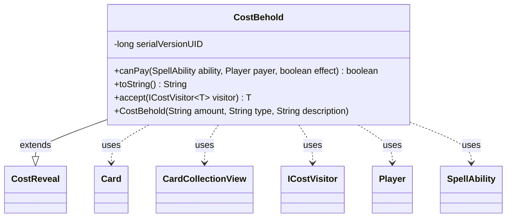

---
aliases:
  - CostBehold
tags:
  - java/class
  - module/forge-game
  - pkg/forge/game/cost
fqn: forge.game.cost.CostBehold
package: forge.game.cost
module: forge-game
kind: Class
---

# CostBehold

**Package:** `forge.game.cost` &nbsp; **Module:** `forge-game` &nbsp; **Kind:** Class



## Relationships
**Extends:**
- [[forge.game.cost.CostReveal|CostReveal]]
**Uses:**
- [[forge.game.card.Card|Card]]
- [[forge.game.card.CardCollectionView|CardCollectionView]]
- [[forge.game.cost.ICostVisitor|ICostVisitor]]
- [[forge.game.player.Player|Player]]
- [[forge.game.spellability.SpellAbility|SpellAbility]]

## Design Description

CostBehold is a specialized payment cost requiring a player to reveal cards from hand (and battlefield) matching a given type and amount, implementing Magic's "Behold" mechanic. It extends CostReveal, inheriting the reveal-from-zone machinery while overriding the source zones to `"Hand,Battlefield"` via its constructor.

Its main design intent appears in the `canPay` override, which adds a special case for the `ChosenType` keyword: rather than counting cards of a fixed type, it checks whether enough cards in hand share a creature type with some other revealed card (supporting cards like Celestial Reunion), otherwise delegating to the superclass. It collaborates with Player and SpellAbility to resolve the affordability check, queries Card/CardCollectionView through CardLists and CardPredicates helpers, and participates in the visitor pattern via `accept(ICostVisitor)`, keeping cost-processing logic external to the cost types themselves.

## Source
`forge-game/src/main/java/forge/game/cost/CostBehold.java`

```java
package forge.game.cost;

import forge.game.card.Card;
import forge.game.card.CardCollectionView;
import forge.game.card.CardLists;
import forge.game.card.CardPredicates;
import forge.game.player.Player;
import forge.game.spellability.SpellAbility;

public class CostBehold extends CostReveal {

    private static final long serialVersionUID = 1L;

    public CostBehold(String amount, String type, String description) {
        super(amount, type, description, "Hand,Battlefield");
    }

    @Override
    public boolean canPay(final SpellAbility ability, final Player payer, final boolean effect) {
        CardCollectionView handList = payer.getCardsIn(revealFrom);
        final int amount = this.getAbilityAmount(ability);
        // currently only creatures (Celestial Reunion)
        if (this.getType().endsWith("ChosenType")) {
            for (final Card card : handList) {
                if (CardLists.count(handList, CardPredicates.sharesCreatureTypeWith(card)) >= amount) {
                    return true;
                }
            }
            return false;
        }
        return super.canPay(ability, payer, effect);
    }

    @Override
    public String toString() {
        final StringBuilder sb = new StringBuilder();
        sb.append("Behold ");

        final Integer i = this.convertAmount();

        final String desc = this.getTypeDescription() == null ? this.getType() : this.getTypeDescription();

        sb.append(Cost.convertAmountTypeToWords(i, this.getAmount(), desc));

        return sb.toString();
    }

    // Inputs
    public <T> T accept(ICostVisitor<T> visitor) {
        return visitor.visit(this);
    }
}
```
