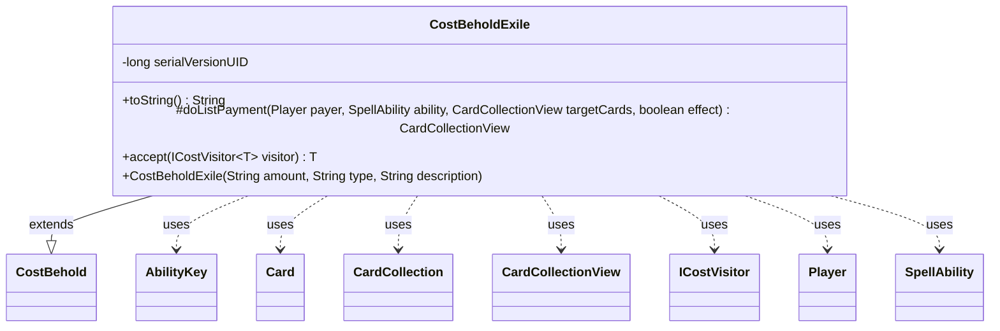

---
aliases:
  - CostBeholdExile
tags:
  - java/class
  - module/forge-game
  - pkg/forge/game/cost
fqn: forge.game.cost.CostBeholdExile
package: forge.game.cost
module: forge-game
kind: Class
---

# CostBeholdExile

**Package:** `forge.game.cost` &nbsp; **Module:** `forge-game` &nbsp; **Kind:** Class



## Relationships
**Extends:**
- [[forge.game.cost.CostBehold|CostBehold]]
**Uses:**
- [[forge.game.ability.AbilityKey|AbilityKey]]
- [[forge.game.card.Card|Card]]
- [[forge.game.card.CardCollection|CardCollection]]
- [[forge.game.card.CardCollectionView|CardCollectionView]]
- [[forge.game.cost.ICostVisitor|ICostVisitor]]
- [[forge.game.player.Player|Player]]
- [[forge.game.spellability.SpellAbility|SpellAbility]]

## Design Description

CostBeholdExile specializes the "behold" payment cost so that, after a player reveals a card of the required type and amount, the chosen card is also exiled. It extends CostBehold, inheriting the reveal/selection logic and overriding only the behaviors that distinguish exiling from merely beholding: toString appends "and exile it," and doListPayment wraps the superclass's selected cards by moving each to exile through the game's action layer, recording zone-change parameters via AbilityKey and tagging the exiled card's source ability through SpellAbilityEffect.handleExiledWith.

The class collaborates with Card, CardCollection/CardCollectionView, Player, and SpellAbility to enact the payment, returning the newly exiled cards so callers can reference them. Its accept method implements the visitor pattern over ICostVisitor, integrating the cost into Forge's cost-processing framework. The design intent is clear: reuse CostBehold's machinery and extend it minimally, isolating the single added side effect of exiling rather than duplicating selection logic.

## Source
`forge-game/src/main/java/forge/game/cost/CostBeholdExile.java`

```java
package forge.game.cost;

import forge.game.card.*;
import forge.game.ability.AbilityKey;
import forge.game.ability.SpellAbilityEffect;
import forge.game.player.Player;
import forge.game.spellability.SpellAbility;

import java.util.Map;


public class CostBeholdExile extends CostBehold {

    private static final long serialVersionUID = 1L;

    public CostBeholdExile(String amount, String type, String description) {
        super(amount, type, description);
    }

    @Override
    public String toString() {
        return super.toString() + " and exile it";
    }

    @Override
    protected CardCollectionView doListPayment(Player payer, SpellAbility ability, CardCollectionView targetCards, final boolean effect) {
        CardCollection result = new CardCollection();
        for (Card targetCard : super.doListPayment(payer, ability, targetCards, effect)) {
            Map<AbilityKey, Object> moveParams = AbilityKey.newMap();
            AbilityKey.addCardZoneTableParams(moveParams, table);

            Card newCard = targetCard.getGame().getAction().exile(targetCard, null, moveParams);
            SpellAbilityEffect.handleExiledWith(newCard, ability);
            result.add(newCard);
        }

        return result;
    }

    // Inputs
    public <T> T accept(ICostVisitor<T> visitor) {
        return visitor.visit(this);
    }
}
```
