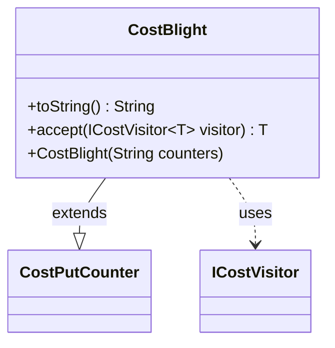

---
aliases:
  - CostBlight
tags:
  - java/class
  - module/forge-game
  - pkg/forge/game/cost
fqn: forge.game.cost.CostBlight
package: forge.game.cost
module: forge-game
kind: Class
---

# CostBlight

**Package:** `forge.game.cost`   **Module:** `forge-game`   **Kind:** Class



## Relationships
**Extends:**
- [[forge.game.cost.CostPutCounter|CostPutCounter]]
**Uses:**
- [[forge.game.cost.ICostVisitor|ICostVisitor]]

## Design Description

CostBlight is a specialized cost type representing the payment of placing -1/-1 (M1M1) counters on a creature the player controls, used in Magic: The Gathering's "Blight" mechanic. It extends `CostPutCounter`, supplying fixed arguments to its supertype's constructor—the counter type, the target restriction (`Creature.YouCtrl`), and a human-readable description—so it functions as a thin, preconfigured convenience subclass rather than introducing new behavior.

Its only customizations are a `toString()` that renders the cost as "Blight N" and an `accept` override implementing the visitor pattern, dispatching to `ICostVisitor.visit(this)` so cost-processing logic can be applied polymorphically across the cost hierarchy without type-checking.

## Source
`forge-game/src/main/java/forge/game/cost/CostBlight.java`

```java
package forge.game.cost;

import forge.game.card.CounterEnumType;

public class CostBlight extends CostPutCounter {
    public CostBlight(final String counters) {
        super(counters, CounterEnumType.M1M1, "Creature.YouCtrl", "a creature you control");
    }

    public String toString() {
        return "Blight " + getAmount();
    }

    @Override
    public <T> T accept(ICostVisitor<T> visitor) {
        return visitor.visit(this);
    }
}
```

## Python
`forge/game/cost/CostBlight.py`

```python
from forge.game.card.CounterEnumType import CounterEnumType
from forge.game.cost.CostPutCounter import CostPutCounter
from forge.game.cost.ICostVisitor import ICostVisitor


class CostBlight(CostPutCounter):
    def __init__(self, counters: str):
        super().__init__(counters, CounterEnumType.M1M1, "Creature.YouCtrl", "a creature you control")

    def toString(self) -> str:
        return "Blight " + str(self.getAmount())

    def accept(self, visitor: ICostVisitor):
        return visitor.visit(self)
```
