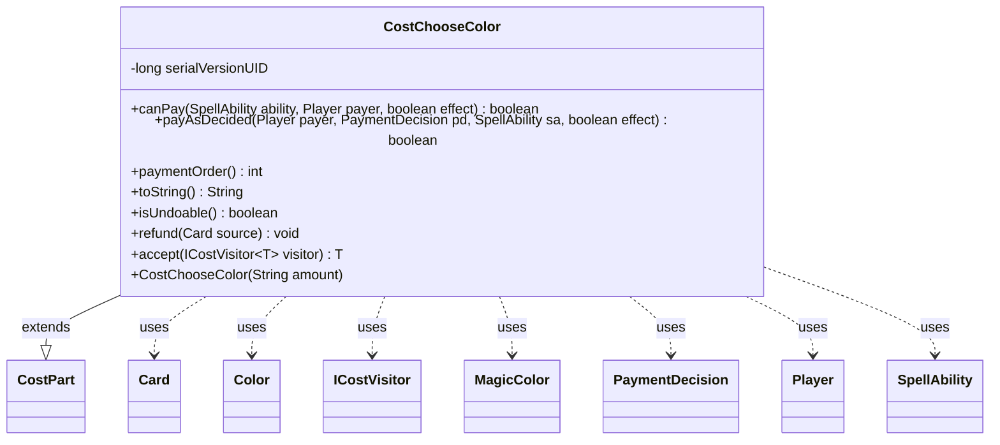

---
aliases:
  - CostChooseColor
tags:
  - java/class
  - module/forge-game
  - pkg/forge/game/cost
fqn: forge.game.cost.CostChooseColor
package: forge.game.cost
module: forge-game
kind: Class
---

# CostChooseColor

**Package:** `forge.game.cost` &nbsp; **Module:** `forge-game` &nbsp; **Kind:** Class



## Relationships
**Extends:**
- [[forge.game.cost.CostPart|CostPart]]
**Uses:**
- [[forge.card.MagicColor|MagicColor]]
- [[forge.card.MagicColor.Color|Color]]
- [[forge.game.card.Card|Card]]
- [[forge.game.cost.ICostVisitor|ICostVisitor]]
- [[forge.game.cost.PaymentDecision|PaymentDecision]]
- [[forge.game.player.Player|Player]]
- [[forge.game.spellability.SpellAbility|SpellAbility]]

## Design Description

CostChooseColor models a "choose a color" payment requirement within Forge's cost system, extending the abstract `CostPart` base type so it can participate uniformly in any `Cost` alongside other cost components. It carries an amount describing how many colors must be chosen and contributes its share of payment ordering (returning 8) so the engine sequences it consistently among parts.

The class is always payable (`canPay` returns true), since the choice itself imposes no resource constraint; payment resolves a `PaymentDecision`'s selected colors and records them on the host `Card` via `setChosenColors`, mapping each `MagicColor.Color` to its name. It is explicitly undoable, with `refund` clearing the host card's chosen colors to restore prior state. By implementing `accept`, it integrates with the `ICostVisitor` double-dispatch mechanism, letting external operations process cost parts polymorphically without type checks. Collaboration with `Player` and `SpellAbility` reflects its role in resolving costs during ability execution.

## Source
`forge-game/src/main/java/forge/game/cost/CostChooseColor.java`

```java
/*
 * Forge: Play Magic: the Gathering.
 * Copyright (C) 2011  Forge Team
 *
 * This program is free software: you can redistribute it and/or modify
 * it under the terms of the GNU General Public License as published by
 * the Free Software Foundation, either version 3 of the License, or
 * (at your option) any later version.
 *
 * This program is distributed in the hope that it will be useful,
 * but WITHOUT ANY WARRANTY; without even the implied warranty of
 * MERCHANTABILITY or FITNESS FOR A PARTICULAR PURPOSE.  See the
 * GNU General Public License for more details.
 *
 * You should have received a copy of the GNU General Public License
 * along with this program.  If not, see <http://www.gnu.org/licenses/>.
 */
package forge.game.cost;

import java.util.stream.Collectors;

import forge.card.MagicColor;
import forge.game.card.Card;
import forge.game.player.Player;
import forge.game.spellability.SpellAbility;

/**
 * the class CostChooseColor
 */
public class CostChooseColor extends CostPart {

    /**
     * Serializables need a version ID.
     */
    private static final long serialVersionUID = 1L;

    /**
     * Instantiates a new cost choose color.
     *
     * @param amount
     *            the amount
     */
    public CostChooseColor(final String amount) {
        this.setAmount(amount);
    }

    /*
     * (non-Javadoc)
     *
     * @see
     * forge.card.cost.CostPart#canPay(forge.card.spellability.SpellAbility,
     * forge.Card, forge.Player, forge.card.cost.Cost)
     */
    @Override
    public final boolean canPay(final SpellAbility ability, final Player payer, final boolean effect) {
        return true;
    }

    @Override
    public boolean payAsDecided(Player payer, PaymentDecision pd, SpellAbility sa, final boolean effect) {
        sa.getHostCard().setChosenColors(pd.colors.stream().map(MagicColor.Color::getName).collect(Collectors.toList()));
        return true;
    }

    @Override
    public int paymentOrder() { return 8; }

    /*
     * (non-Javadoc)
     *
     * @see forge.card.cost.CostPart#toString()
     */
    @Override
    public final String toString() {
        final StringBuilder sb = new StringBuilder();
        final Integer i = this.convertAmount();
        sb.append("Choose ");
        sb.append(Cost.convertAmountTypeToWords(i, this.getAmount(), "color"));
        return sb.toString();
    }

    @Override
    public boolean isUndoable() { return true; }

    /*
     * (non-Javadoc)
     *
     * @see forge.card.cost.CostPart#refund(forge.Card)
     */
    @Override
    public final void refund(final Card source) {
        source.setChosenColors(null);
    }

    @Override
    public <T> T accept(ICostVisitor<T> visitor) {
        return visitor.visit(this);
    }

}
```
