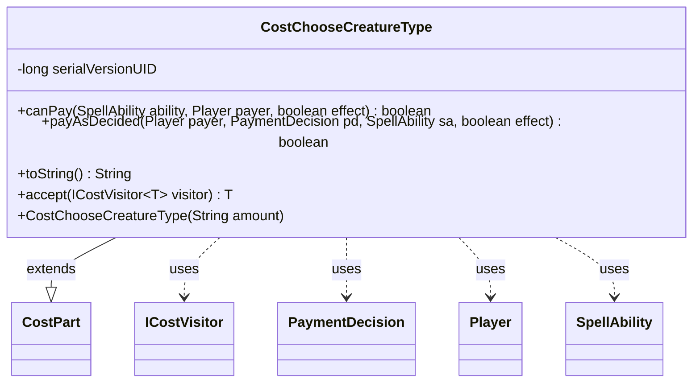

---
aliases:
  - CostChooseCreatureType
tags:
  - java/class
  - module/forge-game
  - pkg/forge/game/cost
fqn: forge.game.cost.CostChooseCreatureType
package: forge.game.cost
module: forge-game
kind: Class
---

# CostChooseCreatureType

**Package:** `forge.game.cost` &nbsp; **Module:** `forge-game` &nbsp; **Kind:** Class



## Relationships
**Extends:**
- [[forge.game.cost.CostPart|CostPart]]
**Uses:**
- [[forge.game.cost.ICostVisitor|ICostVisitor]]
- [[forge.game.cost.PaymentDecision|PaymentDecision]]
- [[forge.game.player.Player|Player]]
- [[forge.game.spellability.SpellAbility|SpellAbility]]

## Design Description

CostChooseCreatureType models the "choose a creature type" component of a Magic: The Gathering casting or activation cost. As a concrete subclass of CostPart, it plugs into Forge's composite cost system, where a Cost aggregates many CostPart instances that are each queried and paid in turn. Payment is trivially affordable—canPay always returns true—and payAsDecided simply records the chosen type on the spell's host card via setChosenType, drawing the selection from the supplied PaymentDecision; toString renders a human-readable "Choose … creature type" label using the inherited amount.

The class collaborates with SpellAbility and Player to reach game state during payment, and implements the visitor hook accept(ICostVisitor) so cost processing (cost reduction, AI evaluation, display) can dispatch over part types without instanceof checks. This reflects a deliberate visitor-based, polymorphic design that keeps each cost variety small and self-contained.

## Source
`forge-game/src/main/java/forge/game/cost/CostChooseCreatureType.java`

```java
/*
 * Forge: Play Magic: the Gathering.
 * Copyright (C) 2011  Forge Team
 *
 * This program is free software: you can redistribute it and/or modify
 * it under the terms of the GNU General Public License as published by
 * the Free Software Foundation, either version 3 of the License, or
 * (at your option) any later version.
 * 
 * This program is distributed in the hope that it will be useful,
 * but WITHOUT ANY WARRANTY; without even the implied warranty of
 * MERCHANTABILITY or FITNESS FOR A PARTICULAR PURPOSE.  See the
 * GNU General Public License for more details.
 * 
 * You should have received a copy of the GNU General Public License
 * along with this program.  If not, see <http://www.gnu.org/licenses/>.
 */
package forge.game.cost;

import forge.game.player.Player;
import forge.game.spellability.SpellAbility;

/**
 * The Class CostChooseCreatureType.
 */
public class CostChooseCreatureType extends CostPart {

    /**
     * Serializables need a version ID.
     */
    private static final long serialVersionUID = 1L;

    /**
     * Instantiates a new cost mill.
     * 
     * @param amount
     *            the amount
     */
    public CostChooseCreatureType(final String amount) {
        this.setAmount(amount);
    }

    /*
     * (non-Javadoc)
     * 
     * @see
     * forge.card.cost.CostPart#canPay(forge.card.spellability.SpellAbility,
     * forge.Card, forge.Player, forge.card.cost.Cost)
     */
    @Override
    public final boolean canPay(final SpellAbility ability, final Player payer, final boolean effect) {
        return true;
    }

    @Override
    public boolean payAsDecided(Player payer, PaymentDecision pd, SpellAbility sa, final boolean effect) {
        sa.getHostCard().setChosenType(pd.type);
        return true;
    }

    /*
     * (non-Javadoc)
     * 
     * @see forge.card.cost.CostPart#toString()
     */
    @Override
    public final String toString() {
        final StringBuilder sb = new StringBuilder();
        final Integer i = this.convertAmount();
        sb.append("Choose ");
        sb.append(Cost.convertAmountTypeToWords(i, this.getAmount(), "creature type"));
        return sb.toString();
    }

    @Override
    public <T> T accept(ICostVisitor<T> visitor) {
        return visitor.visit(this);
    }

}
```
