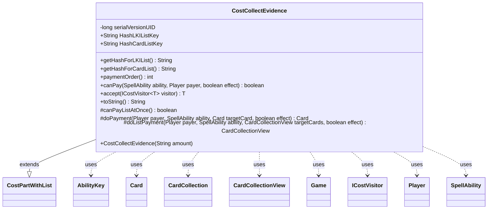

---
aliases:
  - CostCollectEvidence
tags:
  - java/class
  - module/forge-game
  - pkg/forge/game/cost
fqn: forge.game.cost.CostCollectEvidence
package: forge.game.cost
module: forge-game
kind: Class
---

# CostCollectEvidence

**Package:** `forge.game.cost`   **Module:** `forge-game`   **Kind:** Class



## Relationships
**Extends:**
- [[forge.game.cost.CostPartWithList|CostPartWithList]]
**Uses:**
- [[forge.game.Game|Game]]
- [[forge.game.ability.AbilityKey|AbilityKey]]
- [[forge.game.card.Card|Card]]
- [[forge.game.card.CardCollection|CardCollection]]
- [[forge.game.card.CardCollectionView|CardCollectionView]]
- [[forge.game.cost.ICostVisitor|ICostVisitor]]
- [[forge.game.player.Player|Player]]
- [[forge.game.spellability.SpellAbility|SpellAbility]]

## Design Description

CostCollectEvidence models the Magic "Collect Evidence" payment cost, by which a player exiles cards from their graveyard whose combined mana value meets a specified amount. It extends CostPartWithList, inheriting the machinery for costs that act on a tracked collection of cards, and implements the cost-specific contract: validating affordability, defining payment order, and executing the exile. Affordability (canPay) is checked by summing the CMC of exilable graveyard cards against the required amount, while payment is performed in bulk—canPayListAtOnce returns true and doListPayment exiles the whole selection at once, leaving the single-card doPayment unused.

Notable design intent: paymentOrder is fixed at 15 to stay aligned with CostExile (for interactions like Lamplight Phoenix); fixed hash keys ("Collected"/"CollectedCards") expose the paid cards to dependent effects; doListPayment records zone-change table params, tags exiled-with provenance via SpellAbilityEffect, and fires the CollectEvidence trigger. Dispatch to cost handling follows the visitor pattern through accept(ICostVisitor).

## Source
`forge-game/src/main/java/forge/game/cost/CostCollectEvidence.java`

```java
package forge.game.cost;

import forge.game.Game;
import forge.game.ability.AbilityKey;
import forge.game.ability.SpellAbilityEffect;
import forge.game.card.*;
import forge.game.player.Player;
import forge.game.spellability.SpellAbility;
import forge.game.trigger.TriggerType;
import forge.game.zone.ZoneType;

import java.util.Map;

public class CostCollectEvidence extends CostPartWithList {
    // CollectEvidence<Amount>

    private static final long serialVersionUID = 1L;

    public CostCollectEvidence(final String amount) {
        this.setAmount(amount);
    }

    public static final String HashLKIListKey = "Collected";
    public static final String HashCardListKey = "CollectedCards";

    @Override
    public String getHashForLKIList() {
        return HashLKIListKey;
    }
    @Override
    public String getHashForCardList() {
        return HashCardListKey;
    }

    @Override
    public int paymentOrder() {
        // needs to be aligned with CostExile because of Lamplight Phoenix
        return 15;
    }

    @Override
    public boolean canPay(SpellAbility ability, Player payer, boolean effect) {
        int amount = this.getAbilityAmount(ability);

        // This may need to be updated if we get a card like "Cards in graveyards can't be exiled to pay for costs"

        return CardLists.getTotalCMC(CardLists.filter(payer.getCardsIn(ZoneType.Graveyard), CardPredicates.canExiledBy(ability, effect))) >= amount;
    }

    @Override
    public <T> T accept(ICostVisitor<T> visitor) {
        return visitor.visit(this);
    }

    @Override
    public String toString() {
        final StringBuilder sb = new StringBuilder();
        sb.append("Collect evidence ");
        sb.append(this.getAmount());
        return sb.toString();
    }

    @Override
    protected boolean canPayListAtOnce() { return true; }

    @Override
    protected Card doPayment(Player payer, SpellAbility ability, Card targetCard, boolean effect) {
        return null;
    }

    @Override
    protected CardCollectionView doListPayment(Player payer, SpellAbility ability, CardCollectionView targetCards, final boolean effect) {
        final Game game = payer.getGame();
        Map<AbilityKey, Object> moveParams = AbilityKey.newMap();
        AbilityKey.addCardZoneTableParams(moveParams, table);
        CardCollection moved = game.getAction().exile(new CardCollection(targetCards), ability, moveParams);
        SpellAbilityEffect.handleExiledWith(moved, ability);
        game.getTriggerHandler().runTrigger(TriggerType.CollectEvidence, AbilityKey.mapFromPlayer(payer), false);
        return moved;
    }
}
```

## Python
`forge/game/cost/CostCollectEvidence.py`

```python
from forge.game.Game import Game
from forge.game.ability.AbilityKey import AbilityKey
from forge.game.ability.SpellAbilityEffect import SpellAbilityEffect
from forge.game.card.Card import Card
from forge.game.card.CardCollection import CardCollection
from forge.game.card.CardCollectionView import CardCollectionView
from forge.game.card.CardLists import CardLists
from forge.game.card.CardPredicates import CardPredicates
from forge.game.cost.CostPartWithList import CostPartWithList
from forge.game.cost.ICostVisitor import ICostVisitor
from forge.game.player.Player import Player
from forge.game.spellability.SpellAbility import SpellAbility
from forge.game.trigger.TriggerType import TriggerType
from forge.game.zone.ZoneType import ZoneType


class CostCollectEvidence(CostPartWithList):
    # CollectEvidence<Amount>

    serialVersionUID = 1

    HashLKIListKey = "Collected"
    HashCardListKey = "CollectedCards"

    def __init__(self, amount: str):
        self.setAmount(amount)

    def getHashForLKIList(self) -> str:
        return CostCollectEvidence.HashLKIListKey

    def getHashForCardList(self) -> str:
        return CostCollectEvidence.HashCardListKey

    def paymentOrder(self) -> int:
        # needs to be aligned with CostExile because of Lamplight Phoenix
        return 15

    def canPay(self, ability: SpellAbility, payer: Player, effect: bool) -> bool:
        amount = self.getAbilityAmount(ability)

        # This may need to be updated if we get a card like "Cards in graveyards can't be exiled to pay for costs"

        return CardLists.getTotalCMC(CardLists.filter(payer.getCardsIn(ZoneType.Graveyard), CardPredicates.canExiledBy(ability, effect))) >= amount

    def accept(self, visitor: ICostVisitor):
        return visitor.visit(self)

    def toString(self) -> str:
        sb = []
        sb.append("Collect evidence ")
        sb.append(self.getAmount())
        return "".join(str(x) for x in sb)

    def canPayListAtOnce(self) -> bool:
        return True

    def doPayment(self, payer: Player, ability: SpellAbility, targetCard: Card, effect: bool) -> Card:
        return None

    def doListPayment(self, payer: Player, ability: SpellAbility, targetCards: CardCollectionView, effect: bool) -> CardCollectionView:
        game = payer.getGame()
        moveParams = AbilityKey.newMap()
        AbilityKey.addCardZoneTableParams(moveParams, self.table)
        moved = game.getAction().exile(CardCollection(targetCards), ability, moveParams)
        SpellAbilityEffect.handleExiledWith(moved, ability)
        game.getTriggerHandler().runTrigger(TriggerType.CollectEvidence, AbilityKey.mapFromPlayer(payer), False)
        return moved
```
