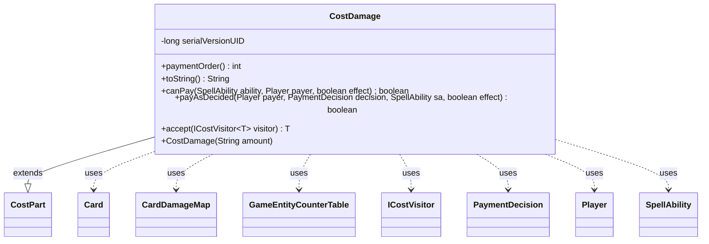

---
aliases:
  - CostDamage
tags:
  - java/class
  - module/forge-game
  - pkg/forge/game/cost
fqn: forge.game.cost.CostDamage
package: forge.game.cost
module: forge-game
kind: Class
---

# CostDamage

**Package:** `forge.game.cost` &nbsp; **Module:** `forge-game` &nbsp; **Kind:** Class



## Relationships
**Extends:**
- [[forge.game.cost.CostPart|CostPart]]
**Uses:**
- [[forge.game.GameEntityCounterTable|GameEntityCounterTable]]
- [[forge.game.card.Card|Card]]
- [[forge.game.card.CardDamageMap|CardDamageMap]]
- [[forge.game.cost.ICostVisitor|ICostVisitor]]
- [[forge.game.cost.PaymentDecision|PaymentDecision]]
- [[forge.game.player.Player|Player]]
- [[forge.game.spellability.SpellAbility|SpellAbility]]

## Design Description

`CostDamage` models the cost of dealing a fixed amount of damage to the paying player, expressed as a payable `CostPart` within Forge's composite cost system. It carries a string damage amount (supporting variable expressions) and slots into payment sequencing via `paymentOrder()`, returning 8 to order itself relative to other cost components. `canPay()` unconditionally returns true, reflecting that self-damage is always a legal cost regardless of the payer's life total.

Payment is delegated to the game's action layer: `payAsDecided()` builds a `CardDamageMap` from the host `Card` to the `Player`, then routes it through `dealDamage` alongside prevention and counter-tracking tables, treating the damage as a cost rather than an effect. The `accept(ICostVisitor)` method implements the visitor pattern, letting cost consumers (AI evaluation, payment handling) dispatch on concrete cost types without instanceof checks, while serialization support via `serialVersionUID` reflects its participation in persisted game state.

## Source
`forge-game/src/main/java/forge/game/cost/CostDamage.java`

```java
/*
 * Forge: Play Magic: the Gathering.
 * Copyright (C) 2011  Forge Team
 *
 * This program is free software: you can redistribute it and/or modify
 * it under the terms of the GNU General Public License as published by
 * the Free Software Foundation, either version 3 of the License, or
 * (at your option) any later version.
 * 
 * This program is distributed in the hope that it will be useful,
 * but WITHOUT ANY WARRANTY; without even the implied warranty of
 * MERCHANTABILITY or FITNESS FOR A PARTICULAR PURPOSE.  See the
 * GNU General Public License for more details.
 * 
 * You should have received a copy of the GNU General Public License
 * along with this program.  If not, see <http://www.gnu.org/licenses/>.
 */
package forge.game.cost;

import forge.game.GameEntityCounterTable;
import forge.game.card.Card;
import forge.game.card.CardDamageMap;
import forge.game.player.Player;
import forge.game.spellability.SpellAbility;

/**
 * The Class CostDamage.
 */
public class CostDamage extends CostPart {

    /**
     * Serializables need a version ID.
     */
    private static final long serialVersionUID = 1L;

    public CostDamage(final String amount) {
        this.setAmount(amount);
    }

    @Override
    public int paymentOrder() { return 8; }

    /*
     * (non-Javadoc)
     * 
     * @see forge.card.cost.CostPart#toString()
     */
    @Override
    public final String toString() {
        final StringBuilder sb = new StringBuilder();
        sb.append("Deal ").append(this.getAmount()).append(" damage to you");
        return sb.toString();
    }

    /*
     * (non-Javadoc)
     * 
     * @see
     * forge.card.cost.CostPart#canPay(forge.card.spellability.SpellAbility,
     * forge.Card, forge.Player, forge.card.cost.Cost)
     */
    @Override
    public final boolean canPay(final SpellAbility ability, final Player payer, final boolean effect) {
        return true;
    }
    
    @Override
    public boolean payAsDecided(Player payer, PaymentDecision decision, SpellAbility sa, final boolean effect) {
        final Card source = sa.getHostCard();
        CardDamageMap damageMap = new CardDamageMap();
        CardDamageMap preventMap = new CardDamageMap();
        GameEntityCounterTable table = new GameEntityCounterTable();

        damageMap.put(source, payer, decision.c);
        source.getGame().getAction().dealDamage(false, damageMap, preventMap, table, sa);

        return decision.c > 0;
    }

    @Override
    public <T> T accept(ICostVisitor<T> visitor) {
        return visitor.visit(this);
    }
}
```
