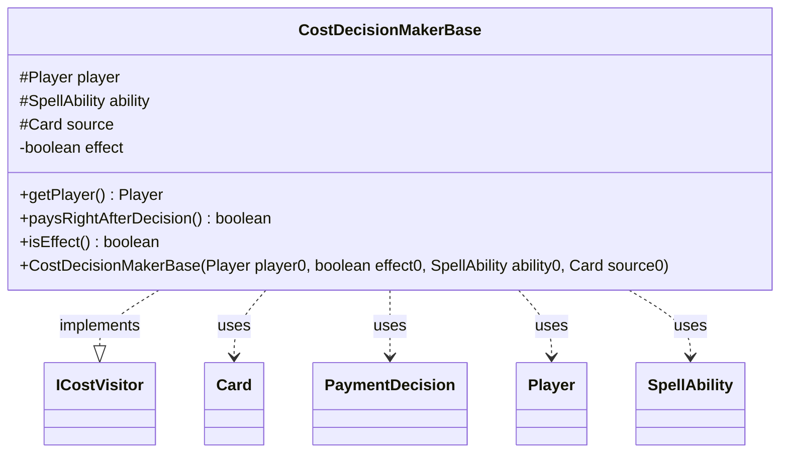

---
aliases:
  - CostDecisionMakerBase
tags:
  - java/class
  - module/forge-game
  - pkg/forge/game/cost
fqn: forge.game.cost.CostDecisionMakerBase
package: forge.game.cost
module: forge-game
kind: Class
---

# CostDecisionMakerBase

**Package:** `forge.game.cost`   **Module:** `forge-game`   **Kind:** Class



## Relationships
**Implements:**
- [[forge.game.cost.ICostVisitor|ICostVisitor]]
**Uses:**
- [[forge.game.card.Card|Card]]
- [[forge.game.cost.PaymentDecision|PaymentDecision]]
- [[forge.game.player.Player|Player]]
- [[forge.game.spellability.SpellAbility|SpellAbility]]

## Design Description

CostDecisionMakerBase is an abstract base class that provides the common state and scaffolding for visitors that decide how a cost is paid. Implementing `ICostVisitor<PaymentDecision>`, it participates in a visitor pattern over the cost hierarchy, where each `visit` method (left to concrete subclasses) produces a `PaymentDecision` for a given cost component. The class captures the shared context of any payment decision—the paying `Player`, the `SpellAbility` being activated, and the `Card` that is its source—as immutable protected fields, plus an `effect` flag distinguishing costs incurred as effects from those paid directly.

Subclasses supply the actual decision logic and must implement `paysRightAfterDecision()`, signaling whether payment is applied immediately upon decision. By centralizing this collaborator state and exposing it through accessors like `getPlayer()` and `isEffect()`, the class lets concrete decision makers focus solely on per-cost visiting behavior.

## Source
`forge-game/src/main/java/forge/game/cost/CostDecisionMakerBase.java`

```java
package forge.game.cost;

import forge.game.card.Card;
import forge.game.player.Player;
import forge.game.spellability.SpellAbility;

public abstract class CostDecisionMakerBase implements ICostVisitor<PaymentDecision> {

    protected final Player player;
    protected final SpellAbility ability;
    protected final Card source;
    private boolean effect;

    public CostDecisionMakerBase(Player player0, boolean effect0, SpellAbility ability0, Card source0) {
        player = player0;
        effect = effect0;
        ability = ability0;
        source = source0;
    }

    public Player getPlayer() { return player; }
    public abstract boolean paysRightAfterDecision();
    public boolean isEffect() {
        return effect;
    }
}
```

## Python
`forge/game/cost/CostDecisionMakerBase.py`

```python
from abc import ABC, abstractmethod

from forge.game.card.Card import Card
from forge.game.cost.ICostVisitor import ICostVisitor
from forge.game.cost.PaymentDecision import PaymentDecision
from forge.game.player.Player import Player
from forge.game.spellability.SpellAbility import SpellAbility


class CostDecisionMakerBase(ICostVisitor, ABC):

    def __init__(self, player0: Player, effect0: bool, ability0: SpellAbility, source0: Card):
        self.player = player0
        self.effect = effect0
        self.ability = ability0
        self.source = source0

    def getPlayer(self) -> Player:
        return self.player

    @abstractmethod
    def paysRightAfterDecision(self) -> bool:
        ...

    def isEffect(self) -> bool:
        return self.effect
```
