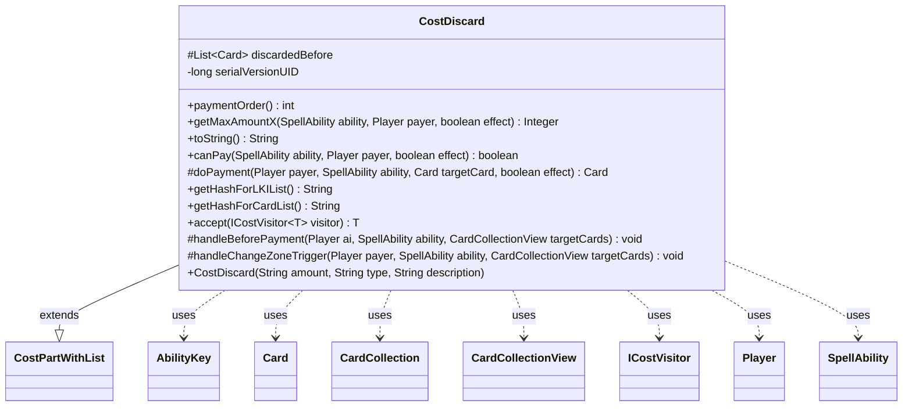

---
aliases:
  - CostDiscard
tags:
  - java/class
  - module/forge-game
  - pkg/forge/game/cost
fqn: forge.game.cost.CostDiscard
package: forge.game.cost
module: forge-game
kind: Class
---

# CostDiscard

**Package:** `forge.game.cost`   **Module:** `forge-game`   **Kind:** Class



## Relationships
**Extends:**
- [[forge.game.cost.CostPartWithList|CostPartWithList]]
**Uses:**
- [[forge.game.ability.AbilityKey|AbilityKey]]
- [[forge.game.card.Card|Card]]
- [[forge.game.card.CardCollection|CardCollection]]
- [[forge.game.card.CardCollectionView|CardCollectionView]]
- [[forge.game.cost.ICostVisitor|ICostVisitor]]
- [[forge.game.player.Player|Player]]
- [[forge.game.spellability.SpellAbility|SpellAbility]]

## Design Description

CostDiscard models the "discard cards" component of a payable cost in the Forge game engine, representing requirements such as discarding a number of cards of a given type, the whole hand, the last drawn card, or cards with same/different names. As a concrete subclass of CostPartWithList, it slots into Forge's composite cost framework: it reports a payment order, computes the maximum payable amount (getMaxAmountX), validates feasibility (canPay), and executes the discard one card at a time via doPayment, which routes through Player.discard.

The design centers on flexible type-string parsing — suffixes like `+WithDifferentNames`/`+WithSameName` and tokens like `Hand`, `LastDrawn`, `Random`, and `ChosenColor` branch its amount, validation, and display logic. It collaborates with Card/CardCollection(View) for hand inspection and with AbilityKey-keyed parameter maps to fire DiscardedAll triggers, snapshotting prior discards in handleBeforePayment. Its accept method participates in an ICostVisitor double-dispatch scheme, and getHash* methods expose stable identifiers for last-known-information tracking.

## Source
`forge-game/src/main/java/forge/game/cost/CostDiscard.java`

```java
/*
 * Forge: Play Magic: the Gathering.
 * Copyright (C) 2011  Forge Team
 *
 * This program is free software: you can redistribute it and/or modify
 * it under the terms of the GNU General Public License as published by
 * the Free Software Foundation, either version 3 of the License, or
 * (at your option) any later version.
 *
 * This program is distributed in the hope that it will be useful,
 * but WITHOUT ANY WARRANTY; without even the implied warranty of
 * MERCHANTABILITY or FITNESS FOR A PARTICULAR PURPOSE.  See the
 * GNU General Public License for more details.
 *
 * You should have received a copy of the GNU General Public License
 * along with this program.  If not, see <http://www.gnu.org/licenses/>.
 */
package forge.game.cost;

import com.google.common.collect.Lists;
import forge.game.ability.AbilityKey;
import forge.game.card.*;
import forge.game.player.Player;
import forge.game.spellability.SpellAbility;
import forge.game.trigger.TriggerType;
import forge.game.zone.ZoneType;
import forge.util.TextUtil;

import java.util.List;
import java.util.Map;

/**
 * The Class CostDiscard.
 */
public class CostDiscard extends CostPartWithList {
    // Discard<Num/Type{/TypeDescription}>

    // Inputs

    protected List<Card> discardedBefore;

    private static final long serialVersionUID = 1L;

    /**
     * Instantiates a new cost discard.
     *
     * @param amount
     *            the amount
     * @param type
     *            the type
     * @param description
     *            the description
     */
    public CostDiscard(final String amount, final String type, final String description) {
        super(amount, type, description);
    }

    public int paymentOrder() { return 10; }

    @Override
    public Integer getMaxAmountX(SpellAbility ability, Player payer, final boolean effect) {
        final Card source = ability.getHostCard();
        String type = this.getType();

        boolean differentNames = false;
        if (type.contains("+WithDifferentNames")) {
            type = type.replace("+WithDifferentNames", "");
            differentNames = true;
        }
        CardCollectionView handList = payer.canDiscardBy(ability, effect) ? payer.getCardsIn(ZoneType.Hand) : CardCollection.EMPTY;

        if (!type.equals("Random")) {
            handList = CardLists.getValidCards(handList, type.split(";"), payer, source, ability);
        }
        if (differentNames) {
            return CardLists.getDifferentNamesCount(handList);
        }
        return handList.size();
    }

    /*
     * (non-Javadoc)
     *
     * @see forge.card.cost.CostPart#toString()
     */
    @Override
    public final String toString() {
        final StringBuilder sb = new StringBuilder();
        sb.append("Discard ");

        final Integer i = this.convertAmount();

        if (this.payCostFromSource()) {
            sb.append(this.getType());
        }
        else if (this.getType().equals("Hand")) {
            sb.append("your hand");
        }
        else if (this.getType().equals("LastDrawn")) {
            sb.append("the last card you drew this turn");
        }
        else if (this.getType().contains("+WithDifferentNames")) {
            sb.append(Cost.convertAmountTypeToWords(i, this.getAmount(), "Card")).append(" with different names");
        }
        else {
            final StringBuilder desc = new StringBuilder();

            if (this.getType().equals("Card") || this.getType().equals("Random")) {
                desc.append("card");
            }
            else {
                desc.append(this.getDescriptiveType());
                desc.append(" card");
            }

            sb.append(Cost.convertAmountTypeToWords(i, this.getAmount(), desc.toString()));

            if (this.getType().equals("Random")) {
                sb.append(" at random");
            }
        }
        return sb.toString();
    }

    /*
     * (non-Javadoc)
     *
     * @see
     * forge.card.cost.CostPart#canPay(forge.card.spellability.SpellAbility,
     * forge.Card, forge.Player, forge.card.cost.Cost)
     */
    @Override
    public final boolean canPay(final SpellAbility ability, final Player payer, final boolean effect) {
        final Card source = ability.getHostCard();

        CardCollectionView handList = payer.canDiscardBy(ability, effect) ? payer.getCardsIn(ZoneType.Hand) : CardCollection.EMPTY;
        String type = this.getType();
        final int amount = getAbilityAmount(ability);

        if (this.payCostFromSource()) {
            return source.canBeDiscardedBy(ability, effect);
        }
        else if (type.equals("Hand")) {
            // trying to discard an empty hand always work even with Tamiyo
            if (payer.getZone(ZoneType.Hand).isEmpty()) {
                return true;
            }
            return payer.canDiscardBy(ability, effect);
            // this will always work
        }
        else if (type.equals("LastDrawn")) {
            final Card c = payer.getLastDrawnCard();
            return handList.contains(c);
        }
        else {
            boolean sameName = false;
            boolean differentNames = false;
            if (type.contains("+WithSameName")) {
                sameName = true;
                type = TextUtil.fastReplace(type, "+WithSameName", "");
            }
            if (type.contains("+WithDifferentNames")) {
                type = type.replace("+WithDifferentNames", "");
                differentNames = true;
            }
            if (type.contains("ChosenColor") && !source.hasChosenColor()) {
                //color hasn't been chosen yet, so skip getValidCards
            } else if (!type.equals("Random") && !type.contains("X")) {
                // Knollspine Invocation fails to activate without the above conditional
                handList = CardLists.getValidCards(handList, type.split(";"), payer, source, ability);
            }
            if (sameName) {
                for (Card c : handList) {
                    if (CardLists.count(handList, CardPredicates.nameEquals(c.getName())) > 1) {
                        return true;
                    }
                }
                return false;
            } else if (differentNames) {
                if (CardLists.getDifferentNamesCount(handList) < amount) {
                    return false;
                }
            }
            int adjustment = 0;
            if (source.isInZone(ZoneType.Hand) && payer.equals(source.getOwner())) {
                // If this card is in my hand, I can't use it to pay for it's own cost
                if (handList.contains(source)) {
                    adjustment = 1;
                }
            }

            if (amount > handList.size() - adjustment) {
                // not enough cards in hand to pay
                return false;
            }
        }
        return true;
    }

    /* (non-Javadoc)
     * @see forge.card.cost.CostPartWithList#executePayment(forge.card.spellability.SpellAbility, forge.Card)
     */
    @Override
    protected Card doPayment(Player payer, SpellAbility ability, Card targetCard, final boolean effect) {
        final Map<AbilityKey, Object> runParams = AbilityKey.newMap();
        AbilityKey.addCardZoneTableParams(runParams, table);

        if (ability.isCycling() && targetCard.equals(ability.getHostCard())) {
            // discard itself for cycling cost
            runParams.put(AbilityKey.Cycling, true);
        }
        // if this is caused by 118.12 it's also an effect
        SpellAbility cause = targetCard.getGame().getStack().isResolving(ability.getHostCard()) ? ability : null;
        return payer.discard(targetCard, cause, effect, runParams);
    }

    /* (non-Javadoc)
     * @see forge.card.cost.CostPartWithList#getHashForList()
     */
    @Override
    public String getHashForLKIList() {
        return "Discarded";
    }
    public String getHashForCardList() {
    	return "DiscardedCards";
    }

    @Override
    public <T> T accept(ICostVisitor<T> visitor) {
        return visitor.visit(this);
    }

    protected void handleBeforePayment(Player ai, SpellAbility ability, CardCollectionView targetCards) {
        discardedBefore = Lists.newArrayList(ai.getDiscardedThisTurn());
    }

    @Override
    protected void handleChangeZoneTrigger(Player payer, SpellAbility ability, CardCollectionView targetCards) {
        super.handleChangeZoneTrigger(payer, ability, targetCards);

        if (!cardList.isEmpty()) {
            final Map<AbilityKey, Object> runParams = AbilityKey.mapFromPlayer(payer);
            runParams.put(AbilityKey.Cards, new CardCollection(cardList));
            runParams.put(AbilityKey.Cause, ability);
            runParams.put(AbilityKey.DiscardedBefore, discardedBefore);
            payer.getGame().getTriggerHandler().runTrigger(TriggerType.DiscardedAll, runParams, false);
        }
    }
}
```

## Python
`forge/game/cost/CostDiscard.py`

```python
from forge.game.cost.CostPartWithList import CostPartWithList
from forge.game.ability.AbilityKey import AbilityKey
from forge.game.card.Card import Card
from forge.game.card.CardCollection import CardCollection
from forge.game.card.CardCollectionView import CardCollectionView
from forge.game.cost.ICostVisitor import ICostVisitor
from forge.game.player.Player import Player
from forge.game.spellability.SpellAbility import SpellAbility
from forge.game.trigger.TriggerType import TriggerType
from forge.game.zone.ZoneType import ZoneType
from forge.game.card.CardLists import CardLists
from forge.game.card.CardPredicates import CardPredicates
from forge.game.cost.Cost import Cost
from forge.util.TextUtil import TextUtil
from typing import TypeVar

T = TypeVar("T")


class CostDiscard(CostPartWithList):
    # Discard<Num/Type{/TypeDescription}>

    # Inputs

    serialVersionUID = 1

    def __init__(self, amount: str, type: str, description: str):
        super().__init__(amount, type, description)
        self.discardedBefore: list[Card] = None

    def paymentOrder(self) -> int:
        return 10

    def getMaxAmountX(self, ability: SpellAbility, payer: Player, effect: bool):
        source = ability.getHostCard()
        type = self.getType()

        differentNames = False
        if "+WithDifferentNames" in type:
            type = type.replace("+WithDifferentNames", "")
            differentNames = True
        handList = payer.getCardsIn(ZoneType.Hand) if payer.canDiscardBy(ability, effect) else CardCollection.EMPTY

        if type != "Random":
            handList = CardLists.getValidCards(handList, type.split(";"), payer, source, ability)
        if differentNames:
            return CardLists.getDifferentNamesCount(handList)
        return handList.size()

    def toString(self) -> str:
        sb = []
        sb.append("Discard ")

        i = self.convertAmount()

        if self.payCostFromSource():
            sb.append(self.getType())
        elif self.getType() == "Hand":
            sb.append("your hand")
        elif self.getType() == "LastDrawn":
            sb.append("the last card you drew this turn")
        elif "+WithDifferentNames" in self.getType():
            sb.append(Cost.convertAmountTypeToWords(i, self.getAmount(), "Card"))
            sb.append(" with different names")
        else:
            desc = []

            if self.getType() == "Card" or self.getType() == "Random":
                desc.append("card")
            else:
                desc.append(self.getDescriptiveType())
                desc.append(" card")

            sb.append(Cost.convertAmountTypeToWords(i, self.getAmount(), "".join(desc)))

            if self.getType() == "Random":
                sb.append(" at random")
        return "".join(sb)

    def canPay(self, ability: SpellAbility, payer: Player, effect: bool) -> bool:
        source = ability.getHostCard()

        handList = payer.getCardsIn(ZoneType.Hand) if payer.canDiscardBy(ability, effect) else CardCollection.EMPTY
        type = self.getType()
        amount = self.getAbilityAmount(ability)

        if self.payCostFromSource():
            return source.canBeDiscardedBy(ability, effect)
        elif type == "Hand":
            # trying to discard an empty hand always work even with Tamiyo
            if payer.getZone(ZoneType.Hand).isEmpty():
                return True
            return payer.canDiscardBy(ability, effect)
            # this will always work
        elif type == "LastDrawn":
            c = payer.getLastDrawnCard()
            return handList.contains(c)
        else:
            sameName = False
            differentNames = False
            if "+WithSameName" in type:
                sameName = True
                type = TextUtil.fastReplace(type, "+WithSameName", "")
            if "+WithDifferentNames" in type:
                type = type.replace("+WithDifferentNames", "")
                differentNames = True
            if "ChosenColor" in type and not source.hasChosenColor():
                # color hasn't been chosen yet, so skip getValidCards
                pass
            elif type != "Random" and "X" not in type:
                # Knollspine Invocation fails to activate without the above conditional
                handList = CardLists.getValidCards(handList, type.split(";"), payer, source, ability)
            if sameName:
                for c in handList:
                    if CardLists.count(handList, CardPredicates.nameEquals(c.getName())) > 1:
                        return True
                return False
            elif differentNames:
                if CardLists.getDifferentNamesCount(handList) < amount:
                    return False
            adjustment = 0
            if source.isInZone(ZoneType.Hand) and payer.equals(source.getOwner()):
                # If this card is in my hand, I can't use it to pay for it's own cost
                if handList.contains(source):
                    adjustment = 1

            if amount > handList.size() - adjustment:
                # not enough cards in hand to pay
                return False
        return True

    def doPayment(self, payer: Player, ability: SpellAbility, targetCard: Card, effect: bool) -> Card:
        runParams = AbilityKey.newMap()
        AbilityKey.addCardZoneTableParams(runParams, self.table)

        if ability.isCycling() and targetCard.equals(ability.getHostCard()):
            # discard itself for cycling cost
            runParams[AbilityKey.Cycling] = True
        # if this is caused by 118.12 it's also an effect
        cause = ability if targetCard.getGame().getStack().isResolving(ability.getHostCard()) else None
        return payer.discard(targetCard, cause, effect, runParams)

    def getHashForLKIList(self) -> str:
        return "Discarded"

    def getHashForCardList(self) -> str:
        return "DiscardedCards"

    def accept(self, visitor: ICostVisitor[T]) -> T:
        return visitor.visit(self)

    def handleBeforePayment(self, ai: Player, ability: SpellAbility, targetCards: CardCollectionView) -> None:
        self.discardedBefore = Lists.newArrayList(ai.getDiscardedThisTurn())

    def handleChangeZoneTrigger(self, payer: Player, ability: SpellAbility, targetCards: CardCollectionView) -> None:
        super().handleChangeZoneTrigger(payer, ability, targetCards)

        if not self.cardList.isEmpty():
            runParams = AbilityKey.mapFromPlayer(payer)
            runParams[AbilityKey.Cards] = CardCollection(self.cardList)
            runParams[AbilityKey.Cause] = ability
            runParams[AbilityKey.DiscardedBefore] = self.discardedBefore
            payer.getGame().getTriggerHandler().runTrigger(TriggerType.DiscardedAll, runParams, False)
```
