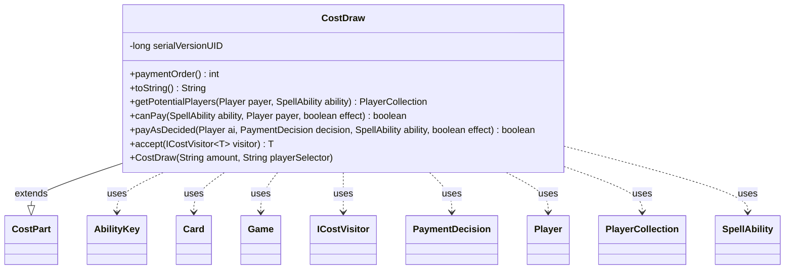

---
aliases:
  - CostDraw
tags:
  - java/class
  - module/forge-game
  - pkg/forge/game/cost
fqn: forge.game.cost.CostDraw
package: forge.game.cost
module: forge-game
kind: Class
---

# CostDraw

**Package:** `forge.game.cost`   **Module:** `forge-game`   **Kind:** Class



## Relationships
**Extends:**
- [[forge.game.cost.CostPart|CostPart]]
**Uses:**
- [[forge.game.Game|Game]]
- [[forge.game.ability.AbilityKey|AbilityKey]]
- [[forge.game.card.Card|Card]]
- [[forge.game.cost.ICostVisitor|ICostVisitor]]
- [[forge.game.cost.PaymentDecision|PaymentDecision]]
- [[forge.game.player.Player|Player]]
- [[forge.game.player.PlayerCollection|PlayerCollection]]
- [[forge.game.spellability.SpellAbility|SpellAbility]]

## Design Description

CostDraw models a "draw cards" payment component within Forge's cost system, extending the abstract CostPart to plug into the engine's composable cost framework. Constructed from an amount and a player-selector expression, it identifies eligible players via getPotentialPlayers — filtering the game's players by the selector's validity rules and each player's ability to draw the required number of cards — and reports payability through canPay. When the cost is paid, payAsDecided directs the players named in the PaymentDecision to draw, threading last-known battlefield and graveyard state through an AbilityKey move-parameter map so triggered effects resolve correctly.

It collaborates with SpellAbility and its host Card to resolve the dynamic amount, and participates in the visitor pattern via accept(ICostVisitor). Its paymentOrder of 20 deliberately defers payment, reflecting design intent that information-revealing costs like drawing resolve last.

## Source
`forge-game/src/main/java/forge/game/cost/CostDraw.java`

```java
/*
 * Forge: Play Magic: the Gathering.
 * Copyright (C) 2011  Forge Team
 *
 * This program is free software: you can redistribute it and/or modify
 * it under the terms of the GNU General Public License as published by
 * the Free Software Foundation, either version 3 of the License, or
 * (at your option) any later version.
 * 
 * This program is distributed in the hope that it will be useful,
 * but WITHOUT ANY WARRANTY; without even the implied warranty of
 * MERCHANTABILITY or FITNESS FOR A PARTICULAR PURPOSE.  See the
 * GNU General Public License for more details.
 * 
 * You should have received a copy of the GNU General Public License
 * along with this program.  If not, see <http://www.gnu.org/licenses/>.
 */
package forge.game.cost;

import forge.game.Game;
import forge.game.ability.AbilityKey;
import forge.game.card.Card;
import forge.game.player.Player;
import forge.game.player.PlayerCollection;
import forge.game.spellability.SpellAbility;

import java.util.Map;

/**
 * The Class CostDraw.
 */
public class CostDraw extends CostPart {

    private static final long serialVersionUID = 1L;

    public CostDraw(final String amount, final String playerSelector) {
        super(amount, playerSelector, null);
    }

    @Override
    public int paymentOrder() {
        // In a world where costs are fully undoable, revealing unknown information should be done last.
        return 20;
    }

    /*
     * (non-Javadoc)
     * 
     * @see forge.card.cost.CostPart#toString()
     */
    @Override
    public final String toString() {
        final StringBuilder sb = new StringBuilder();
        final Integer i = this.convertAmount();
        sb.append("Draw ").append(Cost.convertAmountTypeToWords(i, this.getAmount(), "Card"));
        return sb.toString();
    }

    public PlayerCollection getPotentialPlayers(final Player payer, final SpellAbility ability) {
        PlayerCollection res = new PlayerCollection();
        String type = this.getType();
        final Card source = ability.getHostCard();

        int c = this.getAbilityAmount(ability);

        for (Player p : payer.getGame().getPlayers()) {
            if (p.isValid(type, payer, source, ability) && p.canDrawAmount(c)) {
                res.add(p);
            }
        }
        return res;
    }

    /*
     * (non-Javadoc)
     * 
     * @see
     * forge.card.cost.CostPart#canPay(forge.card.spellability.SpellAbility,
     * forge.Card, forge.Player, forge.card.cost.Cost)
     */
    @Override
    public final boolean canPay(final SpellAbility ability, final Player payer, final boolean effect) {
        return !getPotentialPlayers(payer, ability).isEmpty();
    }

    /*
     * (non-Javadoc)
     * 
     * @see forge.card.cost.CostPart#payAI(forge.card.spellability.SpellAbility,
     * forge.Card, forge.card.cost.Cost_Payment)
     */
    @Override
    public final boolean payAsDecided(final Player ai, final PaymentDecision decision, SpellAbility ability, final boolean effect) {
        final Game game = ai.getGame();
        Map<AbilityKey, Object> moveParams = AbilityKey.newMap();
        moveParams.put(AbilityKey.LastStateBattlefield, game.getLastStateBattlefield());
        moveParams.put(AbilityKey.LastStateGraveyard, game.getLastStateGraveyard());
        for (final Player p : decision.players) {
            p.drawCards(decision.c, ability, moveParams);
        }
        return true;
    }

    @Override
    public <T> T accept(ICostVisitor<T> visitor) {
        return visitor.visit(this);
    }
}
```

## Python
`forge/game/cost/CostDraw.py`

```python
from forge.game.Game import Game
from forge.game.ability.AbilityKey import AbilityKey
from forge.game.card.Card import Card
from forge.game.player.Player import Player
from forge.game.player.PlayerCollection import PlayerCollection
from forge.game.spellability.SpellAbility import SpellAbility
from forge.game.cost.CostPart import CostPart
from forge.game.cost.Cost import Cost
from forge.game.cost.ICostVisitor import ICostVisitor
from forge.game.cost.PaymentDecision import PaymentDecision


class CostDraw(CostPart):
    """The Class CostDraw."""

    serialVersionUID = 1

    def __init__(self, amount: str, playerSelector: str):
        super().__init__(amount, playerSelector, None)

    def paymentOrder(self) -> int:
        # In a world where costs are fully undoable, revealing unknown information should be done last.
        return 20

    def toString(self) -> str:
        sb = []
        i = self.convertAmount()
        sb.append("Draw ")
        sb.append(Cost.convertAmountTypeToWords(i, self.getAmount(), "Card"))
        return "".join(sb)

    def getPotentialPlayers(self, payer: Player, ability: SpellAbility) -> PlayerCollection:
        res = PlayerCollection()
        type = self.getType()
        source = ability.getHostCard()

        c = self.getAbilityAmount(ability)

        for p in payer.getGame().getPlayers():
            if p.isValid(type, payer, source, ability) and p.canDrawAmount(c):
                res.add(p)
        return res

    def canPay(self, ability: SpellAbility, payer: Player, effect: bool) -> bool:
        return not self.getPotentialPlayers(payer, ability).isEmpty()

    def payAsDecided(self, ai: Player, decision: PaymentDecision, ability: SpellAbility, effect: bool) -> bool:
        game = ai.getGame()
        moveParams = AbilityKey.newMap()
        moveParams[AbilityKey.LastStateBattlefield] = game.getLastStateBattlefield()
        moveParams[AbilityKey.LastStateGraveyard] = game.getLastStateGraveyard()
        for p in decision.players:
            p.drawCards(decision.c, ability, moveParams)
        return True

    def accept(self, visitor: ICostVisitor):
        return visitor.visit(self)
```
