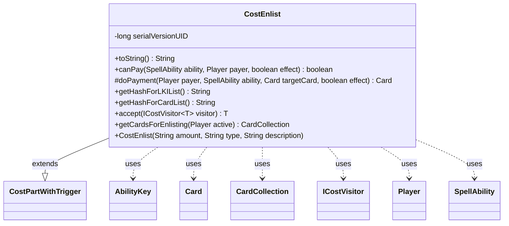

---
aliases:
  - CostEnlist
tags:
  - java/class
  - module/forge-game
  - pkg/forge/game/cost
fqn: forge.game.cost.CostEnlist
package: forge.game.cost
module: forge-game
kind: Class
---

# CostEnlist

**Package:** `forge.game.cost` &nbsp; **Module:** `forge-game` &nbsp; **Kind:** Class



## Relationships
**Extends:**
- [[forge.game.cost.CostPartWithTrigger|CostPartWithTrigger]]
**Uses:**
- [[forge.game.ability.AbilityKey|AbilityKey]]
- [[forge.game.card.Card|Card]]
- [[forge.game.card.CardCollection|CardCollection]]
- [[forge.game.cost.ICostVisitor|ICostVisitor]]
- [[forge.game.player.Player|Player]]
- [[forge.game.spellability.SpellAbility|SpellAbility]]

## Design Description

CostEnlist models the Magic: the Gathering "Enlist" payment as a cost component, representing the requirement to tap an untapped creature to boost an attacker. As a concrete subclass of CostPartWithTrigger, it plugs into Forge's composable cost framework: it reports payability via `canPay`, performs the tap in `doPayment`, and supplies stable hash keys (`getHashForLKIList`, `getHashForCardList`) so paid cards can be tracked and referenced by later effects. It participates in the visitor pattern through `accept(ICostVisitor)`, letting cost-processing logic dispatch on type without instanceof checks.

The design centers on eligibility and event signaling. The static `getCardsForEnlisting` helper filters a player's creatures to those that can tap and are not summoning-sick or already attacking, and is reused by `canPay` to avoid duplicating the rule. On payment, it collaborates with Card, Player, SpellAbility, and AbilityKey to flag the host as enlisted and fire both `TapAll` and `Enlisted` triggers through the game's trigger handler, integrating the cost cleanly with the broader triggered-ability system.

## Source
`forge-game/src/main/java/forge/game/cost/CostEnlist.java`

```java
/*
 * Forge: Play Magic: the Gathering.
 * Copyright (C) 2011  Forge Team
 *
 * This program is free software: you can redistribute it and/or modify
 * it under the terms of the GNU General Public License as published by
 * the Free Software Foundation, either version 3 of the License, or
 * (at your option) any later version.
 * 
 * This program is distributed in the hope that it will be useful,
 * but WITHOUT ANY WARRANTY; without even the implied warranty of
 * MERCHANTABILITY or FITNESS FOR A PARTICULAR PURPOSE.  See the
 * GNU General Public License for more details.
 * 
 * You should have received a copy of the GNU General Public License
 * along with this program.  If not, see <http://www.gnu.org/licenses/>.
 */
package forge.game.cost;

import forge.game.ability.AbilityKey;
import forge.game.card.Card;
import forge.game.card.CardCollection;
import forge.game.card.CardLists;
import forge.game.player.Player;
import forge.game.spellability.SpellAbility;
import forge.game.trigger.TriggerType;

import java.util.Map;

/**
 * The Class CostExert.
 */
public class CostEnlist extends CostPartWithTrigger {

    private static final long serialVersionUID = 1L;

    /**
     * Instantiates a new cost Exert.
     * 
     * @param amount
     *            the amount
     * @param type
     *            the type
     * @param description
     *            the description
     */
    public CostEnlist(final String amount, final String type, final String description) {
        super(amount, type, description);
    }

    /*
     * (non-Javadoc)
     * 
     * @see forge.card.cost.CostPart#toString()
     */
    @Override
    public final String toString() {
        final StringBuilder sb = new StringBuilder();
        sb.append("Enlist " + this.getType());
        return sb.toString();
    }

    /*
     * (non-Javadoc)
     * 
     * @see
     * forge.card.cost.CostPart#canPay(forge.card.spellability.SpellAbility,
     * forge.Card, forge.Player, forge.card.cost.Cost)
     */
    @Override
    public final boolean canPay(final SpellAbility ability, final Player payer, final boolean effect) {
        return !getCardsForEnlisting(payer).isEmpty();
    }

    @Override
    protected Card doPayment(Player payer, SpellAbility ability, Card targetCard, final boolean effect) {
        if (targetCard.tap(true, ability, payer)) {
            ability.getHostCard().setEnlistedThisCombat(true);
            final Map<AbilityKey, Object> runParams = AbilityKey.newMap();
            runParams.put(AbilityKey.Cards, new CardCollection(targetCard));
            payer.getGame().getTriggerHandler().runTrigger(TriggerType.TapAll, runParams, false);
        }

        // need to transfer info
        payTrig.addRemembered(targetCard);

        final Map<AbilityKey, Object> runParams = AbilityKey.mapFromCard(payTrig.getHostCard());
        runParams.put(AbilityKey.Enlisted, targetCard);
        targetCard.getGame().getTriggerHandler().runTrigger(TriggerType.Enlisted, runParams, false);
        return targetCard;
    }

    /* (non-Javadoc)
     * @see forge.card.cost.CostPartWithList#getHashForList()
     */
    @Override
    public String getHashForLKIList() {
        return "Enlisted";
    }
    @Override
    public String getHashForCardList() {
        return "EnlistedCards";
    }

    // Inputs
    public <T> T accept(ICostVisitor<T> visitor) {
        return visitor.visit(this);
    }

    public static CardCollection getCardsForEnlisting(Player active) {
        return CardLists.filter(active.getCreaturesInPlay(), c -> c.canTap() && !c.isSick() && !c.isAttacking());
    }

}
```
