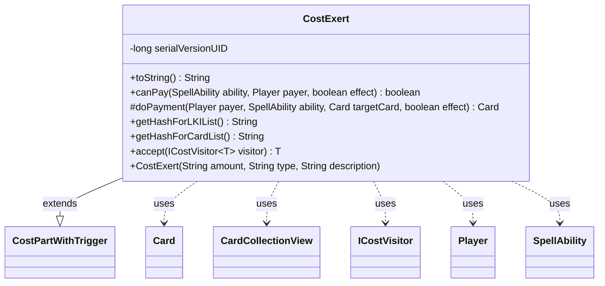

---
aliases:
  - CostExert
tags:
  - java/class
  - module/forge-game
  - pkg/forge/game/cost
fqn: forge.game.cost.CostExert
package: forge.game.cost
module: forge-game
kind: Class
---

# CostExert

**Package:** `forge.game.cost`   **Module:** `forge-game`   **Kind:** Class



## Relationships
**Extends:**
- [[forge.game.cost.CostPartWithTrigger|CostPartWithTrigger]]
**Uses:**
- [[forge.game.card.Card|Card]]
- [[forge.game.card.CardCollectionView|CardCollectionView]]
- [[forge.game.cost.ICostVisitor|ICostVisitor]]
- [[forge.game.player.Player|Player]]
- [[forge.game.spellability.SpellAbility|SpellAbility]]

## Design Description

CostExert models the "Exert" payment as a concrete cost part within Forge's cost-payment framework. Extending `CostPartWithTrigger`, it represents the act of exerting a creature (or a chosen number of valid permanents) as part of paying for a `SpellAbility`, integrating with the engine's trigger machinery since exerting can fire delayed triggers. It validates affordability through `canPay`—either trivially when paid from the source, or by counting matching battlefield permanents owned by the payer against the required amount (also honoring announced values)—and performs the action in `doPayment` by invoking `Card.exert`.

The class collaborates with `Card`, `CardCollectionView`, `Player`, and `SpellAbility` to filter and act on game state, and supplies stable list-hash keys ("Exerted"/"ExertedCards") so paid cards can be tracked. By implementing `accept` for `ICostVisitor`, it participates in the visitor pattern that lets external logic traverse cost components without the cost classes knowing their consumers, keeping each cost type a small, self-contained, polymorphic unit.

## Source
`forge-game/src/main/java/forge/game/cost/CostExert.java`

```java
/*
 * Forge: Play Magic: the Gathering.
 * Copyright (C) 2011  Forge Team
 *
 * This program is free software: you can redistribute it and/or modify
 * it under the terms of the GNU General Public License as published by
 * the Free Software Foundation, either version 3 of the License, or
 * (at your option) any later version.
 * 
 * This program is distributed in the hope that it will be useful,
 * but WITHOUT ANY WARRANTY; without even the implied warranty of
 * MERCHANTABILITY or FITNESS FOR A PARTICULAR PURPOSE.  See the
 * GNU General Public License for more details.
 * 
 * You should have received a copy of the GNU General Public License
 * along with this program.  If not, see <http://www.gnu.org/licenses/>.
 */
package forge.game.cost;

import forge.game.card.Card;
import forge.game.card.CardCollectionView;
import forge.game.card.CardLists;
import forge.game.player.Player;
import forge.game.spellability.SpellAbility;
import forge.game.zone.ZoneType;

/**
 * The Class CostExert.
 */
public class CostExert extends CostPartWithTrigger {

    private static final long serialVersionUID = 1L;

    /**
     * Instantiates a new cost Exert.
     * 
     * @param amount
     *            the amount
     * @param type
     *            the type
     * @param description
     *            the description
     */
    public CostExert(final String amount, final String type, final String description) {
        super(amount, type, description);
    }

    /*
     * (non-Javadoc)
     * 
     * @see forge.card.cost.CostPart#toString()
     */
    @Override
    public final String toString() {
        final StringBuilder sb = new StringBuilder();
        sb.append("Exert ");

        final Integer i = this.convertAmount();

        if (this.payCostFromSource()) {
            sb.append(this.getType());
        } else {
            final String desc = this.getTypeDescription() == null ? this.getType() : this.getTypeDescription();
            if (i != null) {
                sb.append(Cost.convertIntAndTypeToWords(i, desc));
            } else {
                sb.append(Cost.convertAmountTypeToWords(this.getAmount(), desc));
            }
        }
        return sb.toString();
    }

    /*
     * (non-Javadoc)
     * 
     * @see
     * forge.card.cost.CostPart#canPay(forge.card.spellability.SpellAbility,
     * forge.Card, forge.Player, forge.card.cost.Cost)
     */
    @Override
    public final boolean canPay(final SpellAbility ability, final Player payer, final boolean effect) {
        final Card source = ability.getHostCard();

        if (!this.payCostFromSource()) {
            boolean needsAnnoucement = ability.hasParam("Announce") && this.getType().contains(ability.getParam("Announce"));

            CardCollectionView typeList = payer.getCardsIn(ZoneType.Battlefield);
            typeList = CardLists.getValidCards(typeList, this.getType().split(";"), payer, source, ability);
            final int amount = this.getAbilityAmount(ability);

            return needsAnnoucement || (typeList.size() >= amount);
        }

        return true;
    }

    @Override
    protected Card doPayment(Player payer, SpellAbility ability, Card targetCard, final boolean effect) {
        targetCard.exert(payer);
        return targetCard;
    }

    /* (non-Javadoc)
     * @see forge.card.cost.CostPartWithList#getHashForList()
     */
    @Override
    public String getHashForLKIList() {
        return "Exerted";
    }
    @Override
    public String getHashForCardList() {
    	return "ExertedCards";
    }

    // Inputs
    public <T> T accept(ICostVisitor<T> visitor) {
        return visitor.visit(this);
    }

}
```

## Python
`forge/game/cost/CostExert.py`

```python
from forge.game.card.Card import Card
from forge.game.card.CardCollectionView import CardCollectionView
from forge.game.card.CardLists import CardLists
from forge.game.player.Player import Player
from forge.game.spellability.SpellAbility import SpellAbility
from forge.game.zone.ZoneType import ZoneType
from forge.game.cost.CostPartWithTrigger import CostPartWithTrigger
from forge.game.cost.Cost import Cost
from forge.game.cost.ICostVisitor import ICostVisitor


class CostExert(CostPartWithTrigger):
    """The Class CostExert."""

    serialVersionUID = 1

    def __init__(self, amount: str, type: str, description: str):
        """
        Instantiates a new cost Exert.

        @param amount the amount
        @param type the type
        @param description the description
        """
        super().__init__(amount, type, description)

    def toString(self) -> str:
        sb = []
        sb.append("Exert ")

        i = self.convertAmount()

        if self.payCostFromSource():
            sb.append(self.getType())
        else:
            desc = self.getType() if self.getTypeDescription() is None else self.getTypeDescription()
            if i is not None:
                sb.append(Cost.convertIntAndTypeToWords(i, desc))
            else:
                sb.append(Cost.convertAmountTypeToWords(self.getAmount(), desc))
        return "".join(sb)

    def canPay(self, ability: SpellAbility, payer: Player, effect: bool) -> bool:
        source = ability.getHostCard()

        if not self.payCostFromSource():
            needsAnnoucement = ability.hasParam("Announce") and ability.getParam("Announce") in self.getType()

            typeList = payer.getCardsIn(ZoneType.Battlefield)
            typeList = CardLists.getValidCards(typeList, self.getType().split(";"), payer, source, ability)
            amount = self.getAbilityAmount(ability)

            return needsAnnoucement or (typeList.size() >= amount)

        return True

    def doPayment(self, payer: Player, ability: SpellAbility, targetCard: Card, effect: bool) -> Card:
        targetCard.exert(payer)
        return targetCard

    def getHashForLKIList(self) -> str:
        return "Exerted"

    def getHashForCardList(self) -> str:
        return "ExertedCards"

    # Inputs
    def accept(self, visitor: ICostVisitor):
        return visitor.visit(self)
```
