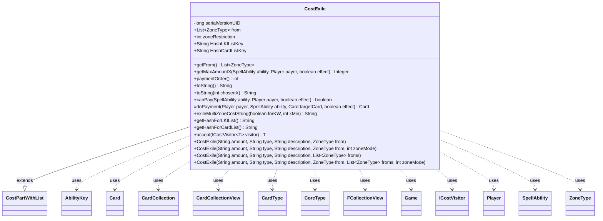

---
aliases:
  - CostExile
tags:
  - java/class
  - module/forge-game
  - pkg/forge/game/cost
fqn: forge.game.cost.CostExile
package: forge.game.cost
module: forge-game
kind: Class
---

# CostExile

**Package:** `forge.game.cost`   **Module:** `forge-game`   **Kind:** Class



## Relationships
**Extends:**
- [[forge.game.cost.CostPartWithList|CostPartWithList]]
**Uses:**
- [[forge.card.CardType|CardType]]
- [[forge.card.CardType.CoreType|CoreType]]
- [[forge.game.Game|Game]]
- [[forge.game.ability.AbilityKey|AbilityKey]]
- [[forge.game.card.Card|Card]]
- [[forge.game.card.CardCollection|CardCollection]]
- [[forge.game.card.CardCollectionView|CardCollectionView]]
- [[forge.game.cost.ICostVisitor|ICostVisitor]]
- [[forge.game.player.Player|Player]]
- [[forge.game.spellability.SpellAbility|SpellAbility]]
- [[forge.game.zone.ZoneType|ZoneType]]
- [[forge.util.collect.FCollectionView|FCollectionView]]

## Design Description

CostExile models the exile-based portion of an ability's payment cost, representing a directive to remove cards from one or more game zones as a price for casting or activating. As a concrete subclass of `CostPartWithList`, it slots into Forge's composite cost framework, tracking the source zones (`from`) and a `zoneRestriction` mode that distinguishes same-zone, any-player, and controller-scoped exiles. It collaborates with `SpellAbility`, `Player`, and `Game` to enumerate and validate eligible cards (`canPay`, `getMaxAmountX`), and executes payment by moving each chosen `Card` to exile via the game's action layer (`doPayment`).

Notable design intent appears in the rich type-string parsing within `canPay`—supporting modifiers like total-CMC, shared-type, and type-count constraints—and the elaborate natural-language rendering in `toString`/`exileMultiZoneCostString`. Its `paymentOrder` defers library exiles so hidden information is revealed last, and `accept` integrates it into an `ICostVisitor` double-dispatch hierarchy.

## Source
`forge-game/src/main/java/forge/game/cost/CostExile.java`

```java
/*
 * Forge: Play Magic: the Gathering.
 * Copyright (C) 2011  Forge Team
 *
 * This program is free software: you can redistribute it and/or modify
 * it under the terms of the GNU General Public License as published by
 * the Free Software Foundation, either version 3 of the License, or
 * (at your option) any later version.
 *
 * This program is distributed in the hope that it will be useful,
 * but WITHOUT ANY WARRANTY; without even the implied warranty of
 * MERCHANTABILITY or FITNESS FOR A PARTICULAR PURPOSE.  See the
 * GNU General Public License for more details.
 *
 * You should have received a copy of the GNU General Public License
 * along with this program.  If not, see <http://www.gnu.org/licenses/>.
 */
package forge.game.cost;

import com.google.common.collect.Lists;
import forge.card.CardType;
import forge.game.Game;
import forge.game.ability.AbilityKey;
import forge.game.ability.AbilityUtils;
import forge.game.ability.SpellAbilityEffect;
import forge.game.card.*;
import forge.game.player.Player;
import forge.game.spellability.SpellAbility;
import forge.game.zone.ZoneType;
import forge.util.Lang;
import forge.util.TextUtil;
import forge.util.collect.FCollectionView;
import org.apache.commons.lang3.StringUtils;

import java.util.List;
import java.util.Map;

/**
 * The Class CostExile.
 */
public class CostExile extends CostPartWithList {
    // Exile<Num/Type{/TypeDescription}>
    // ExileFromHand<Num/Type{/TypeDescription}>
    // ExileFromGrave<Num/Type{/TypeDescription}>
    // ExileFromTop<Num/Type{/TypeDescription}> (of library)
    // ExileSameGrave<Num/Type{/TypeDescription}>

    /**
     * Serializables need a version ID.
     */
    private static final long serialVersionUID = 1L;
    public final List<ZoneType> from = Lists.newArrayList();
    public final int zoneRestriction;

    public final List<ZoneType> getFrom() {
        return this.from;
    }

    public CostExile(final String amount, final String type, final String description, final ZoneType from) {
        this(amount, type, description, from, Lists.newArrayList(), 1);
    }

    public CostExile(final String amount, final String type, final String description, final ZoneType from,
                     final int zoneMode) {
        this(amount, type, description, from, Lists.newArrayList(), zoneMode);
    }

    public CostExile(final String amount, final String type, final String description, final List<ZoneType> froms) {
        this(amount, type, description, null, froms, 1);
    }

    public CostExile(final String amount, final String type, final String description, final ZoneType from,
                     final List<ZoneType> froms, final int zoneMode) {
        super(amount, type, description);
        if (from != null) froms.add(from);
        if (froms.isEmpty()) {
            this.from.add(ZoneType.Battlefield);
        } else {
            this.from.addAll(froms);
        }
        this.zoneRestriction = zoneMode;
    }

    @Override
    public Integer getMaxAmountX(SpellAbility ability, Player payer, final boolean effect) {
        final Card source = ability.getHostCard();
        final Game game = source.getGame();

        CardCollectionView typeList;
        if (zoneRestriction != 1) {
            typeList = game.getCardsIn(this.from);
        } else {
            typeList = payer.getCardsIn(this.from);
        }

        typeList = CardLists.getValidCards(typeList, getType().split(";"), payer, source, ability);

        return typeList.size();
    }

    @Override
    public int paymentOrder() {
        if (this.from.contains(ZoneType.Library)) {
            // In a world where costs are fully undoable, revealing unknown information should be done last.
            return 20;
        }
        return 15;
    }

    @Override
    public final String toString() {
        return toString(0);
    }

    public final String toString(int chosenX) {
        final Integer i = this.convertAmount();
        String desc = this.getDescriptiveType();
        if (this.from.size() == 1) {
            String origin = this.from.get(0).name().toLowerCase();

            if (this.payCostFromSource()) {
                if (!origin.equals("battlefield")) {
                    return String.format("Exile %s from your %s", this.getType(), origin);
                }
                return String.format("Exile %s", this.getType());
            }
            if (this.getType().equals("All")) {
                return String.format("Exile all cards from your %s", origin);
            }

            if (origin.equals("battlefield")) {
                String amt;
                if (i == null && this.getAmount().contains("+")) {
                    int needed = Integer.parseInt(this.getAmount().split("\\+")[0]);
                    amt = Lang.getNumeral(needed) + " or more " + desc;
                } else amt = Cost.convertAmountTypeToWords(i, this.getAmount(), desc);
                return "Exile " + amt + (amt.contains("you control") ? "" : " you control");
            }

            if (!desc.equals("Card") && !desc.contains("card")) {
                StringBuilder sb = new StringBuilder();
                sb.append("Exile %s from ");
                if (zoneRestriction == 0) {
                    sb.append("the same");
                } else if (zoneRestriction == -1) {
                    sb.append("a");
                } else {
                    sb.append("your");
                }
                sb.append(" %s");
                return String.format(sb.toString(), Lang.nounWithNumeralExceptOne(this.getAmount(),
                        desc + " card"), origin);
            }

            if (zoneRestriction == 0) {
                return String.format("Exile %s from the same %s",
                        Cost.convertAmountTypeToWords(i, this.getAmount(), desc), origin);
            }

            if (this.getAmount().equals("X")) {
                String x = chosenX > 0 ? Lang.getNumeral(chosenX) : "any number of";
                return String.format("Exile %s %s from your %s", x, desc, origin);
            }

            return String.format("Exile %s from your %s",
                    Cost.convertAmountTypeToWords(i, this.getAmount(), desc), origin);
        }

        return exileMultiZoneCostString(false, chosenX);
    }

    @Override
    public final boolean canPay(final SpellAbility ability, final Player payer, final boolean effect) {
        final Card source = ability.getHostCard();
        final Game game = source.getGame();

        String type = this.getType();
        if (type.equals("All")) {
            return true; // this will always work
        }
        else if (type.contains("FromTopGrave")) {
            type = TextUtil.fastReplace(type, "FromTopGrave", "");
        }

        CardCollection list = CardLists.filter(zoneRestriction != 1 ? game.getCardsIn(this.from) :
                payer.getCardsIn(this.from), CardPredicates.canExiledBy(ability, effect));

        if (this.payCostFromSource()) {
            return list.contains(source);
        }
        if (getType().equals("OriginalHost")) {
            return list.contains(ability.getOriginalHost());
        }

        boolean totalCMC = false;
        String totalM = "";
        if (type.contains("+withTotalCMCEQ")) {
            totalCMC = true;
            totalM = type.split("withTotalCMCEQ")[1];
            type = TextUtil.fastReplace(type, TextUtil.concatNoSpace("+withTotalCMCEQ", totalM), "");
        }
        boolean totalCMCgreater = false;
        if (type.contains("+withTotalCMCGE")) {
            totalCMCgreater = true;
            totalM = type.split("withTotalCMCGE")[1];
            type = TextUtil.fastReplace(type, TextUtil.concatNoSpace("+withTotalCMCGE", totalM), "");
        }

        boolean sharedType = false;
        if (type.contains("+withSharedCardType")) {
            sharedType = true;
            type = TextUtil.fastReplace(type, "+withSharedCardType", "");
        }

        int nTypes = -1;
        if (type.contains("+withTypesGE")) {
            String num = type.split("withTypesGE")[1];
            type = TextUtil.fastReplace(type, TextUtil.concatNoSpace("+withTypesGE", num), "");
            nTypes = Integer.parseInt(num);
        }

        if (!type.contains("X") || ability.getXManaCostPaid() != null) {
            list = CardLists.getValidCards(list, type.split(";"), payer, source, ability);
        }

        if (nTypes > -1 && AbilityUtils.countCardTypesFromList(list, false) < nTypes) {
            return false;
        }

        if (totalCMC || totalCMCgreater) {
            if (totalM.equals("X") && ability.getXManaCostPaid() == null) { // X hasn't yet been decided, let it pass
                return true;
            }
            int i = AbilityUtils.calculateAmount(source, totalM, ability);
            return totalCMCgreater ? CardLists.getTotalCMC(list) >= i : CardLists.cmcCanSumTo(i, list);
        }

        int amount = this.getAbilityAmount(ability);
        
        if (sharedType) {
            if (list.size() < amount) {
                return false;
            }

            for (CardType.CoreType coreType : CardType.CoreType.values()) {
                int count = 0;
                for (final Card card : list) {
                    if (card.getType().hasType(coreType)) {
                        count++;
                        if (count >= amount) {
                            return true;
                        }
                    }
                }
            }
            return false;
        }

        // for Craft: do not count the source card twice (it will be sacrificed)
        if (ability.isCraft()) {
            CostExile firstExileCost = ability.getPayCosts().getCostPartByType(CostExile.class);
            if (firstExileCost != null && firstExileCost.payCostFromSource()) list.remove(ability.getHostCard());
        }

        // for cards like Allosaurus Rider, do not count it
        if (this.from.size() == 1 && this.from.get(0).equals(ZoneType.Hand) && source.isInZone(ZoneType.Hand)
                && list.contains(source)) {
            amount++;
        }

        if (list.size() < amount) {
            return false;
        }

        if (zoneRestriction == 0) {
            boolean foundPayable = false;
            FCollectionView<Player> players = game.getPlayers();
            for (Player p : players) {
                if (CardLists.count(list, CardPredicates.isController(p)) >= amount) {
                    foundPayable = true;
                    break;
                }
            }
            return foundPayable;
        }
        return true;
    }

    @Override
    protected Card doPayment(Player payer, SpellAbility ability, Card targetCard, final boolean effect) {
        Map<AbilityKey, Object> moveParams = AbilityKey.newMap();
        AbilityKey.addCardZoneTableParams(moveParams, table);
        Card newCard = targetCard.getGame().getAction().exile(targetCard, null, moveParams);
        SpellAbilityEffect.handleExiledWith(newCard, ability);
        return newCard;
    }

    public String exileMultiZoneCostString(boolean forKW, int xMin) {
        final StringBuilder sb = new StringBuilder();
        sb.append("Exile ");
        String amount = this.getAmount();
        int amt = StringUtils.isNumeric(amount) ? Integer.parseInt(amount) : 0;
        String partType = this.getType();
        //consume .Other from most partTypes
        if (partType.contains(".Other")) partType = partType.replace(".Other", "");
        String singNoun = this.getTypeDescription() != null ? this.getTypeDescription() :
                CardType.CoreType.isValidEnum(partType) || partType.equals("Permanent") ? partType.toLowerCase() :
                        partType;
        String plurNoun = !singNoun.contains(" ") ? Lang.getPlural(singNoun) : singNoun;
        if (!forKW && amt == 0 && xMin > 0) amt = xMin;
        boolean perm = singNoun.equals("permanent");
        if (amt == 1) {
            String aNoun = Lang.nounWithNumeralExceptOne(1, singNoun);
            sb.append(partType.equals("Artifact") || perm ? "another " + singNoun : aNoun);
            sb.append(" you control or ").append(aNoun).append(" card from ");
        } else if (amt > 1) {
            sb.append("the ").append(Lang.getNumeral(amt)).append(" from among ");
            sb.append(perm ? "other " : "").append(plurNoun).append(" you control and/or ").append(singNoun);
            sb.append(" cards in ");
        } else { // currently all non-numeric will use xMin
            sb.append(xMin > 1 ? "the " : "").append(Lang.getNumeral(xMin)).append(forKW ? " or more " : " ");
            if (xMin == 1) {
                sb.append(perm ? "other " : "").append(plurNoun).append(" you control and/or ");
                sb.append(!perm ? singNoun : "").append(" cards from ");
            } else {
                if (this.getFrom().size() > 1) {
                    sb.append("from among ").append(perm ? "other " : "").append(plurNoun);
                    sb.append(" you control and/or cards from ");
                } else {
                    sb.append("from ");
                }
            }
        }
        sb.append("your graveyard");
        return sb.toString();
    }

    public static final String HashLKIListKey = "Exiled";
    public static final String HashCardListKey = "ExiledCards";

    @Override
    public String getHashForLKIList() {
        return HashLKIListKey;
    }
    @Override
    public String getHashForCardList() {
        return HashCardListKey;
    }

    public <T> T accept(ICostVisitor<T> visitor) {
        return visitor.visit(this);
    }
}
```

## Python
`forge/game/cost/CostExile.py`

```python
from forge.game.cost.CostPartWithList import CostPartWithList
from forge.game.cost.Cost import Cost
from forge.game.cost.ICostVisitor import ICostVisitor
from forge.card.CardType import CardType
from forge.card.CardType.CoreType import CoreType
from forge.game.Game import Game
from forge.game.ability.AbilityKey import AbilityKey
from forge.game.ability.AbilityUtils import AbilityUtils
from forge.game.ability.SpellAbilityEffect import SpellAbilityEffect
from forge.game.card.Card import Card
from forge.game.card.CardCollection import CardCollection
from forge.game.card.CardCollectionView import CardCollectionView
from forge.game.card.CardLists import CardLists
from forge.game.card.CardPredicates import CardPredicates
from forge.game.player.Player import Player
from forge.game.spellability.SpellAbility import SpellAbility
from forge.game.zone.ZoneType import ZoneType
from forge.util.Lang import Lang
from forge.util.TextUtil import TextUtil
from forge.util.collect.FCollectionView import FCollectionView
from forge.util.StringUtils import StringUtils


class CostExile(CostPartWithList):
    # Exile<Num/Type{/TypeDescription}>
    # ExileFromHand<Num/Type{/TypeDescription}>
    # ExileFromGrave<Num/Type{/TypeDescription}>
    # ExileFromTop<Num/Type{/TypeDescription}> (of library)
    # ExileSameGrave<Num/Type{/TypeDescription}>

    # Serializables need a version ID.
    serialVersionUID = 1

    HashLKIListKey = "Exiled"
    HashCardListKey = "ExiledCards"

    def getFrom(self) -> list[ZoneType]:
        return self.from_

    def __init__(self, amount: str, type: str, description: str, from_=None, froms=None, zoneMode: int = None):
        # Overloaded constructors:
        # (amount, type, description, from)                     -> froms=[], zoneMode=1
        # (amount, type, description, from, zoneMode)           -> froms=[], zoneMode=zoneMode
        # (amount, type, description, froms)                    -> from=None, zoneMode=1
        # (amount, type, description, from, froms, zoneMode)
        if froms is None and zoneMode is None:
            # CostExile(amount, type, description, from)
            froms = []
            zoneMode = 1
        elif froms is not None and not isinstance(froms, list) and zoneMode is None:
            # CostExile(amount, type, description, from, zoneMode)
            zoneMode = froms
            froms = []
        elif isinstance(from_, list) and froms is None and zoneMode is None:
            # CostExile(amount, type, description, froms)
            froms = from_
            from_ = None
            zoneMode = 1
        if froms is None:
            froms = []
        if zoneMode is None:
            zoneMode = 1

        super().__init__(amount, type, description)
        self.from_: list[ZoneType] = []
        if from_ is not None:
            froms.append(from_)
        if len(froms) == 0:
            self.from_.append(ZoneType.Battlefield)
        else:
            self.from_.extend(froms)
        self.zoneRestriction = zoneMode

    def getMaxAmountX(self, ability: SpellAbility, payer: Player, effect: bool):
        source = ability.getHostCard()
        game = source.getGame()

        if self.zoneRestriction != 1:
            typeList = game.getCardsIn(self.from_)
        else:
            typeList = payer.getCardsIn(self.from_)

        typeList = CardLists.getValidCards(typeList, self.getType().split(";"), payer, source, ability)

        return typeList.size()

    def paymentOrder(self) -> int:
        if ZoneType.Library in self.from_:
            # In a world where costs are fully undoable, revealing unknown information should be done last.
            return 20
        return 15

    def toString(self, chosenX: int = 0) -> str:
        i = self.convertAmount()
        desc = self.getDescriptiveType()
        if len(self.from_) == 1:
            origin = self.from_[0].name().lower()

            if self.payCostFromSource():
                if origin != "battlefield":
                    return "Exile %s from your %s" % (self.getType(), origin)
                return "Exile %s" % (self.getType(),)
            if self.getType() == "All":
                return "Exile all cards from your %s" % (origin,)

            if origin == "battlefield":
                if i is None and "+" in self.getAmount():
                    needed = int(self.getAmount().split("+")[0])
                    amt = Lang.getNumeral(needed) + " or more " + desc
                else:
                    amt = Cost.convertAmountTypeToWords(i, self.getAmount(), desc)
                return "Exile " + amt + ("" if "you control" in amt else " you control")

            if desc != "Card" and "card" not in desc:
                sb = []
                sb.append("Exile %s from ")
                if self.zoneRestriction == 0:
                    sb.append("the same")
                elif self.zoneRestriction == -1:
                    sb.append("a")
                else:
                    sb.append("your")
                sb.append(" %s")
                return ("".join(sb)) % (Lang.nounWithNumeralExceptOne(self.getAmount(), desc + " card"), origin)

            if self.zoneRestriction == 0:
                return "Exile %s from the same %s" % (
                    Cost.convertAmountTypeToWords(i, self.getAmount(), desc), origin)

            if self.getAmount() == "X":
                x = Lang.getNumeral(chosenX) if chosenX > 0 else "any number of"
                return "Exile %s %s from your %s" % (x, desc, origin)

            return "Exile %s from your %s" % (
                Cost.convertAmountTypeToWords(i, self.getAmount(), desc), origin)

        return self.exileMultiZoneCostString(False, chosenX)

    def canPay(self, ability: SpellAbility, payer: Player, effect: bool) -> bool:
        source = ability.getHostCard()
        game = source.getGame()

        type = self.getType()
        if type == "All":
            return True  # this will always work
        elif "FromTopGrave" in type:
            type = TextUtil.fastReplace(type, "FromTopGrave", "")

        list_ = CardLists.filter(
            game.getCardsIn(self.from_) if self.zoneRestriction != 1 else payer.getCardsIn(self.from_),
            CardPredicates.canExiledBy(ability, effect))

        if self.payCostFromSource():
            return list_.contains(source)
        if self.getType() == "OriginalHost":
            return list_.contains(ability.getOriginalHost())

        totalCMC = False
        totalM = ""
        if "+withTotalCMCEQ" in type:
            totalCMC = True
            totalM = type.split("withTotalCMCEQ")[1]
            type = TextUtil.fastReplace(type, TextUtil.concatNoSpace("+withTotalCMCEQ", totalM), "")
        totalCMCgreater = False
        if "+withTotalCMCGE" in type:
            totalCMCgreater = True
            totalM = type.split("withTotalCMCGE")[1]
            type = TextUtil.fastReplace(type, TextUtil.concatNoSpace("+withTotalCMCGE", totalM), "")

        sharedType = False
        if "+withSharedCardType" in type:
            sharedType = True
            type = TextUtil.fastReplace(type, "+withSharedCardType", "")

        nTypes = -1
        if "+withTypesGE" in type:
            num = type.split("withTypesGE")[1]
            type = TextUtil.fastReplace(type, TextUtil.concatNoSpace("+withTypesGE", num), "")
            nTypes = int(num)

        if "X" not in type or ability.getXManaCostPaid() is not None:
            list_ = CardLists.getValidCards(list_, type.split(";"), payer, source, ability)

        if nTypes > -1 and AbilityUtils.countCardTypesFromList(list_, False) < nTypes:
            return False

        if totalCMC or totalCMCgreater:
            if totalM == "X" and ability.getXManaCostPaid() is None:  # X hasn't yet been decided, let it pass
                return True
            i = AbilityUtils.calculateAmount(source, totalM, ability)
            return CardLists.getTotalCMC(list_) >= i if totalCMCgreater else CardLists.cmcCanSumTo(i, list_)

        amount = self.getAbilityAmount(ability)

        if sharedType:
            if list_.size() < amount:
                return False

            for coreType in CardType.CoreType.values():
                count = 0
                for card in list_:
                    if card.getType().hasType(coreType):
                        count += 1
                        if count >= amount:
                            return True
            return False

        # for Craft: do not count the source card twice (it will be sacrificed)
        if ability.isCraft():
            firstExileCost = ability.getPayCosts().getCostPartByType(CostExile)
            if firstExileCost is not None and firstExileCost.payCostFromSource():
                list_.remove(ability.getHostCard())

        # for cards like Allosaurus Rider, do not count it
        if len(self.from_) == 1 and self.from_[0] == ZoneType.Hand and source.isInZone(ZoneType.Hand) \
                and list_.contains(source):
            amount += 1

        if list_.size() < amount:
            return False

        if self.zoneRestriction == 0:
            foundPayable = False
            players = game.getPlayers()
            for p in players:
                if CardLists.count(list_, CardPredicates.isController(p)) >= amount:
                    foundPayable = True
                    break
            return foundPayable
        return True

    def doPayment(self, payer: Player, ability: SpellAbility, targetCard: Card, effect: bool) -> Card:
        moveParams = AbilityKey.newMap()
        AbilityKey.addCardZoneTableParams(moveParams, self.table)
        newCard = targetCard.getGame().getAction().exile(targetCard, None, moveParams)
        SpellAbilityEffect.handleExiledWith(newCard, ability)
        return newCard

    def exileMultiZoneCostString(self, forKW: bool, xMin: int) -> str:
        sb = []
        sb.append("Exile ")
        amount = self.getAmount()
        amt = int(amount) if StringUtils.isNumeric(amount) else 0
        partType = self.getType()
        # consume .Other from most partTypes
        if ".Other" in partType:
            partType = partType.replace(".Other", "")
        if self.getTypeDescription() is not None:
            singNoun = self.getTypeDescription()
        elif CardType.CoreType.isValidEnum(partType) or partType == "Permanent":
            singNoun = partType.lower()
        else:
            singNoun = partType
        plurNoun = Lang.getPlural(singNoun) if " " not in singNoun else singNoun
        if not forKW and amt == 0 and xMin > 0:
            amt = xMin
        perm = singNoun == "permanent"
        if amt == 1:
            aNoun = Lang.nounWithNumeralExceptOne(1, singNoun)
            sb.append(("another " + singNoun) if (partType == "Artifact" or perm) else aNoun)
            sb.append(" you control or ")
            sb.append(aNoun)
            sb.append(" card from ")
        elif amt > 1:
            sb.append("the ")
            sb.append(Lang.getNumeral(amt))
            sb.append(" from among ")
            sb.append("other " if perm else "")
            sb.append(plurNoun)
            sb.append(" you control and/or ")
            sb.append(singNoun)
            sb.append(" cards in ")
        else:  # currently all non-numeric will use xMin
            sb.append("the " if xMin > 1 else "")
            sb.append(Lang.getNumeral(xMin))
            sb.append(" or more " if forKW else " ")
            if xMin == 1:
                sb.append("other " if perm else "")
                sb.append(plurNoun)
                sb.append(" you control and/or ")
                sb.append(singNoun if not perm else "")
                sb.append(" cards from ")
            else:
                if len(self.getFrom()) > 1:
                    sb.append("from among ")
                    sb.append("other " if perm else "")
                    sb.append(plurNoun)
                    sb.append(" you control and/or cards from ")
                else:
                    sb.append("from ")
        sb.append("your graveyard")
        return "".join(sb)

    def getHashForLKIList(self) -> str:
        return CostExile.HashLKIListKey

    def getHashForCardList(self) -> str:
        return CostExile.HashCardListKey

    def accept(self, visitor: ICostVisitor):
        return visitor.visit(self)
```
